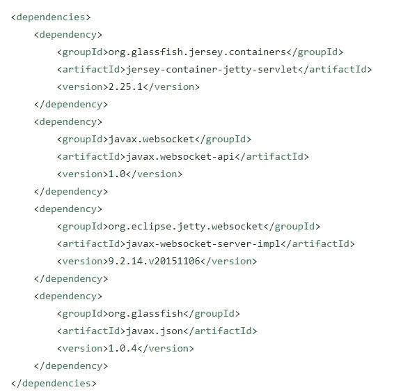
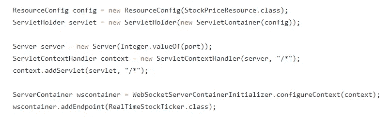
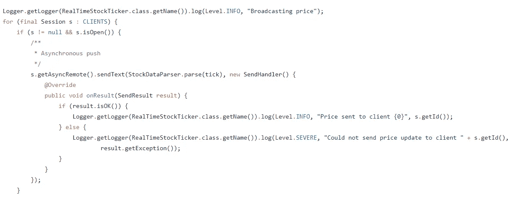
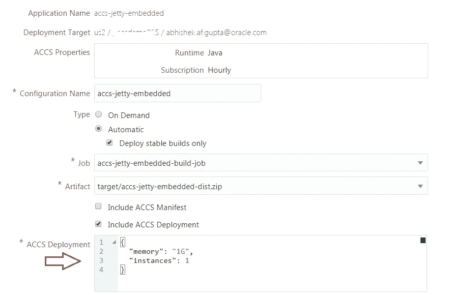
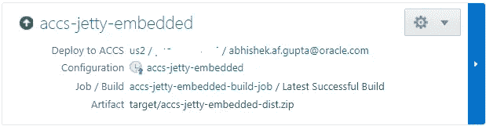
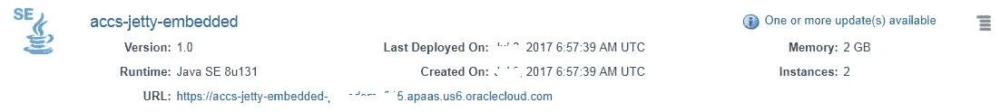

# 使用 Oracle 云构建和部署基于 Jetty 的应用程序

> 原文：<https://medium.com/oracledevs/build-deploy-a-jetty-based-app-using-oracle-application-container-cloud-oracle-developer-cloud-c756f7a04a3b?source=collection_archive---------2----------------------->

这篇博客展示了以下内容

*   开发一个 Java 应用程序，在 **Jetty 之上公开 REST 和 Websocket 服务(在**嵌入式**模式下**
*   在 [**应用容器云**](https://cloud.oracle.com/en_US/application-container-cloud) 上运行它
*   使用 [**开发人员云**](https://cloud.oracle.com/en_US/developer-service) 进行持续集成和交付

# 突堤？

对于不熟悉 [**突堤**](http://www.eclipse.org/jetty/) 的人来说，从根本上来说，

*   网络(HTTP)服务器，以及
*   符合 Servlet 的容器

此外，您可以使用它来创建一个定制容器，因为它的模块化特性允许您为大多数 Java EE Web Profile 规范(例如 Websocket、CDI、JPA 等)插入实现。).[文档中的详细信息](http://www.eclipse.org/jetty/documentation/current/jetty-javaee.html)

# 关于示例应用程序

该应用程序类似于我在以前的博客中使用的[——跟踪纽约证券交易所的股票价格，并使用 REST & Websocket 端点公开它们](/oracledevs/java-ee-based-microservice-on-oracle-cloud-with-payara-micro-32f8f823103f)

重要的区别在于，在这个例子中，没有使用`EJB + CDI events`组合来跟踪和广播股票价格——而是使用了(基于普通 Java SE 的)`ScheduledExecutorService`,它

*   使用后台任务线程(Runnable)定期获取价格，并且
*   将它们发送到每个连接的 Websocket 客户端

该应用程序在处[可用。让我们探索它的一些特定领域](https://github.com/abhirockzz/accs-jetty-embedded)

## 设置所需的容器/运行时

让我们看看如何使用 Jetty 来提供 REST 以及基于 Websocket 的功能

*   **JAX-RS 容器**:该应用利用了 Jersey 的可插拔 Jetty (Servlet)模块，即 Jetty Servlet 容器作为 Jersey (JAX-RS)实现的运行时
*   **Websocket 容器** : Jetty 为[Java web socket API(JSR 356)](http://jcp.org/en/jsr/detail?id=356)提供了一个第一类的实现——因此，它可能不需要插入任何其他的实现(例如 Tyrus)

下面是来自 **pom.xml** 的一个片段，显示了所需的依赖关系

Excerpt from the pom.xml

## ***自举各自的容器***

Bootstrap JAX-RS and Websocket runtimes

## 基于 Websocket 的广播

它是以异步方式实现的

JSR-356 RemoteEndpoint.Async in action

# 设置和部署

您需要为*持续构建*以及*部署*流程配置 Oracle 开发人员云。您可以参考以前的博客(这里将重点介绍这个例子的一些细节)

## 参考

*   在 Oracle 开发人员云中引导应用程序— [项目&代码库创建](https://community.oracle.com/community/cloud_computing/oracle-cloud-developer-solutions/blog/2017/05/25/getting-started-with-kafka-based-microservices-using-oracle-event-hub-cloud-application-container-cloud-developer-cloud#jive_content_id_Project__code_repository_creation)
*   持续集成设置— [配置构建作业](https://community.oracle.com/community/cloud_computing/oracle-cloud-developer-solutions/blog/2017/05/25/getting-started-with-kafka-based-microservices-using-oracle-event-hub-cloud-application-container-cloud-developer-cloud#jive_content_id_Configure_build_job)
*   部署设置— [持续部署(CD)到 Oracle 应用容器云](https://community.oracle.com/community/cloud_computing/oracle-cloud-developer-solutions/blog/2017/05/25/getting-started-with-kafka-based-microservices-using-oracle-event-hub-cloud-application-container-cloud-developer-cloud#jive_content_id_Continuous_Deployment_CD_to_Application_Container_Cloud)

## 提供 Oracle 应用程序容器云(配置)描述符

## Oracle 开发人员云中的部署确认

## Oracle 应用程序容器云中的部署后状态

# 测试应用程序

您可以使用 REST 端点来查询脚本(按需)的价格，或者通过连接到 Websocket 端点来查询 stream ORCL 的价格——这两个选项总结如下

*   **具体股票价格**:只需在指定的 URL 上发出 GET 请求，例如`[https://<ACCS_APP_URL>/mystocks/api/stocks?ticker=AAPL](https://acc-payara-mydomain.apaas.em1.oraclecloud.com/ticker-tracker/api/stocks?ticker=AAPL)`
*   **订阅实时提要**:使用 WebSocket 客户端并访问指定的端点 URL，例如`ws[s://<ACCS_APP_URL>/mystocks/rt/stocks](https://acc-payara-mydomain.apaas.em1.oraclecloud.com/ticker-tracker/api/stocks?ticker=AAPL)`

> 我推荐使用简单的 WebSocket 客户端，它可以作为插件安装到 Chrome 浏览器中

# 测试 CI/CD 流

做一些代码修改，推送到 Oracle 开发者云服务 Git repo。这应该

*   自动触发构建，一旦成功将
*   启动部署流程，以及
*   将新的应用程序版本重新部署到 Oracle 应用程序容器云

# 不要忘记…

*   查看 Oracle 应用容器云的[教程](https://docs.oracle.com/en/cloud/paas/app-container-cloud/create-first-applications.html)——每个运行时都有一些东西！
*   [其他关于应用容器云的博客](http://bit.ly/2gR3nrV)

> 本文表达的观点是我个人的观点，不一定代表甲骨文的观点。