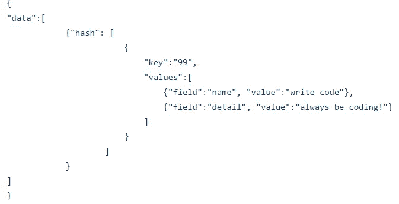
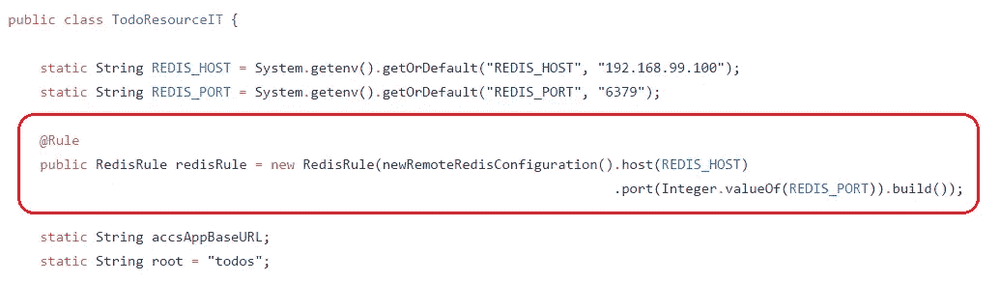
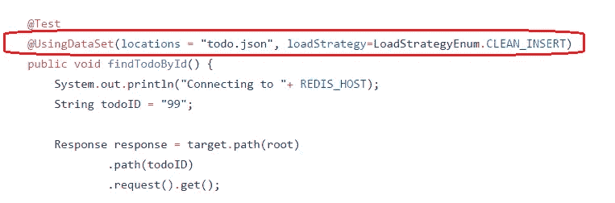
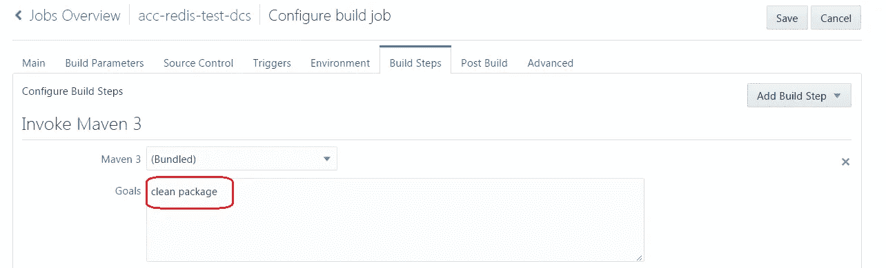
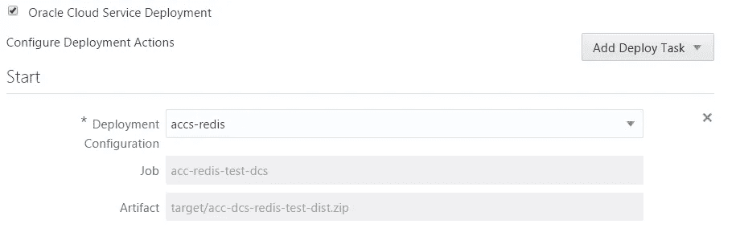
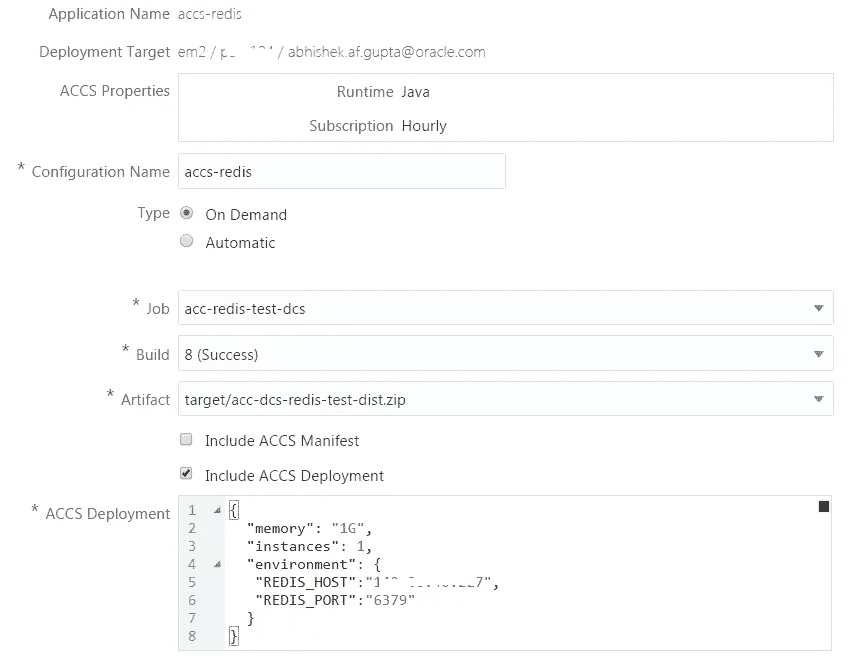
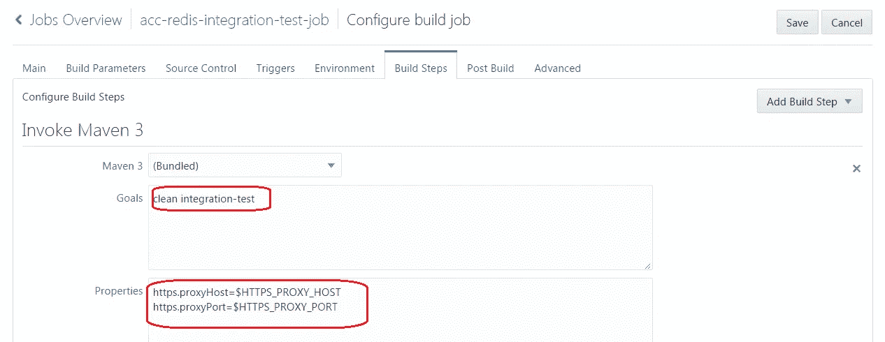
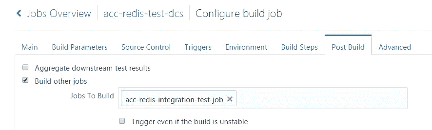
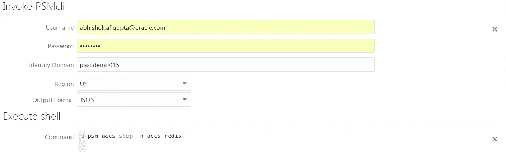

# 使用 Oracle Cloud 构建、部署和测试基于 Redis 的 Java 应用程序

> 原文：<https://medium.com/oracledevs/build-deploy-and-test-a-redis-based-java-application-using-oracle-cloud-9bb219578f2a?source=collection_archive---------1----------------------->

这篇博客将展示如何开始使用基于 Redis 的 Java 应用程序

*   使用 **Oracle Developer** 云在 **Oracle 应用容器**云和 CI/CD 上运行它
*   使用 **NoSQLUnit** 执行集成测试
*   我们的 Redis 实例将在 Oracle 容器云上的 Docker 容器中运行

# 应用

下面是该应用程序的概要

*   使用 Jersey 公开 REST 端点
*   使用 [Redis](https://redis.io/) 作为数据存储
*   [Jedis](https://github.com/xetorthio/jedis) 用作 Redis 的 Java 客户端
*   NoSQLUnit 是用于集成测试的框架

[这是应用程序](https://github.com/abhirockzz/accs-redis-dcs)

# NoSQLunit

**NoSQLUnit** 是一个开源测试框架，用于使用 **NoSQL** 数据库的应用程序。它基于(JUnit) *规则*的概念和一些注释。这些规则适用于数据库生命周期(启动/停止)和状态(播种/删除测试数据)管理。在示例应用程序中，我们使用它对 Redis 实例进行状态管理，即

*   在一个 ***json*** 文件的帮助下，我们定义测试数据，这些数据将在我们的测试开始之前被播种到 Redis，然后
*   使用注释(***@ using dataset***)来指定我们的工作方式(在本例中—它的清理和插入)

***我们的 json 格式的测试数据集***

***NoSQLUnit 在动作***

# 设置

## Oracle 容器云上的 Redis

*   使用现有的服务或创建自己的服务(确保将默认的 Redis 端口暴露给主机 IP)——[文档此处](http://docs.oracle.com/en/cloud/iaas/container-cloud/contu/creating-service-oracle-container-cloud-service.html)
*   开始部署— [文档在此](http://docs.oracle.com/en/cloud/iaas/container-cloud/contu/deploying-service-oracle-container-cloud-service.html)
*   记下运行 Redis 容器的 worker 节点的主机 IP

# 配置 Oracle 开发人员云

我们将从在 Oracle 开发人员云中引导应用程序开始。查看本节参考[项目&代码库创建](https://community.oracle.com/community/cloud_computing/oracle-cloud-developer-solutions/blog/2017/05/25/getting-started-with-kafka-based-microservices-using-oracle-event-hub-cloud-application-container-cloud-developer-cloud#jive_content_id_Project__code_repository_creation)。一旦完成，我们现在就可以开始配置我们的构建了，它是以*管道*的形式，由构建、部署、集成测试和拆除 ***阶段*** 组成

## 构建和部署阶段

代码在 Oracle 应用容器云上构建和部署。请注意，为了保持简洁，我们跳过了单元测试部分

***构建步骤***

***后期构建(部署)***

***部署***

在这个阶段的最后，我们的应用程序将被部署到应用程序容器云中——是时候配置集成测试了

## 集成测试阶段

我们的集成测试将使用 Redis 实例(在我们之前设置的 Oracle Container Cloud 上)直接针对部署的应用程序运行。为此

*   我们定义了另一个构建作业
*   确保它在构建+部署阶段完成后被触发

***整合造业***

***定义依赖关系***

## 拆除阶段

得益于 Oracle Developer Cloud 与 Oracle PaaS Service Manager (PSM)的集成，可以轻松添加一个 *PSMcli* 构建步骤，调用 Oracle PaaS Service Manager 命令行界面(cli)命令，在管道执行完毕后停止我们的 ACCS 应用程序。文档中的更多[细节](http://docs.oracle.com/en/cloud/paas/developer-cloud/csdcs/managing-project-jobs-and-builds-oracle-developer-cloud-service.html#GUID-E4E58D36-E869-41B5-9D7D-5EA9E353F316)

我们讨论了以下内容

*   在 Redis 上构建了一个 Java 应用程序
*   使用 Oracle Developer Cloud 和 Oracle Application Container Cloud 协调其构建、部署和集成测试
*   在这个过程中，我们还看到了如何将我们的基础设施视为代码，并高效地利用我们的云服务

# 不要忘记…

*   查看针对 Oracle 应用容器云的[教程](https://docs.oracle.com/en/cloud/paas/app-container-cloud/create-first-applications.html)——每个运行时都有一些内容！
*   [应用容器云上的其他博客](http://bit.ly/2gR3nrV)

> 本文表达的观点是我个人的观点，不一定代表甲骨文的观点。