# 为特定对象构建带有下拉列表的表单

> 原文：<https://medium.com/mendix/build-form-with-dropdown-lists-for-switching-specialised-objects-in-mendix-a8e3cf5891fc?source=collection_archive---------4----------------------->

# 背景

我的域模型包含一个名为 Object A 的实体，它与另一个名为 Object_B 的实体有两种关系:Object 和 CounterObject。对象 B 有两个专门化 Spec_L 和 Spec_K。

Object_A 有一个 ObjectType 属性，可以是 Type_X 或 Type _ y。Type _ X 表示 Spec_L 是对象，Spec_K 是反对象。Type_Y 表示 Spec_K 是对象，Spec_L 是反对象。

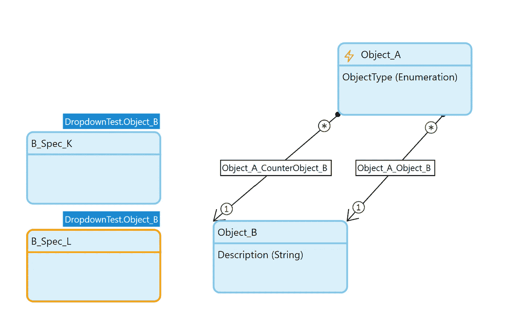

Domain Model

# 界面

我们有对象 A 和对象 b 的选项卡。在对象 A 选项卡上，有一个 3:9 布局网格，在较小的左半部分有一个所有对象的 ListView，在较大的右半部分有一个 DataView，它监听对象 a ListView。根据设置，对象和反对象的下拉列表取决于对象类型。所以对于 Type_X，对象是 Spec_L，反对象是 Spec_K，

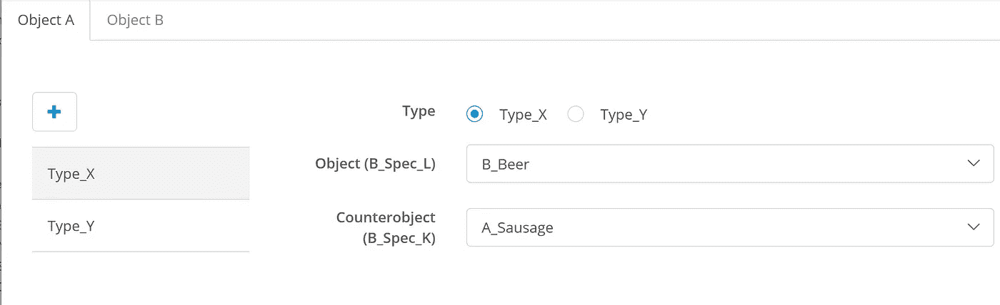

Type X View of Object A

而对于 Type_Y，对象是 Spec_K 的，反对象是 Spec_L 的

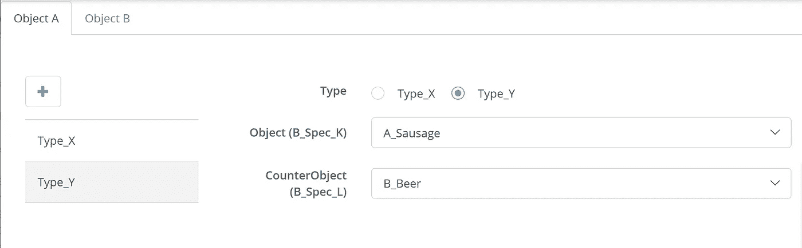

Type_Y view of Object A

这是通过依赖于对象类型的可见性来实现的。该表单有四个 dropdownlists(两对)，其中每种类型都有两个可见的列表。

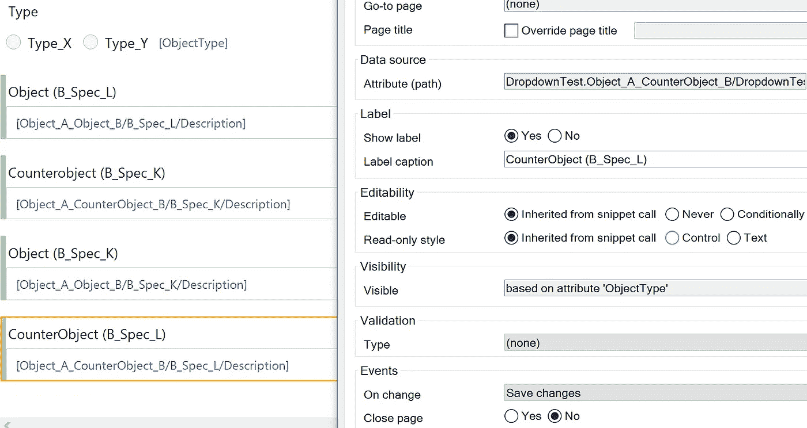

还有一个加号按钮，它创建一个 Object_A 对象并打开一个模态弹出窗口来输入数据。

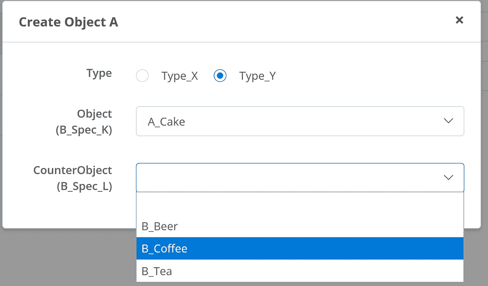

Object A create modal

对象形式是一个片段。所有三个字段(Type、Object、CounterObject)都将 commit 对象作为 onChange 事件。

如您所见，任何视图上都没有保存或取消按钮。因此任何更改一发生就被提交。

# 问题是

一旦对象类型改变，就会有一个 Spec_L-Object_B 作为参考，其中可选项目是 Spec_K-ObjectBs，反之亦然。Mendix 无法显示条目，并且在页面重新加载之前拒绝接受对下拉列表的更改。因为我们已经定义了任何特化都可以存储为对象或反对象，所以我们可能需要通过微流手动切换对象。但是 Mendix 仍然没有显示条目，并且在页面重新加载之前无法进行更改。

# 详细步骤

1.  创建两个对象 b，一个名为 L_Beer，另一个名为 K _ 香肠。

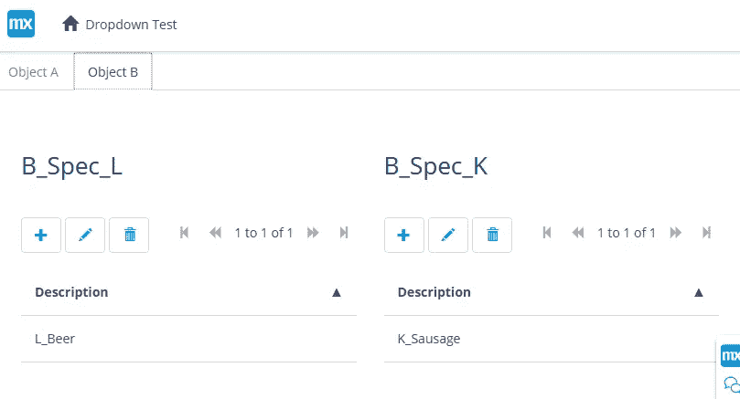

2.创建一个对象 A 作为 Type_X 对象:

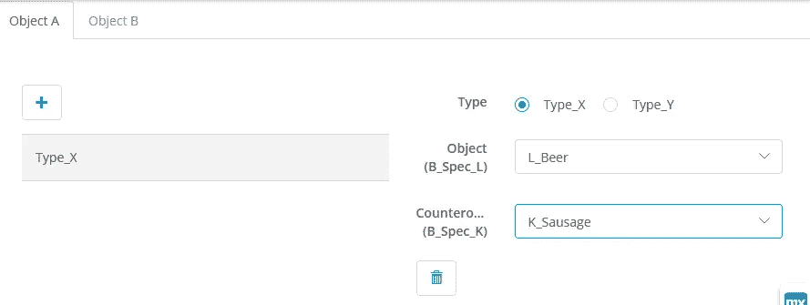

3.将类型切换到类型 _Y

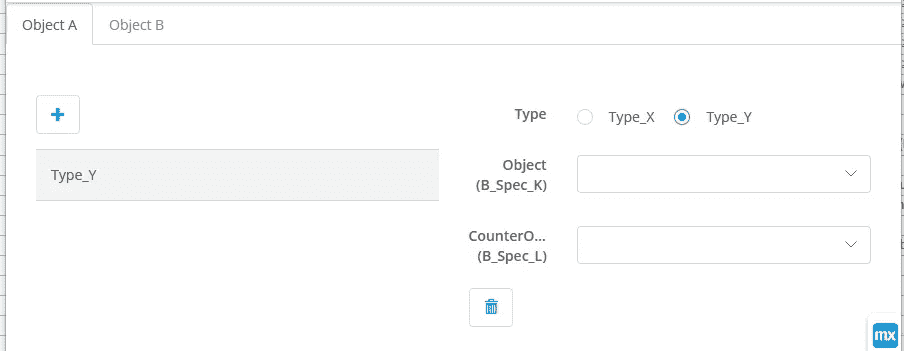

正如所料，下拉字段现在显示 B_Spec_K 作为第一个元素，B_Spec_L 作为第二个元素。但是条目不见了。在页面重新加载之前，无法选择对象。

# 第一种方法

我在 support.mendix.com 制造了一个事件指向这篇文章，他们建议:

*可能的解决方法是，每个属性使用两个引用选择器，而不是使用条件可见性在它们之间切换，这可以通过每个属性一个引用选择器来实现。引用选择器应该使用泛化(ObjectB)作为它的“数据源”,使用微流作为它的“可选对象”,根据对象类型查询正确的专门化。*

这些对象没有出现的原因是:

似乎只要类型被切换一次，就有两个引用选择器(一个可见，一个不可见)同时对同一个属性进行操作，并且具有冲突的约束。每当其中一个试图设置一个值时，另一个会立即将其重置为空，因为它无效。

所以我更改了代码片段(实际上我复制了它并更改了副本)，但很快发现标签也需要由微流确定，正如它所显示的(B_Spec_L ),即使其中有 B_Spec_K 对象:

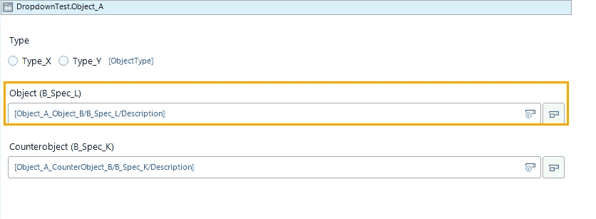

标签只能通过计算的属性动态创建，所以我给对象 b 添加了一个标签属性。我知道这很难看，但现在看来这是解决问题的唯一方法(尽管有多个固定的形式)。

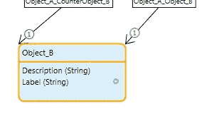

标签现在显示了属性

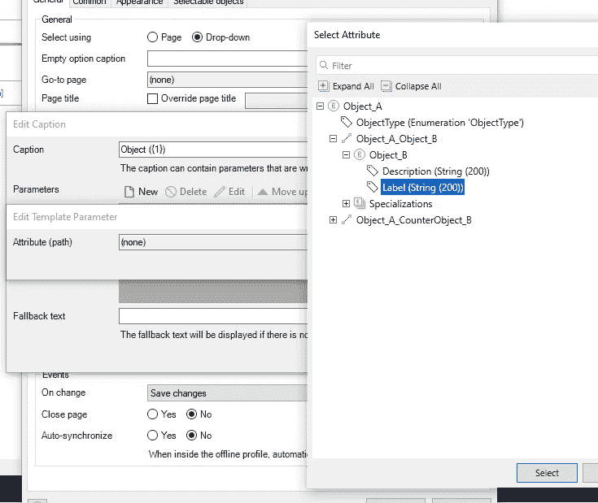

它必须在一般化的 ObjectB 上完成，因为我们在请求属性时不知道专门化。属性后面的微流只做出一个对象决定，并在结束事件中硬编码了名称。是的，这真的很丑。

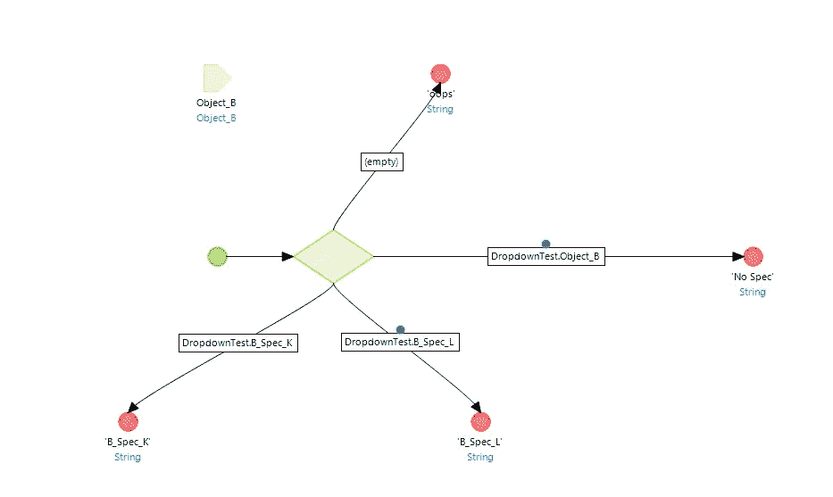

它不起作用。仅当选择了一个对象时，标签才会显示正确的值。当值为空时，没有关联，因此不能调用微流。

# 借口:为什么对象类型决策是坏的

[多态](https://en.wikipedia.org/wiki/Polymorphism_(computer_science))(一般化-特殊化)模式开辟了一种高度灵活和可扩展的方式，将具有相同元结构的对象分组。要使用元对象的属性和关系，新定义的子对象应该只需要将元对象定义为其父对象(一般化)。有了对象类型决策，你就挫败了多态性的全部目的。例如，每次您扩展您的模型时，您都必须扩展您以前创建的所有对象类型决策。你越专门化，你的微流程就会越混乱。

早在 c 编程时代，最昂贵的代码修复位于嵌套的 if 和开关中。

做！不是！用！ObjectTypeDecisions！

# 结果

如上所示，对象类型决策方法既不成功也不值得称赞。支持团队发现了问题。它之所以发生，是因为两个选择器对同一个对象进行操作。他们告诉我，他们*将在 React 中完全重写这个小部件，以扩展其功能，并使其与平台的其他部分保持一致。鉴于 React 小部件是如何实现条件可见性的，重写很可能会解决这个问题。*

所以期待他们的解决方案！

*来自发布者-*

*上面讨论的问题将在未来的版本中解决。*

如果你喜欢这篇文章，你可以在我们的 [*媒体页面*](https://medium.com/mendix) *或我们自己的* [*社区博客网站*](https://developers.mendix.com/community-blog/) *找到更多类似的内容。*

*希望入门的创客可以注册一个* [*免费账号*](https://developers.mendix.com/meetups/#meetupsNearYou) *，通过我们的* [*学苑*](https://academy.mendix.com/link/home) *获得即时学习。*

有兴趣加入我们的社区吗？你可以加入我们的 [*slack 社区频道*](https://join.slack.com/t/mendixcommunity/shared_invite/zt-hwhwkcxu-~59ywyjqHlUHXmrw5heqpQ) *或者那些想更多参与的人，看看加入我们的* [*聚会*](https://developers.mendix.com/meetups/#meetupsNearYou) *。*