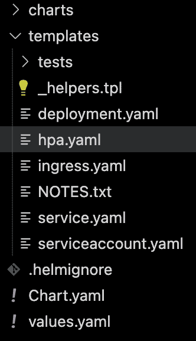
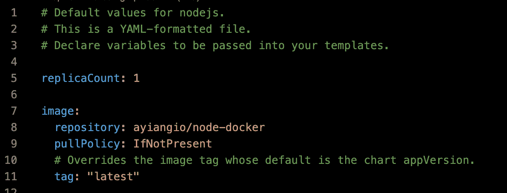
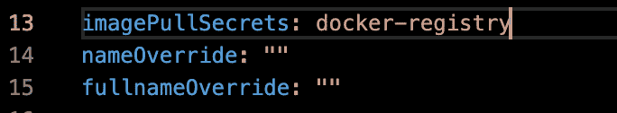
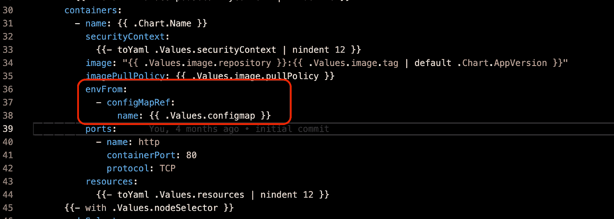
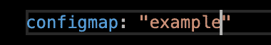

# Build Helm Chart For Your Application

> 原文：<https://medium.easyread.co/build-helm-chart-for-your-application-67d74c40eeb2?source=collection_archive---------2----------------------->


Photo by [Joseph Barrientos](https://unsplash.com/@jbcreate_?utm_source=medium&utm_medium=referral) on [Unsplash](https://unsplash.com?utm_source=medium&utm_medium=referral)

Dalam Mendeploy sebuah Service kubernetes secara manual dalam kita butuh mendefinisikan beberapa object (Kind) yang kita perlukan seperti Service, Deployment, Ingress dan lain sebagainya.

Cara seperti ini akan dilakukan secara berulang untuk setiap service yang akan dideploy dikubernetes dan ini menjadi kurang efisien karna kita melakukan pekerjaan yang berulang.

Pada Artikel ini saya akan berbagi cara mendeploy service di kubernetes menggunakan Helm Chart, Helm chart adalah package yang format chart, yang dapat mencollect dari file sumber kubernetes.

# Prerequisites

*   Helm Version 3\. xx or newer
*   Kubectl
*   Docker Image

# Steps

Pada artikel ini akan membuat helm chart yang sederhana, kita akan deploy service node dengan menggunakan environment variable (configmap).

*   Inisialiasi helm chart menggunakan perintah berikut.

```
helm create (chart name)
```

*   Secara default akan membuat file seperti pada gambar berikut.



helm chart

*   Edit pada file *values.yaml* dengan menambahkan repository image container pada bagian image



values.yaml

***NOTE***

*   Jika repository nya adalah private maka tambahkan secret untuk username dan password repository dengan menggunakan perintah berikut.

```
kubectl create secret docker-registry regcred --docker-server=<your-registry-server> --docker-username=<your-name> --docker-password=<your-pword> --docker-email=<your-email>
```

*   Pada bagian imagePullSecret tambahkan nama secret yang telah dibuat sebelumnya.



values.yaml

*   Menambahkan Configmap, edit file templates/deployment.yaml dan tambahkan envRef seperti pada gambari dibawah ini



deployment.yaml

*   Selanjutnya pada values.yaml tambahkan key configmap dan sesuaikan valuenya dengan configmap pada kubernetes.



values.yaml

*   Bagian service pada artikel ini menggunakan type ClusterIP dengan port 80 dan destinationPort 3000 (sesuai dengan port yang di expose dari aplikasi) .

values.yaml

*   Deploy service menggunakan helm chart dengan perintah berikut

```
helm install (name chart) . -n (namespace application)
```

*   Check apakah aplikasi nya sudah terdeploy di cluster dengan menggunakan perintah berikut

```
kubectl get all -n (namespace appliaction)
```

# Conclusion

Ini hanya chart yang sederhana, banyak lagi yang bisa ditambahkan pada konfigurasi helm chart, seperti menambahkan ingress, horizontall pod autoscalling, livenessProbe and readinessProbe, dan masih banyak lagi

# Reference

*   [https://kubernetes.io/docs/tasks/configure-pod-container/pull-image-private-registry/](https://kubernetes.io/docs/tasks/configure-pod-container/pull-image-private-registry/)
*   [https://helm.sh/docs/helm/helm_create/](https://helm.sh/docs/helm/helm_create/)