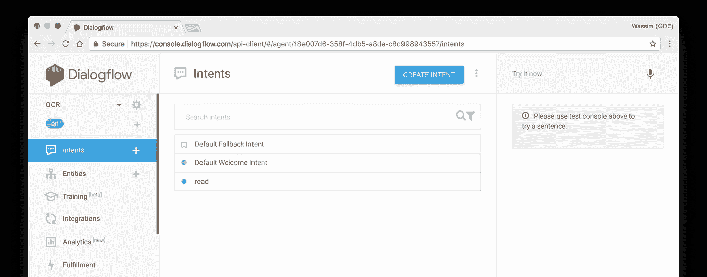
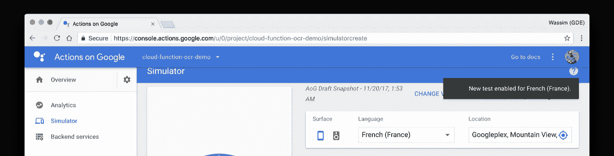

# 为谷歌助手建立多语言操作

> 原文：<https://medium.com/google-developer-experts/build-multi-lingual-actions-for-the-google-assistant-106d2b94aa1a?source=collection_archive---------3----------------------->


Credits: ©Shutterstock.com/Qvasimodo

是时候让你的行动走向国际了。在这篇文章中，我们将学习如何为谷歌助手本地化我们的应用程序，为不同的语言和地区提供定制的体验。

# 在开始之前

在我们开始本地化 Google Assistant 的操作之前，我们需要确保检查 Google Assistant 当前支持哪些语言。你可以在[助手文档](https://developers.google.com/actions/localization/languages-locales)中找到最新列表。

# 定位我们的特工

在我们开始之前，需要注意的是，本地化 Google Assistant 的操作分 3 步完成:

1.  在设计阶段，在 DialogFlow 中本地化代理(意图和实体)。
2.  在开发阶段处理和本地化来自完成的响应(webhook)。
3.  在将操作发布到应用程序目录之前，请为其提供本地化信息。

为了展示这些步骤，让我们使用我已经创建的一个现有动作，它只支持英语，并且也支持法语。

## 将“意图”本地化

为了简单起见，这个动作只有一个我们需要本地化的意图。然而，在现实世界的用例中，我们通常有几十个——如果不是几百个的话。**你必须将它们全部本地化！**



在我们的简单例子中，我们只有两种表达的“阅读”意图:

1.  "阅读这篇文章"
2.  "提取文本"

因此，要添加新的语言，让我们单击语言名称(在左侧面板上)旁边的“+”，然后选择我们想要添加的新语言—在我们的示例中是法语:


在某些用例中，您还可以添加每种主要语言的本地化版本。例如，如果主要语言是法语，您可能希望根据您的目标用户提供欧洲法语或加拿大法语—当然，这完全是可选的。如果这是你的情况，你可以这样做:

要添加语言环境，我们只需将鼠标悬停在法语主语言上，单击“+添加语言环境”蓝色标签，然后选择一个语言环境:


所有新的区域设置都将在其主要语言下列出:


完成后，您可以从左侧面板的语言部分访问新语言及其区域设置:


现在，您已经准备好为每个意图本地化用户的话语了！

> 在开始之前，请确保您选择了正确的语言(或区域设置):蓝色标签表示当前活动的语言(或区域设置)。


## 本地化“实体”

如果您的操作包含实体，您也必须本地化它们。当本地化实体时，您只需要本地化值(第二列)。Make sur 保持所有语言环境中的令牌(第一列)相同:


## 将响应本地化

如果您确实提供了静态响应(来自 DialogFlow ),显然也需要对它们进行本地化:


# 完成

在大多数用例中，您可能将操作的业务逻辑托管在服务器端，并为此配置了一个 webhook。在这种情况下，您需要根据用户的地区提供正确的响应。事实上，当用户与您的操作进行交互时，您会在对您的履行的每个请求中收到 Google Assistant 区域设置——该设置基于用户的电话主要语言。然后，您可以使用这个地区，例如 **fr-FR** ，*来计算如何根据用户的语言或地区返回不同的响应。*

在构建了几十个操作之后，我提出了一个小的实用节点包来为您处理这个过程。

首先，您需要使用 Npm 或 Yarn 安装包:

```
$ yarn add [@manekinekko/actions-on-google-i18n](https://www.npmjs.com/package/@manekinekko/actions-on-google-i18n)
```

在使用这个包之前，您需要为您提供的每个语言环境创建一个文件。文件名必须遵循 [IETF 语言标签](https://en.wikipedia.org/wiki/IETF_language_tag)格式，例如 **en-US** 或 **fr-FR** :

```
├── src/
│   ├── locales/
│   │   ├── fr-FR.json
│   │   ├── fr-CA.json
│   │   ├── en-US.json
│   │   └── en-GB.json
```

每个文件必须符合以下格式:

*   标识唯一字符串的唯一键。
*   包含将发送给用户的文本的值。你可以用 [SSML](https://developers.google.com/actions/reference/ssml) 。
*   通过将变量包装在 **{varibale_name}** 中，可以在字符串中使用变量。

```
*// src/locales/en-US.json* {
   "MSG_001"**:** "Hi {name}. What can I do for ya?"
};*// src/locales/en-GB.json* {
   "MSG_001"**:** "Hi {name}. How can I help?"
};*// src/locales/fr-FR.json* {
   "MSG_001"**:** "Salut {name}. Que puis-je faire?"
};
```

接下来，将包导入到您的操作函数中，并调用 configure 方法，如下所示:

```
**const i18n = require("@manekinekko/actions-on-google-i18n");**exports.agent = (*request*, *response*) *=>* {
 *const* app = new DialogflowApp({ request, response });

 **i18n.use(app);** //...
}
```

最后，使用**应用程序。__()** 方法加载正确的响应，并可选地提供上下文(如果您的响应中有变量):

```
const actionMap **=** **new** Map();actionMap.set('my.cool.action', (app) => {
   app.tell(**app.__('MSG_001', { name: 'Wassim' })**);
});app.handleRequest(actionMap);
```

你可以在这里阅读更多关于这个库的信息

# 出版

恭喜，您现在可以发布(或重新发布)您的本地化操作了。但是在此之前，还有最后一个步骤，您需要提供将在所选语言的应用程序目录中使用的操作的本地化信息。这一步只需要几分钟。

从谷歌助手控制台，进入**概述**，然后进入**应用信息**，点击“添加语言”按钮:


然后选择一种或多种语言。**确保您在 DialogFlow** 中选择了与设计阶段相同的语言:


然后，对于每种语言，您需要填写**所需的**输入:

*   助手 app 名称和发音。
*   助手 app 介绍。
*   助手 app 语音。
*   简短而完整的描述。
*   示例调用。


# 试验

现在，您可以在选定的语言和地区测试您的操作了。您可以使用模拟器中的“语言”下拉列表:



如果您遇到以下错误消息:“您的应用程序必须至少有一个针对区域设置 xx 的操作”:


这意味着您必须提供所选语言的区域设置。例如，欧洲法语就是这种情况。我们将为法国添加一个法语区域:


您现在有了一个针对说法语(来自法国)的用户的特定版本。如果您愿意，您可以更新这个特定地区的信息—在我们的例子中这是可选的:


蓝色的“本地化”标签表示您有特定语言的活动区域设置:


# 瞧啊。

恭喜你！您现在有了一个本地化的操作，它将为所有用户提供定制的体验。

*在 Twitter 上关注我*[*@ manekinekko*](https://twitter.com/manekinekko)*了解更多关于助手和网络平台的信息。*