# 使用缓存层构建 Java 应用程序，并使用 CI/CD 进行部署

> 原文：<https://medium.com/oracledevs/build-oracle-application-container-cloud-cache-based-application-ci-cd-using-oracle-dev-cloud-2392dcd3da00?source=collection_archive---------4----------------------->

在这篇博客中，我们将关注:

*   如何使用[(开源)Java SDK](https://github.com/oracle/accs-caching-java-sdk) 与[应用容器云](http://cloud.oracle.com/acc)缓存交互
*   在此基础上构建应用程序
*   使用[开发者云服务](https://cloud.oracle.com/en_US/developer-service)设置持续集成和持续部署(CI/CD)

# 应用

这个应用程序很简单，它从缓存中获取股票价格。它展示了其他特性(除了基本的缓存之外),例如

*   **缓存加载器** —如果密钥(股票名称)在缓存中不存在(因为它从未被搜索过或者已经过期)，缓存加载器逻辑会使用对端点的 REST 调用来获取价格
*   **序列化器** —允许我们使用我们的域对象( *Ticker* )并负责转换逻辑
*   **到期** —强制执行缓存级到期，之后从缓存中清除条目
*   **指标** —获取通用指标，如缓存大小、命中、未命中等。

# 密码

让我们看看我们的应用程序的一些代码片段和上面提到的每个特性

Github 上的项目[可用](https://github.com/abhirockzz/app-container-cloud-cache-example)

## 缓存操作

这个例子展示了使用 Jersey (JAX-RS API)实现的 REST 端点上的 get cache 操作

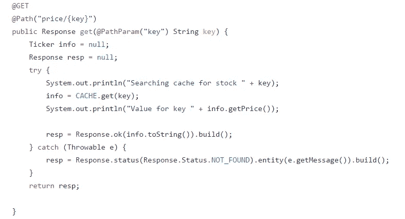

## 缓存加载程序

**PriceLoader.java**包含从外部来源获取价格的逻辑

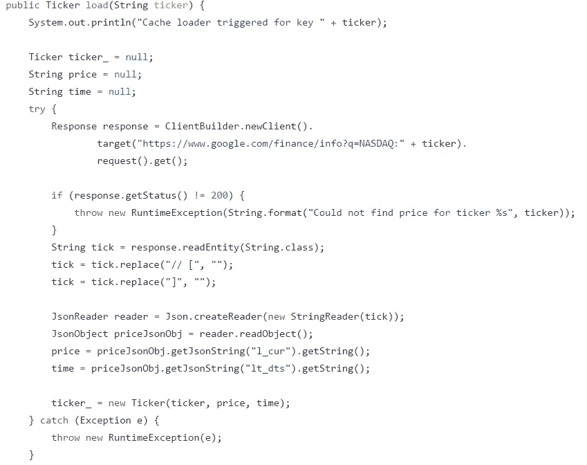

## 串行器

**TickerSerializer.java**与**Ticker.java**的相互转换及其字符串表示

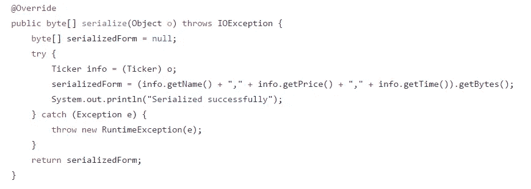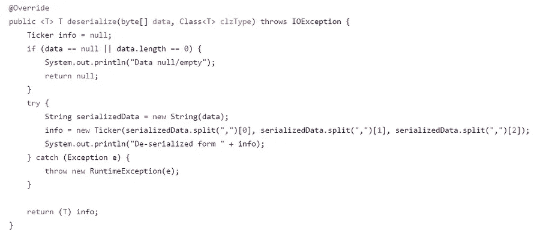

## 满期

达到此阈值时清除高速缓存条目，并在再次查找(get)过期条目时导致高速缓存加载器调用

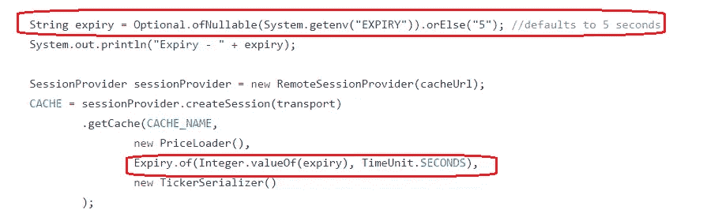

## 韵律学

可以提取许多缓存指标——常见指标在 REST 端点上公开

一些指标是*全局*指标，其他指标是*非*指标。详情请参考 [*缓存度量* javadoc](https://github.com/oracle/accs-caching-java-sdk/blob/master/cache-client-api/src/main/java/com/oracle/cloud/cache/metrics/CacheMetrics.java#L24)

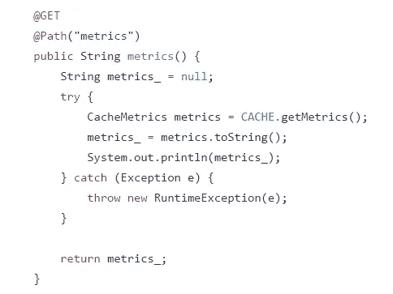

# Oracle 云服务的设置

## 应用容器云

唯一需要的设置是创建缓存。这非常简单，可以使用文档快速完成。

请确保缓存的名称与[代码](https://github.com/abhirockzz/app-container-cloud-cache-example/blob/master/src/main/java/com/oracle/cloud/acc/cache/dcs/CacheREST.java#L20)和配置(开发者云)中使用的名称相同，即测试缓存。如果没有，请更新参考资料

## 开发者云

您需要为构建和持续部署过程配置开发人员云。你可以参考以前的博客——这里将重点介绍这个例子的一些细节

**参考文献**

*   [项目&代码库创建](https://community.oracle.com/community/cloud_computing/oracle-cloud-developer-solutions/blog/2017/05/25/getting-started-with-kafka-based-microservices-using-oracle-event-hub-cloud-application-container-cloud-developer-cloud#jive_content_id_Project__code_repository_creation)
*   [在 Git 存储库中配置源代码](https://community.oracle.com/community/cloud_computing/oracle-cloud-developer-solutions/blog/2017/05/25/getting-started-with-kafka-based-microservices-using-oracle-event-hub-cloud-application-container-cloud-developer-cloud#jive_content_id_Configure_source_code_in_Git_repository)
*   [持续部署(CD)到应用容器云](https://community.oracle.com/community/cloud_computing/oracle-cloud-developer-solutions/blog/2017/05/25/getting-started-with-kafka-based-microservices-using-oracle-event-hub-cloud-application-container-cloud-developer-cloud#jive_content_id_Continuous_Deployment_CD_to_Application_Container_Cloud)

## 提供应用容器云(配置)描述符

*   这里提供的清单 json 将覆盖您的 zip 文件中的清单(如果有的话)——这里并不强制提供它
*   提供 deployment.json 细节是强制性的(在这个 CI/CD 场景中),因为它不能包含在 zip 文件中

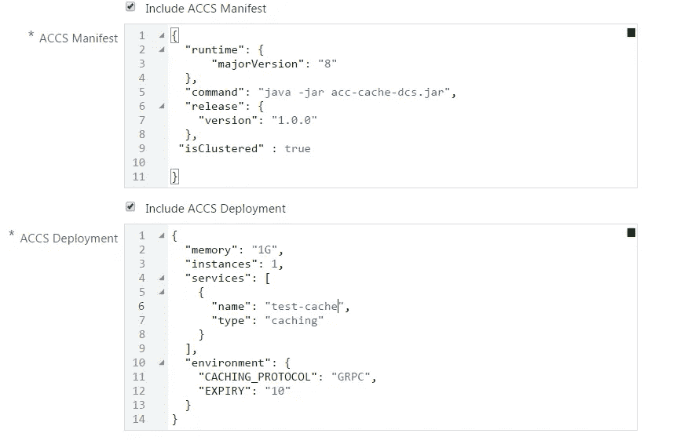

## Oracle 开发人员云中的部署确认

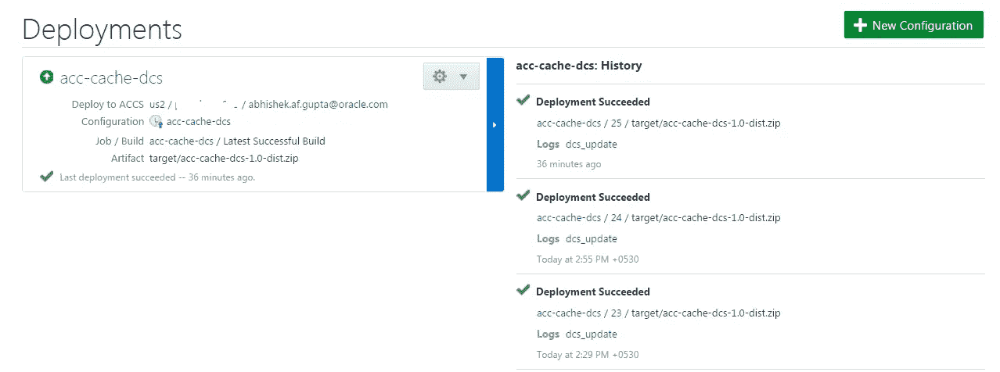

## Oracle 应用程序容器云中的状态

应用程序 URL 已突出显示

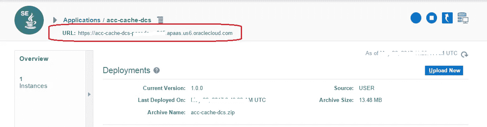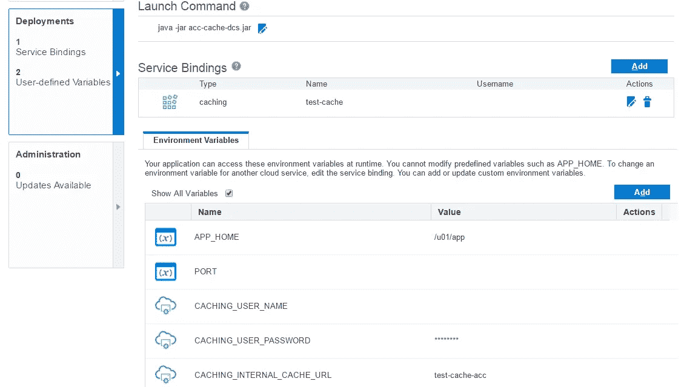

# 测试应用程序

## 最低价格

调用 REST 端点(检查应用程序 URL ),例如

```
curl -X [https://acc-cache-dcs-domain007.apaas.us6.oraclecloud.com/price/ORCL](https://acc-cache-dcs-domain007.apaas.us6.oraclecloud.com/price/ORCL)
```

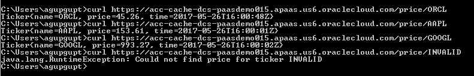

如果您尝试获取股票到期后的价格(默认为 5 秒)，您应该会看到**时间**属性发生了变化(如果价格确实发生了变化，价格也会发生变化)

## 检查缓存指标

调用 HTTP GET(使用 curl 或浏览器)到 REST 端点(检查应用程序 url ),例如

```
curl -X [https://acc-cache-dcs-domain007.apaas.us6.oraclecloud.com/metrics](https://acc-cache-dcs-domain007.apaas.us6.oraclecloud.com/metrics)
```

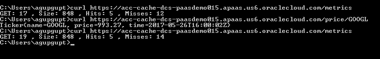

# 测试 CI/CD 流

做一些代码修改，推送给开发者云服务 Git repo。这应该

*   自动触发构建，一旦成功将
*   自动触发部署流程，以及
*   将新的应用程序版本重新部署到应用程序容器云

# 不要忘记…

*   查看 Oracle 应用容器云的[教程—每个运行时都有一些内容！](https://docs.oracle.com/en/cloud/paas/app-container-cloud/create-first-applications.html)
*   [其他关于应用容器云的博客](http://bit.ly/2gR3nrV)
*   [ACCS Java Cache SDK 的 Github 项目](https://github.com/oracle/accs-caching-java-sdk)
*   [甲骨文开发者云文档](http://docs.oracle.com/en/cloud/paas/developer-cloud/index.html)

> 本文表达的观点是我个人的观点，不一定代表甲骨文的观点。