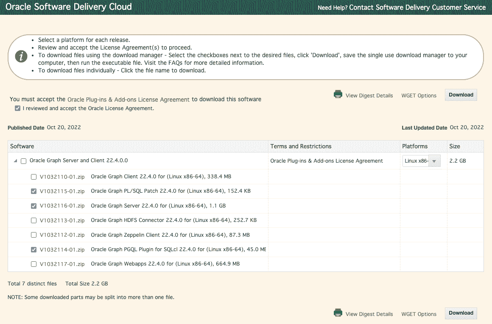

# 在 Docker 上构建 Oracle 图(第 1/2 部分)

> 原文：<https://medium.com/oracledevs/build-oracle-graph-on-docker-part-1-2-5fcacaca430e?source=collection_archive---------0----------------------->


(2022 年 12 月 5 日更新为 22.4 版)

在本文中，我将向您展示如何在您的 Docker 容器上构建 Oracle Graph，这是 Oracle 数据库的最新特性之一，可以免费试用。

首先，让我们从 Oracle Graph 的架构概述开始。Oracle 数据库本身可以作为一个图形数据库(使用 2 层部署)，本文的第 1 部分将讨论这种配置。在[第二部分](/oracledevs/build-oracle-graph-on-docker-part-2-2-407827b0b93)中，我们将添加一个名为 Graph Server 的内存中图形分析框架，以实现图形算法的超快速查询和执行。


你们有些人可能会说，“那我就不需要 Oracle 数据库了。我只想用 Graph Server。”虽然有办法做到这一点(所以我相信你能找到这样的黑客)，但 Oracle Graph 的理念是使用 Oracle 数据库进行用户认证，这样 Graph Server 就能实现无缝的数据集成和企业使用的安全性。

**建立数据库**

如果您已经有一个 Oracle 数据库(版本 12.2 或更高版本)可以用于此目的，请继续下一节。

如果你想在 Docker 上建立一个新的 Oracle 数据库，我推荐从 Oracle Container Registry 下载[速成版(XE 21c)](https://container-registry.oracle.com/ords/f?p=113:4:299976774074:::4:P4_REPOSITORY,AI_REPOSITORY,AI_REPOSITORY_NAME,P4_REPOSITORY_NAME,P4_EULA_ID,P4_BUSINESS_AREA_ID:803,803,Oracle%20Database%20Express%20Edition,Oracle%20Database%20Express%20Edition,1,0&cs=38e8sQz4Gg55h7ktQY_pRCwGkjjcesLhpHt2H1kPv3ApvOVcvAkRlD-3l6fwb2Wo1i7qCzwVpmb1Elp_8rG02-w) 镜像。对于那些没有意识到这一点的人，Express Edition 允许您对小型数据库免费使用 Oracle 数据库的大多数功能，尽管有大小限制(2 个 CPU 线程、2GB RAM、12GB 用户数据)。当然包括 Oracle Graph！

请先拉图。大概是 6GB。

```
$ docker pull container-registry.oracle.com/database/express:21.3.0-xe
```

当您运行容器时，它将启动预构建的数据库。这将只需要 1-2 分钟，所以请立即遵循日志。

```
$ docker run -d --name database -p 1521:1521 -v $HOME:/host-home \
  container-registry.oracle.com/database/express:21.3.0-xe
$ docker logs -f database
```

一旦收到如下消息，就可以连接到数据库。

```
#########################
DATABASE IS READY TO USE!
#########################
```

键入 Control + C 停止跟踪日志，并运行以下脚本来更改管理用户(= sys)的密码。

```
$ docker exec database ./setPassword.sh Welcome1
```

使用 SQL 客户端(= sqlplus)以 sys 用户身份连接。

```
$ docker exec -it database sqlplus sys/Welcome1@xepdb1 as sysdba
```

重新启动容器，并确保您仍然可以连接。

```
$ docker stop database
$ docker start database
```

**下载甲骨文图表**

现在，该说说 Oracle Graph 了。

您可以从[这个站点](https://www.oracle.com/database/technologies/spatialandgraph/property-graph-features/graph-server-and-client/graph-server-and-client-downloads.html)获取补丁(PL/SQL 脚本)来启用 Oracle Graph。当您选择以下任一产品包时，系统会要求您使用 Oracle 帐户登录，以迁移到软件交付云。

*   用于 PL/SQL 的 Oracle 图形客户机
*   用于 SQLcl 的 Oracle Graph PGQL 插件
*   Oracle 图形服务器(我们将在[第 2 部分](/oracledevs/build-oracle-graph-on-docker-part-2-2-407827b0b93)中使用)



按照对话框下载软件包。


**启用 Oracle 图形**

下载 PL/SQL 补丁的 zip 文件(= v 1032115–01 . zip)后，将其解压缩到一个可从容器访问的合适位置。在这种情况下，我们将它设置为`$HOME/oracle-graph`。

```
$ cd $HOME/oracle-graph
$ unzip V1032115-01.zip
$ unzip oracle-graph-plsql-22.4.0.zip -d oracle-graph-plsql
```

连接到容器上的 SQL 客户端。

```
$ docker exec -it database sqlplus sys/Welcome1@xepdb1 as sysdba
SQL>
```

运行脚本。主机的`$HOME`安装在集装箱的`/host-home`上。

```
SQL> @/host-home/oracle-graph/oracle-graph-plsql/19c_and_above/opgremov.sql
SQL> @/host-home/oracle-graph/oracle-graph-plsql/19c_and_above/catopg.sql
SQL> exit
```

**创建用户**

连接到容器上的 SQL 客户端。

```
$ docker exec -it database sqlplus sys/Welcome1@xepdb1 as sysdba
```

创建一个名为`graphuser`的数据库用户，并赋予其必要的权限。

```
CREATE USER graphuser
IDENTIFIED BY Welcome1
DEFAULT TABLESPACE users
TEMPORARY TABLESPACE temp
QUOTA UNLIMITED ON users;

GRANT
  alter session
, create procedure
, create sequence
, create session
, create table
, create trigger
, create type 
, create view
, graph_developer -- This role is required for using Graph Server in Step 2
TO graphuser;

exit
```

验证新用户可以连接。

```
$ docker exec -it database sqlplus graphuser/Welcome1@xepdb1
SQL> 
```

**准备 SQL 语句**

由于 sqlplus 还不具备处理 PGQL 查询的能力，我们需要准备 **SQLcl** ，这是另一个提供 PGQL 插件的 SQL 客户机。

像以前一样从[这个站点](https://www.oracle.com/database/technologies/spatialandgraph/property-graph-features/graph-server-and-client/graph-server-and-client-downloads.html)下载 SQL 插件。选择以下软件包后，将要求您同意许可并使用您的 Oracle 帐户登录。

*   SQLcl 的 PGQL 插件

从 zip 文件(v 1032114–01 . zip)展开 Oracle-graph-sqlcl-plugin-22 . 4 . 0 . zip，并将 Dockerfile(将按如下方式创建)放在同一目录中。

```
$ unzip V1032114-01.zip
Archive:  V1032114-01.zip
  inflating: oracle-graph-sqlcl-plugin-22.4.0.zip
$ vi Dockerfile
```

这是一个示例 Dockerfile 文件。

```
FROM openjdk:12-oracle
ARG VERSION_OPG
RUN yum -y install unzip \
 && yum clean all
RUN curl -s https://download.oracle.com/otn_software/java/sqldeveloper/sqlcl-latest.zip > sqlcl-latest.zip
RUN unzip sqlcl-latest.zip
RUN chmod 755 sqlcl/bin/sql
ADD oracle-graph-sqlcl-plugin-${VERSION_OPG}.zip .
RUN unzip oracle-graph-sqlcl-plugin-${VERSION_OPG}.zip -d sqlcl/lib/ext \
 && rm oracle-graph-sqlcl-plugin-${VERSION_OPG}.zip
ENV PATH=sqlcl/bin:$PATH
CMD sql
```

建立形象。

```
$ docker build . -t sqlcl-pgql --build-arg VERSION_OPG=22.4.0
```

设置别名以允许`sql`命令每次都运行这个容器。

```
$ alias sql='docker run --rm -it sqlcl-pgql sql'
```

连接到在同一主机上的容器中运行的数据库。主机名`host.docker.internal`可能不可用，具体取决于您的 Docker 环境。在这种情况下，请给出主机的 IP 地址。

```
$ sql graphuser/Welcome1@host.docker.internal:1521/xepdb1
SQL>
```

**创建图表**

确保可以将 SQL 切换到 PGQL 模式。

```
SQL> PGQL AUTO ON
PGQL Auto enabled for graph=[null], execute=[true], translate=[false].
PGQL>
```

用 PGQL 查询创建一个图。

```
CREATE PROPERTY GRAPH graph1;
```

现在，向图中添加两个节点和它们之间的一条边。如果粘贴时查询没有正常运行，您可以通过键入`/` (=命令重新运行)来运行它。

```
INSERT INTO graph1 VERTEX v
LABELS (person) PROPERTIES (v.id = 'p1', v.name = 'Alice');

INSERT INTO graph1 VERTEX v
LABELS (car) PROPERTIES (v.id = 'c1', v.brand = 'Toyota');

INSERT INTO graph1 EDGE e BETWEEN src AND dst
LABELS (has) PROPERTIES (e.since = 2017)
FROM MATCH ( (src), (dst) ) ON graph1
WHERE src.id = 'p1' AND dst.id = 'c1';

COMMIT;
```

在图形模式中搜索“Alice 拥有的汽车”。这是一个 PGQL 查询的例子。PGQL 语法的完整描述可从[https://pgql-lang.org/](https://pgql-lang.org/)获得。

```
SELECT p.name, LABEL(h), c.brand, h.since
FROM MATCH (p)-[h:has]->(c:car) ON graph1
WHERE p.name = 'Alice';
```

结果将是:

```
NAME     LABEL(h)    BRAND     SINCE 
________ ___________ _________ ________ 
Alice    HAS         Toyota    2017
```

干得好。现在，您在一个容器上有了自己的图形数据库。这是本文第 1 部分的结尾。

我介绍了在 Docker 容器上构建和开始使用 Oracle Graph 的步骤，我希望您现在可以看到有一种方法可以将 Oracle 数据库本身用作图形数据库。

我还没有介绍 Oracle Graph 的优势，比如表格数据的声明式转换和与高性能图形服务器的集成。我会在[第二部](/oracledevs/build-oracle-graph-on-docker-part-2-2-407827b0b93)中这样做。

请从以下网址了解更多关于**甲骨文图**的信息:

*   [中](/tag/oracle-graph) (=所有带有 Oracle Graph 标签的文章)
*   [堆栈溢出](https://stackoverflow.com/questions/tagged/oracle-graph) (=带有 oracle-graph 标记的问题)
*   [Slack AnDOUC](https://join.slack.com/t/andouc/shared_invite/zt-1a2hmiz6f-vLlblcQyv0t9FMraMMP5uQ) (=邀请链接，请访问#graph)
*   [Slack OracleDevRel](https://join.slack.com/t/oracledevrel/shared_invite/zt-1nwqm6cdi-cxr~JN9YOtmBh3sarhOZvg) (=邀请链接，请访问#oracle-db-graph)