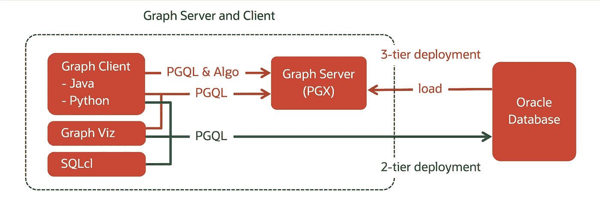
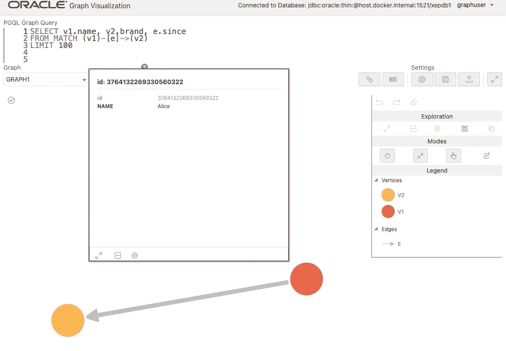

# 在 Docker 上构建 Oracle 图形(第 2/2 部分，版本 22.3)

> 原文：<https://medium.com/oracledevs/build-oracle-graph-on-docker-part-2-2-407827b0b93?source=collection_archive---------0----------------------->


(该程序已在版本 22.3.0 中测试过。**更新版本请见** [**本文**](https://ryotayamanaka.medium.com/14209d23574e) **。**)

在[第 1 部分](/oracledevs/build-oracle-graph-on-docker-part-1-2-5fcacaca430e)中，我解释了如何在容器上运行 Oracle 数据库，并将其用作图形数据库。仅在这个环境中就有各种各样的方法来使用它，比如将表数据转换成图形，创建视图，甚至将它与 JSON 结合起来，我将在以后介绍。

然而，本文将只关注解释为 Graph Server 构建和添加容器的过程。在下面的架构图中，我们已经构建了 2 层部署，现在我们将添加 3 层部署。



**构建图形服务器**

从这个站点下载包含 Graph Server 和 Graph Viz 的 RPM 包。当您选择下面的软件包时，将要求您同意许可并使用您的 Oracle 帐户登录。

*   Oracle 图形服务器

另外，从[这个网站](https://www.oracle.com/java/technologies/downloads/#java11)下载 JDK 11。个人或开发使用无需支付许可费。

*   Linux - x64 RPM 软件包

将这些 RPM 包和您接下来将创建的 Dockerfile 文件放在同一个目录中。

*   oracle-graph-22.3.0.x86_64.rpm
*   甲骨文-图形-客户端-22.3.0.zip
*   jdk-11.x.xx_linux-x64_bin.rpm

```
vi Dockerfile
```

这是一个示例 Dockerfile 文件。

```
FROM oraclelinux:7
ARG VERSION_JDK
ARG VERSION_GSC
COPY ./jdk-${VERSION_JDK}_linux-x64_bin.rpm /tmp
COPY ./oracle-graph-${VERSION_GSC}.x86_64.rpm /tmp
COPY ./oracle-graph-client-${VERSION_GSC}.zip /tmp
RUN yum install -y unzip numactl vim python3 python3-devel gcc openssl \
 && yum clean all \
 && rm -rf /var/cache/yum/* \
 && rpm -ivh /tmp/jdk-${VERSION_JDK}_linux-x64_bin.rpm \
 && rpm -ivh /tmp/oracle-graph-${VERSION_GSC}.x86_64.rpm
ENV JAVA_HOME=/usr/java/jdk-${VERSION_JDK}
ENV PATH=$PATH:/opt/oracle/graph/bin
ENV SSL_CERT_FILE=/etc/oracle/graph/ca_certificate.pem
RUN keytool -alias pgx -import -trustcacerts \
    -keystore $JAVA_HOME/lib/security/cacerts -storepass changeit \
    -file /etc/oracle/graph/ca_certificate.pem -noprompt \
 && pip3 install wheel \
 && pip3 install /tmp/oracle-graph-client-${VERSION_GSC}.zip
EXPOSE 7007
WORKDIR /opt/oracle/graph/bin
CMD ["sh", "/opt/oracle/graph/pgx/bin/start-server"]
```

构建映像，用适当的版本号替换 JDK 版本`<version_of_JDK>`，比如`11.0.16`。

```
docker build . \
-f Dockerfile-graph-server \
--tag graph-server:22.3.0 \
--build-arg VERSION_GSC=22.3.0 \
--build-arg VERSION_JDK=<version_of_JDK>
```

一旦构建了映像，就创建一个容器。此时，日志将显示错误消息，因为数据库连接的 JDBC URL 尚未配置。

```
docker run \
--name graph-server \
--publish 7007:7007 \
graph-server:22.3.0
```

从新控制台连接到容器并编辑 JDBC URL。

```
$ docker exec -it graph-server /bin/bash
# vi /etc/oracle/graph/pgx.conf
```

`pgx.conf`:

```
"jdbc_url": "jdbc:oracle:thin:@host.docker.internal:1521/xepdb1",
```

回到主机并重新启动图形服务器容器。请确认这次日志没有显示任何错误消息。

```
# exit
$ docker restart graph-server
$ docker logs -f graph-server
...
INFO: Starting ProtocolHandler ["https-jsse-nio-7007"]
```

**登录图形即**

现在，您可以从 web 浏览器登录图形可视化。

*   [https://localhost:7007/ui/](https://localhost:7007/ui/)

由于自签名证书，您将看到一条安全警告。所以你必须继续:

*   Chrome:在屏幕上输入“thisisunsafe”
*   火狐:高级>接受风险并继续

以您之前创建的数据库用户身份登录。

```
- User: graphuser
- Password: Welcome1 (if you set it as described in Part1)
- Advanced Options:
  - Database
  - jdbc:oracle:thin:@host.docker.internal:1521/xepdb1
```

为了可视化前一篇文章中创建的图`GRAPH1`,执行下面的 PGQL 查询。

```
SELECT v1.name, v2.brand, e.since
FROM MATCH (v1)-[e]->(v2)
LIMIT 100
```

您可以右键单击节点或边来查看其属性值。



我们现在已经为 Oracle Graph 创建了一个环境。让我们使用这个环境来讨论图形数据库的各种用例，我将在以后的文章中介绍这些用例。

请从以下网址了解更多关于 Oracle Graph 的信息:

*   [中](/tag/oracle-graph) (=所有带有 Oracle Graph 标签的文章)
*   [堆栈溢出](https://stackoverflow.com/questions/tagged/oracle-graph) (=带 oracle-graph 标签的问题)
*   [Slack AnDOUC](https://join.slack.com/t/andouc/shared_invite/zt-1a2hmiz6f-vLlblcQyv0t9FMraMMP5uQ) (=邀请链接，请访问#graph)
*   [Slack OracleDevRel](https://join.slack.com/t/oracledevrel/shared_invite/zt-1nwqm6cdi-cxr~JN9YOtmBh3sarhOZvg) (=邀请链接，请访问#oracle-db-graph)