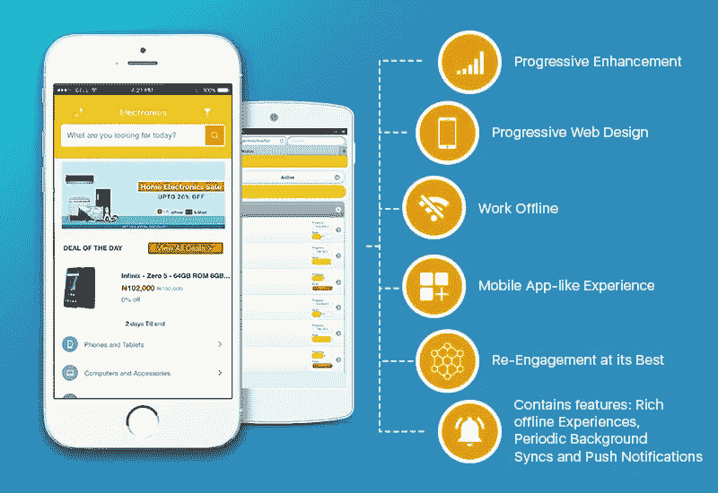

# 构建渐进式 Web 应用程序—第 0 章

> 原文：<https://medium.easyread.co/build-progressive-web-apps-6248a7152730?source=collection_archive---------0----------------------->

## 项目风险评估简介及案例分析

Difference between Progressive Web Apps and Regular Web App

# 构建渐进式 Web 应用程序-列表

**第 0 章—PWA 简介及案例分析(你在这里)**
[**第 1 章—PWA 的优缺点**](https://medium.com/easyread/build-progressive-web-apps-chapter-1-d3d2b449ab42)[**第 2 章—PWA 的组件&架构模式**](https://medium.com/easyread/build-progressive-web-apps-chapter-2-pwa-components-428295c2d524)[**第 3 章—准备及工具**](https://medium.com/easyread/build-progressive-web-apps-chapter-3-a73269d627b2)[**第 4 章—创建一个简单的 SPA(上**](https://medium.com/easyread/build-progressive-web-apps-chapter-4-b85ef6e6d465)

这一切都是从我对由 Dicoding 向我介绍的渐进式网络应用的兴趣开始的。但是，一开始我很犹豫要不要学 PWA，因为我没有足够的预算在[Dicoding.com](https://www.dicoding.com/)买课程，因为课程价格值 55 万印尼盾*(不打算推广)*。最后，我看到了 Indosat Ooredo 以 IDCAMP 的名义提供的全额奖学金。在非常严格地遵循选择并通过在一个关于编码的初级 web 开发课程上工作来满足奖学金要求之后，我终于设法在一封电子邮件上宣布了奖学金的消息[*“Membangun Progressive Web Apps”*](https://www.dicoding.com/academies/74)。

该培训将指导开发人员使用跨平台、高效且有吸引力的渐进式 Web 应用程序开发 Web 应用程序。

***素材:*** 承诺与获取，服务工作者，应用外壳，缓存 API，索引 DB，Web 推送，Workbox。

*谢谢你的支持！*

在这次会议上，我将毫不犹豫地分享我对 PWA 的了解以及如何实施 PWA 的经验。**下面我分几个系列分享一下教程。**

# 智能手机不再是奢侈品

几乎每个人，无论是上层还是下层中产阶级，都能负担得起。现在的智能手机以安卓和 iOS 为主。他们不仅提供电话和短信服务。但是做几乎所有我们可以在电脑上做的事情。例子一般在我们的电脑上可以浏览，那么智能手机也可以。如今，更多年轻的数字一代是通过智能手机而非电脑首次接触互联网的。

为了方便智能手机用户与他们的服务进行交互，许多公司开发了一个单独的应用程序，可以通过 Play Store/App Store 安装。原生移动应用具有许多优势，包括:

**集中式—** 任何应用都可以在 Play Store / App Store 上找到。
没有互联网也能工作——本地移动应用不需要连接到互联网也能很好地工作。

**拥有硬件接入—** 移动应用可以最大化智能手机所拥有的所有硬件功能。

**快速—** 因为移动应用与智能手机系统完美集成。它能够最大限度地发挥其所有硬件特性，从而提高本地移动应用程序的性能。

**与其他应用程序交互—** 智能手机上的原生移动应用程序具有由操作系统开发人员准备的特殊机制，因此它们可以与当前安装的其他应用程序直接交互。

当我们将其与基于 web 的应用程序进行比较时，原生移动应用程序具有不同的开发环境和技术。因此，即使一家公司已经有了支持其业务的基于网络的应用程序，当他们想要创建基于移动的应用程序时，他们将需要额外的程序员。这位新程序员将创建和管理本地移动应用程序。这肯定会增加公司支出。

# 亚历克斯·拉塞尔&弗朗西斯·贝里曼

渐进式网络应用这一术语是由谷歌 Chrome 工程师亚历克斯·拉塞尔(Alex Russel)和 2015 年为谷歌工作的设计师弗朗西斯·贝里曼(Frances Berriman)提出的。Google 对 PWA 的定义如下:

> 渐进式网络应用程序使用现代网络功能来提供类似应用程序的用户体验。它们从浏览器标签中的页面演变成身临其境的顶级应用，时刻保持着网络的低摩擦。

# PWA 的主要目的

PWA 的主要目的是使 web 开发人员能够更改现有的网站，这样他们就可以像本地移动应用程序一样运行，而无需进行许多更改或添加特殊的程序员。这一目标的实现要归功于一系列网络技术。他可以同时利用 web 和移动应用程序的优势。这种技术集合允许在没有互联网连接(离线)的情况下访问传统的 web 应用程序，可以像本地移动应用程序一样安装在主屏幕上，可以将数据同步到服务器，可以发送推送通知，等等。PWA 的特征是:

**渐进式—** 适用于每一位用户。不管什么浏览器，都没问题。原因在于，PWAs 是以渐进改进为核心理念构建的。

**响应迅速—** 符合各种外形规格:台式机、移动设备、平板电脑或未来的任何产品。

**独立连接—** 增强了服务人员离线或在低质量网络上工作的能力。

**类应用程序—** 感觉像是为用户提供应用程序风格的交互和导航的应用程序，因为它们是建立在外壳应用程序模型上的。

**新鲜—** 得益于服务人员的更新流程，始终保持最新。

**安全—** 通过 HTTPS 提供，以防止窥探并确保材料未被篡改。

**可以被找到—** 可以被识别为“应用程序”,这得益于 W3C 清单和服务工作者注册的覆盖范围。这使得搜索引擎可以找到它。

**可以重新启用—**pwa 可以重新启用推送通知等功能。

**可安装—** 允许用户在主屏幕上“保存”他们认为最有用的应用程序，而没有应用程序商店的麻烦。

**可链接—** 可通过 URL 轻松共享。安装很容易。

# **PWA 案例研究**

尽管它仍被归类为新技术，但许多世界级网站已经实施了 PWA。你可以在 PWA.rocks 和 Google Web 案例研究中看到已经实施 PWA 的网站列表。

以下是一些你可能已经知道的名字:

[**Twitter Lite**](https://mobile.twitter.com/)**——**全球最大的社交媒体网站之一。
[**Pokedex**](https://pokedex.org/)**—**一个包含口袋妖怪物种角色迷你百科全书的 PWA 应用示例。
[**bookmy show**](https://developers.google.com/web/showcase/2017/bookmyshow)**—**来自印度的门票预订网站(电影院、演唱会等活动)。
[**电报网**](https://web.telegram.org/)**——**全球最大的消息应用之一。
[**Wego**](https://www.wego.co.id/)**—**旅游服务商网站。
[**阿里巴巴**](https://alibaba.com/)**——**阿里巴巴是全球最大的在线 B2B 销售网站。
[**贝比**](https://babe.co.id/)**——**印尼文策展现场。

你可以在智能手机上的 Chrome 浏览器中打开上面的一些应用程序，以便在头脑中绘制它如何形成 PWA 应用程序。

# 参考

1.  [渐进式网络应用](https://developers.google.com/web/progressive-web-apps)
2.  [Membangun 渐进式网络应用](https://www.dicoding.com/academies/74)