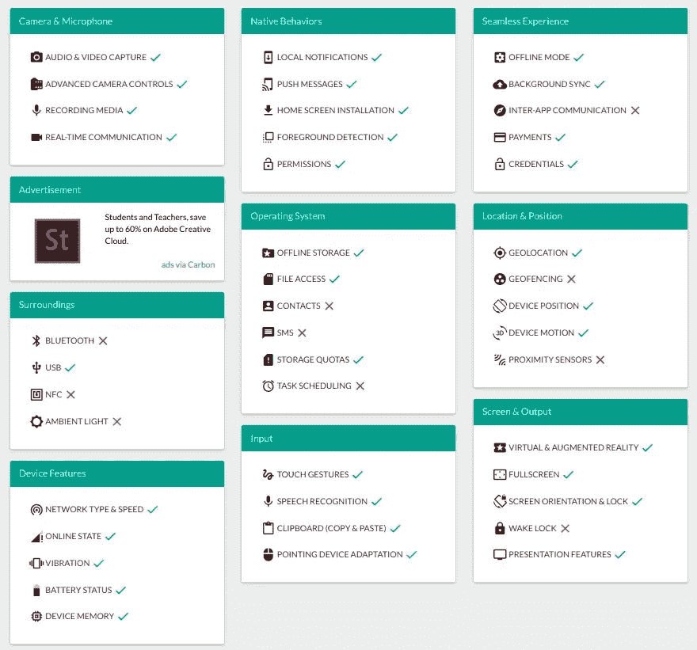

# 构建渐进式 Web 应用程序—第 1 章

> 原文：<https://medium.easyread.co/build-progressive-web-apps-chapter-1-d3d2b449ab42?source=collection_archive---------1----------------------->

## PWA 的优势和劣势

Photo by [Amber Wolfe](https://unsplash.com/@incognitowolfe?utm_source=medium&utm_medium=referral) on [Unsplash](https://unsplash.com?utm_source=medium&utm_medium=referral)

# 构建渐进式 Web 应用程序-列表

[**第 0 章—PWA(你在这里)**](https://medium.com/easyread/build-progressive-web-apps-6248a7152730)
**第 1 章—PWA(你在这里)** [**第 2 章—PWA 的组件&架构模式**](https://medium.com/easyread/build-progressive-web-apps-chapter-2-pwa-components-428295c2d524)[**第 3 章—准备和工具**](https://medium.com/easyread/build-progressive-web-apps-chapter-3-a73269d627b2)[**第 4 章—创建**](https://medium.com/easyread/build-progressive-web-apps-chapter-4-b85ef6e6d465)

像其他技术一样，PWA 也有优点和缺点。以下是 PWA 的一些优点和缺点。

**PWA 是 web，因此不需要安装**

与用户必须下载并安装`.apk`或`.ipa`文件才能使用的原生移动应用相比，渐进式网络应用无需下载或安装任何文件即可使用。即便如此，如果你愿意，我们也可以安装 PWA 出现在主屏幕上。

**无需安装任何更新**

当程序员在本地移动应用程序中修复一个功能或添加一个新功能时，用户必须下载一个新的`.apk`或`.ipa`文件才能获得更新。使用 PWA，用户无需下载任何文件即可获得最新更新。因为 PWA 是 web，要获得新的更新，用户只需刷新应用程序。

**无需通过商店分销**

2018 年 3 月，谷歌 Play 商店已经有超过 330 万份申请。创建与 330 万个应用程序竞争的新应用程序并非易事。幸运的是，PWA 应用程序不需要分发到商店。用户只需访问主网站，就可以利用开发人员已经完成的技术应用。

**可以利用原生特性**

虽然作为原生移动应用程序，集成并不完美，但 PWA 可以与智能手机拥有的硬件进行通信。网站[https://whatwebcando.today/](https://whatwebcando.today/)将概述可以使用的硬件特性。

Hardware features that can be used

**可以通过链接打开任何页面**

再说一次，因为 PWA 是一个网站，每个页面都可以从任何地方通过链接打开，就像一个普通的网站一样。在原生移动应用中，我们要经过已经设计好的导航路径，不能任意加载任何页面。

**万能**

通过商店分发应用程序必须遵循经理应用的规则。使用 PWA，我们作为开发人员是管理我们自己的应用程序分发的人。

**减少数据使用量**

与原生移动应用相比，Konga 电子商务网站成功将初始负载的数据使用量减少了 92%。随着数据的大量减少，load 意味着用户可以更快、更有效地加载所需的页面。这一优势在互联网连接速度较慢的地区非常有用。

# 不足之处

**仍然存在 PWA 无法利用的原生功能**

在讨论 PWA 的优势时，我们看到许多本机功能已经可以通过 PWA 加以利用。但是，有一些重要的功能还不能使用。大多数都与安全问题有关，包括联系人应用程序、短信、电话、日历、书签、闹钟、锁屏、NFC、蓝牙等。

**不支持所有浏览器**

目前，只有 Google Chrome、Firefox、Opera 和三星的 Android 浏览器可以利用所有 PWA 技术，而其他浏览器如 Internet Explorer、Safari、Edge 等尚未实现整个 PWA 功能。

**无法通过商店应用程序使用**

这一点可能是 PWA 的优点，也可能是缺点。我们上面讨论的优势是用户不需要从 Play Store 下载，也不需要与数百万其他应用程序竞争。所以我们要做的就是把用户带到网站首页。