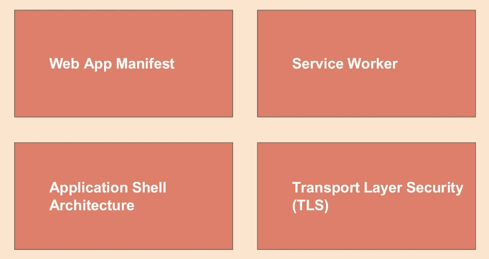

# 构建渐进式 Web 应用程序—第 2 章

> 原文：<https://medium.easyread.co/build-progressive-web-apps-chapter-2-pwa-components-428295c2d524?source=collection_archive---------0----------------------->

## PWA 的组件和架构模式

Photo by [Lance Anderson](https://unsplash.com/@lanceanderson?utm_source=unsplash&utm_medium=referral&utm_content=creditCopyText) on [Unsplash](https://unsplash.com/s/photos/building?utm_source=unsplash&utm_medium=referral&utm_content=creditCopyText)

# 构建渐进式 Web 应用程序-列表

[**第 0 章—PWA**](https://medium.com/easyread/build-progressive-web-apps-6248a7152730)
[**第 1 章—PWA 的优缺点**](https://medium.com/easyread/build-progressive-web-apps-chapter-1-d3d2b449ab42) **第 2 章—PWA 的组件&架构模式(你在这里)** [**第 3 章—准备和工具**](https://medium.com/easyread/build-progressive-web-apps-chapter-3-a73269d627b2)[**第 4 章—创建简单的 SPA(单页应用)**](https://medium.com/easyread/build-progressive-web-apps-chapter-4-b85ef6e6d465)

在构建 PWA 时，必须使用几个组件。以下是我们将要学习的一些 PWA 组件的简要说明。有一些强制组件，也有可选组件。强制组件是每次创建 PWA 时都会用到的组件，而可选组件是不影响 PWA 性能但可以用来丰富 PWA 功能的组件。

## **服务人员**

Service Worker 是浏览器在后台运行的脚本，与浏览器网页上的其他脚本是分开的。服务工作者是使用 JavaScript 编程语言编写的，但是调用方式不同于一般的 JavaScript 代码。通过使用服务工作器，我们可以利用存储在缓存中的资源，即使在离线网络模式下也可以显示。

## **外壳 App**

应用程序外壳(通常缩写为 app shell)是由几个页面组件和其他资产构建的应用程序接口框架。它们首先存储在缓存中，这样当应用程序打开时，它们可以立即出现。通常，作为 shell 应用程序一部分的页面组件是所有页面都有的组件，如页眉、侧栏和页脚。页面内容的组件将被动态和异步地加载。

## **缓存**

缓存是浏览器用来存储资源的本地存储库，这些资源将在将来调用时再次使用，而无需向网络发送更多请求。浏览器中有两种类型的缓存，即浏览器管理的缓存和应用程序管理的缓存。浏览器管理的缓存是用于自动存储浏览器下载文件的临时缓存。这种类型的缓存由浏览器设置，在离线网络模式下不可用。应用程序管理的缓存是由应用程序使用缓存 API 创建的缓存，与浏览器管理的缓存是分开的。我们可以使用这种类型的缓存来存储资源，并可以通过服务人员以离线网络模式显示。

## **网络应用清单**

Web app manifest 是一个简单的 JSON 文件，它控制应用程序如何在用户端显示和运行。这个文件一般命名为 manifest.json，当应用程序第一次在浏览器中打开时，浏览器会读取 manifest 文件，下载资源并显示内容。

## **获取 API**

Fetch API 是 web APIs 之一，可用于从网络内部和跨网络异步检索资源。如果您熟悉 AJAX 技术，那么您将非常熟悉 fetch API。Fetch API 与使用 XMLHttpRequest API 相同，但是有一些更好的特性。

## **渐进增强**

渐进式改进是 web 开发中的一种方法，在这种方法中，我们开始开发在所有浏览器中通用的功能。然后，我们根据每个用户使用的浏览器类型的能力逐渐增加功能。每次我们使用 web API 时，我们都需要注意 API 是否已经被应用程序用户的默认浏览器所支持。当用户使用的浏览器还不支持我们使用的 web API 特性时，我们也需要小心。例如，回退到已支持的类似功能，或显示消息以更新浏览器版本，或敦促始终使用现代浏览器。

## **PWA 架构风格**

PWA 架构风格是指根据所使用的后端技术和应用程序性能要求来构建 PWA 的方法。与此相关的一些术语包括 shell 应用程序、服务器端呈现、客户端呈现等等。

## **索引数据库**

IndexedDB 是浏览器中基于 NoSQL 的本地存储系统。我们可以将任何数据存储在用户的浏览器中以供应用。您可以执行搜索、更新和删除数据操作。

## **推送通知**

通知是出现在用户设备上的弹出消息。我们的 PWA 应用程序支持通知，通知用户应用程序中的某些更新。PWA 应用程序还可以接受服务器发送的推送事件，并显示弹出消息，即使用户没有打开该应用程序。

## **工具箱**

Workbox 是一个库和工具的集合，我们可以用它来生成工人服务文件、预缓存、路由和运行时缓存。Workbox 使我们可以用更简单、更容易管理的语法来编写 PWA 代码。

# PWA 架构模式

Image taken from Google Images

在开始构建 PWA 之前，我们首先需要确定我们的 web 应用程序架构。根据服务器如何返回页面内容，在构建网站时使用了两种体系结构，即服务器端呈现(SSR)和客户端呈现(CSR)。SSR 是一种模式，其中每个网页都在服务器端呈现，并以 HTML 的形式返回给浏览器，以便显示。而 CSR 是一种模式，在这种模式下，服务器只返回数据(通常是 JSON 或 XML 格式)供以后在客户端(浏览器)由 JavaScript 呈现。

除了术语 SSR 和 CSR 之外，web 架构模式在页面内容如何加载方面也是众所周知的，即多页面应用程序(MPA)和单页面应用程序(SPA)。MPA 是当我们的网站由几个 HTML 页面组成时使用的架构名称。

例如，如果我们有一个社交媒体网站，那么我们可以有一个 URL 页面:【domain.com/home.html, domain.com/profil.html, domain.com/timeline.html,】或 domain.com/home, domain.com/profil/用户名，domain.com/timeline/等等。每次浏览器从一个页面移动到另一个页面时，浏览器都会重新加载页面，并将前一个页面的 HTML 内容替换为新内容。

SPA 是一个只使用一个 HTML 文件的架构。这个文件是组成我们网站的各种组件显示的地方，不需要重新加载页面内容。当页面 URL 改变时，浏览器仅使用 JavaScript 改变内容的特定部分。例如，对于与上述场景相同的示例，当页面从`domain.com/home`移动到`domain.com/timeline`时，页面仅在主要内容部分发生变化。公共部分出现在所有页面上，如页眉、页脚、侧栏，包括< head >标签，页脚中的脚本不会重新加载。这种 SPA 机制使数据传输变得更轻松，因为服务器将只发送已更改的部分内容，而浏览器不必重新加载整个页面。

当创建 web 应用程序时，尤其是 PWA，我们可以使用几种现有架构模式的组合。可以应用的架构模式的一些组合是 **MPA + SSR** 像一般的网站， **SPA + SSR** 即直接显示 HTML 内容的 SPA，最后是 SPA + CSR，在客户端呈现 JSON 数据的 SPA。

PWA 存在的主要好处实际上是改进现有 web 应用程序的功能。也许您认为 PWA 应该使用 React、Vue 和 Angular 等 JavaScript 框架来创建。然而，PWA 实际上可以不使用任何框架来构建。PWA 也可以不用做 SPA 来构建，也就是说我们还是可以用 MPA 来实现 PWA。如果您已经有一个在线的 web 应用程序或网站，您可以在网站上实现 PWA 组件。

# 参考

1.  [网络今天能做什么](https://whatwebcando.today)
2.  [会员渐进式网络应用](https://www.dicoding.com/academies/74)