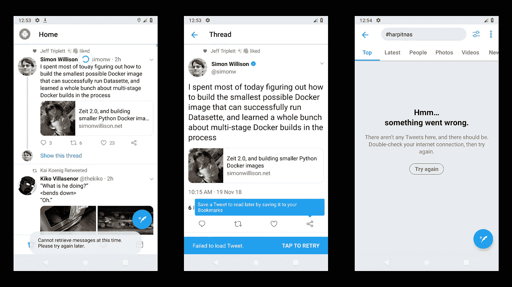
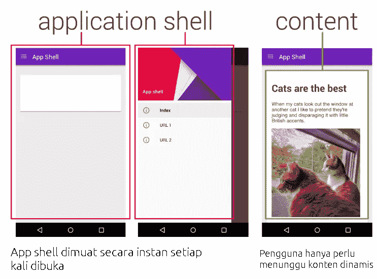

# 构建渐进式 Web 应用程序—第 3 章

> 原文：<https://medium.easyread.co/build-progressive-web-apps-chapter-3-a73269d627b2?source=collection_archive---------0----------------------->

## 准备和工具

Photo by [Fleur](https://unsplash.com/@yer_a_wizard?utm_source=medium&utm_medium=referral) on [Unsplash](https://unsplash.com?utm_source=medium&utm_medium=referral)

# 构建渐进式 Web 应用程序-列表

[**第 0 章—PWA**](https://medium.com/easyread/build-progressive-web-apps-6248a7152730)
[**介绍及案例分析第 1 章—PWA**](https://medium.com/easyread/build-progressive-web-apps-chapter-1-d3d2b449ab42)[**第 2 章—PWA 的组件&架构模式**](https://medium.com/easyread/build-progressive-web-apps-chapter-2-pwa-components-428295c2d524) **第 3 章—准备及工具(你在这里)** [**第 4 章—创建简单的 SPA(单页应用)**](https://medium.com/easyread/build-progressive-web-apps-chapter-4-b85ef6e6d465)

## 要制作 PWA，我们需要:

1.  Chrome 浏览器版本 52 或以上。
2.  Chrome 的网络服务器，或者你选择的网络服务器
3.  一个文本编辑器(Sublime Text，Visual Studio 代码，Atom，Notepad ++等。)
4.  HTML，CSS，JavaScript 和 Chrome DevTools 的基础知识。

我们将更侧重于讨论 PWA 中的技术。对于它之外的其他东西，如界面设计，将只在需要时讨论，读者只是简单地复制和粘贴。

当使用传统的 web 界面时，每个页面都有自己的 HTML 文件。因此，当从一个页面转到另一个页面时，会有一个时间延迟，用户必须等待页面加载并显示某些内容。这不同于一般的原始应用程序。例如，在没有连接的移动设备上使用 Twitter 应用程序时，我们无法看到时间线内容，因为没有互联网连接来下载数据，但我们仍然可以看到一些 UI 组件。这说明原来的应用程序只是从服务器安装它的数据，而其他的 UI 组件从一开始就已经安装好了，在应用程序打开的时候会立刻出现。

Twitter application on mobile devices without connection

在介绍性模块中，我们了解到 PWA 的目标之一是使用本机应用程序提供尽可能相似的体验。如果我们的 PWA 仍然必须在向用户显示之前加载每个页面，这意味着我们还没有提供类似于本机应用程序的体验。通过使用 PWA 技术，我们可以将应用程序 UI 组件存储在设备上，因此应用程序可以在显示来自服务器的数据之前直接显示界面。这种技术被称为应用程序外壳。

# 什么是应用外壳？

应用程序外壳或缩写的应用程序外壳是渐进式 Web 应用程序中的一种技术，用于创建无需等待服务器响应即可立即加载的界面。shell 应用程序仅由存储在缓存中的极简 HTML、CSS 和 JavaScript 文件组成，因此应用程序可以离线工作。由于存储在缓存中，用户无需在每次打开应用时反复向服务器请求 shell app。

*single-page app* (SPA)

果壳 app 只是一种技术，而不是一个库或框架。如果读者已经构建了一个单页应用程序(SPA)，那么读者实际上已经实现了与 shell 应用程序非常相似的东西。我们可以创建一个有框架或没有框架的 shell 应用程序(与框架无关)。

# 使用 Shell 应用程序的优势

在构建网站时，使用 shell 应用程序有许多优势。其中一些如下:

*   它具有可靠和非常快的性能。因为界面的静态资产(HTML、CSS、JavaScript 和图像)在第一次访问时被缓存，所以在下一次会话中返回的用户可以立即加载它们。
*   **体验如原生应用。**通过应用 shell app 技术，我们可以为 web 应用提供与本地应用非常相似的界面、导航系统和离线支持。
*   **更有效率。**虽然总的来说，互联网套餐的价格相当实惠，但仍然有一些地区的互联网套餐仍然很贵，但速度很慢。通过使用 shell 应用程序，我们可以帮助用户节省数据使用量，因为并非所有数据都必须重复下载。

# **何时使用果壳 App**

app shell 适用于制作网站或基于 web 的应用程序的几乎所有场景。一般来说，网站的每个页面都必须有相同的组件，比如页眉、页脚或侧边栏。这些重复的组件可以存储在浏览器缓存中，以便当用户访问另一个页面时，浏览器只需要响应与该页面相关联的内容。

只是要实现 App Shell，你需要稍微改变一下 web 应用开发的范式。从我们通常以每页页数或多页 app (MPA)形式制作的东西来看，它是单页或单页 app (SPA)的基础。页面内容数据请求是异步完成的，也称为 AJAX(异步 JavaScript 和 XMLHTTP)。通过使用 AJAX 技术，改变页面内容不再需要重新加载整个页面。

# 使用 Shell 应用程序的条款

使用 App Shell 技术必须满足的一些条件包括:

*   **使用服务人员绕过请求路径。**在标准的 web 应用程序中，每个资产请求都将被浏览器直接定向到互联网。通过使用 Service Worker，我们可以挑选出哪些请求需要被定向到网络，以及哪些请求可以使用存储在浏览器缓存中的资产来充分满足。您可以在模块 3 中找到更多关于服务人员的信息。
*   **将 shell 应用程序的主要资产保存在缓存中。**为了让应用程序不再需要发送对相同资产的请求，尤其是在 shell 应用程序中使用时，我们需要使用缓存 API 将它们存储在浏览器缓存中。您可以在模块 4 中找到有关缓存 API 的更多信息。
*   **使用 AJAX 请求检索数据。**如前所述，我们需要使用 AJAX 发送数据请求，并使用 JavaScript 将响应结果安装在我们准备用来存储动态内容的元素上。您可以使用 Fetch API、XMLHttpRequest 方法或使用默认的 ajax JavaScript 库方法，如 **$。jQuery 中的 ajax ()** 。

# 参考

[Membangun 渐进式网络应用](https://www.dicoding.com/academies/74)