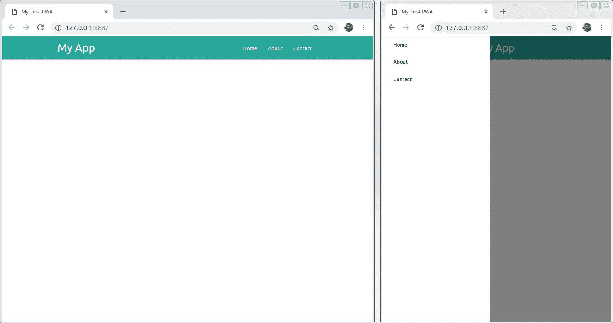

# 构建渐进式 Web 应用程序—第 4 章

> 原文：<https://medium.easyread.co/build-progressive-web-apps-chapter-4-b85ef6e6d465?source=collection_archive---------1----------------------->

## 创建简单的 SPA(单页应用程序)


Photo by [Andrew Small](https://unsplash.com/@andsmall?utm_source=medium&utm_medium=referral) on [Unsplash](https://unsplash.com?utm_source=medium&utm_medium=referral)

# 构建渐进式 Web 应用程序-列表

[**第 0 章—PWA**](https://medium.com/easyread/build-progressive-web-apps-6248a7152730)
[**第 1 章—PWA**](https://medium.com/easyread/build-progressive-web-apps-chapter-1-d3d2b449ab42)[**第 2 章—PWA 的组件&**](https://medium.com/easyread/build-progressive-web-apps-chapter-2-pwa-components-428295c2d524)[**第 3 章—准备和工具**](https://medium.com/easyread/build-progressive-web-apps-chapter-3-a73269d627b2) **第 4 章—创建简单的 SPA(单页应用**

我们将创建一个渐进式 web 应用程序，其中包含可以静态访问的页面。我们将预先准备一个显示基于 AJAX 的页面内容的标准 web 应用程序，也称为单页应用程序或 SPA。

# **准备资产**

首先，下载 Materialize CSS 框架，我们将使用它来简化 shell 应用程序的创建。将下载的文件解压缩到 first-pwa /文件夹中。我们的应用程序的文件结构应该如下所示:

```
*first-pwa*
*├── css/
│ ├── materialize.css
│ └── materialize.min.css
├── js/
│ ├── materialize.js
│ └── materialize.min.js
├── LICENSE
├── README.md*
```

接下来，在项目文件夹中创建一个名为**index.html**的文件来保存 shell app 模板:

```
<!DOCTYPE html>
<html lang="en">
<head>
  <meta charset="UTF-8"/>
  <title>My First PWA</title>
  <meta name="description" content="My first PWA"/>
  <meta name="viewport" content="width=device-width, initial-scale=1">
  <link rel="stylesheet" href="css/materialize.min.css">
</head>
<body>

  <!-- Navigasi -->
  <nav class="teal lighten-1" role="navigation">
    <div class="nav-wrapper container">
      <a href="#" class="brand-logo" id="logo-container">My App</a>
      <a href="#" class="sidenav-trigger" data-target="nav-mobile">☰</a>

      <ul class="topnav right hide-on-med-and-down"></ul>
      <ul class="sidenav" id="nav-mobile"></ul>
    </div>
  </nav>
  <!-- Akhir Navigasi --><div class="container" id="body-content"></div>
  <script src="js/materialize.min.js"></script>
  <script src="js/nav.js"></script>
</body>
</html>
```

在上面的**index.html**文件中，我们使用`**<nav>**`标签和 id 为`**#body-content**`的内容元素创建了一个导航元素。在导航中有`**.brand-logo**`和两个菜单元素，即`**.topnav**`显示顶部菜单和`**.sidenav**`显示侧面菜单。侧边菜单只会在手机屏幕模式下出现，顶部菜单只会在大屏幕模式下出现。在模板中将菜单元素和`**#body-content**`元素都留空。原因是，我们使用 AJAX 填充它。

然后在 js/文件夹中创建一个名为 **nav.js** 的新文件。这个脚本将包含我们所有的 JavaScript 代码。在文件中编写以下代码:

```
document.addEventListener("DOMContentLoaded", function() {
  // Activate sidebar nav
  var elems = document.querySelectorAll(".sidenav");
  M.Sidenav.init(elems);
  loadNav();

  function loadNav() {
    var xhttp = new XMLHttpRequest();
    xhttp.onreadystatechange = function() {
      if (this.readyState == 4) {
        if (this.status != 200) return;

        // Muat daftar tautan menu
        document.querySelectorAll(".topnav, .sidenav").forEach(function(elm) {
          elm.innerHTML = xhttp.responseText;
        });
      }
    };
    xhttp.open("GET", "nav.html", true);
    xhttp.send();
  }
});
```

在上面的代码中，我们激活了物化框架的侧边栏元素，这样当点击汉堡菜单时它就会出现(第 3–4 行)。我们还可以使用 XMLHttpRequest 方法激活包含 AJAX 代码的`**loadNav()**`，以检索 nav.html 文件的内容，并将其保存在菜单元素`**.topnav**`和`**.sidenav**` **中。**

注意:我们所有的 JavaScript 代码都存储在 DOMContentLoaded 事件调用函数的代码块中，以保护 html 文档中所有元素安装完成后运行的代码。

在浏览器中尝试之前，我们准备了另外一个文件，即**nav.html**，它列出了`**sidenav**` 和`**topnav**`的菜单。在**index.html**文件旁边的项目文件夹中创建一个**nav.html**文件:

```
<li><a class="waves-effect" href="#home">Home</a></li>
<li><a class="waves-effect" href="#about">About</a></li>
<li><a class="waves-effect" href="#contact">Contact</a></li>
```

现在在浏览器中打开应用程序。但是请记住，我们的应用程序使用 **XMLHttpRequest** 方法通过 **AJAX** 来检索数据，这将不会使用协议 file: //来运行。因此，如果您只是直接在浏览器中打开 index.html 文件(通过双击 index.html 文件或将文件拖到浏览器中)，应用程序将无法在`**sidenav**` 和`**topnav**`中显示菜单列表。您必须使用 http 协议运行应用程序，如“简介”一章中“运行 PWA 应用程序”一节中的指南所示。

当在浏览器中成功正确地打开一个应用程序时，将会出现一个包含应用程序标题的元素栏。你也可以尝试缩小浏览器的尺寸来模拟手机屏幕的大小，这样汉堡菜单按钮就会出现在左上角，点击它就会弹出一个侧边栏。



Running PWA Applications

# 显示页面内容

我们已经成功地展示了一个带有导航菜单的 shell 应用程序。我们首先通过显示页面内容来完成应用程序。内容将被异步调用**或使用 **AJAX** 技术并存储在**中。正文内容**元素。在 **nav.js** 文件中添加以下代码(写入 **DOMContentLoaded** 回调事件中):**

```
// Load page content
var page = window.location.hash.substr(1);
if (page == "") page = "home";
loadPage(page);

function loadPage(page) {
  var xhttp = new XMLHttpRequest();
  xhttp.onreadystatechange = function() {
    if (this.readyState == 4) {
      var content = document.querySelector("#body-content");
      if (this.status == 200) {
        content.innerHTML = xhttp.responseText;
      } else if (this.status == 404) {
        content.innerHTML = "<p>Halaman tidak ditemukan.</p>";
      } else {
        content.innerHTML = "<p>Ups.. halaman tidak dapat diakses.</p>";
      }
    }
  };
  xhttp.open("GET", "pages/" + page + ".html", true);
  xhttp.send();
}
```

**在上面的代码中，我们首先从页面 url 中检索散列作为要调用的页面的名称。例如，我们打开网址[**http://127 . 0 . 0 . 1:8887/#联系人**](http://127.0.0.1:8887/#contact) 意味着我们访问联系人页面。如果没有找到散列，这意味着将显示默认主页。我们使用 AJAX 调用`**loadPage()**`函数来调用分页文件的内容。然后，页面内容将被保存到。主体内容元素。如果没有找到这个页面(状态代码 404)，那么我们显示一个段落元素，告诉我们这个页面不在可用页面列表中。页面内容文件存储在 pages/文件夹中。**

**在之前的 nav.html 文件中我们增加了三个页面的三个链接，包括**首页**、**关于**和**联系人**。那意味着我们必须准备这些三页的文件。在 pages/文件夹中创建以下三个文件。**

## **pages/home.html**

```
<h2>Selamat datang!</h2>
<p>Selamat datang di laman aplikasi web progresif pertama saya.</p>
```

## ****pages/about.html****

```
<h2>Tentang Saya</h2>
<p>Saya adalah programmer masa depan.</p>
```

## ****pages/contact.html****

```
<h2>Hubungi Saya</h2>
<p>Hubungi saya melalui email [saya@mail.com](mailto:saya@mail.com)</p>
```

**现在，如果您尝试重新加载页面[**http://127 . 0 . 0 . 1:8887/**](http://127.0.0.1:8887/)就会出现主页内容。同样，如果你打开网址[**http://127 . 0 . 0 . 1:8887/#关于**](http://127.0.0.1:8887/#about) 和[**http://127 . 0 . 0 . 1:8887/# contact**t](http://127.0.0.1:8887/#contact)页面内容会根据选择的页面出现。只是当你点击菜单的时候，页面内容并没有立即改变。我们必须首先为每个菜单链接创建一个点击事件监听器。**

# **向单击菜单添加事件侦听器**

**通过为菜单上的每个链接添加事件监听器代码来修改`**loadNav()**`函数，如下所示:**

```
function loadNav() {
  var xhttp = new XMLHttpRequest();
  xhttp.onreadystatechange = function() {
    if (this.readyState == 4) {
      if (this.status != 200) return;

      // Muat daftar tautan menu
      document.querySelectorAll(".topnav, .sidenav").forEach(function(elm) {
        elm.innerHTML = xhttp.responseText;
      });

      // Daftarkan event listener untuk setiap tautan menu
      document.querySelectorAll(".sidenav a, .topnav a").forEach(function(elm) {
        elm.addEventListener("click", function(event) {
          // Tutup sidenav
          var sidenav = document.querySelector(".sidenav");
          M.Sidenav.getInstance(sidenav).close();

          // Muat konten halaman yang dipanggil
          page = event.target.getAttribute("href").substr(1);
          loadPage(page);
        });
      });
    }
  };
  xhttp.open("GET", "nav.html", true);
  xhttp.send();
}
```

**重新加载页面，现在当点击菜单时，页面内容应该立即改变。**

**您可以从以下链接下载此 **codelab** :**

**[*https://github.com/jansutris10/Simple_SPA*](https://github.com/jansutris10/Simple_SPA)**