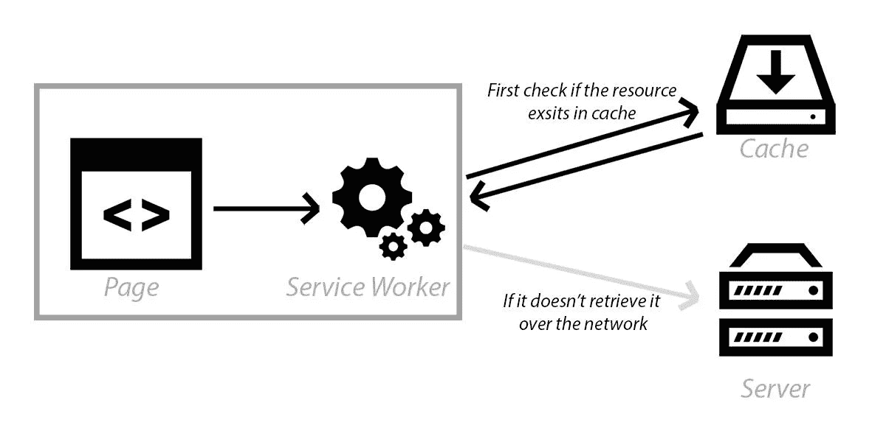
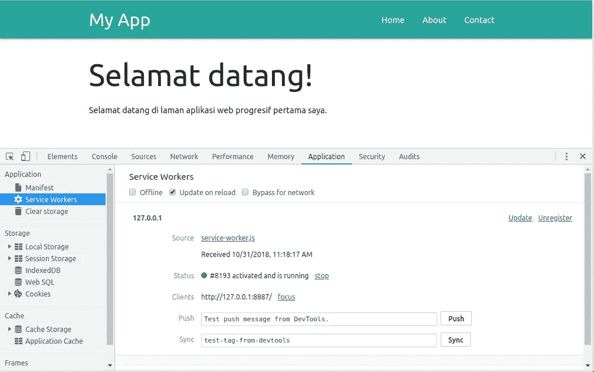
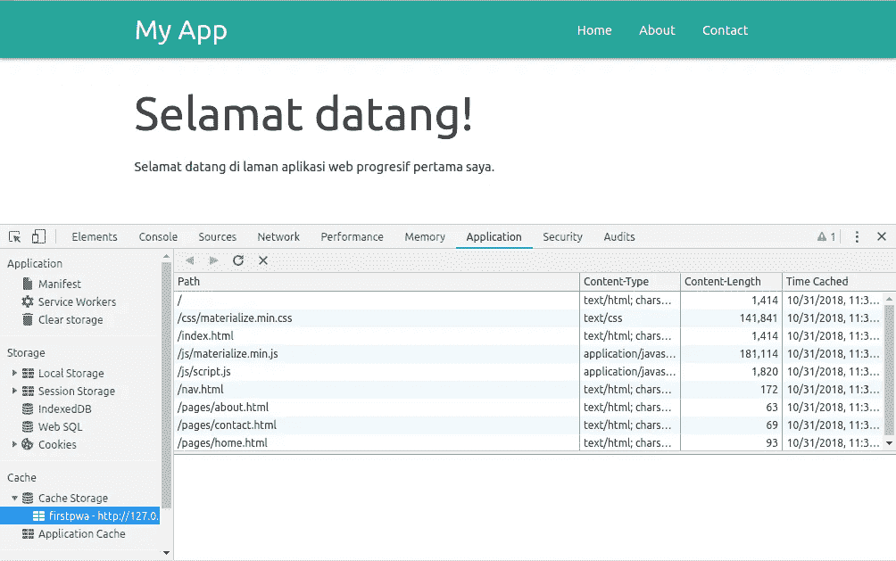
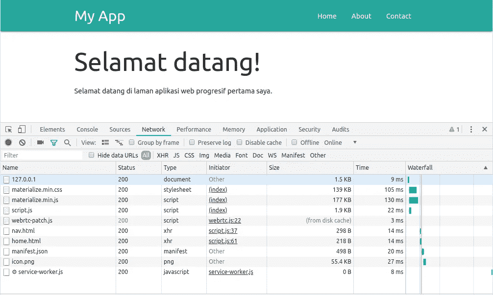
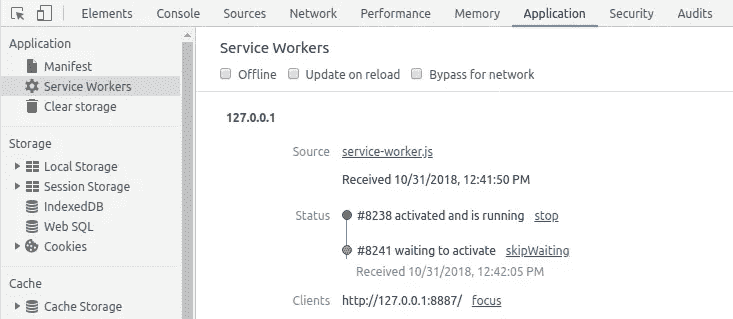
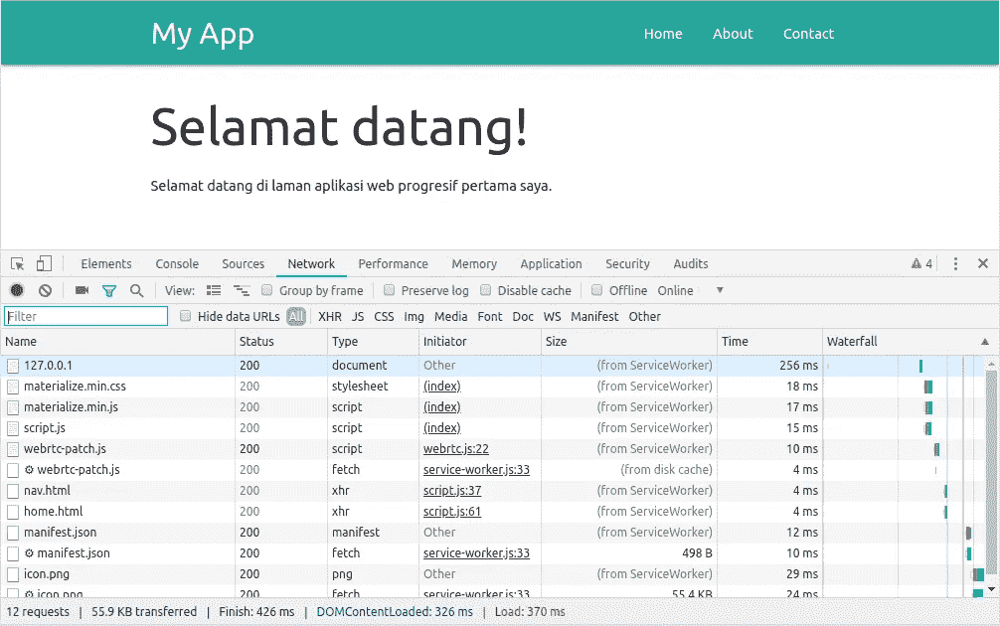
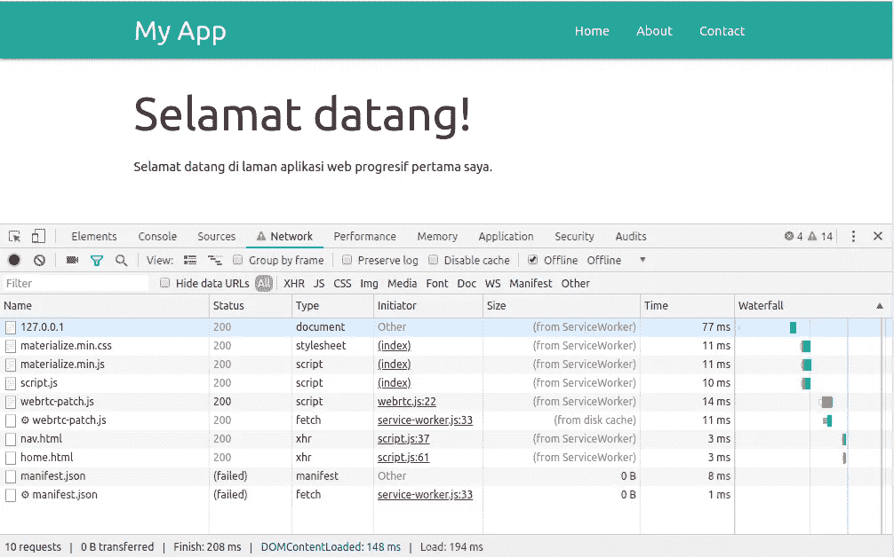
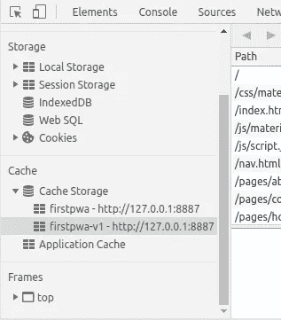

# 构建渐进式网络应用——第 5 章

> 原文：<https://medium.easyread.co/build-progressive-web-apps-chapter-5-60f6213f1075?source=collection_archive---------0----------------------->

## 服务工作者丹缓存技术



Service Workers Lifecycle

# 构建渐进式 Web 应用程序-列表

[**第 0 章—PWA**](https://medium.com/easyread/build-progressive-web-apps-6248a7152730)
[**介绍及案例分析第 1 章—PWA**](https://medium.com/easyread/build-progressive-web-apps-chapter-1-d3d2b449ab42)[**第 2 章—PWA 的组件&架构模式**](https://medium.com/easyread/build-progressive-web-apps-chapter-2-pwa-components-428295c2d524)[**第 3 章—准备及工具**](https://medium.com/easyread/build-progressive-web-apps-chapter-3-a73269d627b2)[**第 4 章—创建一个简单的 SPA**](https://medium.com/easyread/build-progressive-web-apps-chapter-4-b85ef6e6d465)

在前面的[章节](https://medium.com/@jansutris10/build-progressive-web-apps-chapter-4-b85ef6e6d465)中，我们已经使用 Materialize CSS 框架和一些 JavaScript 代码制作了一个简单的 SPA 来改变页面内容。但据说我们在 SPA 上使用了 shell 应用程序，这并不完美。因为即使作为多页网站切换页面时页面没有重新加载，设备离线或没有连接时，shell 应用程序仍然不会出现。换句话说，我们的 shell 应用程序不是一个有效的本地应用程序，它甚至在用户界面组件脱机时仍然显示用户界面组件。要做到这一点，我们需要两种 web 浏览器技术，服务工作器和缓存。

# 服务人员注册

Service Worker 是浏览器在后台运行的脚本，与浏览器网页上的其他脚本是分开的。服务工作者是使用 JavaScript 编程语言编写的，但是调用方式不同于一般的 JavaScript 代码。在我们这次的案例研究中，服务工作者充当请求路径的监管者，对缓存中哪些资产已经可以立即使用，哪些资产需要首先向网络请求。

如何调用服务工作者代码与一般的 JavaScript 代码略有不同。通常，我们使用页面上的

# 预缓存资产

在 **service-worker.js** 文件中，编写代码来缓存资产并提供已经缓存的资产，以便它们可以在将来的页面调用中使用。为了在缓存中注册资产，我们从浏览器使用缓存 API，包括`**caches.open()**`打开缓存、 `**caches.add()**`和`**cache.addAll()**`在缓存中存储资产，以及`**caches.match()**`检查请求的资产是否已经在缓存中。API 缓存是基于承诺的。如果你不熟悉承诺，你可以在“承诺和获取 API”一章中学习。

你可以在下一章了解更多关于服务工作器和缓存 API 的知识。现在，我们将继续下一个 codelab，以便我们的应用程序即使在离线网络条件下也能继续显示 UI 组件。

在第一个 codelab 中，我们将更改本教程前面创建的单页应用程序，以逐步逐个实现 PWA 功能。最早的步骤是向创建的应用程序注册一个服务人员。

# 注册服务人员

在项目文件夹中创建一个名为 **service-worker.js** 的文件。先留空。

然后重新打开**index.html**文件，在结束标签 **< /body >** 前的底部添加以下代码:

```
<script>
  // REGISTER SERVICE WORKER
  if ("serviceWorker" in navigator) {
    window.addEventListener("load", function() {
      navigator.serviceWorker
        .register("/service-worker.js")
        .then(function() {
          console.log("Pendaftaran ServiceWorker berhasil");
        })
        .catch(function() {
          console.log("Pendaftaran ServiceWorker gagal");
        });
    });
  } else {
    console.log("ServiceWorker belum didukung browser ini.");
  }
</script>
```

在上面的代码中，我们首先检查 navigator 对象是否已经在浏览器中。这意味着如果对象不存在，所使用的浏览器不支持服务工作器功能，因为服务工作器在对象导航器内运行。

然后我们使用`**navigator.serviceWorker.register()**`方法注册 service-worker.js 文件。注册过程仅在具有 **https: //** 或 **http: //** 域名的网站上成功(仅在开发期间允许)。重新加载您的应用程序，您将能够在 Chrome DevTools 面板的 Service Worker 部分的应用程序选项卡中检查注册过程是成功还是失败(可以在应用程序的左侧菜单中访问):



Service Worker section

在“控制台”选项卡上，您还可以看到来自服务人员注册代码的日志消息，这些消息指示服务人员注册成功还是失败。

# 将资产保存到缓存

现在我们将在 **service-worker.js** 文件中编写服务工作者代码。在文件中添加以下代码:

```
const CACHE_NAME = "firstpwa";
var urlsToCache = [
  "/",
  "/nav.html",
  "/index.html",
  "/pages/home.html",
  "/pages/about.html",
  "/pages/contact.html",
  "/css/materialize.min.css",
  "/js/materialize.min.js",
  "/js/nav.js"
];

self.addEventListener("install", function(event) {
  event.waitUntil(
    caches.open(CACHE_NAME).then(function(cache) {
      return cache.addAll(urlsToCache);
    })
  );
});
```

在上面的代码中，我们创建了一个常量变量 **CACHE_NAME** ，其中包含一个字符串，我们稍后将使用该字符串作为缓存名称。我们还创建了一个 **urlsToCache** 变量，以便更容易地编写资产列表以及哪些页面将被缓存。

然后，我们为 install 事件注册事件监听器，该事件监听器将在服务工作者注册过程成功后被调用。在其中，我们用我们写的名字打开缓存。如果它不存在，则会创建一个同名的新缓存。打开缓存后，我们立即将资产存储在缓存中，这是我们使用`**cache.addAll()**`方法在 **urlsToCache** 变量中创建的资产列表。

如果代码运行良好，那么资产应该在浏览器缓存中列出。您可以在**缓存存储**部分的 **DevTools** 应用选项卡上检查已注册的缓存。点击**缓存存储**菜单左侧的三角形，查看缓存列表。



Cache Storage

此时，我们只在缓存中存储资产。如果您检查“网络”选项卡并刷新页面，页面仍会使用来自服务器请求的资产。



Network tab

在上面的示例图像中，大小列似乎仍然显示从服务器加载的资源的大小。

# 使用缓存中的资产

将以下代码添加到 service-worker.js 文件中，以便该页面使用已缓存的资产:

```
self.addEventListener("fetch", function(event) {
  event.respondWith(
    caches
      .match(event.request, { cacheName: CACHE_NAME })
      .then(function(response) {
        if (response) {
          console.log("ServiceWorker: Gunakan aset dari cache: ", response.url);
          return response;
        }

        console.log(
          "ServiceWorker: Memuat aset dari server: ",
          event.request.url
        );
        return fetch(event.request);
      })
  );
});
```

在上面的代码中，我们为服务工作者获取事件注册了事件监听器，每次浏览器向网络发送请求时都会调用该事件监听器，例如**加载页面、css、js、图形资产和字体。**我们首先检查请求是否匹配已经存储在缓存中的资产之一。如果有匹配的，那么我们直接在页面上返回要使用的资产。如果没有找到，我们将继续使用`**fetch()**` 方法发送请求。

如果您现在刷新页面，您将在 Network 选项卡上看到应用程序仍然没有使用缓存中的资产。这是因为活动的服务工作者仍然是旧代码。浏览器将等待激活过程，直到我们在新的会话中打开应用程序。只要我们打开应用程序，就会计算一个会话，直到我们关闭浏览器选项卡或浏览器窗口。



service workers tab

在上图中，我们看到活动的和运行的工作线程的服务状态仍然是旧版本，我们添加到事件监听器获取代码的最新版本已经收到，但尚未激活。

要激活最新的服务人员，您可以首先关闭应用程序的浏览器选项卡，然后再次打开以获得新的会话。但是这种方法在开发过程中效率较低。一种更简单的方法是单击最新工作人员服务状态旁边的 **skipWaiting** 链接。或者为了更有效率，你可以激活服务人员面板顶部的**重新加载时更新**选项复选框。因此，每次有更新时，浏览器都会立即激活服务人员。

在最近的服务工作者被激活之后，您可以重新加载该页面，现在该页面应该已经使用了来自缓存的资产，这在 Size 列中被指示，该列现在被写为资产是由服务工作者提供的。



现在你可以尝试在**离线模式**下调用页面，以确保应用程序仍然出现，即使它没有连接到网络。你可以关闭 web 服务器，或者在 DevTools 的**网络**选项卡上，你可以激活面板顶部的离线选项复选框来模拟**离线**网络模式。



Offline option

恭喜您，您已经实现了服务工作器的主要功能，即离线访问。因此，您的应用程序用户仍然可以访问应用程序，即使它没有连接到互联网！

# 删除旧缓存

当我们改变应用程序页面的内容，或者改变 CSS 代码时会发生什么？是的，您在浏览器页面中看不到任何变化，因为应用程序显示使用了缓存中的资产。但是如果您在 DevTools 的 Service Workers 面板中激活了 Update on reload 选项，那么每次我们刷新应用程序页面时，内容和资产中的所有更改都会更新到缓存中。

重新加载时更新选项在应用程序开发过程中非常有用。但是当应用程序已经发布给用户时，就不能依赖这个选项了，因为我们不能强迫用户打开 DevTools 并激活这个选项。尤其是当用户通过移动设备打开应用时。

使更新发生在用户端的解决方案是更改服务工作器中使用的缓存的名称。如果之前我们的缓存名称是 firstpwa，那么我们可以用另一个名称替换它。我们通常只是添加一个版本标记，这样我们就可以轻松地跟踪已经发生的更改，例如，我们将缓存的名称更改为 firstpwa-v1、firstpwa-v2 等等。要点是每次向用户发布应用程序更新时，必须确保也更改缓存名称。

现在尝试对页面(内容或 CSS)做一些小的更改，并在 **service-worker.js** 文件中重命名缓存:

```
const CACHE_NAME = 'firstpwa-v1';
```

因此，当刷新应用程序页面时，将会出现更改并创建一个新的缓存。



firstpwa-v1

新的问题会出现。我们越频繁地更改缓存的名称，用户的浏览器中就会有很多垃圾缓存，当然它会占用用户设备的存储空间。为此，我们必须创建一个旧的缓存删除机制，以免给用户带来负担。在 service-worker.js 文件的末尾添加以下代码:

```
self.addEventListener("activate", function(event) {
  event.waitUntil(
    caches.keys().then(function(cacheNames) {
      return Promise.all(
        cacheNames.map(function(cacheName) {
          if (cacheName != CACHE_NAME) {
            console.log("ServiceWorker: cache " + cacheName + " dihapus");
            return caches.delete(cacheName);
          }
        })
      );
    })
  );
});
```

在上面的代码中，我们注册了服务工作器激活事件的事件侦听器，该事件将在服务工作器安装过程结束后立即激活服务工作器时调用。我们首先获取所有注册的缓存名称。然后，我们逐一检查缓存名称是否与服务工作者正在使用的缓存名称不同，然后我们在 **caches.delete()** 方法中调用它以将其删除。

您可以尝试重新打开应用程序，看到缓存存储浏览器中的缓存现在只剩下正在使用的缓存。