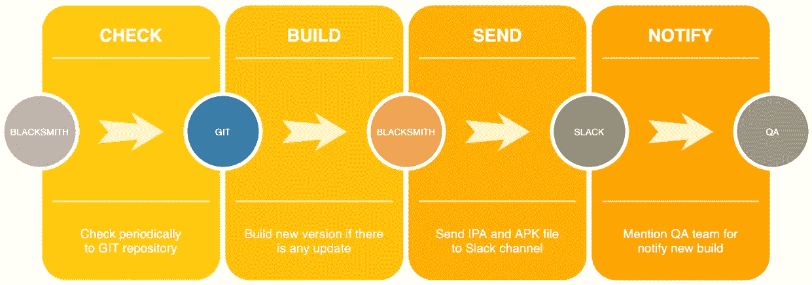
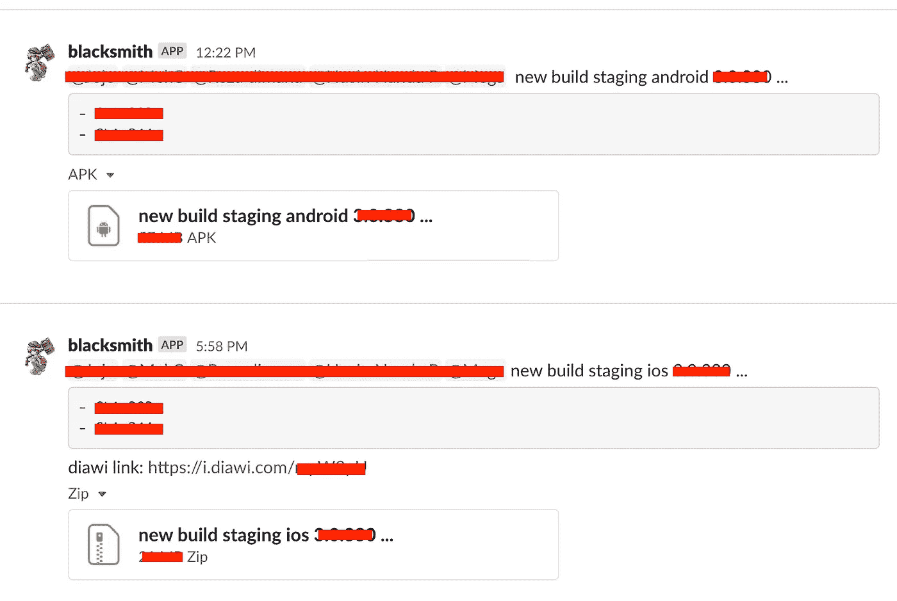

# 使用 CLI(简单 CI/CD)构建 React 本机 IPA+APK

> 原文：<https://medium.easyread.co/build-react-native-ipa-apk-using-cli-simple-ci-cd-2b8303d079e0?source=collection_archive---------0----------------------->

## 了解在 React Native 上构建 IPA+APK 文件的基本 CLI


Photo by [pexels.com](http://pexels.com/photo/person-holding-silver-iphone-7-887751/)

大家好！在这一部分，我想再次分享一些关于软件工程领域技术相关的经验或观点。这个故事此时会给你带来什么话题？如题，我们将讨论我在 React Native 中使用 CLI 为我们的移动应用程序构建 IPA 和 APK 的经验。

这个想法是在我们开发稳定有组织的时候产生的。但是，QA 团队和移动开发者之间存在冲突。在开发期间，QA 希望每天两次或更多次获得新的 IPA 或 APK。因为他们不想在期末将所有的任务挂起并一起测试。

他们害怕时间不够了。如果他们能经常做就更好了。然后，移动开发者反对 QA 的声明。他们说做这件事太浪费时间了。因为构建 IPA 和 APK 的 MacBook 已经相当旧了。对于每个单独的构建，构建 IPA 和 APK 可能需要大约 1-2 个小时。

那么，解决这个问题的办法是什么呢？我们意识到有一款高端电脑支持快速构建 IPA 和 APK。这台电脑没人用。而且很久以前，我们老板曾经说过，就用它来造吧！好了，是时候构建一些东西或工具了，这是实施 CI/CD 概念，可以很容易地将 IPA 和 APK 直接交付给 QA 团队。

在与整个团队成员讨论后，我们决定采用以下流程:



Picture 1\. Our development of mobile application flow

等等，铁匠是什么？好的，让我从上面的流程图解释一下。基本上，铁匠只是我们工具的名字来做这个交付。灵感来自 Ragnarok 网游中的铁匠角色:)

那么我们的计划将是这样的:

*   铁匠会通过 API 定期检查我们的 git 库。
*   如果开发版本有任何更新，Blacksmith 将获取最新的代码并开始构建 IPA 和 APK。
*   成功获取文件后，Blacksmith 将使用 Slack bot(也称为 Blacksmith:)，通过 API 将这些文件发送到 Slack 通道。
*   最后，通知 QA 团队，铁匠机器人将提到 QA 团队成员，我们有一个新版本，然后准备你的工作！lol:)

那么，我们如何做到这一点呢？我不会解释这个故事的所有技术方面。只关注 CLI 部分的建筑。因为它是所有事物中最重要的。如果我们能够解决这个问题，您就可以根据自己的需要轻松调节流量。

## **安卓**

对于 android 来说，使用 CLI 构建 APK 并不难。确保您的项目已经准备好构建，没有任何错误(我们在 Android 和 iOS 上都使用 React Native)。在我们的例子中，我们只需要这个命令:

```
**$ cd [YOUR_RN_PROJECT]
$ npm install
$ cd android
$ ./gradlew clean
$ ./gradlew assembleRelease && react-native run-android --variant=release**
```

成功构建 APK 后，您可以在以下位置找到该文件:

```
**[YOUR_RN_PROJECT]/android/app/build/outputs/apk/release/app-release.apk**
```

## ios

我可以说，这部分有点难，因为我的背景不是移动开发者，尤其是 iOS 开发者。我们的移动开发者不太熟悉使用 CLI 制作 IPA 文件。通常，他们使用 Xcode 来做这件事。

还有，iOS 和 Android 相比比较复杂。我们应该有一个苹果开发者帐户，证书，配置文件等。经过多次试错，问了一些 iOS 开发者朋友(谢谢 [Muhammad Alfiansyah](https://medium.com/u/d319382e99d8?source=post_page-----2b8303d079e0--------------------------------) 、 [Riyan Pratama](https://medium.com/u/bd9a987666c4?source=post_page-----2b8303d079e0--------------------------------) 、Nico、 [Agita Firstawan](https://medium.com/u/1226a917666a?source=post_page-----2b8303d079e0--------------------------------) 、 [Robby Widyahartono](https://medium.com/u/4d0c45a7113d?source=post_page-----2b8303d079e0--------------------------------) 、 [Reza Arifiansyah](https://medium.com/u/68609736c2a4?source=post_page-----2b8303d079e0--------------------------------) )，终于可以拿到 IPA 了！

但是，与 Android 的行为不同，iOS 应该先进行存档，然后将其导出为 IPA 文件。

> 我们使用自动签名来建立这个，所以请确保您可以通过您的 Xcode 自动签名方法获得 IPA 文件


Picture 2\. Automatically signing on Xcode

该命令将在我们将项目导出为 IPA 文件之前对其进行归档。

```
**$ cd [YOUR_RN_PROJECT]
$ npm install
$ cd ios
$ pod install
$ xcodebuild clean archive -workspace [YOUR_RN_PROJECT]/ios/[YOUR_APP_NAME].xcworkspace -scheme [YOUR_APP_NAME] -archivePath [YOUR_ARCHIVE_PATH]/[YOUR_ARCHIVE_NAME].xcarchive | xcpretty**
```

> 注意！您必须有用于导出 IPA 的 plist 文件，并更改 teamID 字符串值

成功归档项目后，我们可以用这个命令将其导出为 IPA 文件。

```
**$ xcodebuild -exportArchive -archivePath [YOUR_ARCHIVE_PATH]/[YOUR_ARCHIVE_NAME].xcarchive -exportPath [YOUR_BUILD_PATH] -exportOptionsPlist [YOUR_EXPORT_PLIST_PATH]/[YOUR_EXPORT_PLIST_NAME].plist | xcpretty**
```

如果没有错误，你可以在你的`**[YOUR_BUILD_PATH]**`上找到你的 IPA 文件！！恭喜你！！

最后，我们解决了这个流程的重要部分！正如你在图 1 中看到的，我们构建工具来确保系统运行良好。我们用 Go for 做了很多任务，例如:

*   使用任务调度器定期检查 git 存储库。
*   运行包含所有命令的 sh 文件，从拉最新的代码。
*   更改配置(自动增加内部版本号)。
*   开始建设。
*   将 IPA 文件上传到 Diawi([https://www.diawi.com/](https://www.diawi.com/))以便轻松分发应用程序。
*   将文件发送到 Slack 并向 QA 团队提及(使用 changelog)。

你可以用你擅长的任何编程语言来改变服务，比如 Python，Javascript，Ruby，Java 等等。



Picture 3\. Files sending to Slack and bot mentioned the QA team with changelog

**注明**！！

> 对于 IPA 文件，我们使用 diawi[https://www.diawi.com/](https://www.diawi.com/)安装到 iPhone 中。我们的分销方式是临时的，所以我们已经注册了所有 UUID 团队成员的手机

也许，你有很多问题，你为什么不使用云？你为什么不用浪子试飞？答案是，我们的预算有限，所以使用云不是我们的选择。我们仍然可以通过使用我们的内部电脑来解决这个问题。

关于浪子和试飞，我认为我们可以把它加入到我们的下一个计划中，浪子实际上很好，试飞会有很大帮助。但是，目前的解决方案可以解决我们的问题。因此，将该系统改为浪子和试飞并不是一个优先事项。

希望你喜欢它，我很高兴如果这篇文章对你有用！快乐大厦！

谢谢大家！