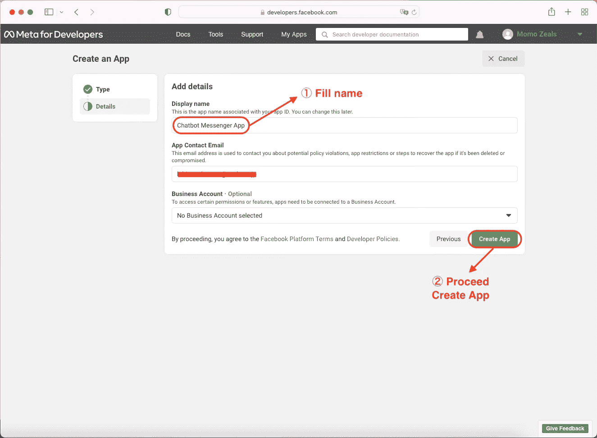
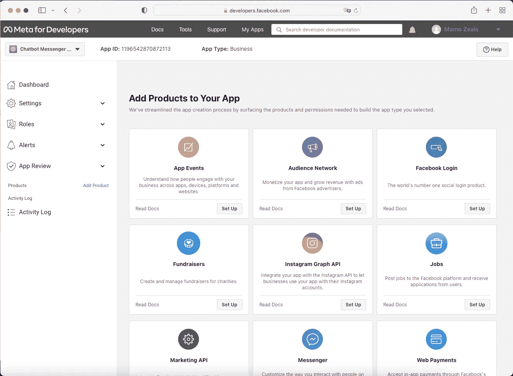

# 用 Golang & Messenger 构建基本聊天机器人

> 原文：<https://medium.easyread.co/build-simple-chatbot-with-golang-messenger-f00f6299960?source=collection_archive---------1----------------------->


Chatbot with Golang & Messenger

# 介绍

大家好！还是跟我分享一些与软件工程领域技术相关的经验、想法或者看法吧。在这篇文章中，我想分享如何使用 Golang 在 Messenger 上创建一个简单的聊天机器人！

为了给我们应该做的事情提供一些背景，我们将处理以下几点:

*   拥有一个脸书帐户或创建一个新帐户。
*   创建一个脸书页面。
*   创建一个脸书应用程序(应自动创建)。
*   创建一个 webhook 服务器。

# 建筑设计

为了接收终端用户发送给 Messenger(脸书页面)的消息，我们需要提供一个带有 REST API 的 Webhook 服务器。架构设计将如下图所示:


Chatbot Architecture Design

# 脸书账户

我猜现在人们都有一个脸书账户。然而，如果没有，只需访问[https://www.facebook.com](https://www.facebook.com)点击创建新账户按钮即可轻松注册。


Create a Facebook Account

# 脸书·佩奇

创建一个脸书网页可以通过主页上的菜单来完成。


Facebook Page Menu

然后单击“创建新页面”按钮，转到“创建页面”表单。


Create New Page Menu

或者只需打开 https://www.facebook.com/pages/create/?ref_type=site_footer[的这个链接](https://www.facebook.com/pages/create/)就可以直接去创建一个页面表单。填写必要的信息，并通过单击“创建页面”按钮完成。


Create New Page Form

在页面列表中，将显示一个新页面。


New Page Created

# 脸书应用程序

接下来，进入开发者主页【https://developers.facebook.com 点击这里，选择我的应用菜单。


Meta For Developers Page

通过单击创建应用程序按钮创建新应用程序。


Create App

选择业务类型，然后单击下一步按钮。


Choose App Type

添加应用程序的详细信息，最后一步单击创建应用程序继续。



Proceed Create App

稍等片刻，页面创建成功后会重定向到详细 App。



App Successfully Created

# Webhook

在将 Messenger & Webhook 产品添加到脸书应用程序之前，我们可以准备一个 Webhook 来验证回调 URL。有关详细信息，请参考本文档:

[](https://developers.facebook.com/docs/messenger-platform/getting-started/webhook-setup/) [## Webhook 设置-信使平台-文档-开发者脸书

### Messenger 平台是语言不可知的。要遵循本指南，您将需要安装 Node.js，但您可以编写…

developers.facebook.com](https://developers.facebook.com/docs/messenger-platform/getting-started/webhook-setup/) 

因为我们将在本教程中使用 Go，所以通过以下链接可以更好地理解 Go:

[](https://go.dev/) [## Go 编程语言

### Go 是一种开源编程语言，它使构建简单、可靠和高效的软件变得容易。

go.dev](https://go.dev/) 

那么，Go 代码的例子可以是这样的:

实际上，我们需要部署可以从 Messenger 平台接收 Webhook 事件的 live Webhook。代码必须托管在公共 HTTPS 服务器上。但是我们可以在本地完成，并使用 ngrok 创建一个从公共 URL 到本地主机的隧道。要安装和使用 ngrok，请参考以下链接:

[](https://ngrok.com/) [## ngrok -保护到本地主机的内部隧道

### 到本地主机 webhook 开发工具和调试工具的 ngrok 安全自省隧道

ngrok.com](https://ngrok.com/) 

首先，使用以下命令运行 Webhook 服务器:

```
go run .
```

Webhook 将在端口 3000 上运行。

```
2022/01/03 00:36:30 http server listening at localhost:3000
```

然后，启用隧道非常简单，只需运行以下命令:

```
ngrok http 3000
```

如果 ngrok 成功启用隧道，输出将如下所示:


ngrok Enabling Tunnel

通过做这个简单的卷曲来测试隧道:

```
curl --location --request GET 'https://e52b-2001-448a-400d-238a-d170-291d-3057-4e4a.ngrok.io/?hub.verify_token=12345&hub.challenge=challenge'
```

当输出与查询参数相同时，那么它就工作了！

```
challenge⏎
```

# 配置 Messenger 产品

在 Webhook 准备好之后，下一步是设置 Messenger 产品。找到 Messenger 产品，然后单击设置按钮。


Set Up Messenger Product

将 Messenger 设置与我们在上一节中创建的脸书页面相链接。


Add Facebook Page


Choose Facebook Page

使用 ngrok HTTPS URL 将回拨 URL 添加到回拨 URL 设置表单中。


Add Callback URL


Fill URL and Token

因为我们将从 Messenger 平台接收消息，所以为“消息”字段添加订阅。


Add Message Field Subscription

使用创建脸书应用程序的同一脸书帐户向脸书页面信使发送消息(我们也可以邀请其他用户测试此应用程序)。如果我们的 Webhook 成功接收到消息，这意味着我们的 Webhook 正在工作！


Testing Receiving Message

# 配置 Webhook 产品

下一部分是从最终用户发送回复消息。在此示例中，Webhooks 设置的配置在完成 Messenger 设置后自动填充(带有订阅消息字段)。以防我们的配置没有自动设置，请参考这些设置。


Webhooks Configured

# 生成访问令牌

基于这个 Send API 文档，我们需要在发送消息的请求中包含页面访问令牌。

[](https://developers.facebook.com/docs/messenger-platform/reference/send-api/) [## 发送 API -信使平台-文档-开发者脸书

### Send API 是用于向用户发送消息的主要 API，包括文本、附件、结构化消息模板…

developers.facebook.com](https://developers.facebook.com/docs/messenger-platform/reference/send-api/) 

然后，我们需要转到 Messenger 设置页面并生成令牌。在我们关闭弹出窗口后，令牌将会隐藏。这就是为什么最好复制令牌并保存它。


Generate Token

# 修改 Webhook

要向特定用户发送消息，我们需要前面部分生成的令牌，并向脸书 API 发出 HTTP 请求。最终的代码将如下所示:

上面的代码只是一个简单的聊天机器人，它总是发送“自动回复🙌🏻“消息无论最终用户发送何种类型的消息(文本、贴纸、表情符号、gif、文件)。下面是最终代码的结果，发送消息后我们得到了回复！是的，起作用了！！


Webhook Sent Reply Message

# 关闭

构建 Chabot for Messenger 平台非常简单，因为官方网站上有很多写得很好的文档。此外，没有限制我们创建，访问页面和应用程序，所以我们可以很容易地测试我们的聊天机器人。

虽然本文的范围仅限于回复消息，但 Messenger 有很多可用的功能，所以我希望您可以自己探索更多！

感谢您的阅读！希望这篇文章对你有用！！