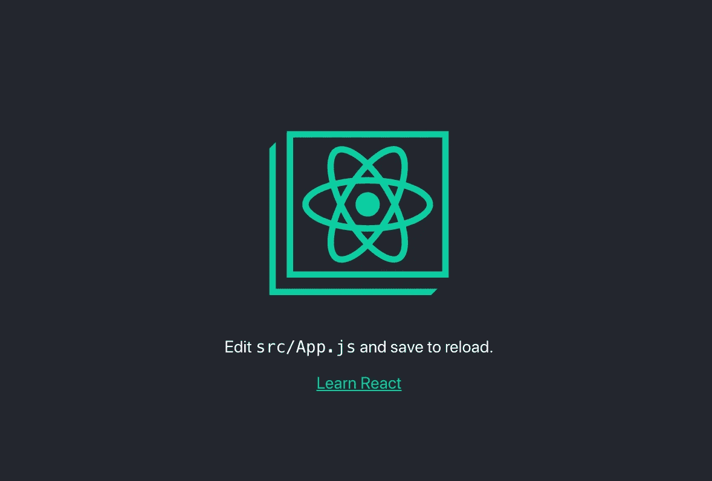

# 在 5 分钟内构建简单的 React Js 应用程序

> 原文：<https://medium.com/quick-code/build-simple-react-js-application-in-5-minutes-f9abfc2d018a?source=collection_archive---------0----------------------->


[Duomly — programming online courses](https://www.duomly.com)

本文最初发布于:[https://www . blog . duomly . com/how-to-create-react-app-in-5-minutes/](https://www.blog.duomly.com/how-to-create-react-app-in-5-minutes/)

React.js 是当今最流行的前端框架之一，很多人觉得学习它很有用。掌握了理论之后，就到了开始实践的时候了，然后可能会显得有点难，怎么开始，怎么获取数据，怎么展示。但是创建您的第一个 React.js 应用程序不必如此复杂。
在本文中，我将创建一个简单的 React.js 应用程序，在 5 分钟内一步一步地从 API 获取数据。
要创建这个应用程序，最好具备 React.js、Javascript、HTML 和 CSS 的基础知识。此外，要安装该工具，我将使用您必须在您的计算机上安装 Node.js 和 npm。

如果你喜欢视频教程，看看这里:

【https://www.youtube.com/SPM4xyYd9MI 

我们开始吧。

# **1。安装**创建-反应-应用

一开始，我们必须安装 **create-react-app** 工具。这是 React.js 创建者提供的工具，它允许安装现成的 React.js 应用程序，以及所有需要的依赖项。要安装该工具，我们必须在命令行中使用以下命令:

```
**npm install -g create-react-app**
```

该过程成功完成后，您已经安装了它。让我们创建我们的应用程序吧！

# 2.创建应用程序

现在，使用 create-react-app 工具创建我们的第一个应用程序非常容易。我们可以在命令行中使用一个命令来完成。首先，通过命令行导航到您希望应用程序所在的文件夹，然后运行以下命令，其中 reactapp 是我们的应用程序的名称:

```
**npx create-react-app reactapp**
```

您可以随意为您的应用程序设置不同的名称。如果该过程成功完成，你应该有你的应用程序准备好的文件夹！现在让我们开始应用程序吧！

# 3.启动应用程序

让我们使用以下命令启动 reactapp:

```
**cd reactapp**
**npm start**
```

第一个命令用于进入我们应用程序的文件夹，第二个命令用于启动我们的应用程序。默认情况下，应用程序在 localhost:3000 打开，但是我们可以在设置中更改端口。
应用程序启动后，浏览器窗口将在适当的地址弹出，您将在浏览器中看到以下图像:



[Duomly — programming online courses](https://www.duomly.com)

在命令行中，您将看到以下信息:


[Duomly — programming online courses](https://www.duomly.com)

看起来我们的第一个应用程序正在运行，现在让我们从 API 中获取一些数据。

# 4.创建 API 调用

让我们在您最喜欢的代码编辑器中打开应用程序的代码。在**里面。/src** 文件夹，里面有我们的主要组件 **App.js** 。让我们打开它，看看里面是什么。我们可以在这里看到我们在[看到的代码 https://localhost:3000。](https://localhost:3000.)

```
**import React from 'react';**
**import logo from './logo.svg';**
**import './App.css';****function App() {**
 **return (**
 **<div className="App">**
 **<header className="App-header">**
 ****
 **<p>**
 **Edit <code>src/App.js</code> and save to reload.**
 **</p>**
 **<a**
 **className="App-link"**
 **href="https://reactjs.org"**
 **target="_blank"**
 **rel="noopener noreferrer"**
 **>**
 **Learn React**
 **</a>**
 **</header>**
 **</div>**
 **);**
**}**
**export default App;**
```

让我们从修改组件开始，将其更改为类组件，这在我们的情况下会方便得多。我们希望我们的 **App.js** 组件看起来如下:

```
**import React, { Component } from 'react';****class App extends Component {
  render() {
    return (
      <p>Hello world!</p>
    );
  }
}
export default App;**
```

我删除了 App.css 和 logo.svg 导入，因为我们不再需要它们了。另外，我从“react”导入了组件，我用它创建了一个类组件。让我们在 return **()** 语句中添加一些自定义的 JSX 代码，并重新加载页面以查看结果！


[Duomly — programming online](https://www.duomly.com)

现在，让我们设置一个本地状态，在这里我们将保存来自 API 的数据。

```
**import React, { Component } from 'react';

class App extends Component {
constructor(props) {
    super(props);
    this.state = {
      posts: []
    }
  }****render() {
    return (
      <p>Hello world!</p>
    );
  }
}
export default App;**
```

我已经添加了一个构造函数并传递了 props，然后我设置了一个本地状态，将 post 作为一个空数组，因为我们将从 API 中获取一些 post。

好了，现在我准备好创建对 API 的调用了。我将使用来自 JSONPlaceholder 网站([https://jsonplaceholder.typicode.com/](https://jsonplaceholder.typicode.com/))的伪造 API。为了获取数据，我将使用。从 Javascript 获取方法。让我们创建一个呼叫:

```
**import React, { Component } from 'react';

class App extends Component {
constructor(props) {
    super(props);
    this.state = {
      posts: []
    }
  }****componentDidMount() {
    const url = "https://jsonplaceholder.typicode.com/posts";
    fetch(url)
    .then(response => response.json())
    .then(json => this.setState({ posts: json }))
  }****render() {
    return (
      <p>Hello world!</p>
    );
  }
}
export default App;**
```

在上面的代码中，我从 API 获取数据并保存在我们的状态中。在展示帖子之前，让我们先看看我们的数据是什么格式:

```
**[
  {
    "userId": 1,
    "id": 1,
    "title": "sunt aut facere repellat provident occaecati excepturi optio reprehenderit",
    "body": "quia et suscipit\nsuscipit recusandae consequuntur expedita et cum\nreprehenderit molestiae ut ut quas totam\nnostrum rerum est autem sunt rem eveniet architecto"
  },
  {
    "userId": 1,
    "id": 2,
    "title": "qui est esse",
    "body": "est rerum tempore vitae\nsequi sint nihil reprehenderit dolor beatae ea dolores neque\nfugiat blanditiis voluptate porro vel nihil molestiae ut reiciendis\nqui aperiam non debitis possimus qui neque nisi nulla"
  },
  {
    "userId": 1,
    "id": 3,
    "title": "ea molestias quasi exercitationem repellat qui ipsa sit aut",
    "body": "et iusto sed quo iure\nvoluptatem occaecati omnis eligendi aut ad\nvoluptatem doloribus vel accusantium quis pariatur\nmolestiae porro eius odio et labore et velit aut"
  },**
**...**
**]**
```

# 5.显示数据

现在，我们有一些文章数据，我们想显示它们。为了让它看起来更好，但不带有风格，让我们在应用程序中添加引导 CDN。从 Bootstrap 网站，我们得到一个 CDN，我们必须将它放在**中。/public/index.html** 文件<头>节。

```
**....
    <!-- Bootstrap -->**
 **<link rel="stylesheet" href="https://stackpath.bootstrapcdn.com/bootstrap/4.3.1/css/bootstrap.min.css" integrity="sha384-ggOyR0iXCbMQv3Xipma34MD+dH/1fQ784/j6cY/iJTQUOhcWr7x9JvoRxT2MZw1T" crossorigin="anonymous">**
 **<title>React App</title>**
 **</head>**
 **<body>
....**
```

就这样，我们现在可以使用 Bootstrap 了。让我们为我们的数据创建一个 JSX 代码。

```
**....**
**render() {**
 **return (**
 **<div className="container">**
 **<div class="jumbotron">**
 **<h1 class="display-4">Blog posts</h1>**
 **</div>**
 **<div className="card">**
 **<div className="card-header">**
 **Featured**
 **</div>**
 **<div className="card-body">**
 **<h5 className="card-title">Special title treatment</h5>**
 **<p className="card-text">With supporting text below as a natural lead-in to additional content.</p>**
 **<a href="#" className="btn btn-primary">Go somewhere</a>**
 **</div>**
 **</div>**
 **</div>**
 **);**
 **}**
**...**
```

我添加了一个容器、标题和一个卡片，我将在其中显示来自 state . state 的数据。

让我们通过 map()方法使用数据，并将它们显示为帖子。

```
**import React, { Component } from 'react';**

**class App extends Component {**
 **constructor(props) {**
 **super(props);**
 **this.state = {**
 **posts: []**
 **}**
 **}**

 **componentDidMount() {**
 **const url = "https://jsonplaceholder.typicode.com/posts";**
 **fetch(url)**
 **.then(response => response.json())**
 **.then(json => this.setState({ posts: json }))**
 **}**

 **render() {**
 **const { posts } = this.state;**
 **return (**
 **<div className="container">**
 **<div class="jumbotron">**
 **<h1 class="display-4">Blog posts</h1>**
 **</div>**
 **{posts.map((post) => (**
 **<div className="card" key={post.id}>**
 **<div className="card-header">**
 **#{post.id} {post.title}**
 **</div>**
 **<div className="card-body">**
 **<p className="card-text">{post.body}</p>**
 **</div>**
 **</div>**
 **))}**
 **</div>**
 **);**
 **}**
**}**
**export default App;**
```

我们将 post 中的数据传递给一个 card 元素，并将 **post.title、post.body** 和 **post.id** 设置为一个元素的键。

# 6.添加一些样式

我们可以看到我们的应用程序现在几乎准备好了。


[Duomly — programming online](https://www.duomly.com)

但它看起来仍然不惊艳，所以我们会添加一些造型。让我们再次导入一个 App.css 文件，并在那里设置一些填充和边距，使我们的博客文章看起来更好。

```
**.app {**
 **padding: 10px;**
**}**

**.app .jumbotron {**
 **text-align: center;**
**}**

**.app .card {**
 **margin-bottom: 10px;**
**}**

**.app .card-header {**
 **color: white;**
 **font-weight: bold;**
**}**
```

呜哇！我们的 app 好像准备好了！又快又简单。


[Duomly — programming online](https://www.duomly.com)

# 结论

在本文中，我们创建了一个简单的 React.js 应用程序，从 REST API 获取数据。我们构建了一个简单的列表，显示简短的博客文章。我们使用 create-react-app 轻松地设置了一个现成的 React.js 应用程序和用于样式化的 Bootstrap。

我希望本教程对您有所帮助，并将其作为您首次 React.js 应用程序培训的基础！如果您想掌握 React.js 知识，请加入我们在[duomly.com](http://duomly.com/)的活动，完成 React.js 课程！

好好编码！


[Duomly — programming online courses](https://www.duomly.com)

感谢您的阅读！

本文由我们的队友安娜提供。