# 用自治数据库构建 SPARQL 端点(第 2 部分)

> 原文：<https://medium.com/oracledevs/build-sparql-endpoint-with-autonomous-database-part-2-2-7c1c10f617b9?source=collection_archive---------1----------------------->


Photo by [Cristian Escobar](https://unsplash.com/@cristian1?utm_source=unsplash&utm_medium=referral&utm_content=creditCopyText) on [Unsplash](https://unsplash.com/s/photos/spark?utm_source=unsplash&utm_medium=referral&utm_content=creditCopyText)

(本文中的过程已经过 Oracle RDF Graph Server 和 Query UI 版本 **22.2.0** 的测试)

在[第 1 部分](https://ryotayamanaka.medium.com/build-always-free-sparql-endpoint-part-1-2-6749daa974bd)中，我们已经设置了使用自治数据库实例和计算实例创建 SPARQL 端点的环境，这两个实例都作为[永远免费服务](https://signup.cloud.oracle.com/?language=en&sourceType=:ex:tb:::::&SC=:ex:tb:::::&pcode=)的一部分运行，您现在就可以注册..

在这一部分中，我们将上传一个示例 RDF 数据集并发布一个 SPARQL 端点，这样任何人都可以使用 SPARQL 查询访问数据。这是在网上分享你的 LOD(链接开放数据)的第一步！

**上传 RDF 数据集**

让我们尝试加载示例 RDF 数据集，你可以从 W3C Turtle 规范页面([https://www.w3.org/TR/turtle/](https://www.w3.org/TR/turtle/))找到它作为示例 1。

`**example1.ttl**`

```
[@base](http://twitter.com/base) <[http://example.org/](http://example.org/)> .
[@prefix](http://twitter.com/prefix) rdf: <[http://www.w3.org/1999/02/22-rdf-syntax-ns#](http://www.w3.org/1999/02/22-rdf-syntax-ns#)> .
[@prefix](http://twitter.com/prefix) rdfs: <[http://www.w3.org/2000/01/rdf-schema#](http://www.w3.org/2000/01/rdf-schema#)> .
[@prefix](http://twitter.com/prefix) foaf: <[http://xmlns.com/foaf/0.1/](http://xmlns.com/foaf/0.1/)> .
[@prefix](http://twitter.com/prefix) rel: <[http://www.perceive.net/schemas/relationship/](http://www.perceive.net/schemas/relationship/)> .<#green-goblin>
    rel:enemyOf <#spiderman> ;
    a foaf:Person ;    # in the context of the Marvel universe
    foaf:name "Green Goblin" .<#spiderman>
    rel:enemyOf <#green-goblin> ;
    a foaf:Person ;
    foaf:name "Spiderman", "Человек-паук"[@ru](http://twitter.com/ru) .
```

首先，在 Data 选项卡中，指定您之前注册的数据源(`ADB1`)并创建一个 RDF 网络。这里，Oracle 数据库中的 RDF 网络是由一组表和索引组成的逻辑 RDF 存储。一个数据库中可以有多个 RDF 网络。

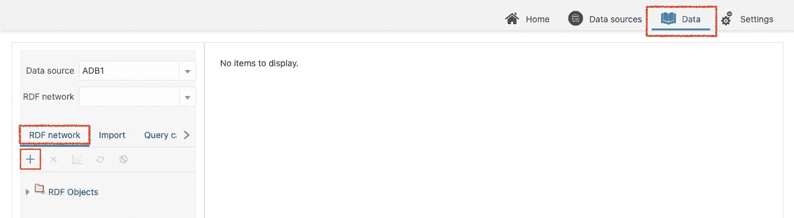

```
- Network owner: **ADMIN**
- Network name: Any network name (e.g. **NETWORK1**)
- Tablespace: **DATA**
```

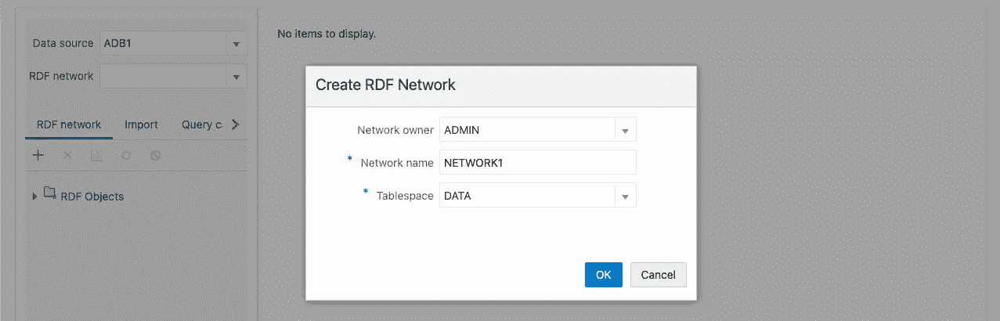

在“数据”选项卡中，指定您之前创建的 RDF 网络(`ADMIN.NETWORK1`)，并单击“导入”选项卡上的“上传数据”图标，将文件上传到暂存表。

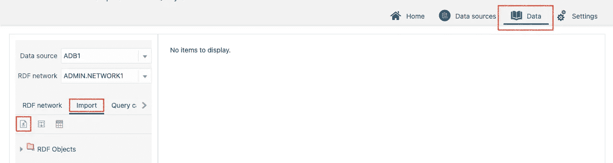

```
- Upload: Select **example1.ttl**
- Staging table: Input any new table name (e.g. **EXAMPLE1_TABLE**)
- Overwrite: **false** (unless the table name is used already)
```

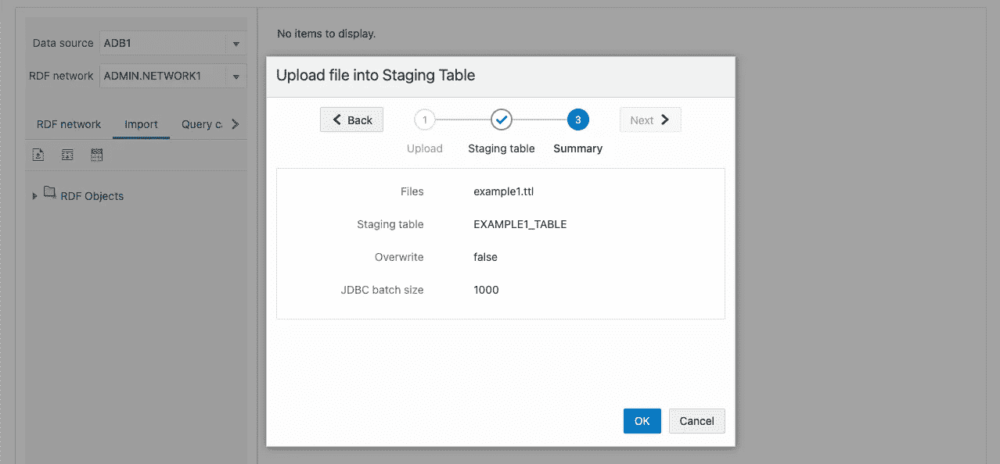

最后，单击 Import 选项卡上的 Bulk load data 图标，将数据从 staging 表加载到模型中。这里，Oracle Graph 中的一个**【模型】**是一组三元组的管理单元，一个 RDF 网络可以容纳多个模型。您还可以在执行 SPARQL 查询时指定一个模型作为目标，甚至可以定义一个**“虚拟模型”**作为模型的集合。

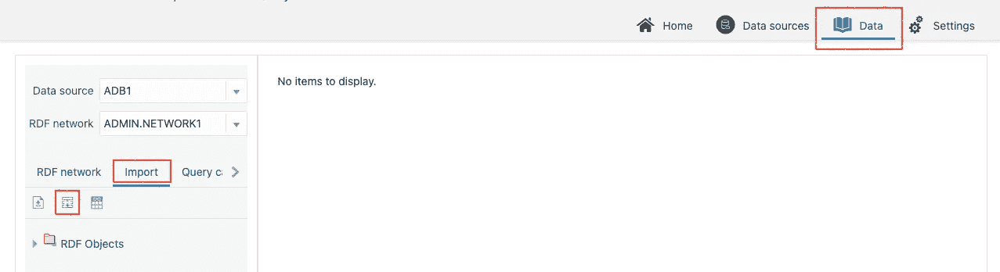

```
- RDF Data
  - Model: Any model name (e.g. **EXAMPLE1_MODEL**)
  - Staging table owner: **ADMIN**
  - Staging table: The staging table created above (**EXAMPLE1_TABLE**)
- Options
  - All items: No need to change
- Event Trace
  - All items: No need to change
```

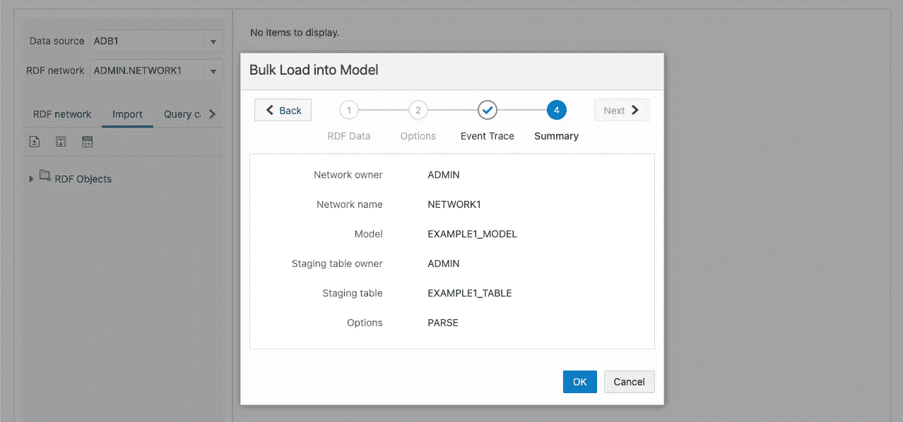

**试试 SPARQL 查询**

让我们在端点管理服务器的查询 UI 上尝试 SPARQL 查询。

右键单击目标模型(在本例中是`EXAMPLE1_MODEL`)并单击 Open 以显示编辑器。

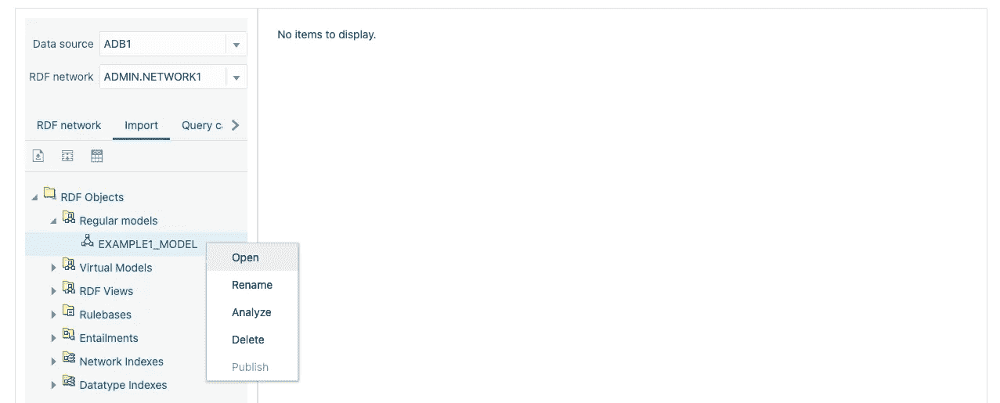

单击 Execute 按钮运行缺省情况下显示在编辑器中的 SPARQL 查询，这样三元组将作为结果返回。

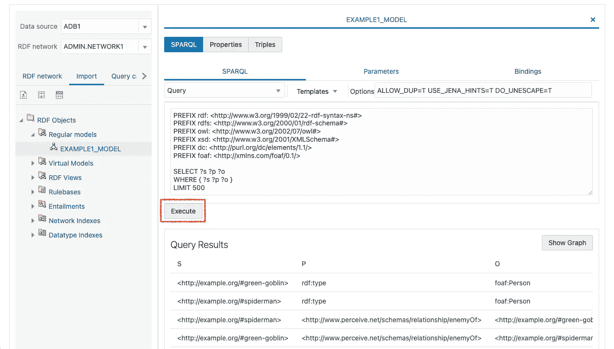

下面是一个查询，查找一个名叫“蜘蛛侠”(`?h`)的英雄的敌人(`?e`)的名字(变量`?e_name`)。

```
PREFIX foaf: <[http://xmlns.com/foaf/0.1/](http://xmlns.com/foaf/0.1/)>
PREFIX rel: <[http://www.perceive.net/schemas/relationship/](http://www.perceive.net/schemas/relationship/)>SELECT **?e_name**
WHERE {
  **?h** foaf:name "Spiderman" .
  **?e** rel:enemyOf **?h** .
  **?e** foaf:name **?e_name** .
} 
LIMIT 500
```

绿魔回来了！

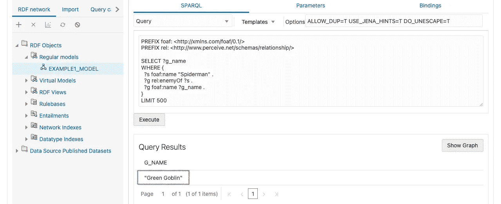

**发布端点**

此时，SPARQL 端点尚未发布。要允许发布端点，请从选择目标数据源的设置选项卡中更新配置(在本例中为`ADB1`)。您将看到一个弹出窗口进行确认，因此单击 OK 继续。

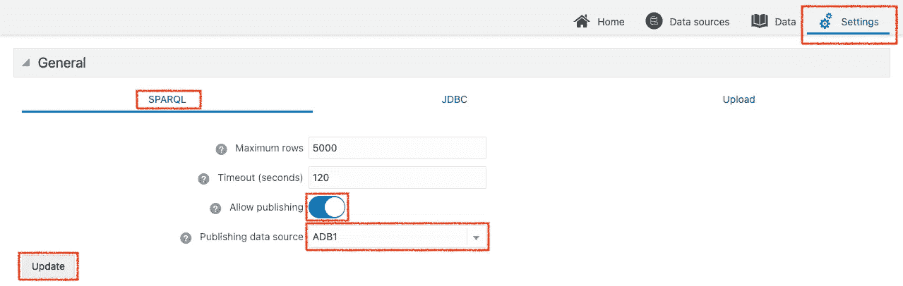

右键单击模型并选择发布。输入要在端点 URL 中使用的数据集的名称(在我们的例子中是`example1`)。

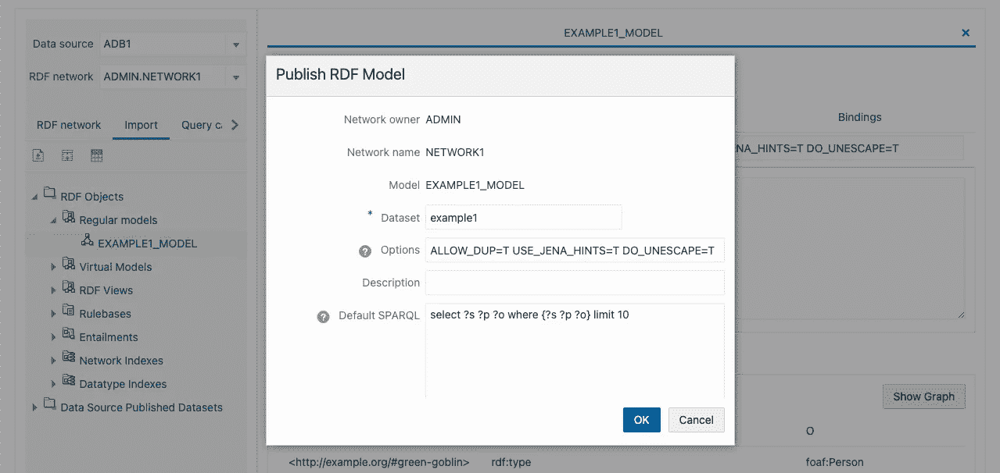

将显示如下所示的端点 URL，请保存它以供下一步使用。

```
https://<ip_address>:8001/orardf/api/v1/datasets/query/published/example1
```


**通过 REST 访问端点**

让我们使用 REST 向一个端点发送一个 SPARQL 查询，通常是 POST 请求。首先，将上面的 SPARQL 查询保存到桌面上的一个文件中。

`**sparql.rq**`

```
PREFIX foaf: <[http://xmlns.com/foaf/0.1/](http://xmlns.com/foaf/0.1/)>
PREFIX rel: <[http://www.perceive.net/schemas/relationship/](http://www.perceive.net/schemas/relationship/)>SELECT ?e_name
WHERE {
  ?h foaf:name "Spiderman" .
  ?e rel:enemyOf ?h .
  ?e foaf:name ?e_name .
} 
LIMIT 500
```

发送一个 POST 请求，将该文件内容作为查询字符串。由于服务器正在使用自签名证书，我们需要通过添加`-- insecure`选项来允许这一点。

```
$ curl https://<ip_address>:8001/orardf/api/v1/datasets/query/published/example1 --data-binary @sparql.rq --insecure -X POST
```

默认情况下，结果以 W3C 标准的 JSON 格式返回。

```
{
  "head": {
    "vars": [
      "E_NAME"
    ],
    "links": []
  },
  "results": {
    "bindings": [
      {
        "E_NAME": {
          "type": "literal",
          "value": "Green Goblin"
        }
      }
    ]
  }
}
```

**在数据加载上添加图形名称**

当加载 RDF 数据时，您可能想要批量设置这些三元组的图形名称，并将它们作为四元组加载。在这种情况下，在将三元组上传到 staging 表之后，您可以创建一个视图，将图名添加到该表中，并将其加载到 RDF 模型中。

首先，如上所述将数据上传到转移表(创建 RDF 网络)。

```
- Upload: Select **sample.nt**
- Staging table: Input any new table name (e.g. **SAMPLE_TABLE**)
- Overwrite: **Off** (unless the table name is used already)
```

打开数据库操作以执行 SQL 查询。

```
Oracle Cloud console
  > Oracle Database
    > Autonomous Database
      > (The ADB instance)
        > Tools
          > Open Database Actions
```

执行以下 SQL 查询来创建视图。用您想要指定的图形名称替换`<http://example.org/graph1>`。

```
create view SAMPLE_VIEW as
select
  RDF$STC_SUB
, RDF$STC_PRED
, RDF$STC_OBJ
, '<[http://example.org/graph1](http://example.org/graph1)>' as RDF$STC_GRAPH
from SAMPLE_TABLE
```

返回 SPARQL 端点，单击 Import 选项卡上的 Bulk load data 图标，将数据从创建的视图加载到新模型中。

```
- RDF Data
  - Model: Input any model name (e.g. **SAMPLE_MODEL**)
  - Staging table owner: **ADMIN**
  - Staging table: Select the table created above (e.g. **SAMPLE_VIEW**)
- Options
  - All of the items: Do not need to change
- Event Trace
  - All of the items: Do not need to change
```

您可以验证图形名称是否包含在以下 SPARQL 查询的结果中。

```
SELECT *
WHERE { GRAPH ?g { ?s ?p ?o } } 
LIMIT 500
```

在本文中，我们介绍了如何设置一个永远免费的 SPARQL 端点，并使用管理服务器 UI 发布数据集。通过这种方式，您可以轻松地管理自治数据库上的 RDF 数据集，并保持它们与“数据网”的连接

# 加入对话！

如果你对 Oracle 开发人员在他们的自然环境中发生的事情感到好奇，来[加入我们的公共休闲频道](https://join.slack.com/t/oracledevrel/shared_invite/zt-uffjmwh3-ksmv2ii9YxSkc6IpbokL1g?customTrackingParam=:ex:tb:::::RC_WWMK220210P00062:Medium_SPARQLendpoint_pt2)！我们不介意成为你的鱼缸🐠

如果您想分享您的反馈或向社区提问，请张贴到标签为 [oracle-graph](https://stackoverflow.com/questions/tagged/oracle-graph) 的 **Stack Overflow** ，或点击[此处](https://join.slack.com/t/andouc/shared_invite/zt-mfbk0un9-E7mgQweUfBnJ6BfRgcTeMQ)加入 AnDOUC(分析和数据 oracle 用户社区)的 **Slack** 工作区，并在 [#graph](https://andouc.slack.com/archives/C01BMHU02JX) 频道发表您的评论。