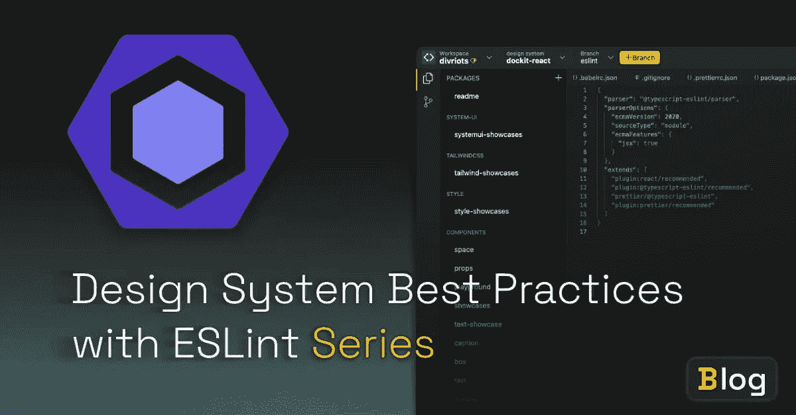

# 为你的设计系统建立测试规则

> 原文：<https://medium.com/quick-code/build-testing-rules-for-your-design-system-e83500b25?source=collection_archive---------0----------------------->

## 了解如何使用 ESLint 构建高级测试规则，以确保符合设计系统最佳实践



欢迎来到三部分*“用 ESLint 设计系统最佳实践”的第二部分。*

本系列旨在帮助您鼓励那些使用您的设计系统的人遵循您的最佳实践。

我们在第 1 部分中涉及了很多理论( [*使用 ESLint 强制设计系统*](/quick-code/use-eslint-to-enforce-design-system-eaffbb1cd4e7) ，如果你还没有读过，你应该从它开始)，比如 ESLint 是如何在引擎盖下工作的。我们用 ESLint 建立了一些简单的规则。

在第 2 部分中，我们将讨论如何构建更复杂的 ESLint 规则。

# 快速回顾第 1 部分

在第一篇文章中，我们讨论了如何创建两条规则:

*   避免元素中的内联样式
*   确保工具提示不包含交互式内容。

让我们花点时间来谈谈为什么我们选择了这些规则。

首先，它们都是很好的规则，可以作为编写规则的入门。虽然我们在这些文章中讨论的实现可能还没有准备好投入生产，但是它们将有助于巩固您到目前为止所学到的知识。

除了作为教学辅助，这两条规则还有实际应用。

对于我们的第一条规则，您可能希望鼓励您的最终用户与他们的样式实现保持一致，这可能有助于可读性和维护。CSS 偏好因人而异，因库而异，所以您可能会发现这个特定的规则不适用于您的库。但是，针对特定属性非常有用。例如，您可能不希望在非交互元素上使用[标签索引，或者您可能希望鼓励对某个元素使用属性，比如对`button`组件使用`type`属性。](https://developer.mozilla.org/en-US/docs/Web/HTML/Global_attributes/tabindex#accessibility_concerns)

我们选择了第二条规则，因为我们将使用一个现有的设计系统作为例子，即使用 Lion web 组件编写的 [Simba 设计系统](https://backlight.dev/edit/5vtJtbY04aoD1dGKcsu1/introduction/doc/index.md)。

在[工具提示元素](https://backlight.dev/edit/5vtJtbY04aoD1dGKcsu1/tooltip/doc/index.md)的 Simba 设计系统文档中，开头描述如下:

交互式内容不应放在工具提示内容槽中。工具提示只是为了显示附加信息。

这可能足以防止一些最终用户不使用`tooltip,`中的交互内容，但一些开发人员可能不会阅读(或记住)文档中的所有规则。有一个 ESLint 规则来执行这些规则，会让人们更容易记住并遵守你的框架的规则。

# 设置我们的项目

让我们从克隆 starter repo 开始。回购涵盖了许多繁琐的设置，例如:

*   安装软件包
*   ESLint 样板文件
*   设置测试套件

要开始回购，请遵循以下步骤:

*   使用`git clone [https://github.com/andrico1234/custom-eslint-tutorial/tree/0-begin-first-rule](https://github.com/andrico1234/custom-eslint-tutorial/tree/0-begin-first-rule)`克隆回购
*   导航到项目目录
*   用`npm i`安装你的依赖项
*   在代码编辑器中打开 repo

> 使用 [ESLint](https://eslint.org/docs/developer-guide/working-with-rules) 指南设置演示回购。

以下是启动回购的简要概述:

## 库/规则

`lib/rules`包含我们的规则。我们已经通过编写样板文件为您准备了第一个。根据 [*使用规则* '](https://eslint.org/docs/developer-guide/working-with-rules) 的建议，我们已经向文件添加了一些 JSDoc 注释。这将为您编写 lint 逻辑提供一些非常好的智能感知。

## 测试/库/规则

`tests/lib/rules`包含我们将为我们的规则编写的测试。我们为`no-inline-styles`增加了一些，但如果你喜欢，欢迎你添加更多。我们使用 ESLint 的内置 [RuleTester](https://eslint.org/docs/developer-guide/nodejs-api#ruletester) 来测试我们的规则。我们已经创建了一个`RuleTester`的实例，并用几个有效和无效的案例来调用`run`。

`valid`是一个不应该报告林挺错误的字符串化 JavaScript 数组。

`invalid`是包含两个属性的对象数组:`code`和`errors`。`code`是报告林挺错误的字符串化 JavaScript。`errors`属性是一个对象数组。这些对象可以保存不同类型的断言，因此我们不仅可以检查代码片段是否不符合 lint 规则，还可以检查我们得到的错误消息以及错误在 IDE 中的位置，这就是 VSCode 如何确定在哪里放置曲线。

一旦您熟悉了 repo，您就可以通过运行`npm test`来启动测试运行程序。每当您对规则文件进行更改时，测试运行程序将会运行，这将在出现问题时提供即时反馈，或者更有希望是正确的

# 创建简单的 ESLint 规则

如果`lit`元素包含内联样式，我们将编写的第一条规则将显示一条错误消息。

## 创建我们的访问者函数

让我们从跳转到`lib/rules/no-inline-styles.js`文件开始。

如果您还记得第一篇文章，当我们的 JavaScript 被解析时，`html`函数被表示为 AST 中的`TaggedTemplateExpression`节点。我们可以通过在规则的`create`函数中定义一个`TaggedTemplateExpression`来请求 ESLint 在到达这个节点时访问它。

不要忘记，并不是所有的`TaggedTemplateExpressions`都是我们想要运行 lint 规则的`html`表达式。我们要检查函数的名称，看看它是否是“html”。

试着用上面的逻辑填充`create`函数，或者你可以偷看下面我们的答案。

下一步是获取`node`并将其解析成有效的 HTML AST。

# 解析我们的 HTML

由于解析我们的`node`的逻辑不是我们规则的*业务逻辑*的一部分，我们在一个单独的实用程序目录中创建了一个类存根。所以跳到`utils/index.js`文件。

我们需要做两件事:

*   将我们的模板表达式转换成 HTML 字符串
*   将我们的字符串解析成 HTML AST，并将其存储为实例变量

对于第一个任务，让我们采取简单的方法，就像我们的 Lit 表达式不包含动态内容一样。

换句话说，我们只需要担心:

```
html`<div style="display:none;"></div>`;
```

而不是:

```
html`<div style="${val}"></div>`;
```

我们将在下面提供解决方案，但是尝试使用我们在本文中介绍的工具来自己解决这个问题。

您可以自己尝试一下，或者查看下面的解决方案:

> 技巧 1:不要忘记使用 [AST 浏览器](https://astexplorer.net/)来理解如何从模板表达式中获取 HTML 字符串
> 
> 技巧 2:要将字符串解析成 HTML，使用 parse5 的`[*parseFragment*](https://github.com/inikulin/parse5/blob/master/packages/parse5/docs/index.md#parsefragment)`函数。

# templateExpressionToHtml 是怎么回事？

上面的代码忽略了更复杂的用例，只提取了`quasis`数组中的第一项。

这意味着对于下面的`lit`表达式，这些测试将运行良好:

```
html`<div style=""></div>`;
html`<div style="display:none;"></div>`;
```

这是因为这些`lit`表达式在模板文本中不包含任何 JavaScript 表达式。

这意味着`node.quasi`物体看起来会像这样:

```
{
  quasi: {
    quasis: ['<div style="display:none;"></div>'],
		expressions: [],
  }
}
```

不幸的是，这意味着下面的`lit`表达式的测试将会失败:

```
html`<div style="${val}"></div>`;
```

因为这个`lit`表达式在模板文本中包含了一个 JavaScript 表达式，所以`node.quasi`对象看起来会像这样:

```
{
  quasi: {
    quasis: ['<div style="', '"></div>'],
		expressions: ['val'],
  }
}
```

第三个测试用例将会失败，直到我们完全实现了`templateExpressionToHtml`函数。

如果您已经运行了测试，所有有效的案例应该仍然是通过的，所有无效的案例应该是失败的。这是一个很好的指标，可以看出我们的 TemplateAnalyzer 的构造函数中是否存在任何基本的解析问题。

> 上面的代码片段是一个非常简化的例子，与 ESLint 将 JavaScript 解析成的 AST 结构不匹配。

# 创建我们的访问者函数

下一步是为我们的分析器创建一个遍历函数。这将进入每个 HTML 节点，就像 ESLint 对 JavaScript 所做的那样，它将调用一个访问者函数，我们将使用该函数来进行断言。

它会把我们的访问者函数作为一个输入，然后访问每个节点，调用我们的访问者。

为了简单起见，我们需要检查节点是否是一个元素，然后调用正确的访问者。不要担心其他节点类型，比如注释节点或文本节点。

> 如果您不确定如何实现 visitor。你可以从第一篇文章回到 [CodeSandbox](https://codesandbox.io/s/mystifying-morning-lk3xh?file=/src/index.js) 。

我们的遍历函数将:

*   取一个名为`visitors`的对象，它包含了我们的访问者函数
*   访问`this.ast`的每个子节点
*   为每个元素节点调用`element`访问者函数

一旦实现，`traverse`函数将看起来像这样:

这是该函数正在做的事情:

*   声明了处理核心逻辑的函数`visit`。
*   如果没有`node`出现，`visit`会提前返回
*   `visit`检查我们的节点是否是一个 HTML 元素
*   如果是，`visit`调用我们的访客函数
*   `visit`用子节点递归调用。

剩下的唯一要实现的功能是`isElement`助手。这个助手将把一个`node`作为参数，并检查`node.tagName`值是否正确。

```
isElement(node) {
    return !!node.tagName;
}
```

# 撰写我们的断言

现在我们可以开始写断言了，让我们重温一下 ESLint 规则。让我们使用新的 visitor 函数来访问每个元素。

> 这个简单的助手是受 T21 的启发。

我们现在可以通过修复失败的测试来继续 TDD 方式。第一个失败的测试针对以下情况:

```
html`<div style=""></div>`;
```

这个例子失败了，因为存在`style`属性。如果属性存在，我们应该报告一个 ESLint 错误。在继续之前，花几分钟时间尝试并实现属性检查。如果您不确定节点的形状，不要忘记使用 AST explorer。

下一步是报告错误，我们将使用 ESLint 提供的`[context.report](http://context.report)`函数来完成。`report`函数接受一个对象，我们将使用它来提供值:

1.  `message`，也就是`no-inline-styles`
2.  `node`，这将是我们的 ESLint 节点。

花些时间浏览一下 AST，并亲自尝试一下。如果除了一个测试之外，所有的测试都通过了，那么您就知道您已经实现了一个通过的解决方案

解决方案如下:

# 返回模板表达式 Html

我们需要做的最后一件事是修复最终失败的测试。这意味着我们需要对我们的`templateExpressionToHtml`函数进行修改。

因为我们节点的`quasi`值如下所示:

```
{
  quasi: {
    quasis: ['<div style="', '"></div>'],
		expressions: ['val'],
  }
}
```

我们需要做的就是按照下面的模式来调和它们:准[0] →表达式[0] →准[1] →等等。

这听起来像是一个简单循环的工作！

因为我们不关心表达式的值，所以我们可以应用一个占位符来帮助区分它和 HTML 字符串的其余部分。这有助于我们稍后在 HTML 遍历器中运行检查。

我们将复制 [eslint-plugin-lit](https://github.com/43081j/eslint-plugin-lit#readme) 用于自己占位符的占位符模板:`{{__Q:${i}__}}`。

试着写一个循环，一旦最终测试通过，你就会知道你成功了。下面是`templateExpressionToHtml`函数完成后的样子:

> 这个语法没有什么特别的。它足够具体，因此不会与我们的任何 JavaScript 代码冲突。表达式的唯一标识符就是表达式在数组中的位置。

让我们一步步来:

*   `value`用一个空字符串初始化，用来构建 HTML
*   我们计算`quasis`数组的长度，这将用于通知我们的循环的迭代计数。
*   我们开始我们的循环，我们:
    –通过当前索引
    访问 quasi–通过当前索引
    访问表达式–将当前 quasi 追加到我们的`value`字符串
    –如果`expression`存在，我们也将它追加到`value`。
*   我们返回`value`，现在我们可以用它来解析成 HTML AST。

为了真正切中要害，让我们运行以下代码片段的循环:

提醒一下，我们将得到的节点如下所示:

*   我们将使用`value`来构建 HTML
*   我们将查看`node.quasi.quasis`的长度来确定循环的迭代次数。在这种情况下，数组中有两个元素。一个用于`<div style="`，另一个用于`"></div>`。
*   循环 1:
    –获取第一个 quasi，`<div style="`，并将其添加到我们的`value`字符串中。
    ——因为一个元素存在于`expressions`数组的第一个索引中，我们将为`val` 创建一个占位符——在第一次循环迭代结束时，我们的`value`看起来像`<div style="{{__Q:i__}}`
*   循环 2:
    –获取第二个 quasi，`"></div>`，并将其添加到我们的`value`字符串中。
    ——因为在`expressions`数组的第二个索引中不存在元素，我们跳过这一步
    ——在第二次循环迭代结束时，我们的`value`看起来像`<div style="{{__Q:i__}}"></div>`
*   我们返回完全格式化的`value`字符串，它准备好被解析成 HTML AST。

在实现了`templateExpressionToHtml`函数之后，整个测试套件都通过了，希望你的也能通过！

> 这一系列的解释可能会让人觉得矫枉过正。关于拟和表达式的概念可能会令人困惑，所以我们想在它们上面多花一点时间。

# ESLint 的局限性

根据定义，我们使用像 ESLint 这样的静态分析工具，在不运行代码的情况下检查代码。我们可以使用 ESLint 来标记代码中的代码风格问题，就像我们在本文中所做的那样。

ESLint 不能做的是运行我们的代码，并在输出中报告错误。因此，ESLint 无法报告以下代码片段的问题:

这是因为我们作为值传递的表达式不会被 ESLint 计算。

# 更进一步

我们已经介绍并学习了如何构建更高级的 ESLINT 规则来实施设计系统最佳实践。

在我们的下一篇也是最后一篇文章中，我们将更进一步。我们将编写一个更复杂的规则以及一些单元测试。我们将为现有设计系统的`Tooltip`组件实现实现一个 ESLint 规则。这个规则将特别有用，因为它将确保组件以其预期的方式使用，并且它将避免棘手的可访问性问题，这些问题可能会排除所有人使用该组件

*原载于*[*https://back light . dev*](https://backlight.dev/blog/best-practices-w-eslint-part-2)*作者:*[@ AndricoKaroulla](https://twitter.com/AndricoKaroulla)*2022 年 1 月 14 日。*

沙箱:

[https://codesandbox.io/s/mystifying-morning-lk3xh?file=/src/index.js](https://codesandbox.io/s/mystifying-morning-lk3xh?file=/src/index.js)

资源:

*   [辛巴设计系统](https://backlight.dev/edit/5vtJtbY04aoD1dGKcsu1/introduction/doc/index.md)
*   [Github 回购克隆](https://github.com/andrico1234/custom-eslint-tutorial/tree/0-begin-first-rule)
*   [ESLint 指南 (T1)](https://eslint.org/docs/developer-guide/working-with-rules)
*   (T2) RuleTester (T3)
*   ◎片 名 AST Explorer (T5)
*   [parseFragment](https://github.com/inikulin/parse5/blob/master/packages/parse5/docs/index.md#parsefragment)
*   [eslint-plugin-lit (T9)](https://github.com/43081j/eslint-plugin-lit#readme)