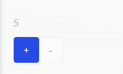
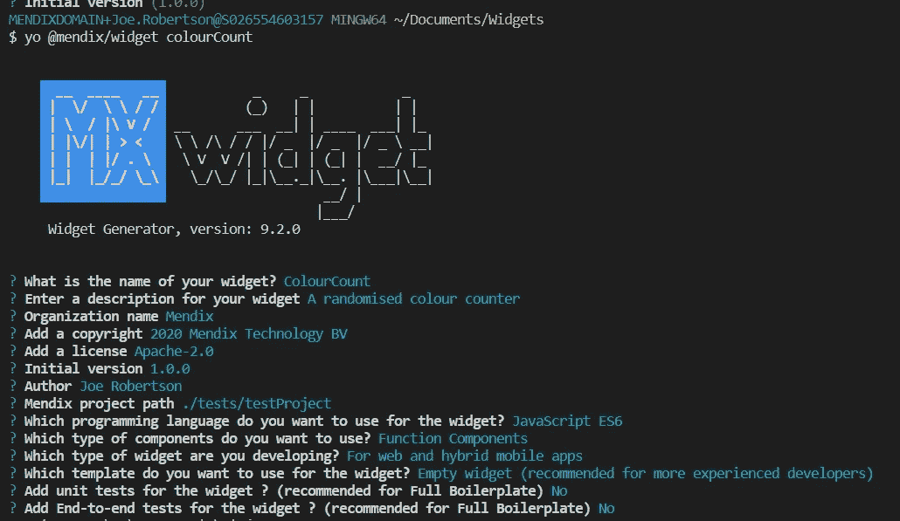
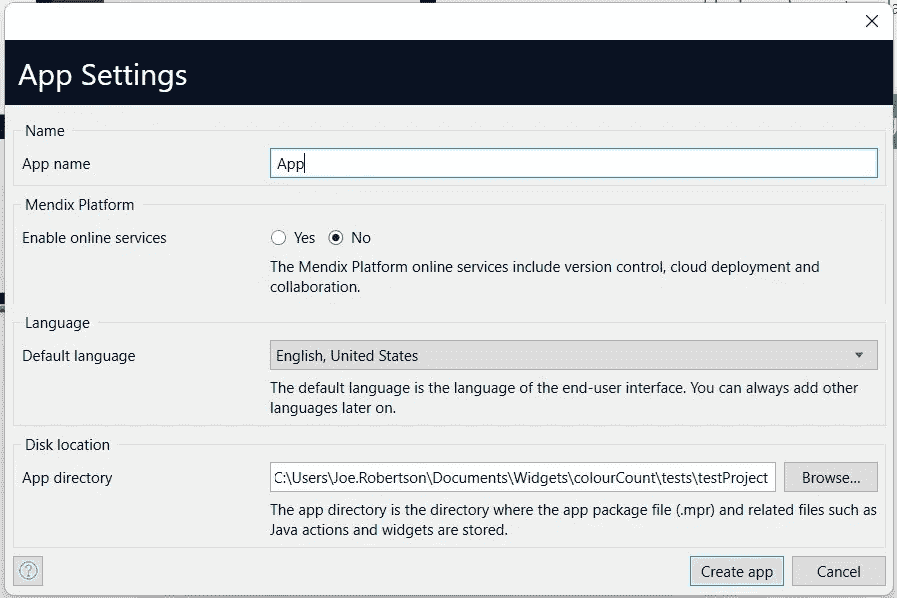
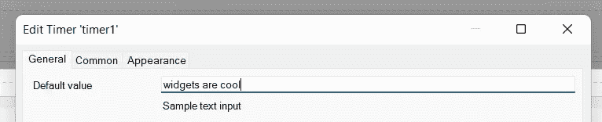
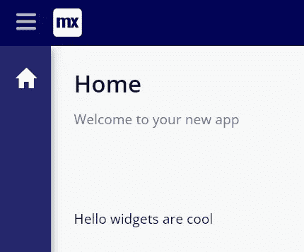
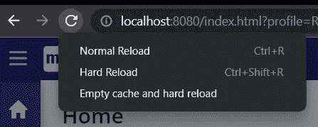
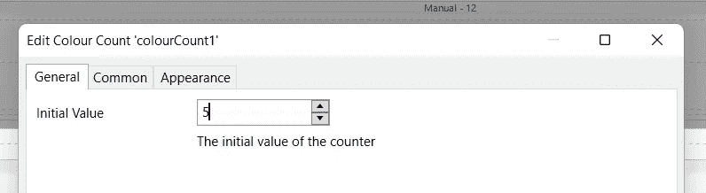
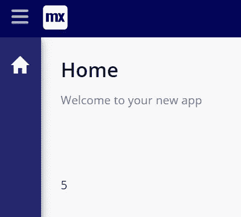
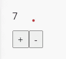
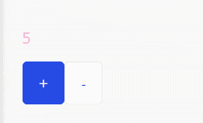

# 使用 React 在 Mendix 中构建小部件—第 1 部分—颜色计数器

> 原文：<https://medium.com/mendix/build-widgets-in-mendix-with-react-part-1-colour-counter-f1e400c3cdff?source=collection_archive---------0----------------------->


Build widgets in Mendix with React — Part 1 — Color Counter

# Mendix 是一个低代码平台，让制造商更快地交付价值，轻松地构建应用程序。使用 Mendix，可以使用 React 和可插拔小部件框架定制前端。

这篇博客是熟悉为 Mendix 构建自己的可插拔小部件的一系列构建小部件中的第一篇。这些博客将涵盖越来越复杂的概念，并将涵盖一系列用例，包括熟悉 Typescript 和 Pluggable widgets API，在浏览器中运行机器学习模型，以及构建一个基本的 WebAssembly 游戏。

# 从哪里开始

如果您还没有，那么您应该查看工作示例来创建您的第一个可插拔小部件:

 [## 构建可插入的 Web 小部件:第 1 部分

### 这篇操作指南将教你创建一个可插入的 web 小部件。

docs.mendix.com](https://docs.mendix.com/howto/extensibility/create-a-pluggable-widget-one/)  [## 构建可插入的 Web 小部件:第 2 部分(高级)

### 这个操作指南将教你如何给你的文本框输入部件添加高级功能。

docs.mendix.com](https://docs.mendix.com/howto/extensibility/create-a-pluggable-widget-two/) 

可插拔小部件使用 React Javascript 框架，我们将在本系列中触及一些 React 概念，但这绝不是对 React 的全面介绍。因此，如果您需要介绍或复习，我强烈推荐以下课程(您甚至可能会发现这个小部件的灵感)。

[](https://scrimba.com/learn/learnreact) [## React 教程:学习 React JS -免费 11 小时课程

### 终极反应 101 -任何反应初学者的完美起点。通过解决以下问题学习现代反应的基础知识…

scrimba.com](https://scrimba.com/learn/learnreact) 

# 本博客的目的

在这篇博客中，我们将讨论:

*   可插入小部件项目结构
*   测试设置和开发
*   React 概念介绍
*   利用外部库

# 我们正在建造的东西

我们将建立一个计数器，可以通过点击按钮来增加或减少，点击时会随机改变颜色。



项目的结束状态可在此处找到:

[](https://github.com/joe-robertson-mx/colourCount) [## GitHub -乔-罗伯逊-mx/colourCount

### 伴随 ColourCount 插件的一个小部件，可以增加或减少一个计数器…

github.com](https://github.com/joe-robertson-mx/colourCount) 

# 入门指南

首先，我们使用 Mendix 小部件生成器 yo @mendix/widget color count 搭建小部件。这给了我们 HelloWorld 实现。



**文件夹结构:**

我们的小部件文件夹具有以下结构:

> -dist —我们构建和捆绑的代码将输出到的地方
> 
> -节点模块-我们的节点依赖关系
> 
> -src-我们的 src 代码文件夹
> 
> -components-每个组件文件夹 jsx 文件
> 
> -ui —用于样式化小部件的 css
> 
> -package . XML-描述小部件结构
> 
> -colourCount.editorConfig.ts —在 Studio Pro 和 Studio 中设计模式下预览的配置
> 
> -colour count . editor preview . jsx-在 Studio Pro 和 Studio 中提供预览的组件
> 
> -colourCount.tsx —小部件的入口点
> 
> -colourcount.xml —描述小部件和 Mendix 之间接口的标记
> 
> -package.json —描述我们的 npm 项目和小部件依赖关系
> 
> -appearlier . config . js—允许我们为代码修改更漂亮的规则

**测试&开发设置**

为了便于测试，我们在小部件的目标版本中创建了一个新的空白 Mendix 项目。/colourCount/tests/testProject



**让它运行起来**

完成后，让我们运行构建脚本并测试小部件。

从终端导航到小部件根目录，然后输入

```
npm run build 
```

这将在我们的 dist/文件夹和测试应用程序的 widgets 文件夹中创建一个 widget 包。

要查看小部件的运行情况，我们只需在 Studio Pro 中打开我们的测试应用程序，然后按 F4 来同步我们的文件目录。然后，我们可以像添加任何其他小部件一样，将小部件添加到页面中。

为了配置我们的小部件并验证参数是否从建模器传递到前端的小部件，我们可以添加一些文本来传递。



当我们运行应用程序时，我们可以看到



我们的小部件的部署和测试过程是可行的，但是有点慢。为了加速这个过程，我们可以通过运行

```
npm run start
```

这将观察我们的代码的变化，为了看到它们的反映，我们只需要清除缓存并强制重新加载。

这可以在 Chrome 中通过打开 Chrome 开发者工具(Ctrl + Shift +i)，右键点击刷新按钮，选择“清空缓存和硬重新加载”来完成。



# 编写代码

该编码了！

**在我们开始**之前有几个小改动

让我们从 react 代码开始，首先让我们将组件重命名为更合理的名称:Count。

首先，我们重命名 HelloWorld.jsx 中的组件。

```
import { createElement } from "react";
import { Count } from "./components/Count";
import "./ui/ColourCount.css";export function ColourCount({ sampleText }) {
   return <Count sampleText={sampleText ? sampleText : "World"} />
}
```

重命名文件以匹配 ColourCount 中的组件也是最佳实践。

我们需要将 src/ui 中的 CSS 文件重命名为 colour count . CSS——以便正确导入。我们还必须更新子组件，为此，我们首先将 HelloWorldSample.jsx 重命名为 Count.jsx，并将其中的组件名称更新为 Count。

```
export function Count({ sampleText }: HelloWorldSampleProps) {
    return <div className="widget-hello-world">
              Hello {sampleText}
           </div>;
 }
```

为了加快开发过程，我们将改变我们的 editorPreview 文件，这样通过像这样更新它，它就不依赖于其余的代码了

```
import { ReactElement, createElement } from "react";export function preview() {
    return <div />;
}export function getPreviewCss() {
    return require("./ui/ColourCount.css");
}
```

在我们开始更新我们的组件之前，让我们将我们的子组件重命名为更合理的名称:“Count”。为此，我们需要更新 ColourCount 父组件，以引用 components/Count 文件中包含的 Count 组件。

我们的小部件构建可以分为 3 个部分:

*   更新 Mendix 小部件接口，接受一个数字作为计数器的起始值
*   创建更改该数字的逻辑
*   将随机颜色变化添加到数字中

**更新 Mendix Widget 接口**

Mendix 模型和小部件之间的接口在 ColourCounter.xml 标记中定义。我们需要通过将' **sampletext** ' *属性*更改为以下内容来更新我们的以接受数值:

```
<property key="initialValue" type="integer" required="true" defaultValue="5">
    <caption>Initial Value</caption>
    <description>The initial value of the counter</description></property>
```

如果我们打开我们的 Mendix 模型，按 F4 并更新小部件。打开小工具时，你会看到我们的新界面。



然而，这还没有连接到我们的组件。

为此，我们需要在 ColourCount 文件中用 **initialValue** 替换 **sampleText** :

```
import { createElement } from "react";
import { Count } from "./components/Count";
import "./ui/ColourCount.css";export function ColourCount({ initialValue }) {
    return <Count initialValue={initialValue} />;
}
```

并且在计数文件中

```
export function Count({ initialValue }) {
    return <div>{initialValue}</div>;
}
```

如果我们重新运行我们的应用程序，我们可以看到我们的初始值:



属性(或道具)从 Mendix 应用程序传递到 ColourCount 组件，在那里它在函数中被析构并传递到 Count 组件。

> 点击阅读更多关于解构 javascript 对象[的内容。](https://dmitripavlutin.com/javascript-object-destructuring/)

**创建逻辑以更改该数字**

道具不应该在 React 中直接改动。相反，我们存储在组件状态中改变的属性。

为了在功能组件中利用状态，我们使用了 useState 钩子。

> hook 是在 React 16.8 版本中引入的。它允许您在不编写类的情况下使用状态和其他 React 特性。挂钩是从功能组件“挂钩”反应状态和生命周期特征的功能。它在类内不起作用。点击阅读更多关于 React [中钩子的内容。](https://www.javatpoint.com/react-hooks#:~:text=Hooks%20are%20the%20new%20feature,does%20not%20work%20inside%20classes.)

首先我们需要将**使用状态**添加到导入中。

`import { createElement, useState } from "react";`

然后，我们将下面的代码添加到计数组件中。

```
export function Count({ initialValue }) {
    const [count, setCount] = useState (initialValue)
    return <div>{count}</div>;
}
```

当我们调用 **useState** 时，它返回一个状态变量数组，以及一个设置状态变量的函数。这立即被析构为**计数**状态和**设置计数**功能。

它接受 **initialValue** 作为参数，在创建时设置 count 变量的值。

现在我们可以使用 **setCount** 来改变状态。在设置状态时，您可以简单地传入一个值，或者像在本例中一样，您可以使用以前的状态作为函数中的参数。

知道了这一点，我们可以添加一个函数来增加状态值。

```
export function Count({ initialValue }) { const [count, setCount] = useState (initialValue)

   const increment = () => {
      setCount(prevState => prevState + 1);
   };   return <div>{initialValue}</div>;
}
```

我们可以对减量函数做同样的事情。

现在我们需要更新 JSX 来呈现我们的应用程序所需的 HTML:

```
export function Count({ initialValue }) {
    const [count, setCount] = useState (initialValue) const increment = () => {
         setCount(prevState => prevState + 1);
    }; const decrement = () => {
        setCount(prevState => prevState - 1);
    }; return (
        <div>
              <p>{count}</p>
              <button onClick={increment}>+</button>
              <button onClick={decrement}>-</button>
       </div>
    );
}
```

当我们运行我们的应用程序时，我们现在可以增加和减少**状态**中的值，它显示在小部件中:



**将随机颜色变化添加到数字**

我们现在想在计数改变时生成一个随机颜色。这将是一段耗时的代码，幸运的是，我们可以使用存储在 npm 注册表中的预写软件包: **randomcolor** 。

[](https://www.npmjs.com/package/randomcolor) [## 随机颜色

### 一个生成吸引人的随机颜色的小脚本。查看演示以获得解释和一些示例。randomColor…

www.npmjs.com](https://www.npmjs.com/package/randomcolor) 

这个包提供了一个函数，当调用这个函数时，它以字符串的形式返回一个随机颜色。利用这个包很容易:首先，我们通过运行 widget 文件夹中的`npm install randomcolor`来安装这个包。

然后我们开始改变计数文件中的代码。首先，我们导入函数

`import randomColor from 'randomcolor';`

然后我们需要初始化一些状态来保存我们的颜色属性

`const [colour, setColour] = useState('')`

我们还需要颜色反映在小部件的样式中。为此，我们可以使用 HTML 标签的样式属性。style 属性接受一个 JS 对象，该对象带有您希望应用的样式属性。

> 点击这里，阅读更多关于使用 React [设计 Dom 元素样式的信息。](https://reactjs.org/docs/dom-elements.html#style)

`<p style={{ color: colour }}>{count}</p>`

在这里，我们可以通过使用内置的 Mendix 类来改进按钮的外观:

```
import { createElement, useState } from 'react'
import randomColor from 'randomcolor'export function Count({ initialValue }) {
  const [count, setCount] = useState(initialValue)
  const [colour, setColour] = useState('')

  const increment = () => {
    setCount((prevState) => prevState + 1)
  }

  const decrement = () => {
    setCount((prevState) => prevState - 1)
  }

  return (
    <div>
      <p style={{ color: colour }}>{count}</p>
      <button className="mx-button btn-primary" onClick={increment}>
        +
      </button>
      <button className="mx-button" onClick={decrement}>
        -
      </button>
    </div>
  )
```

当计数变量改变时，我们现在需要触发颜色的改变。为此，我们可以使用 React 中可用的关键实用程序之一: **useEffect** 。

**useEffect** 是一个钩子，在组件的每次渲染上调用一个函数(副作用)。通过添加以下内容，我们可以在渲染时将颜色设置为随机值:

```
import { createElement, useState } from 'react'
import randomColor from 'randomcolor'export function Count({ initialValue }) {
  const [count, setCount] = useState(initialValue)
  const [colour, setColour] = useState('')

  useEffect(() => {
    setColour(randomColor())
  }, [])

  const increment = () => {
    setCount((prevState) => prevState + 1)
  }

  const decrement = () => {
    setCount((prevState) => prevState - 1)
  }

  return (
    <div>
      <p style={{ color: colour }}>{count}</p>
      <button className="mx-button btn-primary" onClick={increment}>
        +
      </button>
      <button className="mx-button" onClick={decrement}>
        -
      </button>
    </div>
  ) 
```

当我们在浏览器中运行时，我们得到…迪斯科计数！



这很酷，但绝对不是我们想要的。那么，为什么会出现这种情况呢？

如果我们把 console.log('Render ')放在 useEffect 中，我们可以看到组件在重复地重新呈现，这是因为组件在任何状态或道具改变时都会重新呈现。因此，当我们在 useEffect **中设置颜色状态时，会导致重新渲染和无限循环**。

幸运的是，这很容易解决。useEffect 钩子接受第二个参数，这是一个要观察的状态和/或道具的数组。这意味着该功能将只在其中一个被监视的状态/道具改变时运行。我们只希望颜色在计数改变时改变，因此我们将 useEffect 更新为:

```
useEffect(() => {
    setColour(randomColor())
  }, [count])
```

*注意:为了只运行一次 useEffect，在组件加载时添加一个空数组作为第二个参数*

现在，当我们更新我们的小工具…瞧！


# 概述

在这篇博客中，我们介绍了如何在 Mendix 中使用可插拔的小部件，如何设置您的开发环境以及一些核心的 React 概念，包括状态、道具和 useEffect。

小部件的最终代码可以在这里找到:

[](https://github.com/joe-robertson-mx/colourCount) [## GitHub -乔-罗伯逊-mx/colourCount

### 伴随 ColourCount 插件的一个小部件，可以增加或减少一个计数器…

github.com](https://github.com/joe-robertson-mx/colourCount) 

# 接下来呢？

接下来，我们将开始使用 Typescript，直接与 Mendix 实体和属性集成，并看看如何从我们的小部件触发 Mendix 模型中的操作。

让我们知道你对这篇文章的看法。有你想看的小配件吗？请在这里的评论中提出对未来小工具的任何建议。

**资源**

要了解有关可插拔小部件的更多信息，以下资源可能会有所帮助:

[](https://reactjs.org/docs/getting-started.html) [## 开始行动-做出反应

### 用于构建用户界面的 JavaScript 库

reactjs.org](https://reactjs.org/docs/getting-started.html)  [## 构建可插入的 Web 小部件

### 可插拔 web 小部件是 Mendix 基于 React 定制的小部件。这种语言允许你定制部件…

docs.mendix.com](https://docs.mendix.com/howto/extensibility/pluggable-widgets/) [](https://github.com/mendix/widgets-resources/tree/master/packages/pluggableWidgets) [## widgets-resources/packages/pluggableWidgets at master mendix/widgets-resources

### Mendix 平台支持的小部件的 Mono 存储库-小部件-资源/包/可插拔的 widget at master…

github.com](https://github.com/mendix/widgets-resources/tree/master/packages/pluggableWidgets)