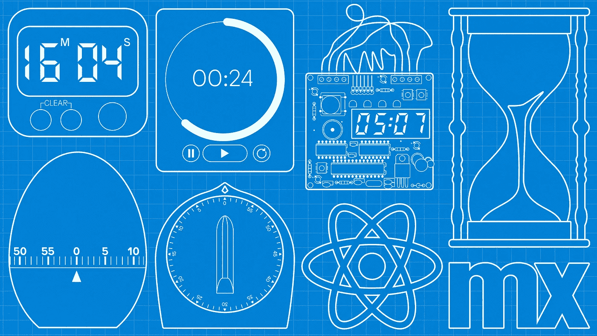
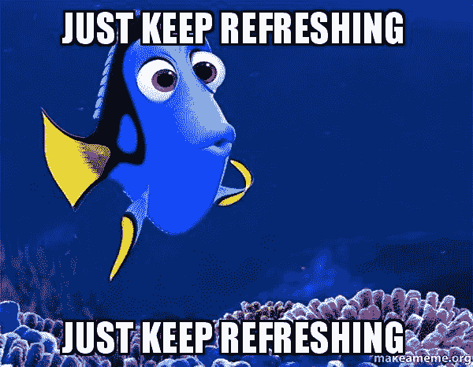
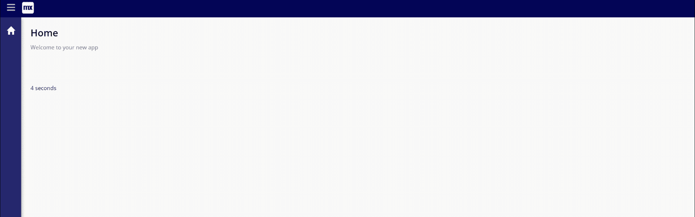
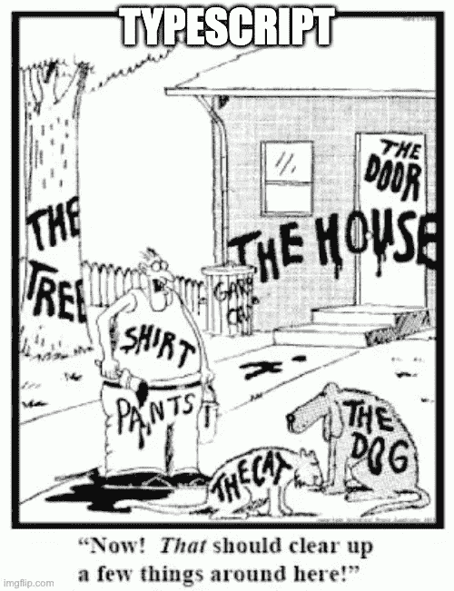
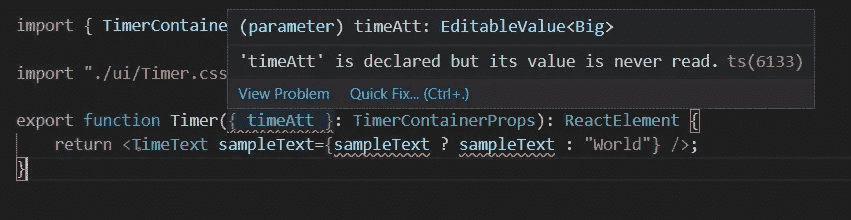
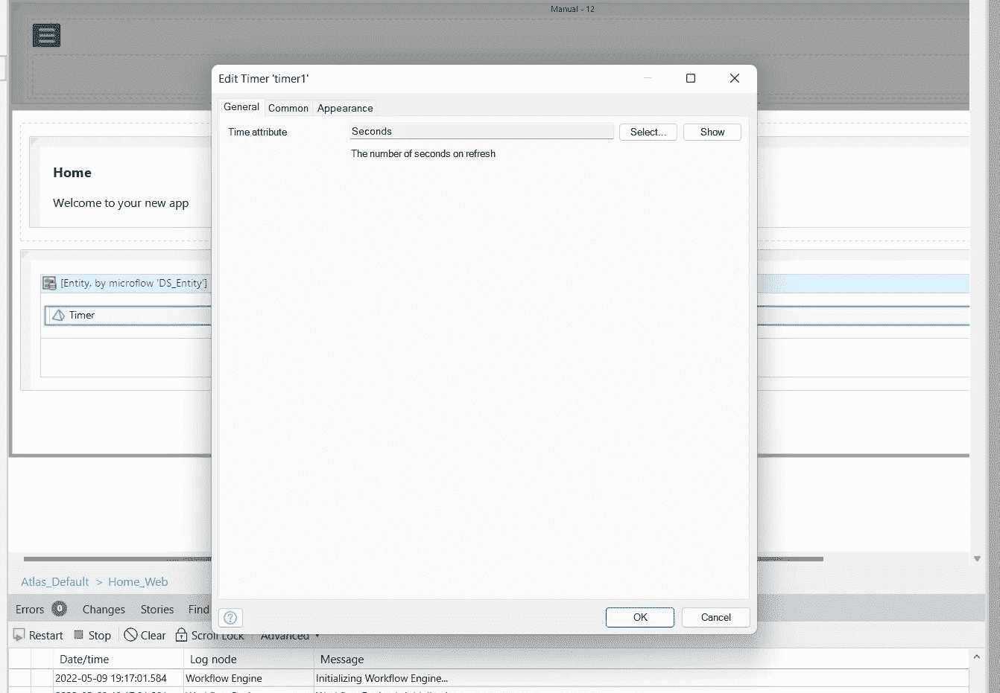
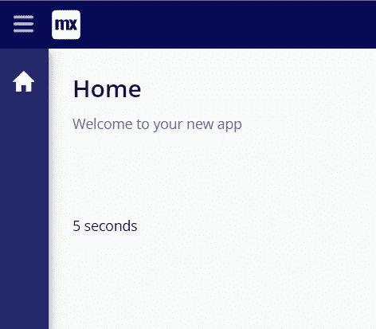
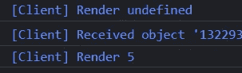
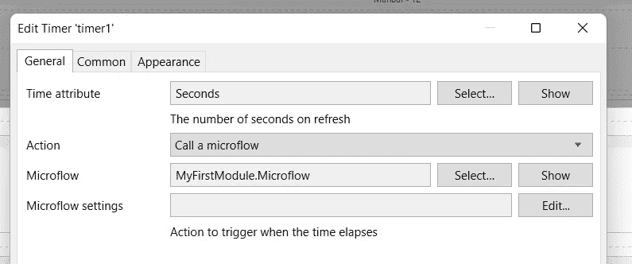

# 使用 React 在 Mendix 中构建小部件第 2 部分—计时器

> 原文：<https://medium.com/mendix/build-widgets-in-mendix-with-react-part-2-timer-b65c720b34e3?source=collection_archive---------1----------------------->



Build Widgets in Mendix with React Part 2 — Timer

# Mendix 平台使开发人员能够通过可插拔小部件框架，使用 React 扩展他们的应用程序。该框架允许开发人员利用强大的库，并通过构建可以在 Mendix Studio Pro 中使用的 React 组件来扩展 UI。

在这篇博客中，我们将**了解 Typescript** ，我将向你展示如何**在你的小部件**中使用来自你的 Mendix 模型的属性，如何**利用浏览器 API** ，我们甚至将触及 React 中的**条件渲染。**

这是一个多部分系列的第二篇博客，博客 1 可以在这里找到:

[](/mendix/build-widgets-in-mendix-with-react-part-1-colour-counter-f1e400c3cdff) [## 使用 React 在 Mendix 中构建小部件—第 1 部分—颜色计数器

### Mendix 是一个低代码平台，让制造商更快地交付价值，轻松地构建应用程序。和门迪克斯一起…

medium.com](/mendix/build-widgets-in-mendix-with-react-part-1-colour-counter-f1e400c3cdff) 

# 何时使用可插拔部件

在决定是否创建一个新的可插拔小部件时，我使用了一些检验标准:

*   它需要 UI 组件吗？—如果您需要使用 Javascript，但是没有 UI 组件，那么一个 [JS 动作](https://docs.mendix.com/howto/extensibility/write-javascript-actions)可能更适合您的用例
*   在 [Mendix 市场](https://marketplace.mendix.com)有吗？
*   它使用浏览器 API 还是 NPM 软件包？

# 我们正在建造的东西

这一次我们将构建一个计时器，用于以固定的时间间隔刷新页面。"为什么我不用 JavaScript 就能做到呢？"我听到你问了。这是因为我们还将有一个可视化组件，**会告诉您距离下一次刷新还有多长时间**。



这是基于一个真实的用例，其中一个仪表板显示在车间里，需要每 30 秒更新一次。



# 入门指南

对于这个小部件，我们将使用 [**Typescript**](https://www.typescriptlang.org/) ，Javascript 的强类型包装器，虽然它最初会使代码编写起来稍微困难一些，但是**内置的林挺**和**丰富的文档**在创建可插拔小部件时非常有用。Typescript 的这些元素也使得在大型团队中协作更加容易，并且与复杂的 API 集成更加容易。



我们从搭建我们的小部件开始，就像在 [Blog 1](/mendix/build-widgets-in-mendix-with-react-part-1-colour-counter-f1e400c3cdff) 中一样，但是这次选择 Typescript 作为我们的编程语言。

> **React**中功能组件与类组件的快速说明
> 
> **在这些博客中，我们将使用功能组件**，然而，你也可能会遇到**使用类组件**编写的 React。这是因为，**直到** [**释放钩子**](https://reactjs.org/docs/hooks-intro.html) **在 React 16.8** ，**类组件是管理状态**的唯一方式，功能组件主要是前端的表示层。现在，React 社区正朝着使用功能组件的方向发展，因为它们在语法上更加简单，更加轻量级(T21)。

[](/geekculture/is-there-any-reason-to-still-use-react-class-components-9b6a1e6aa9ef) [## 还有理由继续使用 React 类组件吗？

### 用 React 钩子看函数组件和类组件

medium.com](/geekculture/is-there-any-reason-to-still-use-react-class-components-9b6a1e6aa9ef) 

# 开发时间

*关于插件文件夹结构以及如何设置开发环境的解释，请参见我的* [*上一篇博客*](/mendix/build-widgets-in-mendix-with-react-part-1-colour-counter-f1e400c3cdff) *。*

**先说一件事**

为了加快开发过程，我们将删除我们的编辑器预览文件。这个文件在 Studio Pro 或 Studio 的设计模式下为我们的小部件创建预览，我们在本指南中并不担心这个问题。这只是又一个需要更新的东西。因此，让我们继续删除文件:**timer . editor preview . tsx .**

## **简述**

我们可以将我们的小部件想要实现的目标分成 3 个主要部分:

*   **步骤 1:** 将定时器设置为 Mendix 中定义的初始值
*   **步骤 2:** 以 1 秒为间隔减少计时器
*   **第三步:**执行一个动作

# **第一步**

## **将定时器设置为 Mendix** 中定义的初始值

让我们从创建 Mendix 模型和小部件之间的接口开始。我们可以使用一个简单的整数，但是通过使用一个属性，我们可以更灵活地在运行时动态改变定时器值。

我们更新 Timer.xml 以包含:

```
<property key="timeAtt" type="attribute" required="true
    <caption>Time attribute</caption>
    <description>The number of seconds on refresh</description>
    <attributeTypes>
         <attributeType name="Integer"/>
    </attributeTypes>
</property>
```

同时，我们还应该将子组件重命名为 TimeText，将接口重命名为 TimeTextProps。当我们保存文件并运行命令:`npm run build`时，我们会看到错误，这很好！


它显示 sampleText 属性已被 timeAtt 替换。让我们用 timeAtt 代替默认的 sampleText 来更新我们的计时器文件。

如果我们在 Timer.tsx 文件中突出显示 timeAtt，我们可以看到它的类型是`EditableValue<Big>`。



[EditableValue](https://docs.mendix.com/apidocs-mxsdk/apidocs/pluggable-widgets-client-apis/#editable-value) 是 Mendix 用来表示所有属性的[泛型类型](https://www.typescriptlang.org/docs/handbook/2/generics.html)，它允许我们在 Mendix 模型中读写值。

**<>**部分，由属性类型决定。对于整数或小数属性，我们使用 Big.js 库。这是为了确保应用程序中使用的数字不受默认 JavaScript 数字限制的约束。

## **使用状态**

到目前为止，我们已经通过容器组件的道具在 Mendix 和小部件之间创建了一个链接。现在我们需要将一个易读的值传递给 TimeText 组件，以显示在页面上。为此，我们将处理我们的`EditableValue<Big>`，并在容器组件的**状态**中存储一个简单的整数。

我们在这里使用**状态**而不是**道具**，因为我们将随时间改变我们的计时器值，并且 [**道具永远不应该被直接改变**](https://www.freecodecamp.org/news/how-to-update-a-components-prop-in-react-js-oh-yes-it-s-possible-f9d26f1c4c6d) :

让我们从从“React”导入**使用状态**开始，并用下面的代码初始化一个名为**时间**的**状态**:

`const [time, setTime] = useState<number>();`

这给了我们一个状态变量( **time** )和一个 setState 函数来改变该状态(像 props 一样，状态决不能被直接改变，而是可以通过这个函数来改变)。

## **使用使用效果**

接下来，我们需要**将我们的属性值传递给我们的状态**。最简单的方法是将一个值传递给我们的 useState:

`const [time, setTime] = useState<number>(timeAtt.value.toNumber());`

但是因为我们的值可能是空的，所以我们不会这样做。相反，我们将使用 React 的另一个核心概念“useEffect”。

> 那么什么是 useEffect 呢？本质上，它在每次渲染后执行一个函数。我们可以用它来设定我们的时间，就像这样:

```
export function Timer({timeAtt}: TimerContainerProps):ReactElement {
const [time, setTime] = useState<number>(); useEffect(() => {
         if (timeAtt.value) {
             setTime(timeAtt.value.toNumber());
         }
     }, []);

    return <TimeText sampleText={sampleText ? sampleText:"World"}/>;
}
```

然后，我们可以通过更新 props 来接受新的时间状态，从而将它传递给子组件 TimeText:

```
return <TimeText value={time}/>;
```

这就是我们更新的计时器组件！

现在我们只需要对我们的 TimeText 组件做一些小的改动，让**接受新的道具**。因为我们使用的是 Typescript，所以我们的组件有一个**接口**。这定义了使用该组件的任何代码如何与之交互。因此，让我们将显示组件更新为:

```
export interface TimeTextProps {
    value: number | undefined;
}export function TimeText({ value }: TimeTextProps): ReactElement {
    return <div>{value} seconds</div>;
}
```

> *接口在这里似乎是不必要的，对于像这样的小部件来说，它们可能是必要的，但是对于* ***当项目变大时，它们是非常有用的*** *。*

为了测试，我们可以打开 Mendix Studio Pro 并按下 F4 来同步更新或小部件。然后，我们需要设置页面，以便可以将数字属性传递给计时器小部件。



我们**点击运行**并…我们的页面上只写着“秒”。


不要担心**由于 Mendix 加载属性的方式**，这是意料之中的。**属性值是异步加载的**，这使得 Mendix 前端如此之快，但这意味着我们需要额外的几行代码来让我们的小部件工作。

## **使用 useEffect，但正确地**

我们让 useEffect 的第二个参数为空，**这意味着 useEffect 函数在组件第一次挂载**时运行一次，此时**我们的属性值还没有准备好**。

*如果您想检查这一点，请在 If 语句上方放置一个* `*console.log(`Render ${timeAtt.value}`)*` *并检查浏览器控制台(从浏览器中选择“Ctrl + Shift + i”)。*

因此，我们希望 useEffect 函数在 timeAtt 更新时运行，为此，我们只需将 timeAtt 添加到 useEffect 的第二个参数中。

```
export function Timer({timeAtt}: TimerContainerProps):ReactElement {
const [time, setTime] = useState<number>();useEffect(() => {
         if (timeAtt.value) {
             setTime(timeAtt.value.toNumber());
         }
     }, [timeAtt]);

    return <TimeText value={time}/>;
}
```

如果您从 Mendix 重新运行应用程序，您将看到您的计时器值出现，如果您检查控制台日志，您将看到小部件呈现两次，一次是值未定义时，一次是数字。



成功！第 1 部分完成了！

# **第二步**

## **以 1 秒为间隔减少计时器**

酷毙了。所以我们在屏幕上显示了一个数字，但这并没有多大用处，**我们希望我们的计时器倒计时**。为此，我们将**使用浏览器 Javascript API，**特别是`[window.setTimeout()](https://developer.mozilla.org/en-US/docs/Web/API/setTimeout)`，它会在固定时间后**执行一项功能**。

通过结合我们的老朋友 useEffect，我们可以创建一个倒计时。如果我们让我们的 useEffect 函数依赖于我们的时间状态，并等待 1 秒钟来将我们的**时间**状态改变 1 秒钟，我们实际上创建了一个循环。

```
export function Timer({timeAtt}: TimerContainerProps):ReactElement {
const [time, setTime] = useState<number>();useEffect(() => {
         if (timeAtt.value) {
             setTime(timeAtt.value.toNumber());
         }
     }, [timeAtt]);useEffect(() => {
        if (time !== undefined) {
             window.setTimeout(() => setTime(time - 1), 1000);
        }
    }, [time]);

    return <TimeText value={time}/>;
}
```

但是这个计数会一直持续下去，所以我们需要再添加一个条件让它停止。

```
useEffect(() => {
        if (time !== undefined) {
            if (time > 0) {
                window.setTimeout(() => setTime(time - 1), 1000);
            }
        }
    }, [time]);
```

如果我们重新加载我们的小部件，我们可以看到我们有倒计时。


> *提醒您，如果您正在使用* `*npm run start*` *并观察您的小部件* ***上的变化，您需要清除缓存并刷新*** *(在 Chrome 打开浏览器工具并右击刷新按钮)*

# **第三步**

## **执行一个动作**

我们现在需要在倒计时到 0 的时候发生点什么！


幸运的是，Mendix 提供了一个非常易用的 API 来与模型集成并执行一个动作。首先，我们更新 Timer.xml 以包含:

```
<property key="action" type="action" required="true">
 <caption>Action</caption>
      <description>Action to trigger when the time elapses</description>
</property>
```

然后，我们可以添加一个函数来执行 Timer.tsx 上的操作，并更新 useEffect 函数来执行 0 处的操作。

我们最终的 Timer.tsx 应该是这样的:

```
export function Timer({ timeAtt, action }: TimerContainerProps): ReactElement {
    const [time, setTime] = useState<number>();useEffect(() => {
        if (time !== undefined) {
            if (time > 0) {
                window.setTimeout(() => setTime(time - 1), 1000);
            } else {
                execAction();
            }
        }
    }, [time]);useEffect(() => {
        if (timeAtt.value) {
            setTime(timeAtt.value.toNumber());
        }
    }, [timeAtt]);const execAction = () => {
        if (action && action.canExecute) {
            action.execute();
        }
    };return <TimeText value={time} />;
}
```

我们可以在我们的 Mendix 应用程序中测试这个新代码，方法是按下 F4 并选择要执行的操作。



通过选择调用刷新页面的微流，我们得到了重复计时器。


## **最后一件事**

当我们的组件首次加载时，有一小段时间传递给 TimeText 组件的时间值是未定义的。这不是一个大问题，因为它只是导致小部件呈现“秒”,但是给出一些值正在加载的指示是最佳实践。

为此，我们将在 React 中使用一个通用模式进行条件呈现。

我们可以使用 if 语句来检查值是否尚未定义，并像这样显示 loading:

```
export function TimeText({ value }: TimeTextProps): ReactElement {
 if (value === undefined) {
  return <div>Loading</div>;
 } else {
  return <div>{value}</div>;
 }
}
```

但是这个很啰嗦。**我们可以用** [**的三元运算符从 ES6**](https://developer.mozilla.org/en-US/docs/Web/JavaScript/Reference/Operators/Conditional_Operator) 中将其简化为:

```
export function TimeText({ value }: TimeTextProps): ReactElement {
    return value ? <div>{value} seconds</div> : <div>Loading</div>;}
```

瞧啊。


# **总结**

恭喜，您构建了一个可插拔的小部件！

在这个版本中，我们介绍了可插拔小部件 API，如何从 Mendix 模型中获取数据并更改它；讲述了如何使用 Typescript 来更好地理解如何与我们的 Mendix 应用程序集成，重温了关键的 React 概念，并学习了如何在小部件中执行来自 Mendix 模型的操作。

此小部件的最终状态可在此处找到:

[](https://github.com/joe-robertson-mx/timer) [## GitHub -乔-罗伯逊-MX/定时器

### 我的 widget 描述][功能亮点][逐步说明][沙盒链接 GitHub 问题链接]…

github.com](https://github.com/joe-robertson-mx/timer) 

接下来，我们将使用 Mendix 和可插拔小部件构建看板，以了解如何组合小部件来创建流畅的最终用户体验，以及如何在您的 Mendix 数据库中进行持久的更改。

如果你有任何自己开发的很酷的小部件想要分享，你在开发中遇到的挑战，或者你想在这个系列中看到的东西，请**在**下面留言！

## 阅读更多

 [## 可插拔小部件 API

### 理解插件的指南。

docs.mendix.com](https://docs.mendix.com/apidocs-mxsdk/apidocs/pluggable-widgets/)  [## 可插拔小部件 API

### 理解插件的指南。

docs.mendix.com](https://docs.mendix.com/apidocs-mxsdk/apidocs/pluggable-widgets/#widget-definition)  [## 可插入小部件属性类型

### 理解可插拔部件属性类型的指南。

docs.mendix.com](https://docs.mendix.com/apidocs-mxsdk/apidocs/pluggable-widgets-property-types/)  [## 可插拔小部件可用的客户端 API

### 理解可插拔小部件可用的客户端 API 的指南。

docs.mendix.com](https://docs.mendix.com/apidocs-mxsdk/apidocs/pluggable-widgets-client-apis/) 

*来自发布者-*

*如果你喜欢这篇文章，你可以在我们的* [*中页*](https://medium.com/mendix) *找到更多喜欢的。对于精彩的视频和直播会话，您可以前往*[*MxLive*](https://www.mendix.com/live/)*或我们的社区*[*Youtube PAG*](https://www.youtube.com/c/MendixCommunity/community)*e .*

*希望入门的创客，可以注册一个* [*免费账号*](https://signup.mendix.com/link/signup/?source=direct) *，通过我们的* [*学苑*](https://academy.mendix.com/link/home) *获得即时学习。*

有兴趣加入我们的社区吗？加入我们的 [*松弛社区频道*](https://join.slack.com/t/mendixcommunity/shared_invite/zt-hwhwkcxu-~59ywyjqHlUHXmrw5heqpQ) *。*