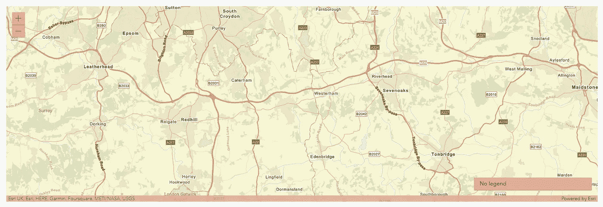
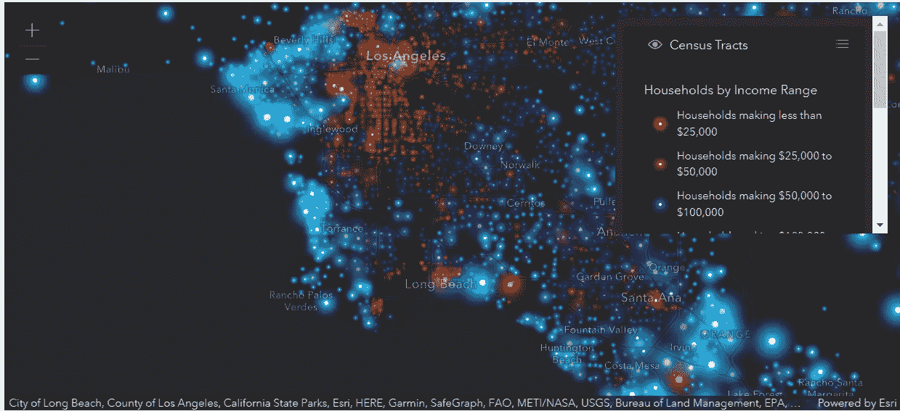
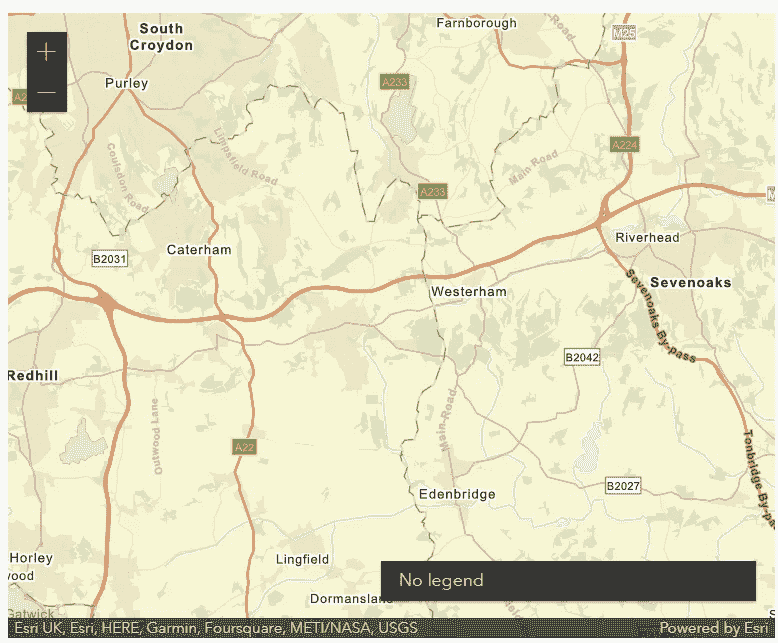
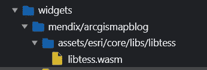

# 使用 React 在 Mendix 中构建微件第 4 部分 ArcGIS 地图

> 原文：<https://medium.com/mendix/build-widgets-in-mendix-with-react-part-4-arcgis-maps-1eb44777f0c3?source=collection_archive---------5----------------------->

## 在这篇博客中，我们将使用 ArcGIS Javascript API 在我们的微件中构建一些地图，并在此过程中学习一些历史知识。


Build widgets in Mendix with React Part 4 — ArcGIS Maps

## Mendix 是排名第一的低代码平台，它的主要优势之一是它提供的可扩展性。您可以使用 React 合并很酷的第三方库并扩展您的应用程序。

这是一个多部分系列的第 4 篇博客，之前的博客可以在这里找到:

[](/mendix/build-widgets-in-mendix-with-react-part-1-colour-counter-f1e400c3cdff) [## 使用 React 在 Mendix 中构建小部件—第 1 部分—颜色计数器

### Mendix 是一个低代码平台，让制造商更快地交付价值并轻松构建应用程序。和门迪克斯一起…

medium.com](/mendix/build-widgets-in-mendix-with-react-part-1-colour-counter-f1e400c3cdff) [](/mendix/build-widgets-in-mendix-with-react-part-2-timer-b65c720b34e3) [## 使用 React 在 Mendix 中构建小部件第 2 部分—计时器

### Mendix 使制造商能够通过可插拔小部件框架使用 React 扩展他们的应用程序。

medium.com](/mendix/build-widgets-in-mendix-with-react-part-2-timer-b65c720b34e3) [](/mendix/build-widgets-in-mendix-with-react-part-3-kanban-2598aa71444d) [## 使用 React 第 3 部分——看板在 Mendix 中构建部件

### Mendix 是排名第一的低代码平台，它使开发者开发应用程序的速度大大快于…

medium.com](/mendix/build-widgets-in-mendix-with-react-part-3-kanban-2598aa71444d) 

## 我们在建造什么

最近， [Ivo Sturm](https://medium.com/u/b43844a7f8d5?source=post_page-----1eb44777f0c3--------------------------------) 写了一篇关于从 Dojo 转换一个现有的 ArcGIS widget 到 React 的博客。

我认为**从头开始构建一个简单版本的 ArcGIS 地图小工具**会很有趣。



## 开始

正如到目前为止所有的可插拔部件博客一样，我们从运行`yo @mendix/widget arcGISMap`和[建立一个测试 Mendix 项目](/mendix/build-widgets-in-mendix-with-react-part-1-colour-counter-f1e400c3cdff)来开始**搭建我们的部件**。

让我们从安装 ArcGIS Javascript API 的 npm 包开始

```
npm install @arcgis/core 
```

ArcGIS 是一个在线地理信息系统，允许您显示地图和添加图层来显示各种信息。



为了访问完整的服务[,您需要注册并创建一个访问令牌](https://developers.arcgis.com/documentation/mapping-apis-and-services/get-started/),但是对于我们的简单示例，我们可以继续进行。

## 入门指南

查看[文档](https://developers.arcgis.com/javascript/latest/display-a-map/#create-a-map-view)我们可以更新我们的代码，得到两个文件:

**一个家长**

```
import { ReactElement, createElement } from "react";
import { MapComponent } from "./components/Map";
import { ArcGISMapBlogContainerProps } from "../typings/ArcGISMapBlogProps";
import "./ui/ArcGISMapBlog.css";export function ArcGISMapBlog(props: ArcGISMapBlogContainerProps): ReactElement {
    return <MapComponent basemap={props.basemap} />;
}
```

**还有一个孩子**

```
import { ReactElement, createElement, useEffect, useRef } from "react";
import Map from "[@arcgis/core](http://twitter.com/arcgis/core)/Map";
import MapView from "[@arcgis/core](http://twitter.com/arcgis/core)/views/MapView";
import Legend from "[@arcgis/core](http://twitter.com/arcgis/core)/widgets/Legend";export interface MapProps {
    basemap: string;
}export function MapComponent({ basemap }: MapProps): ReactElement {
    const mapDiv = useRef(null);useEffect(() => {
        if (mapDiv.current) {
            MountMap(basemap);
        }
    }, [basemap]);const MountMap = (basemap: string): MapView => {
        const legend = new Legend();
        const map = new Map({ basemap });
        const view = new MapView({
            map,
            center: [0.029, 51.256], // Longitude, latitude
            zoom: 10, // Zoom level
            container: mapDiv.current as unknown as HTMLDivElement 
        }); legend.view = view;
        view.ui.add(legend, "bottom-right");
        return view;
    };return <div id="viewDiv" ref={mapDiv} style={{height: "500px"}}/>;
}
```

让我们**也从 ArcGIS** 导入样式表，这样我们可以让我们的小部件看起来更好，更改您的 UI/{widgetName}。css 至:

```
@import "https://js.arcgis.com/4.24/@arcgis/core/assets/esri/themes/dark/main.css";
```

现在我们用`npm run build`构建我们的小部件……我们得到一个错误:

```
[!] Error: Invalid value for option "output.file" - when building multiple chunks, the "output.dir" option must be used, not "output.file". To inline dynamic imports, set the "inlineDynamicImports" option.
```

那么我们如何解决这个问题呢？为了解释，我们需要后退几步…

## Javascript 简史

> 下一部分是 Javascript 的简史，给出了解决方案的背景，如果您对此不感兴趣，可以跳过并继续这个例子

开始的时候…

Javascript 是由 Brendan Eich 在 1995 年发明的，在开发的最初几年，它主要用于独立的脚本任务。随着 JS 开始在应用程序中被更多地使用，管理代码变得更加困难。JS 通常以更复杂的方式跨多个脚本使用，这不可避免地会导致函数和名称冲突。

因此，引入了模块概念，这意味着可以在一个封闭的地方编写代码供内部使用，而不用担心在其他地方发生冲突，并且还允许开发人员将大型代码库分解为小的独立部分，从而更容易编写和维护。

第一次尝试解决这个问题是用**立即调用函数表达式(life)**，它本质上只是将每个文件包装在一个函数中，将变量和函数保存在一个文件中，在那个作用域而不是全局作用域。

`(function() {// Your code }) ();`

这种方法仍然有许多问题，包括缺乏依赖性解析和全局名称空间的污染。


随着时间的推移，出现了 3 种独立的(且相互竞争的)模块规格:

*   **CommonJS**——仍然广泛用于服务器端 JS 的节点中，通过它的`require()`和`module.exports`语法很容易识别
*   **AMD** —异步模块定义，早期从 CommonJS 拆分。关键区别在于 AMD 允许互不依赖的模块异步加载(都在名字里！)
*   **UMD** —通用模块定义，支持其他两种模块规范以及“旧式”的“全局”变量定义

这一切都非常复杂…所以有些好消息。自 2015 年和 ES6 发布以来，**模块已经在 Javascript 语言**中得到支持。这给了我们在代码中一直使用的可爱而简单的`import`和`export`语法。


那么为什么要上历史课呢？嗯，当我们写代码时，我们需要能够处理所有这些模块类型，这就是捆绑器的用武之地。

# Bundlers

捆绑器允许你在编译时**编译你的代码**，**处理你的依赖**，**提供一个兼容的连接文件**。常见的解决方案包括 **Webpack** (用于 Mendix 8 小部件)和 **rollup** (用于 Mendix 9 小部件)

这允许您使用现代 ES6 特性(如果您喜欢，甚至可以使用 Typescript)模块化地编写代码，然后生成一个优化的文件(或一组文件)提供给浏览器。

这很好，但是一些浏览器还不支持 ES6，所以他们不能对这些编译好的文件做任何事情。为了修复这个**,我们可以使用一个 Transpiler** ,比如 **Babel** ,以一种可以阅读的格式将它提供给网页。

所以回到我们的部件…

可插拔小部件框架需要您为 Mendix 应用程序开发 React 组件所需的所有工具。这包括:

*   **npm** —轻松安装和管理第三方软件包的软件包管理器
*   **roll up**——一个捆绑器，它允许你模块化地编写你的代码，然后把它捆绑在一个小的包里
*   babel——一个 transpiler，它将 JS 转换成一种可以被旧浏览器(和 Studio Pro)阅读的格式

那么我们的错误是什么意思呢？

```
[!] Error: Invalid value for option "output.file" - when building multiple chunks, the "output.dir" option must be used, not "output.file". To inline dynamic imports, set the "inlineDynamicImports" option.
```

对于每个小部件项目，我们使用@mendix/pluggable-widget-tools 库提供的汇总配置。

> 这可以在以下文件中找到:
> 
> **node _ modules/@ mendix/pluggable-widget-tools/configs . roll up . config . js .**

在这个配置中，我们**告诉我们的小部件将编译好的 JS 放到一个文件中**。同时，我们正在使用的 **ArcGIS npm 库**提供了块中的**动态导入，默认情况下 **rollup 希望将这些块作为单独的文件发布到目录**中。**

要解决这个问题，我们只需要按照错误中所说的去做，然后**设置 inlineDynamicImports 选项**，这将把所有内容都放入一个文件中。我们可以更改可插拔小部件库中的 rollup.config.js 文件，但这是一个非常糟糕的想法，因为它不可维护，并且会创建非常难以阅读和调试的代码。幸运的是 **Mendix 有内置功能来设置我们自己的汇总配置**。

我们需要**在根小部件目录中创建一个名为 r **ollup.config.js** 的文件**。然后，我们添加以下 JS 代码来更改小部件的构建方式:

```
export default args => {
    const result = args.configDefaultConfig;
    console.warn ('Custom roll up')
    return result.map((config) => {
                config.output.inlineDynamicImports = true
                console.warn ("Set dynamic imports")
                return config;
    });
};
```

所以我们再次运行`npm run build`，得到一个新的错误:

```
FATAL ERROR: Reached heap limit Allocation failed - JavaScript heap out of memory
```

原来构建过程需要更多的内存。我可以通过运行

```
export NODE_OPTIONS=--max_old_space_size=5120
```

如果我们重建，那么我们的小部件现在编译。

我们的 bundler 可以帮助我们创建单个文件，这样它们就可以很容易地被浏览器读取。

Rollup 还做了一些非常聪明的事情，叫做**树摇动**:这涉及到在你的代码和**中构建一个**依赖树的映像，只包括实际需要的代码**。这在使用大型库时特别有用，可以避免将大量未使用的代码加载到浏览器中。这种树抖动是 Mendix 在 Mendix 8 和 9 之间从 webpack 切换到 rollup 的关键因素之一。**


捆扎机还附带了一大堆其他功能，以插件的形式出现。在这篇博客中，我想做的最后一件事是讨论一个非常常见的用例，即必须修改小部件的汇总配置

# 提供您的小部件需要的文件

ArcGIS 通过**内容交付网络(CDN)** 交付创建地图所需的文件。但是，可能会有**个实例，您希望保留** **并在您的小部件**中管理这些文件，这可能是由于您组织内的防火墙设置。幸运的是，ArcGIS Javascript API 使这成为可能。

首先要做的是更新我们的代码，告诉 API 我们将在本地管理我们的资产。为此，我们只需更新容器组件，使其包含:

```
import esriConfig from "[@arcgis/core](http://twitter.com/arcgis/core)/config.js";export function ArcGISMapBlog(props: ArcGISMapBlogContainerProps): ReactElement {
    esriConfig.assetsPath = "./widgets/mendix/arcgismapblog/assets";
    return <MapComponent basemap={props.basemap} />;
}
```

接下来，我们需要**更新**我们的**汇总**到**从我们的节点模块中获取我们**需要的文件，然后**把它们放到我们的小部件** mpk 中。

要做到这一点，我们可以**使用汇总复制插件**(什么都有插件)，首先，我们需要安装它

```
npm i rollup-plugin-copy —save-dev 
```

我们使用`—save-dev`命令，因为它是一个只有在开发时才需要的依赖项。然后，我们将 rollup.config.js 更新为:

```
import copy from "rollup-plugin-copy";
export default args => {
    const result = args.configDefaultConfig;
    console.warn ('Custom roll up')
    return result.map((config) => {
                config.output.inlineDynamicImports = true
                console.warn ("Set dynamic imports")
                const plugins = config.plugins || []
                config.plugins = [
                    ...plugins,
                    copy({
                        targets: { src:"node_modules/@arcgis/core/assets", dest:"dist/tmp/widgets/mendix/arcgismapblog" }]}),
                ]  
                return config;
    });
};
```

这个**从 ArcGIS npm 包中获取“assets”**文件夹，然后**将其放入我们的 dist/tmp 文件夹**，这是最终压缩以创建我们的 mpk 的内容。然后，当我们运行我们的应用程序时，小部件 mpk 的内容被提供给**。/widgets/{ your organization name }/{ yourWidgetName }**。

为了看到这一点，让我们运行命令来构建我们的小部件

```
npm run build
```

然后我们可以重新运行我们的应用程序。



如果我们打开我们的部署目录，我们可以看到微件提供给资产文件夹，如果我们在 chrome 开发工具中检查我们的页面源，我们可以看到 ArcGIS web assembly 文件提供给浏览器以确保我们的地图工作



我们没有更新我们的 CSS 来使用本地文件。为此，我们只需将文件更新为:

```
@import "../assets/esri/themes/dark/main.css";
```

简单…有点…

如果您使用的是 9 . 13 . 2 或更低版本的**插件工具，并且您使用的是 Windows，那么您的**字体将无法正确导入**。rollup.config.js 中需要以下代码来修复导入:**

```
import postcssUrl from "postcss-url";const cssUrlTransform = asset => {
    const outWidgetDirForwardSlash = outWidgetDir.replace(/\\/g, "/")
    return asset.url.startsWith(`${assetsDirName}/`) ? `${outWidgetDirForwardSlash}/${asset.url}` : asset.url;
}export default args => {
    const result = args.configDefaultConfig;
    console.warn ('Custom roll up')
    return result.map((config) => {
                config.output.inlineDynamicImports = true
                console.warn ("Set dynamic imports")
                const plugins = config.plugins || []
                config.plugins = [
                    ...plugins,
                    postcssUrl (cssUrlTransform)]  
                return config;
    });
};
```

然后运行`npm install postcss-url --save-dev`。您的小部件现在将呈现图标。

我们完了。

ArcGIS API 包含了许多令人惊叹的功能，我鼓励您去探索它。要查看它能做什么的一个很好的例子，请查看 Ivo Sturm 的小部件:

[](https://github.com/ivosturm/ArcGIS-React) [## GitHub - ivosturm/ArcGIS-React:基于 React 的新的改进的 ArcGIS 微件

### 基于 React、Mendix 可插拔微件 API 和最新的 ArcGIS API(4.22/02-2022)1 . 0 . 0 版的新 ArcGIS 微件…

github.com](https://github.com/ivosturm/ArcGIS-React) 

我的 ArcGIS 微件的报告可在以下位置找到:

[](https://github.com/joe-robertson-mx/arcGISMapBlog) [## GitHub -乔-罗伯逊-mx/arcGISMapBlog

### 通过在 GitHub 上创建一个帐户，为 joe-robertson-mx/arcGISMapBlog 开发做出贡献。

github.com](https://github.com/joe-robertson-mx/arcGISMapBlog) 

在我的下一篇文章中，我们将利用我们对 rollup 的理解在我们的 Mendix 应用程序中运行 WebAssembly，到时见！

*来自发布者-*

*如果你喜欢这篇文章，你可以在我们的* [*媒体页面*](https://medium.com/mendix) *找到更多类似的文章。对于精彩的视频和直播会话，您可以前往*[*MxLive*](https://www.mendix.com/live/)*或我们的社区*[*Youtube PAG*](https://www.youtube.com/c/MendixCommunity/community)*e .*

*希望入门的创客，可以注册一个* [*免费账号*](https://signup.mendix.com/link/signup/?source=direct) *，通过我们的* [*学苑*](https://academy.mendix.com/link/home) *获得即时学习。*

*有兴趣加入我们的社区吗？加入我们的* [*松弛社区频道*](https://join.slack.com/t/mendixcommunity/shared_invite/zt-hwhwkcxu-~59ywyjqHlUHXmrw5heqpQ) *。*