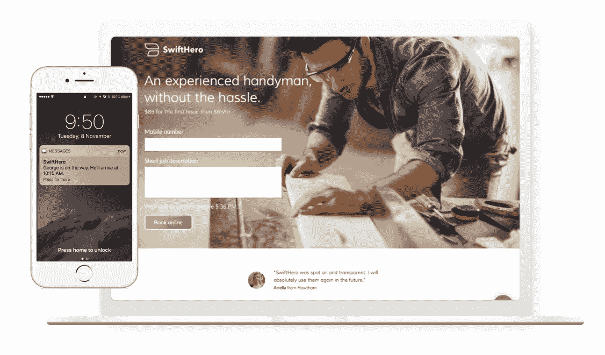
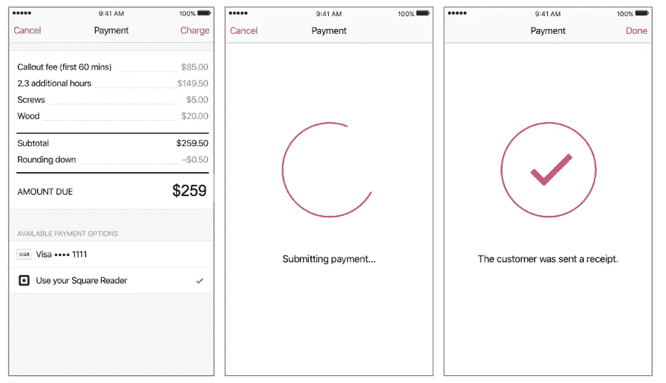
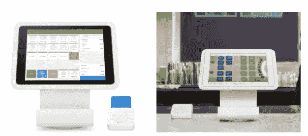

# 建筑广场正在澳大利亚掀起浪潮！

> 原文：<https://medium.com/square-corner-blog/build-with-square-is-creating-waves-in-australia-6a7135c6cf7f?source=collection_archive---------5----------------------->

## 澳大利亚开发者非常喜欢我们的 API，并且开发了各种很酷的应用，现在，我们最大的两个合作伙伴已经准备好接受 Square Down 的支付了。

> 注意，我们已经行动了！如果您想继续了解 Square 的最新技术内容，请访问我们的新家[https://developer.squareup.com/blog](https://developer.squareup.com/blog)

自 2016 年 3 月在美国推出 Build with Square 以来，Square 一直致力于将我们的工具带给更多各种规模的开发者和卖家。我们的 API 集合使开发人员能够为销售人员构建定制的解决方案，使他们能够在一个地方运行他们业务的每个部分。2017 年 1 月，我们向澳大利亚开发者提供了我们的 API，使他们能够只需几行代码就可以与 Square 硬件和支付集成。与 Square 的 API 集成很简单，因此开发人员不必将来自多家供应商的硬件、软件和支付服务拼凑在一起——他们可以在一个地方获得所有这些。

自发布以来，我们的电子商务 API 迅速发展，商家已经在使用我们的电子商务集成在其电子商务网站上处理支付。其他开发商已经接受了我们的平台，并正在使用销售点 API 构建创意应用程序，以帮助他们的客户无论身在何处都能轻松接受支付。

[墨尔本初创公司 SwiftHero](https://swifthero.com.au/) 使用 Square 的销售点 API 来促进无缝计费流程。通过集成 Square 新发布的 API，零售商现在可以直接在 SwiftHero Pro 应用程序中接受卡支付。

SwiftHero helps connect tradespeople to consumers and streamline the payment process using Square’s Point of Sale API

在一个现金仍然为王的行业，SwiftHero 的目标是让小企业跟上技术的发展。Square 的支付 API 让该公司解决了行业面临的另一个主要问题，并为商人提供了在快速发展的经济中生存的工具。

Payment flow within the SwiftHero app

" Square 为小企业打开了一个全新的世界."SwiftHero 的联合创始人迈克尔福斯特说。“有了 SwiftHero 和 Square，商人可以从口袋里操作他们的整个业务——无纸化和无现金化。”

从今天开始，我们最大的两个合作伙伴将把他们的 Square 集成到他们在澳大利亚的销售点应用程序中。澳大利亚零售商和餐馆业主现在将能够部署一个 [Vend](https://squareup.com/pos/partners/vend) 或 [TouchBistro](https://squareup.com/pos/partners/touchbistro) 销售点，同时利用 Square 的硬件和支付处理服务。

Vend of TouchBistro Point of Sale with Square Stand and contactless + EMV reader

我们很自豪能够让开发者构建工具，帮助商家发展他们的在线和离线业务。无论你想做什么，Square 都能满足你。了解更多关于使用方形构建[的信息。](https://squareup.com/developers)