# 使用 Headless CMS(Strapi)、Node.js 和 Next.js 构建您的应用程序(第 1 部分)

> 原文：<https://medium.com/globant/build-your-app-with-headless-cms-strapi-node-js-and-next-js-part-1-39ac581c832c?source=collection_archive---------0----------------------->

## 探索 Strapi 及其与定制 UI 和后端的集成

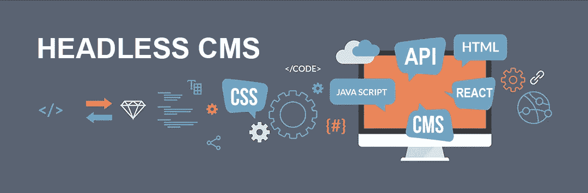

您好，感谢您的入住。

你能想象只用 Javascript 构建一个端到端的应用吗？听起来很棒，对吧？让我们看看 JS 开发人员如何利用他们的技能来实现这一点。为此，我们将使用以下技术:

*   作为后端的无头 CMS 将帮助我们创建和管理内容
*   **Node.js** 作为一个中间件，它将帮助我们根据 UI 需求修改响应
*   **Next.js** 作为我们展示内容的前端。

如果此刻所有这些听起来有点过分，请不要担心。我们将构建一个示例应用程序— **My Events App** 来演示这一切有多简单。我的事件应用程序将是一个简单的 web 应用程序，用于显示一个组织的事件，并提供用户选择的事件的详细信息。

让我们从无头 CMS 开始，多谈谈 CMS 及其类型。

# **内容管理系统**

内容管理系统是一种软件，它帮助用户创建、管理和修改网站上的内容，而不需要专门的技术知识。它提供了一个图形用户界面，带有创建、编辑和发布 web 内容的工具，而无需从头开始编写代码。

虽然内容管理系统有多种类型，但市场上只有两种主要类型可供参考，它们是:

*   像 [WordPress](https://wordpress.com/) 、 [Drupal](https://www.drupal.org/) 等传统的 CMS。和
*   像 [Strapi](https://strapi.io/) 、 [Netlify](https://www.netlify.com/) 、 [Directus](https://directus.io/) 等无头 CMS。

根据您的使用情形、体系结构和长期内容管理目标，每种解决方案都是可行的。

传统上，我们会为每个平台单独开发架构、准备内容和配置界面。被称为 Headless CMS 的新一代 CMS 使得跨多个平台管理内容成为可能。

# **那么，什么是无头 CMS 呢？**

Headless CMS 是一个内容管理系统，内容与其输出分离。Head 是输出，body 是存储和创作内容的地方。无头 CMS 并不意味着我们不需要一个头，但实际上，我们可以有多个头，并在任何时候改变它们，而不需要重新创作内容。

我们只需要在 headless CMS 中上传一次内容，使用 API，我们将能够在网站、社交网络、移动应用程序等多个渠道上发布内容。

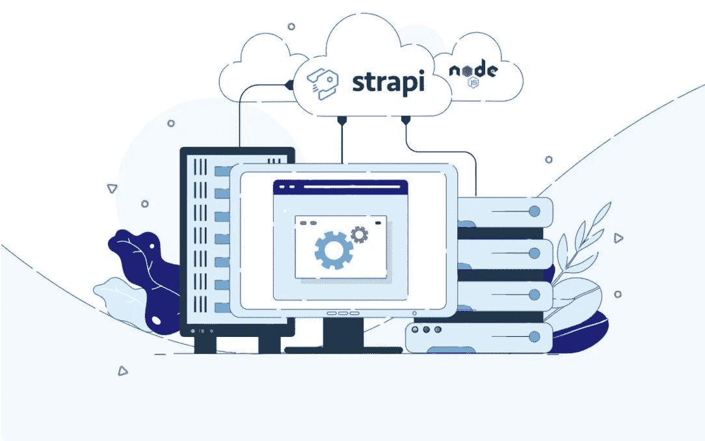

Headless CMS

现在让我们看看传统 CMS 和 Headless CMS 之间的区别:

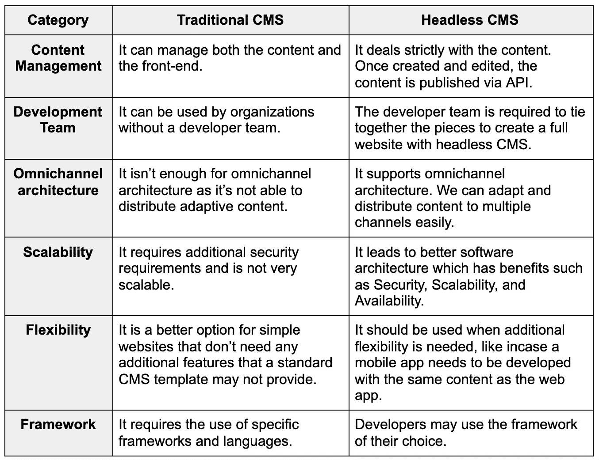

Traditional vs Headless CMS

总的来说，headless CMS 架构对于我们的开发团队来说是一个强大的解决方案，可以向任何类型的平台发布动态和创新的内容。无头 CMS 主要由 API 和后端技术组成，需要存储和交付内容。

开源的无头 CMS 有 [Strapi](https://strapi.io/) 、 [Netlify](https://www.netlify.com/) 、 [Directus](https://directus.io/) 等多种选择。我们将在本文中使用 Strapi。让我们深入研究一下 Strapi 的用途及其设置。

Strapi 用于构建用 javascript 编写的快速且易于管理的 api。它使开发人员能够使用漂亮的用户界面轻松制作灵活的 API 结构。

# 设置 Strapi(无头 CMS)

Strapi 自带项目生成器。通过使用它，我们将创建一个新的目录

```
$ npm create strapi-app events-project-cms — quickstart
```

安装后，服务器将在端口 1337 自动启动。
如果您访问 [http://localhost:1337/](http://localhost:1337/) ，您将能够看到登录信息屏幕。让我们正确地填写它，这将是您的主/管理员登录信息。
创建账户后，您将能够看到主仪表板窗口。

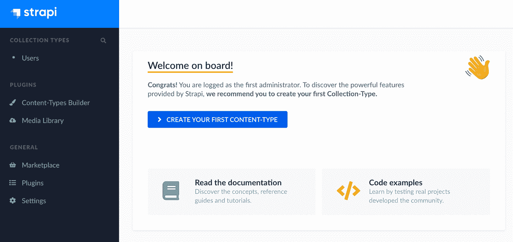

Strapi Dashboard

这是我们数据库的图形界面，我们可以在其中创建表格和添加内容。
接下来，我们将了解如何在 Strapi 中创建集合。

# **创建收藏**

Content-Types Builder 是 Strapi 的核心插件，使用它我们可以创建:

*   可以管理多个条目的集合类型。
*   只能管理一个条目的单一类型。
*   组件，它们是可以在多种集合类型和单一类型中使用的数据结构。

让我们试着创建一个名为 **events** :
的集合。在左侧面板中，您会看到“插件”类别下的“内容类型生成器”。单击它，您将能够看到创建新收藏的选项。

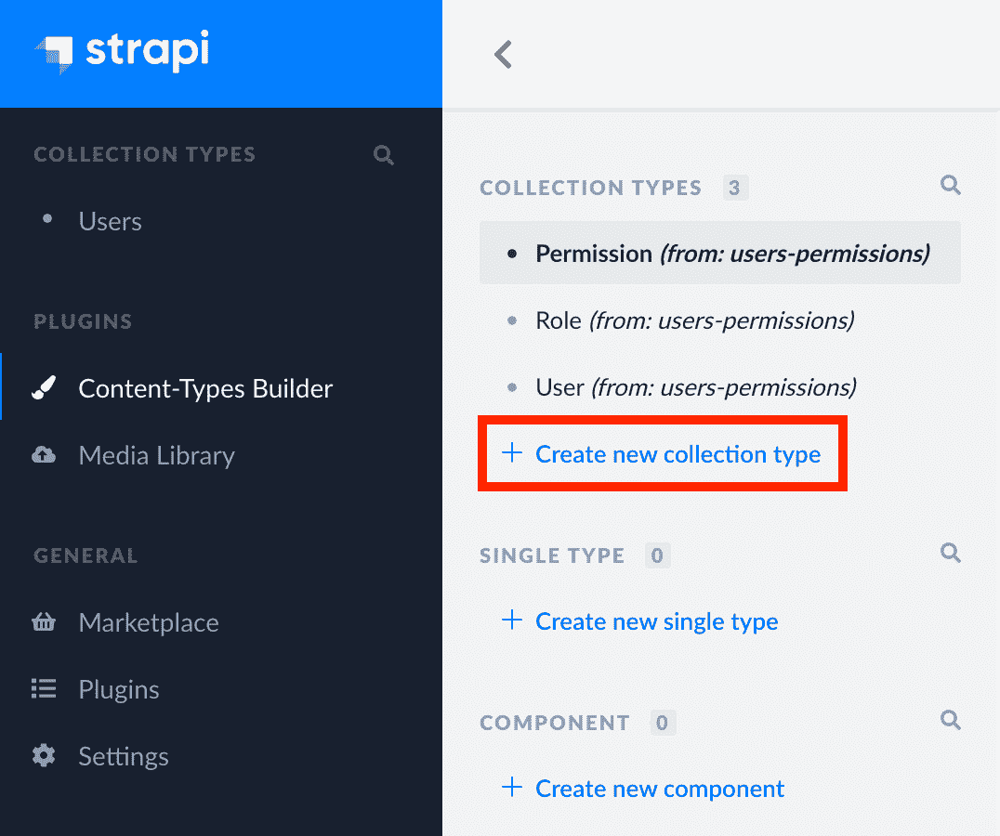

Creating Collection

单击创建新的集合类型，输入集合的名称，然后单击继续。

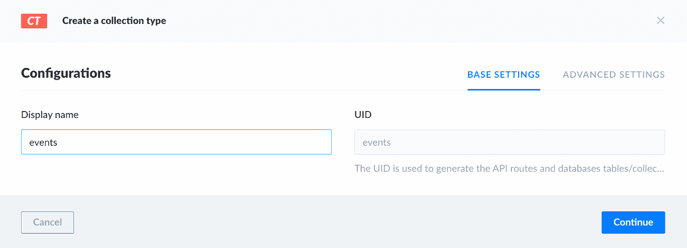

Creating Collection

# **添加字段**

然后，系统会提示您向新创建的集合类型添加字段。
内容类型由一个或几个字段组成。每个字段都被设计为包含特定类型的数据。可以在创建新的内容类型或组件时添加字段，也可以在之后编辑或更新内容类型或组件时添加字段。

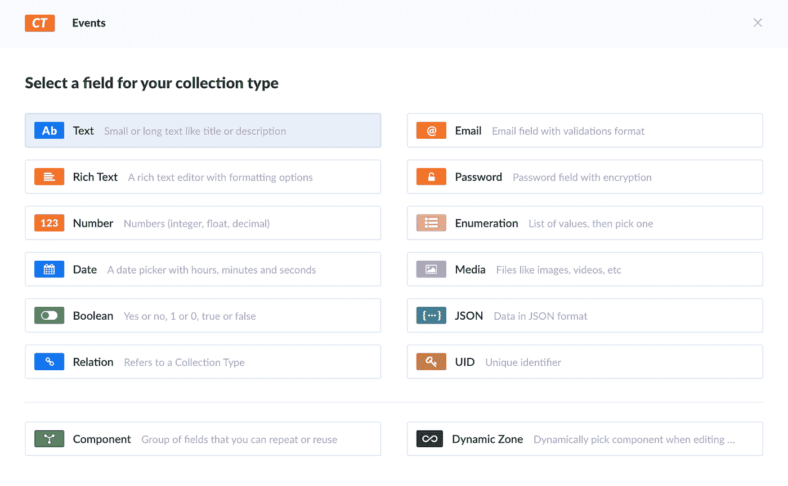

Adding Fields

接下来，让我们尝试添加一些字段:
1) **标题** :-创建一个文本字段:

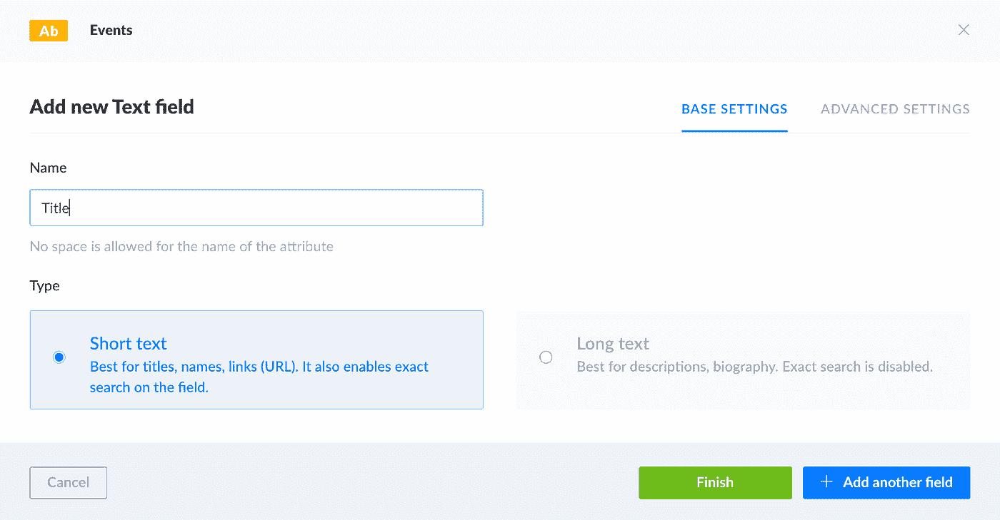

2) **内容** :-创建富文本字段:

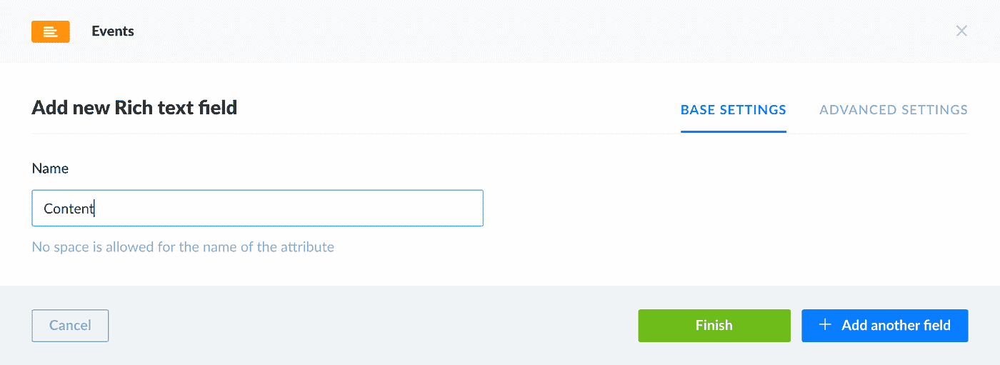

3) **图像** :-创建媒体字段(单个):

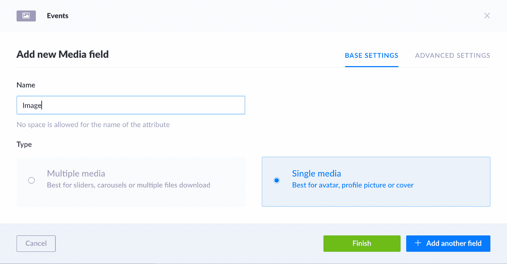

这将为我们提供三个字段，现在我们可以单击保存。
服务器将重启，我们将能够在左侧菜单面板的收藏类型下看到我们新创建的收藏。
我们在集合类型下创建了集合作为事件。最后，我们现在添加一些内容。

# **添加内容**

在左侧面板中，单击“事件”，然后单击“添加新事件”按钮，这将允许您向“事件”集合添加新项目。

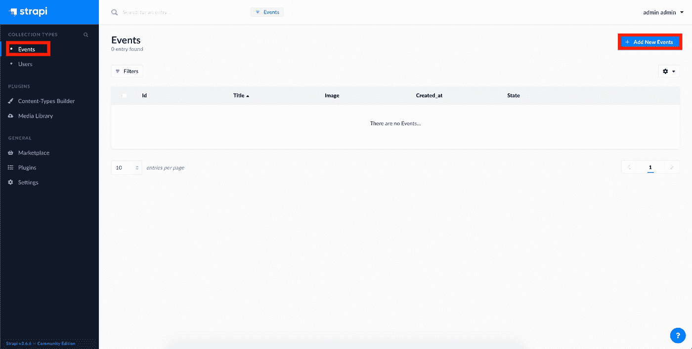

Add Content

我们将能够看到这一页，在这里我们可以添加一些数据。我们来补充一些数据。我们还将通过单击图像字段的右上角来添加图像。我们可以选择在我们的电脑上上传现有的图片或通过网址。这里，我们在本地添加图像。
完成后，我们可以点击**保存**，然后点击**发布**按钮。

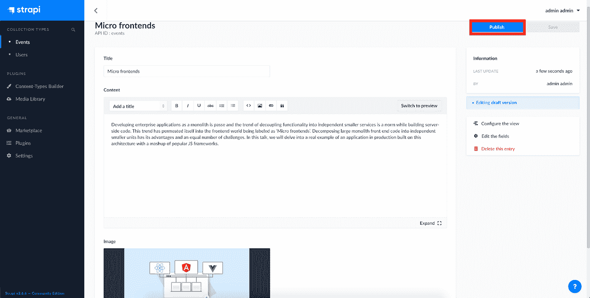

Publish Content

同样，我们可以添加所需条目的数量。我们已经完成了内容的添加。

# **角色和权限**

下一步是添加权限，以便我们可以访问 API。默认情况下，Strapi 是完全封闭的，所以我们必须手动选择应该公开哪种类型的请求。

角色和权限插件提供了一种通过完整的身份验证过程来保护 API 的方法。为此，点击左侧面板中的“设置”选项，然后点击“用户和权限插件”部分下的“角色”。

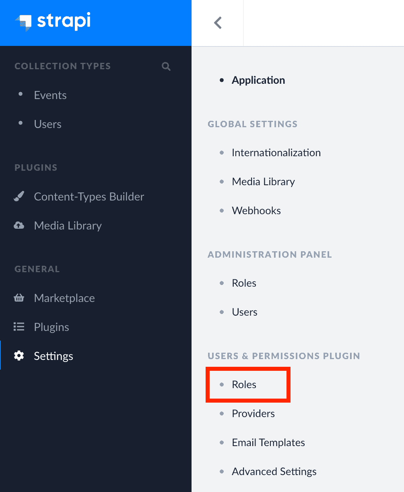

Setting Role

接下来，点击“角色”部分下的“公共”，然后向下滚动到“权限”部分。我们只希望公共 API 对查看所有或单个事件项目开放:

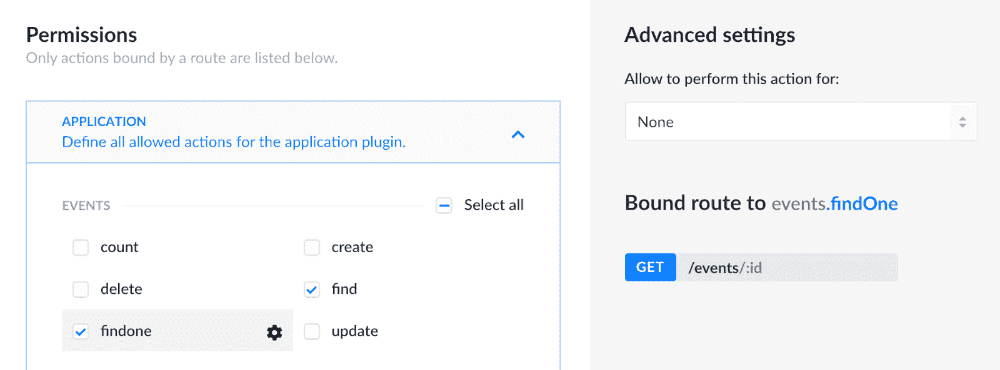

Permissions

添加“find”和“findone”将使路线**/事件**和**/事件/:id** 可用。点击保存。

# 考验的时候到了！！

让我们试试我们刚刚配置的。这里，我们使用 postman 进行 API 测试。当您点击[http://localhost:1337/events](http://localhost:1337/events)时，您将能够看到新创建的 JSON 格式的事件数据，如下所示:

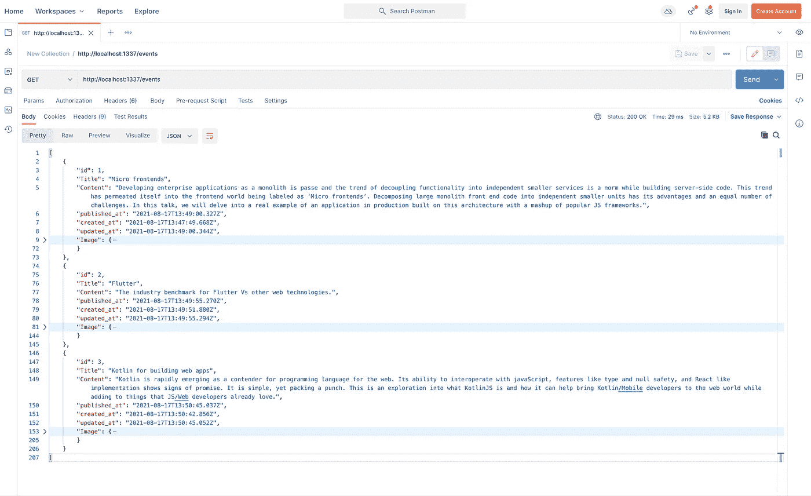

JSON Data

# 最后

考虑图像的高亮部分。如果我们看一下我们的“我的活动”应用程序的架构，这就是我们所取得的进展:

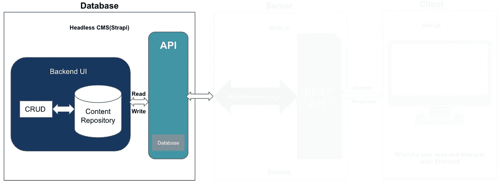

The architecture of My Events App

内容存储库包含我们创建的所有模式，每个模式都公开了自己的 REST 端点，我们可以根据需要在中间层修改/使用这些端点。

现在，如果您想知道为什么该架构缺少某些部分，那么关注本文接下来的部分是值得的。

# 到目前为止我们知道些什么？

无头 CMS 与众不同之处在于它根本不直接与前端连接。内容本身和客户端界面分离的原则允许您加速开发和扩展，同时节省资源。这被称为全渠道就绪。有了这个功能，内容可以在网站、移动应用程序或各种数字设备的界面中以通用格式使用。这扩大了业务机会，允许您灵活地使用不同的解决方案。

# 需要注意什么？

我们将在这里结束**第 1 部分**，为**第 2 部分**做准备，其中我们将介绍使用 Next.js 的前端设置和中间件(Node.js)设置，以确保一切顺利运行。更多内容敬请期待！

# 信用

*   合著者: [Shreyasee Kamble](https://medium.com/u/dc34cf5644c3?source=post_page-----39ac581c832c--------------------------------)
*   [Strapi.io](https://strapi.io/)