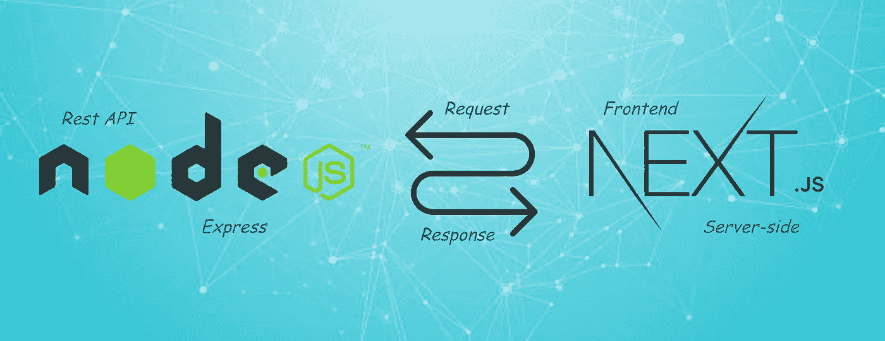
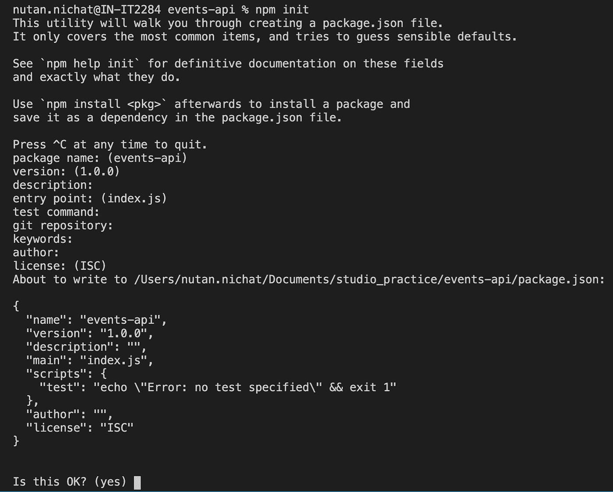
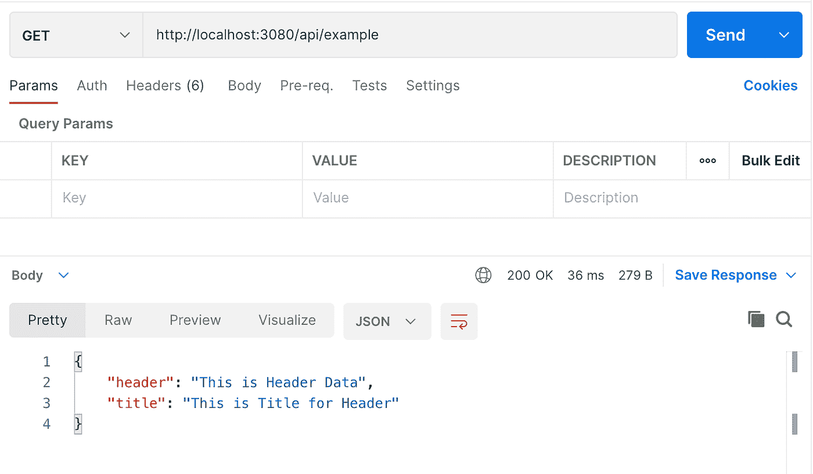
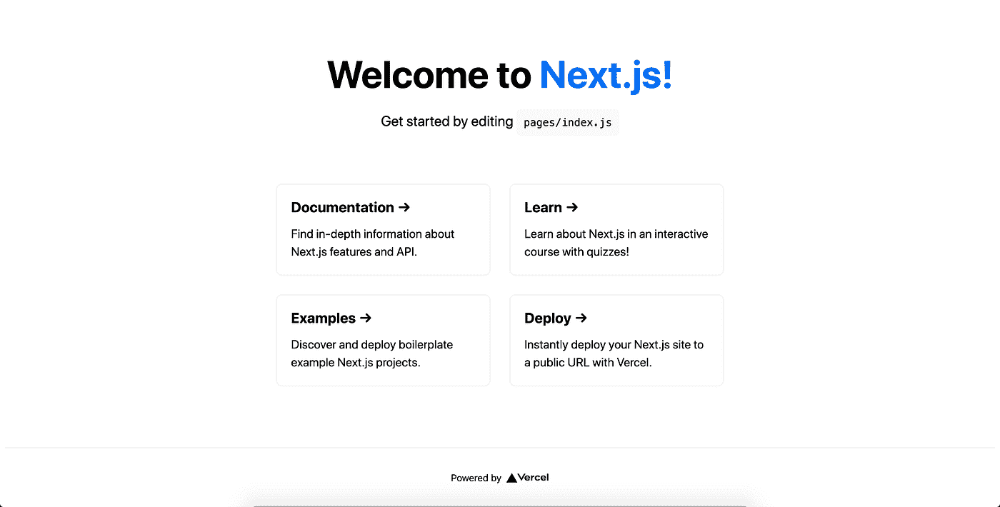
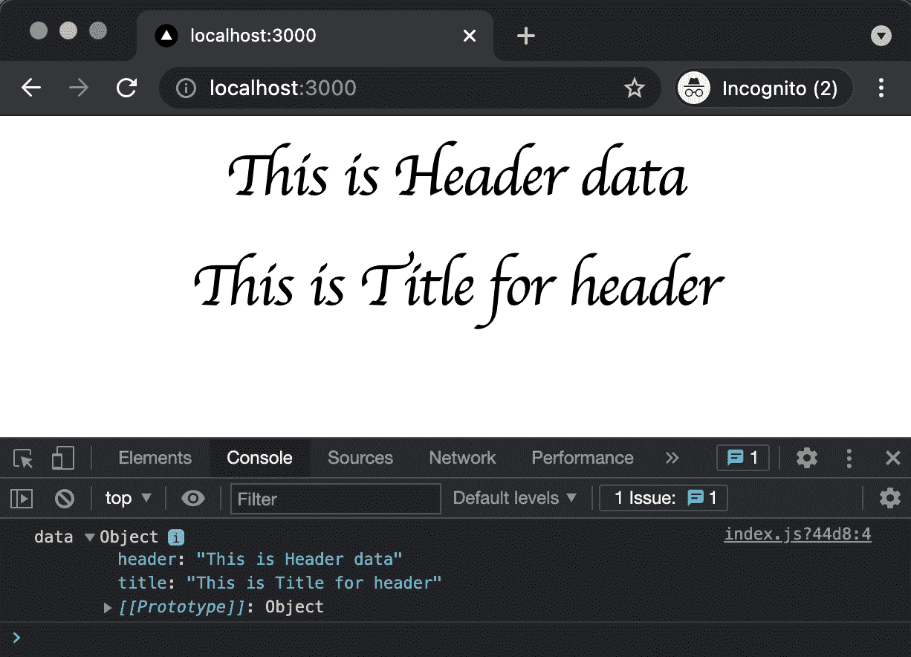
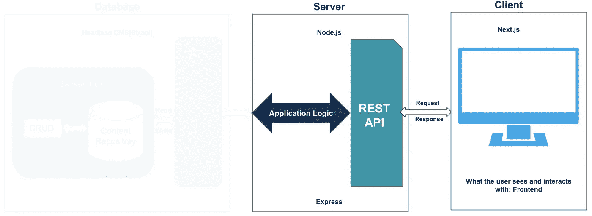

# 使用 Headless CMS (Strapi)、Node.js 和 Next.js 构建您的应用程序(第 2 部分)

> 原文：<https://medium.com/globant/build-your-app-with-headless-cms-strapi-node-js-and-next-js-part-2-74bc952fc7f1?source=collection_archive---------0----------------------->

## 探索 Next.js 以及 Node.js API 与 Next.js 的集成



你好。欢迎回到**用 Headless CMS(Strapi)、Node.js 和 Next.js (Part-2)** 构建你的应用的下一部分。在之前的[文章](/globant/build-your-app-with-headless-cms-strapi-node-js-and-next-js-part-1-39ac581c832c)中，我们已经看到了 JS 开发者如何使用 headless CMS (Strapi)作为后端来创建和管理网站上的数据。让我们转到构建完整应用程序的其他方面，即中间件和前端。
在本文中，我们将介绍:

*   使用 Node.js 设置中间件
*   使用 Next.js 进行前端设置
*   一个小例子演示了如何在 NextJS 中调用 Node.js API

首先，让我们开始使用 Node.js 设置中间件

# **节点设置**

当我们安装 Node.js 时，我们也在机器上安装了 npm 程序。我们需要遵循两个重要步骤:
1)初始化 npm
2)安装我们必须使用的模块

首先，让我们在项目中初始化 npm，这意味着我们需要从根目录运行一个命令。在我们的例子中，根目录将是 events-api。让我们转到这个目录:

```
**$ cd events-api** And then run: **$ npm init**
```

这将创建一个单一的配置文件，我们可以用它来管理所有的依赖关系。这将要求您提供一些信息，以填充此配置文件中的各个字段，对于每个字段，我们将坚持使用默认值。



package.json

完成后，键入 yes 继续，这将创建一个“package.json”文件。
如果需要任何依赖关系，可以使用命令:
**npm i module_name。**
这里我们安装了三个依赖:
1) **Express.js:-** 为特定的 HTTP 请求提供 GET、POST 等方法
**NPM I express** 2)**Axios:-**发送异步 HTTP 请求，执行 CRUD 操作。
**NPM I axios** 3)**node mon:-**仅用于开发观看文件
**npm i nodemon**

现在，我们将开始创建一个 app.js 文件，我们将在其中添加一个端口号，并将定义一些路由，例如 **/api/example** 下面是一个如下所示的 app.js 文件:

```
// App.jsconst express = require("express");
const app = express();
port = 3080;
const data = {
  header: "This is Header data",
  title: "This is Title for header",
};
// @ Routes
app.use("/api/example", (req, res) => {
  console.log("Example API Called!");
  res.json(data);
});
app.use("/", (req, res) => {
  res.status(200).send();
});
app.listen(port, () => {
  console.log(`Server listening on the port::${port}`);
});
```

在这个文件中，我们简单地为 **/api/example** 定义了一个路由，它返回一个带有头和标题的数据对象。

接下来，我们需要使用以下命令启动 Node.js 服务器:

```
**npm run dev**
```

这将在端口 3080 上启动我们的服务器，当我们更改任何文件时，它将自动更新，因为我们使用 nodemon 来监视文件更改。

现在，如果你点击[http://localhost:3080/api/example](http://localhost:3080/api/example)你将能够看到我们在 app.js 中定义的数据对象如下:
这里，我们使用 Postman 进行 API 测试。



API response

让我们使用 Next.js 构建一个网页，然后看看如何在 Next.js 中调用这个 API

# **next . js 是什么？**

如果您还不熟悉，Next.js 是一个流行的 React 框架，用于构建服务器端呈现的 React 应用程序。该框架允许您构建 React 应用程序，无需任何配置即可生成静态站点和服务器端呈现。

Next.js 不仅用于构建应用程序的前端，因为它的“服务器端”方法，它还可以用于构建应用程序的完整后端。它加载了基于文件的路由、样式、认证、包优化等特性。这使我们能够构建成熟的生产就绪型应用程序。

但是，与其长篇大论地解释 Next.js 的好处，不如让我们构建一个示例来演示如何使用它来构建一个静态站点。

# **next . js 入门**

打开终端，创建或导航到您想要创建新项目的目录。在那里，在终端中运行以下命令来创建项目:

```
**$ npx create-next-app my-events-app**
```

在这里，events-project 是我们项目的名称。一旦这个过程完成，我们有我们的项目准备好了。要运行项目，请执行以下命令:

```
**$ cd my-events-app
$ npm run dev**
```

打开浏览器，输入以下 URL 查看我们的项目运行: [http://localhost:3000](http://localhost:3000/)



Next.js homepage

您将看到我们刚刚创建的 Next.js 项目的默认信息页面。Next.js 提供了热重新加载，因此您对项目代码所做的任何更改都会自动应用并反映在浏览器中。

> 在开发阶段，我们将在完全不同的端口上运行 Node.js 和 Next.js 应用程序。这样开发更容易更快。

# **创建布局**

现在我们已经建立了项目，让我们为编码做准备。但首先，我们可以做一点清理。让我们从 index.js 文件中删除内容，并设置一个基本布局:

```
// **pages/index.js**export default function Home() {
  return (
    <div className="main-container container">
      <div className="main-title">UI Engineering</div>
      <div className="event-title">Events</div>
    </div>
  );
}
```

保存更改后，您将能够在浏览器上看到带有 UI 工程和事件标题的主页。现在我们已经运行了 UI 和中间件，让我们看看如何在 Next.js 中访问 Node.js API。

> 不要忘记让您的中间件保持运行。

# **调用 Next.js 中的 API**

现在是时候看看 Next.js UI 了。我不会把所有的文件都放在这里，但是让我们看看一些重要的文件。首先，在根级别创建一个名为“services”的文件夹，并在其中创建一个名为“service.js”的文件。
下面是使用 Axios 调用 Node.js API 的 service.js 文件。

```
// **services/service.js**import axios from "axios";
const fetchResponse = async (path) => {
  const url = `http://localhost:3080/api/${path}`;
  const res = await axios.get(url);
  return res.data;
};
export default fetchResponse;
```

这个文件负责调用 Node.js API 并返回所需的数据。现在让我们看看如何在 index.js 文件中获取这些数据。更新后的 index.js 文件将如下所示:

```
// **pages/index.js**import fetchResponse from "../services/service";export default function Home({ data }) {
  console.log("data", data);
  return (
    <div className="main-container container">
      <div className="main-title">{data.header}</div>
      <div className="event-title">{data.title}</div>
    </div>
  );
}
export async function getStaticProps() {
  const data = await fetchResponse("example");
  return {
    props: { data },
    revalidate: 1,
  };
}
```

在这个文件中，我们试图使用 **getStaticProps()** 方法从后端获取数据，并将其显示在 UI 上。我们将在本系列的下一篇文章中看到这种方法的重要性。

# 考验的时候到了！！

如果一切正常，那么最终结果应该是这样的:



Next.js UI with API response

# 最后

考虑图像的高亮部分。如果我们看一下我们的“我的活动”应用程序的架构，这就是我们所取得的进展:



The architecture of My Events App

我们已经用 Node.js 创建了一个服务器，并使用了 Express.js，它具有路由、渲染和支持 REST APIs 等特性。

现在，如果您想知道为什么该体系结构缺少某些部分，那么关注本文接下来的部分是值得的。

# 到目前为止我们学到了什么？

我们可以有很多方法来构建 Next.js 应用程序，一种方法是用 Node.js 构建 Next.js 应用程序，并提供静态内容。当你想做服务器端渲染或者需要做一些处理的时候，这真的很有帮助。Node.js 是非阻塞 IO，对于普通网站来说也非常好。

# 我们接下来要学什么？

我们将在这里结束**第 2 部分**，为最后一部分做准备，即**第 3 部分**，在这里我们将深入研究代码，并向您展示如何通过 Node.js 集成我们在**第 1 部分**中构建的无头 CMS API，并确保一切顺利运行。回头见！

# 信用

*   合著者: [Charvee Sharma](https://medium.com/u/6a9eb1e4e839?source=post_page-----74bc952fc7f1--------------------------------) 和 [Shreyasee Kamble](https://medium.com/u/dc34cf5644c3?source=post_page-----74bc952fc7f1--------------------------------)
*   [Next.js](https://nextjs.org/)
*   [Express.js](https://expressjs.com/en/guide/writing-middleware.html)

[](/globant/build-your-app-with-headless-cms-strapi-node-js-and-next-js-part-1-39ac581c832c) [## 使用 Headless CMS(Strapi)、Node.js 和 Next.js 构建您的应用程序(第 1 部分)

### 探索 Strapi 及其与定制 UI 和后端的集成

medium.com](/globant/build-your-app-with-headless-cms-strapi-node-js-and-next-js-part-1-39ac581c832c)