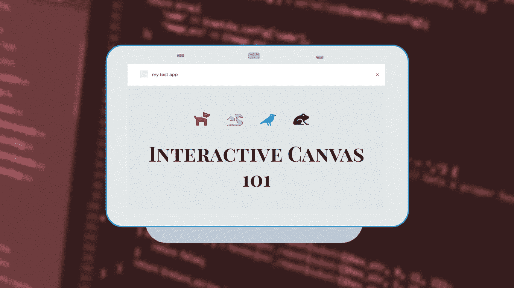
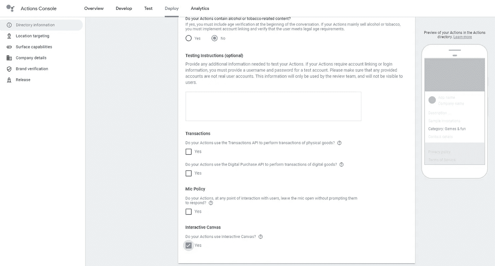
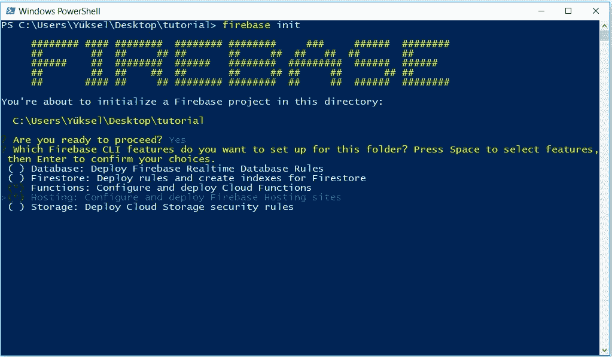
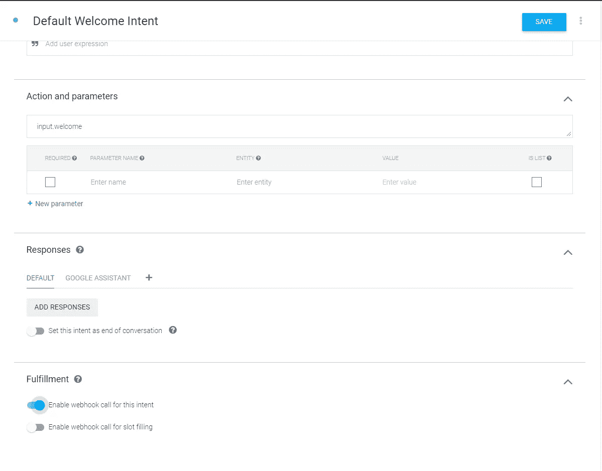
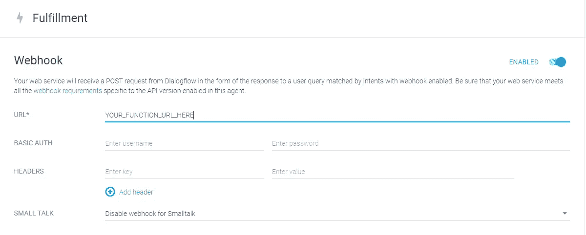
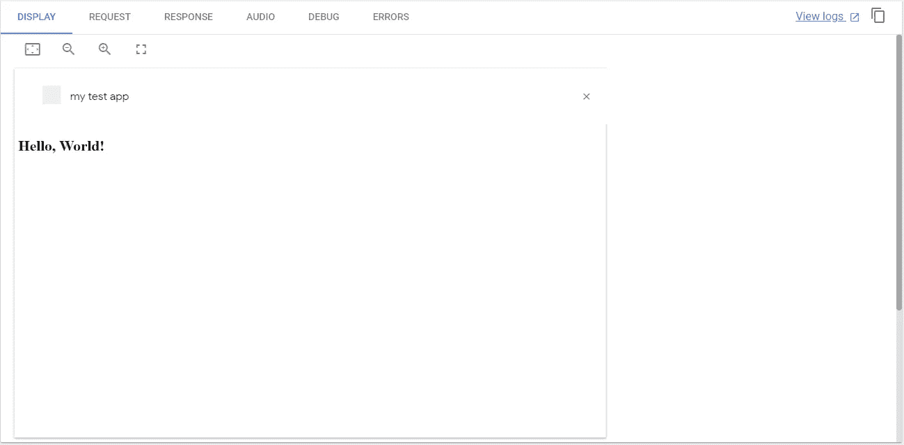
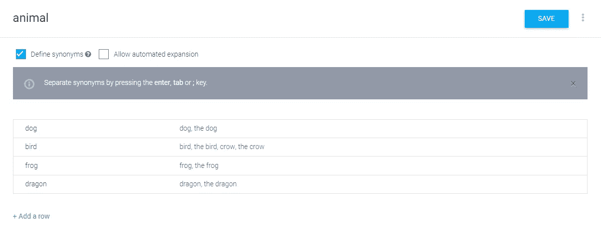
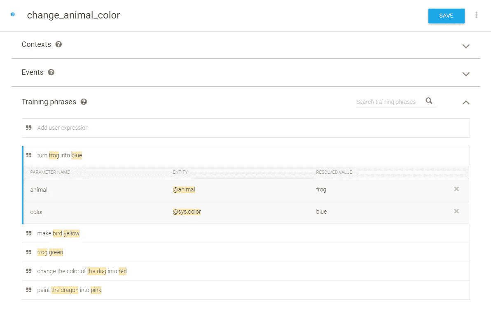
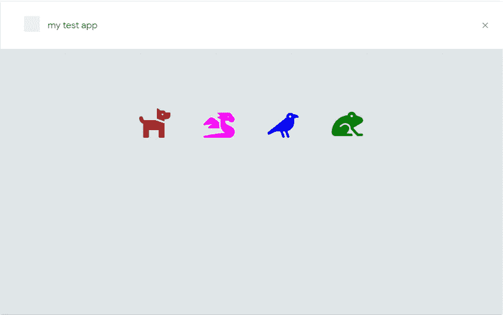

# 使用交互式画布构建您的第一个动作

> 原文：<https://medium.com/google-developer-experts/build-your-first-action-with-interactive-canvas-11edd0698c5e?source=collection_archive---------1----------------------->

如果你曾经为 Google Assistant 开发过一个动作，你可能会认为“这个平台有很大的游戏潜力”，但你会意识到你实际上可以向用户展示的东西非常有限。

进入，互动画布！



# 什么是交互画布？

在 Google I/O’19 上宣布的 Interactive Canvas 是一个框架，允许您的操作提供丰富的视觉效果，可以与语音进行交互。现在，我个人并不认为游戏一定要有图形，我相信纯语音的游戏可以和重图形的游戏一样有趣。但是交互式画布仍然是一个游戏规则改变者，因为它允许你通过利用你已经知道并喜欢的网络技术来建立语音转发体验。它目前支持智能显示器和 Android 移动设备。

如果你想让游戏为谷歌助手做好准备，请继续阅读。因为在这篇文章中，我将试着带你去构建一个使用交互式画布的简单动作的步骤。

## 限制

尽管 Interactive Canvas 支持现代 web 浏览器所支持的大多数 HTML/CSS/JS 特性，但由于隐私和安全原因，它还是有一些限制。例如，您不能使用 cookies 或本地存储。你可以在这里找到限制[的完整列表](https://developers.google.com/actions/interactivecanvas/build/web-app#restrictions)。

# 我们将要建造的东西

我们将构建一个动作，在屏幕上向用户显示各种动物图标，用户可以通过简单地告诉动物的名称和他们希望它变成的颜色来改变每种动物的颜色。

## 它将如何工作？

*   用户将开始动作，我们的*默认欢迎意图*将触发交互式画布，向用户显示带有动物图标的网页
*   用户将挑选一种动物和一种颜色，并说，例如，*“使狗变红”*
*   和往常一样，Assistant 会将用户的话语转换成文本，并发送给 Dialogflow
*   Dialogflow 将用户的意图与 *change_animal_color intent、*进行匹配，并提取实体值为 *animal = dog* 和 *color = red*
*   我们的实现将更新画布的**数据**(状态)。这个更新将由网页通过 *InteractiveCanvas.js* 注册，这将触发一个改变动物颜色的函数。

## 先决条件

> 请注意，即使我们不会在本文结束时制作一个完整的游戏，你仍然需要熟悉谷歌平台和 Firebase 上的基本动作。

*   了解谷歌平台的基本操作
*   熟悉对话流
*   安装在计算机上的 Node.js 和 firebase-tools

如果你缺少一个或多个先决条件，我建议在遵循本教程之前完成谷歌助手(1 级)的代码实验室[构建动作](https://codelabs.developers.google.com/codelabs/actions-1/)和谷歌助手(2 级)的[构建动作](https://codelabs.developers.google.com/codelabs/actions-2/)。

# 构建 Hello World

## 创建项目

1.  首先，在谷歌控制台上进入[动作，创建一个新项目。(别忘了注意新的用户界面有多漂亮😍)](https://console.actions.google.com)
2.  选择游戏和娱乐类别，因为互动画布从今天起只适用于游戏。
3.  在下一步选择*对话*，因为我们将使用 Dialogflow。
4.  在*构建您的操作*部分，选择*添加操作*并点击*添加您的第一个操作*按钮。选择*自定义意图*并点击*构建。*
5.  此时，Dialogflow 应该会打开。如果您还没有登录，请点击右上角的*创建*。
6.  回到谷歌控制台上的操作，从顶部菜单中选择*部署*。
7.  滚动到最底部，选中标签为**交互式画布的框。**向上滚动到顶部，点击*保存*。



瞧啊。您的项目和 Dialogflow 代理已准备好进行开发。

> *如果您在这一步没有选择正确的类别，您可以随时通过位于*部署>目录信息>附加信息下的 dropbox 进行设置

## 设置本地开发环境

在本教程中，我们将使用 Firebase 云功能来实现 webhook 和 Firebase 托管来托管我们的 web 应用程序。如果您从未在计算机上使用过 firebase-tools，首先运行:

```
firebase login
```

如果您已登录，让我们在计算机上创建一个目录，运行以下命令:

```
firebase init
```

当它问你是否准备好了，说是，从列表中选择主机和功能特性，然后按回车键。



将弹出一个新列表，选择您在前面步骤中创建的项目的项目 id。以 as 的身份回答以下问题:

**功能配置:**

*   Java Script 语言
*   没有 ESLint
*   是，安装依赖项。

**托管配置:**

*   使用(public)作为我们的公共目录。(只需按回车键)
*   是，将此应用配置为单页应用。

这就是我们的云功能和托管的本地开发环境，准备部署在 Firebase 上。

## 配置欢迎意图

我们的*默认欢迎意图*需要在助手中打开我们的 web app。这意味着我们必须对它进行配置，以便它由我们的 webhook 来完成。打开 Dialogflow 控制台并:

1.  从列表中选择*默认欢迎意向*，并删除该意向的所有培训短语。(我们不希望我们的用户通过使用这些短语回到这个意图)
2.  继续删除所有的回复。
3.  最后，通过使用页面底部的按钮启用意向的 webhook 调用。点击*保存。*



## 构建基础:Web 应用程序

我们需要首先构建和部署 web 应用程序，因为在构建我们的实现时，我们将使用它的 URL。

打开 index.html 的**公共>文件，用以下代码修改其内容:**

Notice the asset that Google provides us with: interactive_canvas.min.js

*   interactive_canvas.min.js 是一个工具，它将注册我们从 webhook 发送的状态更新。基本上，这个文件使我们的对话代理和我们的 web 应用程序之间的通信成为可能。
*   interactive_canvas.min.js 还有一个获取用户设备的页眉高度的方法。

现在，运行以下命令来部署我们的主机:

```
firebase deploy --only hosting
```

上传完成后，您应该会在终端中看到托管 URL。您可能需要复制该 URL，因为我们将在下一步中使用它。

## 构建基础:实现

我们已经用 firebase-tools 为我们的项目生成了必要的文件，现在我们可以继续编辑它们了。

首先，我们需要为我们的 webhook 实现设置依赖关系。打开**函数> package.json** ，用以下代码修改其内容:

As you can see, we’re depending on the “preview” version of the actions-on-google client library to use Interactive Canvas.

然后在 **functions** 目录下运行以下命令来安装依赖项:

```
npm install
```

安装完成后，打开**函数> index.js** ，用以下代码修改其内容:

⚠️ Don’t forget to replace YOUR_URL_HERE with your web apps URL ⚠️

您需要返回一个新的 **HtmlResponse** 对象来使用交互式画布。您需要写下您的 web 应用程序的 URL，这是您在上一步中复制的，它显示为 YOUR_URL_HERE。

更新 URL 后，运行以下命令来部署您的云功能:

```
firebase deploy --only functions
```

现在，在您的终端中，您应该会看到函数 URL。复制并转到 Dialogflow 控制台。在左侧栏中，点击*履行*，启用 Webhook 并粘贴您的功能 URL。



## 测试您的行动

转到 Google 控制台上的操作，点击顶部菜单上的*测试*打开模拟器。当你说*“跟我的测试 app 说话”*你应该看到**你好，世界！**显示器上写着，还听到“你好，世界”。



How exciting 👀

在助手中看到我们的自定义网页很酷，但我们仍然无法用语音与之交互。让我们继续下一部分，看看我们如何做到这一点。

# 更进一步

让我们把动物图标放在屏幕上，让用户用他们的声音改变它们的颜色。

## 扩展 Dialogflow 代理

在完成的项目中，我们将有 4 只动物改变颜色。这意味着我们需要在对话流中处理两个实体:动物和颜色。幸运的是，Dialogflow 有一个颜色的系统实体，所以我们不必定义它。但是我们确实需要为动物创建一个新的实体来展示给用户。打开 Dialogflow 控制台，点击左侧边栏上的*实体*。**创建一个名为 animal 的新实体:**



I added crow as a synonym for the bird because the icon we’ll be using is technically a crow 🐦

完成后，保存它。

我们也需要一个改变动物颜色的新意图。让我们继续创建它。从左侧栏选择*意图*，然后**创建一个名为 change_animal_color:** 的新意图



Make sure the entities are extracted properly 🔍

您可以复制以下培训短语:

*   把青蛙变成蓝色
*   把鸟变成黄色
*   青蛙绿
*   把狗的颜色变成红色
*   把龙涂成粉红色

向下滚动到页面底部，*启用履行*并打开**启用此意向的 webhook 调用**。

完成后，继续保存它。

## 为新意图创造实现

打开**函数> index.js** ，用以下代码修改其内容:

⚠️ Don’t forget to replace YOUR_URL_HERE with your web apps URL ⚠️

如您所见，新的 intent 处理程序返回另一个 HtmlResponse 对象。但是这一次，我们不需要再次设置 URL。相反，我们传递一个带有参数的 ***数据*** 对象来更新我们的 web 应用程序的状态。

## 扩展 web 应用程序

最后，当 *change_animal_color* 意图更新*数据*(状态)时，我们将使我们的 web 应用程序显示动物并改变它们的颜色。为此，打开**公共>index.html**文件，用以下代码更改其内容:

Free SVG icons are courtesy of FontAwesome licensed under CC BY 4.0 License — More info at [http://fontawesome.com/](http://fontawesome.com/)

你注意到我们已经包括两个新文件了吗？ *main.css* 和 *main.js* 让我们创建它们:

**public > main.css**

Some basic styling to make everything look alright

**public > main.js**

Notice how we use the *getHeaderHeightPx()* method of the interactiveCanvas object

如您所见，web 应用程序注册状态更新的方式实际上非常简单。

> *每次从我们的 Webhook 发送 HtmlResponse 时，都会用新的数据(状态)调用 onUpdate 函数。这时，我们将选择相应动物的 SVG 元素，并将其填充颜色更改为存储在更新状态中的颜色。*

现在我们完成了，部署您的实现和托管:

```
firebase deploy
```

## 测试您的行动

继续打开模拟器，说*“跟我的测试应用说话”。*看到屏幕上的图标后，请随意尝试改变动物的颜色:



You can also use smart display devices or Android phones to test your Action.

很好，您已经用交互式画布创建了您的第一个动作👏

# 了解更多信息

💻您可以在 [Github](https://github.com/YTolun/aog-interactive-canvas-intro) 上下载本教程的示例代码。

如果你想了解更多关于交互式画布的知识，你可以访问官方文档或者你可以查看谷歌助手 Codelab 的[用交互式画布构建动作，这是由 Yoichiro Tanaka 写的，他也是谷歌助手 GDE。](https://yoichiro.github.io/codelabs/actions-with-interactive-canvas/?index=codelabs/#0)

# 结束语

显然，开发一个游戏不仅仅是用听觉和视觉反应来回应用户的输入。语音游戏还有许多方面需要我们去解决，但是如果我们想的话，最终有一种方法向我们的用户展示一些漂亮的图形是很好的。

交互式画布最好的部分是它利用了我们许多人已经喜欢和使用的网络技术。**这也意味着你可以在显示器上展示的东西基本上没有限制。**这就是为什么自从交互式画布发布以来，我一直在尝试使用 JS 库，它允许我在网络上创建动画或视觉效果。

> 你认为哪些 JS 库或工具可以很好地与 Interactive Canvas 搭配？

非常感谢 [Allen Firstenberg](https://medium.com/u/41a6565d9e5b?source=post_page-----11edd0698c5e--------------------------------) 和[Mehmet karak se](https://medium.com/u/e9a682384333?source=post_page-----11edd0698c5e--------------------------------)对本文的反馈。不要忘记👏如果你喜欢的话。**如果你和我一样对语音游戏的未来感到兴奋，你应该在 Medium 和**[**Twitter**](https://twitter.com/YTolun)**上关注我。**