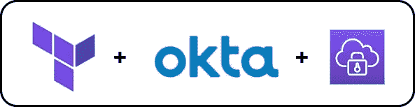
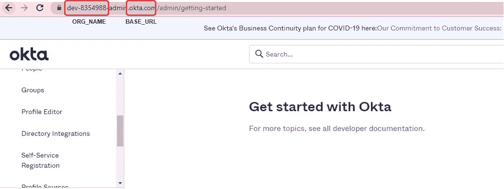
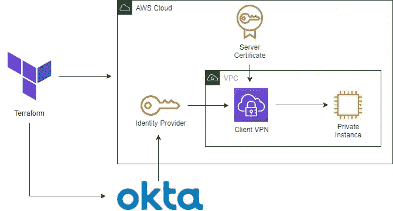
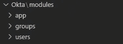
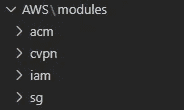
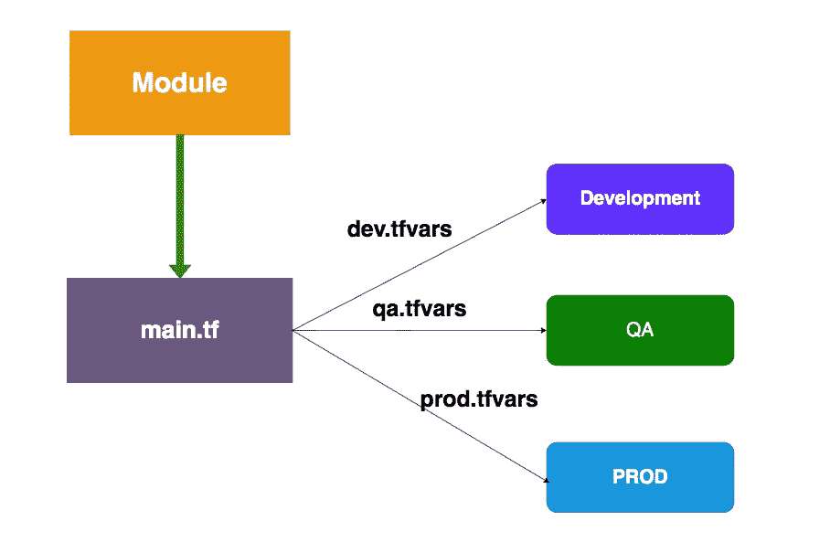
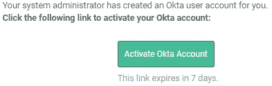
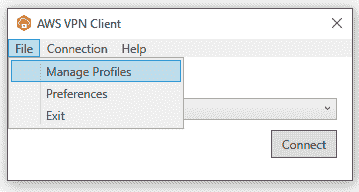
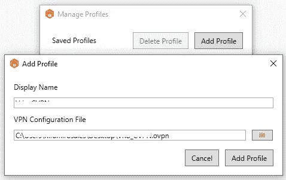

# 在 AWS 中构建您自己的客户端 VPN，并使用 Okta IdP 以自动化的方式向它认证用户。

> 原文：<https://medium.com/globant/build-your-own-client-vpn-in-aws-and-authenticate-users-to-it-with-okta-idp-in-an-automated-fashion-2c918e4604a4?source=collection_archive---------0----------------------->

# **简介**

众所周知，全球所有公司每天都在努力实现最可靠、最牢不可破和最强大的方法来保护数据。其中一种方法是尝试通过实施虚拟专用网络(VPN)来加密传输中的数据，从而保护私有网络，无论是在内部还是在云环境中。但是现在数据被安全地加密了，我们如何确保最终用户是我们组织中值得信任的人呢？

我们希望实现一种方法，将我们的用户与任何应用程序或设备连接起来，而无需自己构建和维护集成。

在本文中，我想指导您如何在 AWS 中构建自己的客户端 VPN，并将其与安全声明标记语言(SAML 2.0-base federated)、Okta 身份提供者(IdP)集成，以便通过 Terraform 以自动化的方式向我们的 VPN 认证用户，管理 2 个提供者和不同的环境。

**注意**:我假设你知道 Terraform 的基础知识，比如创建变量和获取输出，所以我将跳过代码中的解释。

# 工具

*   Okta 为你提供了一个 30 天的免费试用帐号，我们将在这个教程中使用，你可以在这里创建它(【https://www.okta.com/free-trial/】)。
*   在这里可以找到 Okta Terraform 提供者([https://registry . terra form . io/providers/Okta/Okta/latest/docs](https://registry.terraform.io/providers/okta/okta/latest/docs))和 AWS 提供者([https://registry . terra form . io/providers/hashi corp/AWS/latest/docs](https://registry.terraform.io/providers/hashicorp/aws/latest/docs))。
*   我们将使用免费的 AWS 帐户。然而，AWS 客户端 VPN 没有免费层，我们在这里要注意避免收费。

# **配料**

由于所有的资源都将通过 terraform 创建和管理，我们只需要从 Okta 和 AWS 获得我们的凭证就可以访问。我们去抓住他们。

当我们准备好我们的免费 Okta 帐户时，让我们记下一些将在以后帮助我们的事情。

*   基本 URL。
*   组织名称。
*   API 令牌。

在我的例子中，我的 ORG_NAME 将是“dev-8354988 ”,我的 BASE_URL 是“okta.com ”,不要担心，在你读这篇文章的时候，我已经删除了这个 okta 帐户。

在左侧面板中创建 API 令牌>“安全”>“API”>“令牌”>“创建令牌”。然后输入一个名称，并将该令牌复制到记事本中。小心，除非你把令牌复制到别的地方，否则你不会再看到它。

让我们跳到我们的 AWS 帐户，转到 IAM 控制台，创建一个具有管理权限的基本 IAM 编程用户，保存凭据，并创建一个具有填充权限的 IAM 角色。

# **架构**

平台提供商将帮助我们提供基础设施。

在 AWS 中，我们将提供:

*   一个 IAM IdP 将与 Okta 的客户端 VPN 的 SAML 2.0 应用程序兼容。
*   Amazon Certificate Manager 中的证书导入，用于加密客户端 VPN 软件和客户端 VPN 端点之间的通信。
*   客户端 VPN(本测试使用默认的亚马逊虚拟私有云(亚马逊 VPC))。

在俄克拉荷马州，我们将提供:

*   用于 AWS 客户端 VPN 的 SAML 2.0 应用程序。
*   一个用户和一个组使用它来进行身份验证。

# 游戏攻略

让我们开始构建我们将为此使用的 Terraform 代码，所以首先，创建 main.tf 来指定下一个:

*   AWS 和 Okta 提供商。
*   S3 的一个后端来存储我们的 terraform.tfstate
*   创建的角色将由 Terraform 承担。

之后，我们将在同一个文件中构建 Okta 和 AWS 使用的模块。

对于 Okta:

对于 AWS:

正如您可能注意到的，这些是我们将用于此资源调配的所有变量和模块，因此现在我将跳过每个资源的模块和变量配置。

让我们跳到我们将用于开发/QA 的环境变量。在这里，我们可以定义模板中使用的所有变量，以便只管理这个文件，避免在代码中硬编码值。

记住使用您自己的 Aws 帐户 ID、VPC ID 和子网 ID。

为此测试指定的客户端 CIDR 数据块为“10 . 10 . 0 . 0/22 ”, DNS 将为 Google DNS，CloudFlare DNS 适用于此测试。

现在让我们来看看 Okta 配置，我们将分为 3 个模块，如您所见，应用程序、群组和用户。

Okta Modules

**注意:**对于 Okta 提供者，我们必须在提供者的每个模块中指定版本，就像我们在主文件中做的一样，你可以在一个单独的。您的模块中的 tf 文件。

对于应用程序，我们将使用 AWS 客户端 VPN 的预配置应用程序。

我们还将创建一个应用组分配，这将帮助我们将 Okta 中创建的组分配到应用客户端 VPN，两者都在同一个应用模块中。

对于组，我们必须创建组并为此组指定一个名称，这很重要，因为组名必须与我们稍后将创建的客户端 VPN 授权中的名称完全匹配。

对于 Okta 用户和应用程序模块，我们必须创建用户并将其分配给一个组。

这个用户必须是我们刚刚创建的组的成员。

这就是我们在 Okta 需要做的所有配置，在这里你可以管理你的用户、群组成员、应用分配等。并将它应用到您的多种环境中，而不必每次都重新编写代码或手动完成。请记住，应该为用户或群组分配应用程序，否则，在认证后，应用程序将无法工作。

到目前为止，我们已经看到了如何配置 Okta 资源，如一个简单的用户、一个组和一个 SAML 应用程序，它们将帮助我们向 AWS 客户端 VPN 进行身份验证，现在让我们看看如何配置 AWS 资源。

在继续之前，我们需要生成一个简单的证书以导入 AWS 证书管理器。有许多关于如何生成一个文件的资源，我们需要 chain.crt、ca.crt 和密钥，您可以在您的“acm”模块中创建带有这些扩展名的文件。

分为 4 个模块，这是我们需要的。

通过此代码，我们将提供以下资源:

*   我们将向 AWS ACM 导入一个证书。
*   将创建客户端 VPN、路由和授权。
*   IAM 中的 IdP 与我们的 Okta 帐户匹配。
*   一个简单的安全组，允许我们的客户端 VPN 的一些规则。

为了导入证书，一旦证书位于我们的模块目录中，我们就要使用“File”函数从我们的模块中调用这些资源。

我们需要前面生成的文件中所述的下一个文件:

*   私有密钥
*   证书 _ 正文
*   证书链

对于 IAM 中的 IdP，我们需要 XML 格式的“元数据”输出，我们可以在 Okta Module > app 中轻松生成，如果您再次向上滚动并检查 main.tf 中的模块 IAM，您会注意到我们从该资源中调用了该属性。

对于安全组，我们将创建一个所有流量都开放的安全组，源将是我们为客户端 VPN 选择的子网。

最后，对于客户端 VPN 配置，我们需要配置以下资源，首先我们需要创建客户端以使用联合身份验证，并使用我们在 IAM 中创建的客户端，以及所需的基本配置。

然后，我们需要子网关联和客户端 VPN 的路由。

您可能注意到，在路由中，我们使用了一个局部变量和一个名为“Routes_All”的变量，这是因为我们将使用该资源中的一些值，并独立地操纵它，而不考虑其余的资源。

但首先让我们创建授权，这将像客户端 VPN 中的“组”一样进行配置，我们给它的名称应该与我们刚才在 Okta 中创建的组的名称相匹配，如果该组不匹配，我们的用户将无法到达任何网络。

对于最佳实践，我们希望将不同资源中的授权分开，以限制每个团队或用户应该到达的路线，例如开发人员团队应该以他们自己的帐户到达开发人员-VPC，或者第三方团队应该到达他们自己的 VPC，而不能到达网络的其余部分，为此目的的每个资源应该这样配置:

同样，我们使用本地资源来完成这项工作。此外，我们使用“For_each”元参数来更好地管理每个路由和每个授权。

本地文件如下所示:

在这种情况下我们只需要把路由添加到我们自己的 VPC 来测试和授权相同的路由。路由是我们希望使用客户端到达的远程 VPC 或子网，授权是 Okta 和 AWS 中的组将到达的路由，如果没有明确地在授权中，但是在路由中，用户将不能到达目的地。

哇，我们终于有代码了！我们去部署它！

还记得我们创建 Okta API 和我们记下的所有值吗？让我们把它们放入环境变量中。

$ Env:OKTA _ ORG _ NAME
$ Env:OKTA _ BASE _ URL
$ Env:OKTA _ API _ TOKEN

AWS 凭证也是如此。

$ Env:AWS _ ACCESS _ KEY _ ID
$ Env:AWS _ SECRET _ ACCESS _ KEY

一旦我们有了这些，我们就可以运行“ *Terraform Init* 来初始化它，最重要的是，您想要创建一个工作区*“terra form workspace new dev _ workspace”*来隔离您的多个环境，否则您的部署将被覆盖，运行一个快速验证来查看是否有任何东西出现，如果没有，我们可以使用我们的“*来运行“ *Terraform 计划*。tfvars"* 查看要在我们想要应用和测试的环境中创建的资源。

然后，应用更改并等待资源完全创建，这一部分可能需要 5 分钟以上。

在等待资源提供的时候，很可能你已经收到了 Okta 邀请用户的邮件，我们去接受邀请吧。

此链接将重定向到为您的用户设置新密码，并将您重定向到最终用户 Okta 网站，您将在那里看到客户端 VPN 应用程序。

现在，转到 AWS 控制台> VPC >客户端 VPN 端点，在我们新创建的摘要中，您将看到*“自助服务门户 URL”*，复制该 URL 并导航到它。在那里你可以下载 VPN 的配置文件和客户端 VPN 客户端的安装程序，一旦安装完毕，我们必须对其进行配置。

1.  打开以前安装的客户端 VPN 应用程序，进入“文件”并点击“管理配置文件”。

**2** 。单击“添加配置文件”,并在显示名称中键入您想要标识 VPN 的名称。在“VPN 配置文件”中浏览。下载 ovpn 文件，点击“添加配置文件”，然后点击“完成”。

**3** 。点击“连接”，这将打开并重定向到您的 Okta 帐户，如果您已登录，您将看到以下消息，如果没有，它将要求您登录。

这就对了。您应该能够通过自己的 VPN 私下访问您的 AWS 资源！让我们快速测试一下，在您的 VPC 中配置一个 EC2 实例，对于 SG 入站规则，打开来自源 172.31.0.0/16 的 ICMP 流量，准备好后尝试 ping 实例私有 IPv4 地址。

# 结论

在这篇博文中，我们探讨了保护 VPN 访问的解决方案，通过使用 AWS 和 Okta 实现联合身份验证，所有这些都通过 Terraform 模板进行管理，几乎不接触两个控制台，使用最佳实践，不硬编码任何机密或值，这还可以通过为 Okta 用户启用 MFA 来实现更高的安全性。您可以通过多种方式将其集成到您环境的管道中，例如，每次测试代码时都会触发 Jenkins 管道，然后将新的身份认证组或路由推送到生产环境，或者在复杂的网络中，使用 Transit Gateway，您可以将可达性扩展到任何组织中的更多 VPC。

别忘了！在开始时提到，AWS 客户端 VPN 不是免费的，如果您想避免被收费，只需运行*“terra form destroy”*即可回滚之前部署的所有资源。

# **参考文献**

 [## 证明

### 身份验证在 AWS 云的第一个入口点实施。它用于确定客户端是否…

docs.aws.amazon.co](https://docs.aws.amazon.com/vpn/latest/clientvpn-admin/client-authentication.html#federated-authentication)  [## AWS 客户端 VPN

### Amazon Web Services (AWS)客户端 VPN 是一种完全托管、按需付费的 VPN 服务，可以灵活地扩展或缩减…

www.okta.com](https://www.okta.com/integrations/aws-clientvpn/#overview)  [## 亚马逊网络服务和 AWS 数据| Globant

### 从帮助组织使用数据产生新的商业价值和竞争优势，到构建和部署…

www.globant.com](https://www.globant.com/stay-relevant/partnerships/aws)