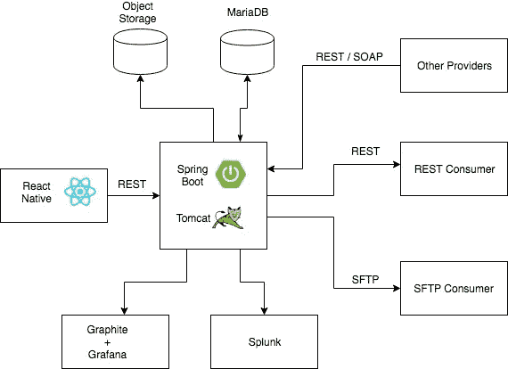
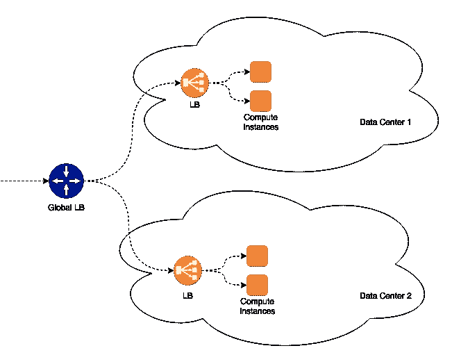
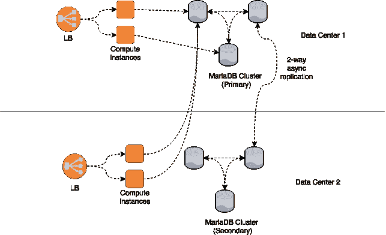
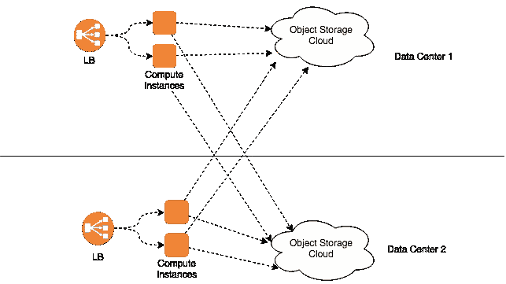
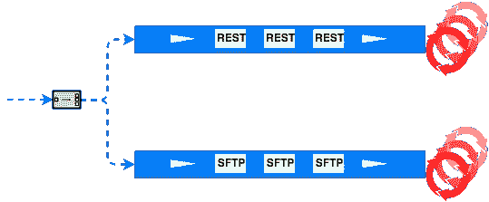
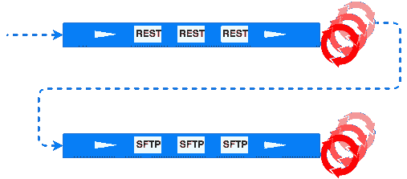

# 构建一个 24/7/365 沃尔玛规模的 Java 应用程序

> 原文：<https://medium.com/walmartglobaltech/building-a-24-7-365-walmart-scale-java-application-12cb7e58df9c?source=collection_archive---------0----------------------->

Image by Falkenpost from pixabay.com

沃尔玛全球技术(Walmart Global Tech)是沃尔玛的软件技术部门，负责构建、拥有和部署解决方案，以解决当今电子商务和商店(实体)业务面临的复杂挑战。我所在的团队创建了位于沃尔玛私有云中的应用程序，供我们的美国商店员工使用。我们面临的最有趣的挑战之一是构建能够处理巨大规模和 24/7 可用性需求的应用程序，这些需求预计来自世界头号零售商的近 5000 家美国商店。

我有幸领导一个团队交付了一个 React 原生 iPad 应用程序，该程序由沃尔玛云上的 Spring Boot 服务提供支持。iPad 应用程序从用户那里收集信息，并将这些信息发送给下游服务。尽管这个想法很简单，而且预期使用率很低，但是在表面之下有很多功能性和非功能性的复杂性。应用程序必须 24/7/365 可用，在任何情况下都不会丢失数据，甚至可以在网络不可用时运行

在这篇文章中，我将借助一些基于 Java 的代码示例来讨论我们所解决的一些问题。

# 系统结构

该服务利用 Spring Boot，并将一个 war 工件部署到运行在沃尔玛内部云中的 Tomcat 上。它公开了运行在 iOS 平台上的 UI 使用 React Native 访问的 REST APIs。API 创建持久存储在 MariaDB 中的元数据资源，而大型附件存储在对象存储中。UI 所需的一些附加信息是从图中的其他提供者处获取的。有两个下游消费者——一个提供 REST API，另一个基本上是 SFTP 服务器。日志被发送到 Splunk，指标被发送到 Graphite，以便在 Grafana 仪表板中查看。

该服务以主动-主动模式部署在两个数据中心。MariaDB 实际上是一个数据库服务器的 Galera 集群，数据复制在多个数据中心。对象存储集群也部署在多个数据中心。MariaDB 和 Object Storage 都由沃尔玛的其他团队管理，因此我的团队不必了解它们的实现或处理运行它们时涉及的操作问题。

正如我在上一篇文章中提到的，这个系统的吞吐量很低，大约不到 10 TPS。所以负荷不大。暂时中断也是可以接受的，但是系统应该不会丢失数据。

# 技术性深潜

让我们开始深入了解应用程序的技术细节，这些细节对从试点商店开始扩展应用程序并将其推广到美国连锁店最有帮助。我将展示一系列主题，并向您展示我们如何解决与每个主题相关的一些问题，以及适当的代码片段和图表。

# 高可用性

值得注意的是，虽然服务可能会中断，但用户仍然可以使用该应用程序。移动应用的用户不必担心中断是否只是暂时的，例如在计划的升级期间后端服务的重启。

使用简单的负载平衡、无状态 REST 服务设计就可以实现这种级别的可用性。

全局负载平衡器根据邻近程度将请求转发到两个数据中心。每个数据中心中的负载平衡器将请求循环传送到其后的节点。对于应用程序集群，两个数据中心都是活动的。

MariaDB 的设置有点不同:

两个数据中心中的服务指向其中一个数据中心中的单个主 MariaDB 集群，该集群将故障转移到其他数据中心中的辅助集群。是的，这会导致数据中心出现额外的不必要的延迟，您可以从上图中看到这一点。然而，这种额外的延迟对于这种特定的应用来说是完全可以接受的。如果真的发生灾难，应用程序将会暂时中断，因为应用程序会切换到另一个数据中心。此外，如果主群集关闭，UI 能够经受住可能导致的临时服务中断。这种设置更易于维护，并且很好地满足了我们的需求。如果应用程序要求更严格，我可能不会选择这个。

每个数据中心中的数据库集群使用一种称为 Galera 的技术，该技术利用基于认证的多主机同步复制。由于 Galera 集群是同步的，因此它确实会影响写入延迟。但是，它提供了应用程序所需的高一致性。跨数据中心的异步双向复制可确保数据得到复制。如果真的发生灾难，可能会出现复制延迟，这是必须解决的问题。滞后意味着尽管数据并没有因为一个数据中心暂时停机而实际丢失，但传输中的数据并不在灾难中幸存下来的另一个数据中心中。这种情况似乎不可接受，但是负面风险有限，因为可能受影响的实际数据量非常小。

对象存储设置如下所示:

对象存储写入在其中一个数据中心的存储云中执行，不会复制到另一个数据中心。对两个数据中心执行读取，没有更新。这种设计允许在任一给定时间在任一数据中心只存在一个对象副本。来自 UI 的大多数对象存储操作都是写操作。当用户结束他们的会话时，读取是异步执行的，因此我们不必担心在两个数据中心搜索对象的额外延迟。也没有更新，所以这大大简化了事情。我们不必担心跨数据中心的对象一致性。

如果其中一个存储集群出现故障，应用程序将无法访问存储在那里的对象，直到它重新联机。但是，新的请求会发送到其他数据中心。因此，正在进行的事务会暂时中断，但新的事务会转移到其他地方，应用程序会继续运行。这种情况是可以接受的，因为 UI 能够处理临时中断。

在将最初的一组商店扩展到链中的所有商店的过程中，我们遇到了一个数据中心中的对象存储云受到升级影响的情况。因为我们已经考虑到了这种情况发生的可能性，所以我们能够顺利通过。

# 员额的等幂

RFC 2616 说方法 GET、PUT 和 DELETE 应该是幂等的。这意味着除了错误或过期问题之外，多个请求的副作用与单个请求是一样的。因此，如果我发出 1 个 GET 请求或者 2 个或 3 个具有相同请求头和请求体的请求，最终结果将完全相同。同样的想法也适用于上传和删除请求。这在现实中并不总是正确的——这取决于你如何实现你的 REST 控制器，但是如果你不遵循 RFC，那么你的实现就是不符合的。

为什么这是一件好事？让我解释一下:

如果网络没有丢弃数据包或做任何阴险的事情，请求会一直到达服务，客户端会收到响应。但是，假设我们有一个常规的旧的不可靠的网络，这意味着连接可能会在中间网关或边缘路由器处掉线，超时可能会因糟糕的 Wifi 网络上的大量数据包丢失而导致，等等。如果请求在到达服务之前丢失，客户端可以超时或者检测到丢失的套接字连接，然后再次尝试请求。如果再次尝试该请求，它可能会成功，我们没有什么可担心的。如果来自服务器的响应在到达客户机之前丢失了，我们只能假设发生了两种情况中的一种——服务中是否达到了预期的结果。但是客户端无法知道——它只是重试请求。如果方法不是等幂的，客户端发送的第二个请求可能会产生意想不到的后果。

这解释了为什么幂等性是一件好事。但是如果你阅读 RFC 2616，你会注意到他们遗漏了 POST 方法。这种方法有副作用，因为它是用来创建新对象的。虽然这对于大多数应用程序来说是有意义的，但结果是我们构建的应用程序无法处理由于网络问题重试 POST 时创建的空对象。我们最终在每个 POST 请求中使用一个 correlation-id 头来解决这个问题。correlation-id 只是客户端生成的唯一 UUID。尽管不同的客户端可以生成相同的 UUID，但这种情况与网络重试同时发生的几率非常低。

POSTs 的幂等性是使用 Spring MVC 中的 HandlerInterceptorAdapter 类实现的。这允许我们在调用控制器方法之前，在预处理方法中处理请求头，而后处理方法允许我们在退出控制器方法之后，在响应中缓存位置头。

这段代码中仍然存在超时值较小的争用情况。在第一个请求的 Location 头缓存到 postHandle 方法之前，第二个请求可能会进入 preHandle 方法并通过 301 检查。然而，这可以通过稍微修改来解决，如果第一个请求先前被接收但是还没有完成处理，则拒绝具有相同相关 Id 的第二个请求。

这并不完美，因为我们假设缓存是立即一致的，并且第一个请求将在某个时间点完成。这些假设是基于 UUIDs 是唯一的这一假设之上的。

然而，这些假设足以在大多数应用程序中正确处理与网络错误相关的重试。在有限商店的初步试点推广期间，我们没有在商店的用户界面上看到几次重试尝试。但是当我们将足迹扩展到 chain 时，我们开始看到更多与网络错误相关的重试。

# 并发性考虑

这个应用程序有两个下游消费者——一个 REST 消费者和一个 SFTP 消费者。REST 消费者应该为操作 UI 的用户提交的信息提供一个参考号。该参考号被显示给用户。发送到 SFTP 消费者的请求也需要这个参考号，但是用户不需要来自 SFTP 消费者的任何东西。

因为我们有一个用户在等待从下游服务返回的东西，我们不希望他们等得太久。在这种情况下，典型的 SLA 实际上不会超过几秒钟。

在我们在一家商店试用该应用程序之前，我们的初始原型在这里做了一些非常简单的事情。它使用单线程来处理来自 UI 的所有请求。这保证了 SFTP 消费者的请求总是在其余消费者的请求之后得到处理。然而，它强制所有的请求被连续处理，所以来自 UI 的下一个请求将等待上一个请求完成。任何请求的响应时间都会随着请求总数的增加而增加。

这并不理想，但是当只有一个来自单个部署到单个存储的请求时，这种方法很有效。因此，当我们需要将应用程序带到一个单独的试点商店时，它允许我们不用担心并发性问题。在生产过程中获得应用反馈的需求比担心将其推广到数百或数千家商店更重要。

因此，一旦我们将这个实现部署到一个商店，我们就通过将引用号检索的并发性问题与 SFTP 消费者的问题分离开来，提高了 REST 消费者的并发性。为此，我们为 REST 使用者和 SFTP 使用者提供了单独的线程池。

你发现上面代码的问题了吗？没有办法保证 SFTP 消费者请求在其他消费者请求之前得到处理。

那么我们如何在 Java 中做到这一点？一种方法是在处理完来自 REST 使用者的响应后，为 SFTP 使用者生成请求。

这样做的问题是，处理两个下游消费者的代码之间存在耦合。可以通过使用事件总线模式来处理这个问题。只需使用一个应用程序事件总线，其中第一个消费者返回一个响应，处理该响应的服务在总线上发出一个事件。任何其他服务(如 SFTP 处理服务)都会看到此事件，并为该服务创建必要的请求。

一般来说，事件总线以这种方式解耦应用程序逻辑是一件好事。使用这种模式并不简单，因为必须注册事件及其消费者，并且需要对生成的事件模式进行版本控制和管理。

然而，有另一种更简单的方法可以使用 CompleteableFuture 直接解决系统的需求。这提供了一种在 java 中创建两个需要链接的异步任务之间的依赖关系的简洁方法。在这种情况下，SFTP 任务需要在 REST 消费者任务之后运行。两者都需要在单独的线程池中运行，但是一个需要在另一个完成后被触发。

上面的代码仍然存在一个与异常处理相关的问题。当线程执行某些代码时发生异常，JVM 会将控制权传递给默认的未捕获异常处理程序(如果为该线程注册了一个处理程序的话)。否则，默认行为是将堆栈跟踪打印到系统错误输出中。基本上，这个异常在这里被吞掉了，因为我们没有在我们编写的代码中进行适当的日志记录。但是 CompleteableFuture 提供了一个特殊的方法，允许人们注册一个异常处理程序，正是因为这个原因。但是，这不应该用来代替代码中正确的异常处理。

# 审计日志

根据业务需求，我们开始构建一个应用程序——最初的目标是在试点项目中获得一些东西。然而，在这一过程中，我们意识到，一旦应用程序在试运行中安全运行，我们需要确切了解发生了什么故障、哪些交易受到影响以及哪些商店受到影响，以便我们可以快速评估故障的影响，并为业务提供支持。我们还需要这些信息，让企业决定是否要在“连锁”的道路上进一步扩大现有的商店。基本上，我们需要数据来根据确凿的事实做出去/不去的决定。要做到这一点，我们需要应用程序在现场的成功和失败的日常报告。

我们认为，拥有应用程序使用时生成的业务事件的审计日志符合我们的标准。由于应用程序日志是尽最大努力完成的，并且只由日志服务团队维护有限的时间长度，所以它不能满足我们的非功能性需求。此外，应用程序日志会捕获大量噪音，当查看大量日志时，很容易错过业务事件。

但是，我们还需要在我们的基础设施中维护一个单独的审计日志实现。我们决定在 MariaDb 数据库中创建一个日志表形式的审计日志，因为它为其他数据提供了保存可用性保证。由于事件量不是很大，我们不需要提供非常高的写入吞吐量和巨大存储容量的实施。

我们围绕审计日志构建了一个 API，如下所示:

为了使用上面的 API，可以简单地创建一个 Postman 集合，每天查询这些 API，或者构建一个实用程序，比如 Python 或 Java 中的命令行实用程序。我们选择使用 Swing 构建一个具有快速 UI 的实用程序，因为我们认为在我们向美国连锁店推广的开始，我们想要做的查询类型没有很好地定义。Swing 实用程序允许任何人开始使用我们的审计日志来生成遇到故障的用户会话的每日报告。这对我们的商业利益相关者非常有用。

# 日志过滤

我们的应用程序处理高度敏感的数据。这意味着我们需要确保进入应用程序日志的信息不会错误地包含敏感数据，如社会保险号等。您可能还需要转义 HTML 字符，以防止所谓的日志伪造攻击。这很容易通过在日志框架中使用拦截器模式来实现。

使用 Logback，您可以使用涡轮过滤器来进行拦截。这将在日志消息被 Logback 写出之前拦截每条日志消息。这个想法是，你做一些处理，以取代敏感的关键字，也转义 HTML 关键字等。这无疑增加了日志系统需要完成的工作的开销，因此需要谨慎地完成。我在这里展示的代码没有针对更高的吞吐量进行优化，因此在高负载下运行时，您可能会看到额外的损失。

Logback 创建一个 TurboFilter 类的实例，并使用它来拦截所有日志。使用这种方法，您可以清理日志消息，并将新的清理版本写到日志中。您也可以删除包含敏感数据的消息。但是，在查看日志和尝试解决问题时，您可能会丢失上下文，因为包含敏感信息的日志消息被丢弃了。

因为 TurboFilter 是由 Logback 本身而不是 Spring 实例化的，所以您失去了注入由 Spring 管理的 bean 的能力。所以在 spring boot 项目中使用这种技术时要小心。

我必须注意，上面的代码只过滤来自你自己的源代码包的日志。然而，在依赖库中的某些地方，打开跟踪级日志记录可能会损害应用程序的隐私要求。在 Apache HTTP 客户端的情况下，名为 *org.apache.http.wire* 的记录器如果在跟踪级别运行，可以将未加密的二进制数据转储到日志中。对于您的特定应用程序，这是您需要了解的。您可能希望限制这些库的日志级别。

# 描摹

任何由少数用户使用的真实应用程序都存在操作和维护方面的挑战。查看应用程序日志并在现场报告问题时确定应用程序如何处理用户数据的能力是一个非常理想的特性。

为了跟踪来自特定用户的请求发生了什么，应用程序将需要转储关于传入请求的足够的上下文以及应用程序或审计日志，以允许生产中的任何操作员能够确定用户数据发生了什么。您最不想要的就是不可追溯性，如果在运行时出现错误，很难或者不可能确定应用程序是否仍然拥有可恢复格式的用户数据。

有多种工具可以做到这一点。事实证明，我们选择的最有用的工具是 Logback 库中的 MDC 日志记录特性。这基本上是使用线程局部变量来保存一些上下文变量，然后通过应用正确的日志模式将这些变量与每个日志一起打印出来。

下面是一个使用以下代码的简单示例:

但是您实际上不会在日志中看到任何新内容，除非您实际修改日志模式以显式包含这些变量:

这很好，但也有问题。首先，如何让上下文在线程边界之间传递？您的应用程序很可能将工作从控制器线程卸载到一些执行器服务线程，以非阻塞方式执行工作。在这种情况下，您可能希望在线程中执行任何代码之前总是应用 MDC 变量，然后在执行之后自动清除这些变量。下面是一个例子，说明如果不使用 Spring 执行任务，该如何做:

下面是一个非常简单的例子:

然而，Spring 的任务执行 API 有一个更好的方法来在任务执行前修饰它们。如果你使用的是 Spring 的 ThreadPoolTaskExecutor，你可以设置一个*org . Spring framework . core . task . task Decorator*来将上面相同的 decorator 逻辑应用于线程池中执行的任何任务。

第二个问题是上下文变量的来源。在我们构建的应用程序中，上下文来自请求本身，这在大多数应用程序中可能都是正确的。您可以在 REST 控制器方法中保存 MDC 变量，方法是首先从请求体中提取它们。然而，这导致了难以维护的紧密耦合的脆弱解决方案。我们采用的方法是让客户端(React UI)将应用程序特定的头附加到每个传出的请求，这将为每个调用提供正确的上下文变量。然后，我们选择使用 Servlet 过滤器来捕获这些变量，并将其插入到 MDC 上下文中。

上面的代码基本上为我们提供了服务中数据流的完整视图，供该领域中使用我们应用程序的任何用户使用。因为 MDC 上下文存在于每个日志消息中，所以现在可以在我们的日志中进行搜索，这允许我们非常快速地解决问题。

IMHO 这是除了审计日志之外的非功能性特征，当从试点项目开始，在几个商店中运行应用程序，并慢慢地将商店足迹扩展到大约 5000 个商店的美国连锁店时，这被证明是最有价值的。它使技术团队能够进行根本原因分析和业务影响确定，这是我们的利益相关者在出现重大问题(如停机或资源耗尽)时希望知道的。

# 测试与模拟服务的集成

生产环境中的大多数应用程序都会遇到一些小概率的网络错误和超时。当部署只有少量用户时，由于网络错误导致的失败率通常很低。然而，随着用户数量的增加，由于网络错误和与网络相关的超时而导致的故障数量也会增加。

在通过网络通信的应用程序的各个部分之间捕获这样的测试场景是非常有用的。这种回归测试有助于在生产中发现问题之前隔离问题。通常，只有在用户规模显著扩大后，才会发现此类问题。

如何在回归测试中测试这些东西呢？有几种方法已经用于此:

*   使用模拟的单元测试:可以通过模拟下游服务的响应并测试被测类的期望，在单元测试中测试这种行为。这里的结果将保证被测试类的行为，但不保证产品在运行时的行为。
*   *使用 mock 的集成测试:*这基本上是在集成类型的环境中建立自己的应用程序，以及使用 Wiremock 之类的框架或自己编写的东西建立单独的模拟下游服务。被模仿的服务只是对特定的请求提供固定的响应。您可以使用它发送回 HTTP 500s，导致超时，丢弃响应等。Wiremock 特别有用，因为它能够响应请求模拟故障。
*   *带有定制错误注入的代理:*这种方法还要求您用您的应用程序和下游服务的副本建立一个集成类型的环境。然而，您使用的是位于应用程序和下游服务之间的代理。代理可以是你自己写的。这种想法对于在难以模拟的场景中模拟错误或超时非常有用。基本上，您是在下游服务的行为中插入混乱，这允许您测试各种场景，包括试图模拟实际生产行为的随机错误注入。

我们在集成测试中广泛使用 Wiremock 来模拟由网络或下游应用程序中的错误导致的故障。下面是如何使用 Wiremock 实现这一点的示例:

这个故事改编自最初出现在[这里](https://codeperfector.wordpress.com/2018/10/27/lessons-learned-deploying-a-cloud-based-application-walmartlabs-part-2-technical/)的一个帖子