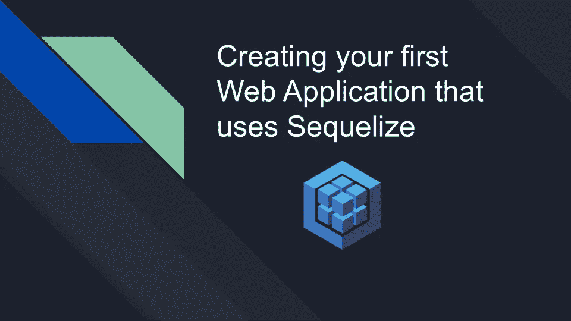
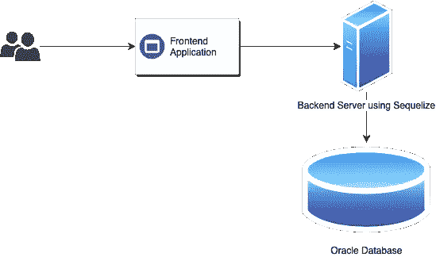
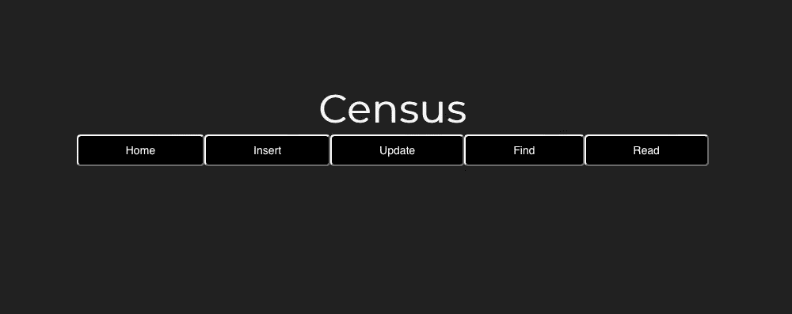
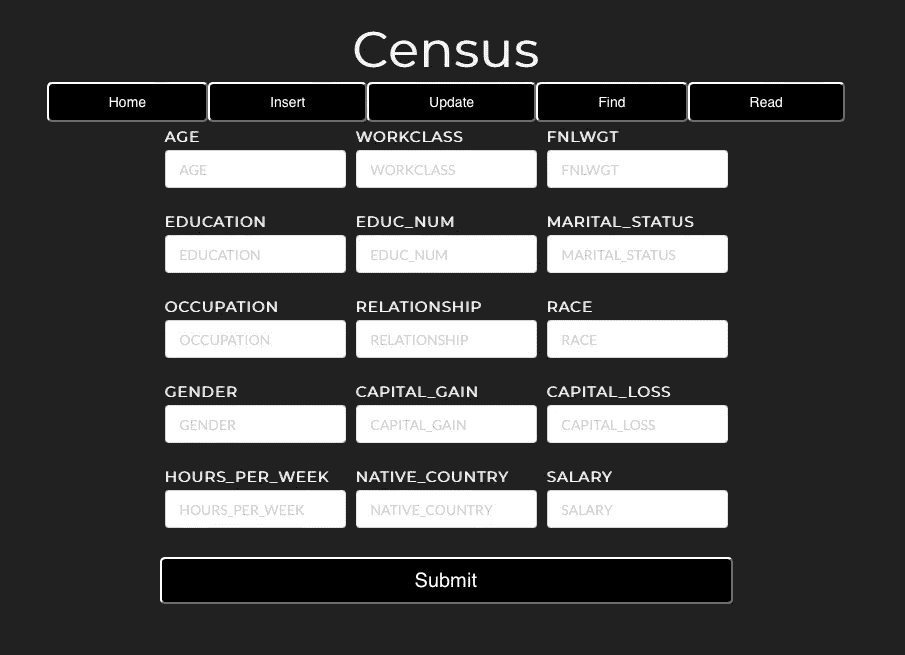
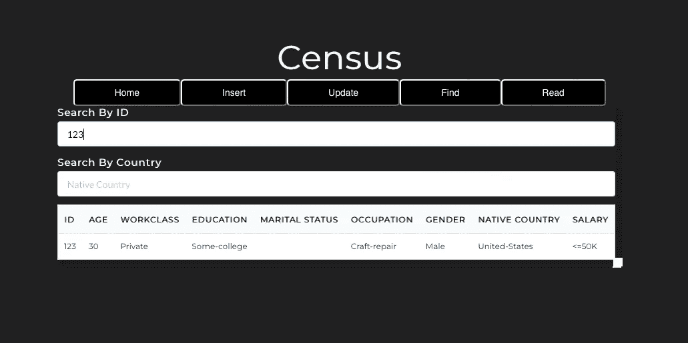

# 使用 Sequelize 和 Oracle 数据库构建人口普查应用程序

> 原文：<https://medium.com/oracledevs/building-a-census-application-with-sequelize-and-oracle-database-3c7e2ed17706?source=collection_archive---------0----------------------->

这篇博文将带您创建一个使用 Node.js Sequelize ORM 和 Oracle 数据库的 web 应用程序。



*这是由*[*Nilabja Bhattacharya*](/@nilabja10201992)*撰写的客座博文，他是负责驱动程序和框架的 Oracle 数据库开发团队的成员。*

在我之前的文章中，我宣布了 Sequelize 的 Oracle 数据库方言。Sequelize 是一个现代的 TypeScript 和 Node.js ORM。在这篇博文中，我将带您了解我是如何创建一个使用 Sequelize 的人口普查演示应用程序的。

该应用程序的架构是:



前端是一个 web 应用(在 https://localhost:3000/)。这个前端与监听 http://localhost:3001/的系统后端进行对话。后端使用 Sequelize 实现，并使用新的 Oracle 方言连接到 Oracle 数据库。

# 我开发 web 应用程序的步骤

为了简化前端的开发，我使用了 create-react-native-app。这使得开始使用 React 原生项目变得非常容易。

## 如何设置前端？

创建客户端目录，并将其更改为:

`mkdir client && cd client`

安装*创建-反应-本地-应用*模块:

`npm i -g create-react-native-app`

使用以下内容创建一个示例 web 应用程序:

`create-react-native-app demo-sequelize-app`

我通过进入应用程序目录检查了演示应用程序的工作情况:

`cd demo-sequelize-app`

然后我运行`npm start`来启动 web 应用程序，这个应用程序可以在[https://localhost:3000/](https://localhost:3000/)上访问

现在我有了示例 web 应用程序，我需要为我想要的应用程序扩展它，并将其连接到后端。

## 普查应用前端

为了构建我的人口普查演示应用程序的前端，我修改了 *app.js* 文件以添加四个端点:

*   **创建—** 将数据插入数据库
*   **更新—** 更新数据库中的数据
*   **读取** —读取数据库
*   **查找** —查询数据库

下面的代码片段显示了我是如何添加**创建**端点的。可以为其他端点添加类似的代码。这些只是设置访问这些页面的 URL(我将在下一节详细展示如何设置这些端点)。

```
function App() {
  const navigate = useNavigate();
  ...
  const navigateToCreate = () => {
    // Navigates to the create page
    navigate('/create');
  };
  ...
  return (

      <div className="main">
        <div><h2 className="main-header">Census</h2></div>
        <div>
        ...
        <button onClick={navigateHome}>Home</button>
        <button onClick={navigateHome}>Insert</button>
        ...
        <Routes>
          ...
          <Route path='create' element={<Create />} />
          ...
        </Routes>
    </div>
  );
}
```

(省略号显示了可以为其他端点添加代码的位置。)

## 如何设置后端？

要设置应用程序的后端，创建目录*服务器*，并将其更改为:

`mkdir server && cd server`

我设置了 Sequelize 实例用来连接数据库的环境变量，例如，使用我的本地 Oracle Database 21c XE database，我为我之前创建的一个现有数据库用户设置了凭据:

```
export SEQUELIZE_USERNAME=sequelize
export SEQUELIZE_PASSWORD=....
export SEQUELIZE_SERVICENAME=XEPDB1
export SEQUELIZE_HOST=localhost
export SEQUELIZE_PORT=1521
```

在*服务器*目录下创建一个名为 *index.js* 的文件。该文件将:

*   实例化序列实例
*   初始化普查模型
*   将序列模型与数据库同步
*   填充数据库表格中的数据

我编辑了 *index.js* ，看起来像下面的代码片段。这展示了如何实例化一个 Sequelize 实例并定义一个包含两列的 census 模型。省略号显示了可以添加其他列的位置。最后，普查数据被有效地加载到数据库中。我之前从[https://github . com/Oracle-samples/Oracle-d b-examples/blob/main/machine-learning/datasets/census . cs](https://github.com/oracle-samples/oracle-db-examples/blob/main/machine-learning/datasets/CENSUS.csv)v:

```
// The Census model
let census;

// Function that we call when the server start to do the necessary initialization of tables in the DB
async function init() {
  // Establishing a DB connection using sequelize
  // For more info please refer - https://sequelize.org/docs/v6/getting-started/#connecting-to-a-database
  const sequelize = new Sequelize(process.env.SEQUELIZE_SERVICENAME, 
                                  process.env.SEQUELIZE_USERNAME, 
                                  process.env.SEQUELIZE_PASSWORD,
                                  {host: process.env.SEQUELIZE_HOST, 
                                   port: process.env.SEQUELIZE_PORT, 
                                   dialect: 'oracle'});

  // Defining the census model which would create the table census in the db with the column names given as parameter
  // The keys in the parameter represent the DB column name and the value represents its configuration
  // For more info please refer - https://sequelize.org/docs/v6/core-concepts/model-basics/#using-sequelizedefine
  census = sequelize.define('census', {
    ...
    AGE: {
      type: DataTypes.STRING,
      allowNull: false,
    },
    WORKCLASS: {
      type: DataTypes.STRING,
      allowNull: false,
    },
   ...
  });

  // We call sequelize.sync to refresh the DB with the sequelize models defined
  // For more info please refer - https://sequelize.org/docs/v6/core-concepts/model-basics/#model-synchronization
  await sequelize.sync({force: true});

  // Reading the csv file in sync mode
  let rows = fs.readFileSync('./CENSUS.csv').toString().split('\n');
  // Extract the column name of the table from the csv file
  const cols = rows[0].split(',');
  // Shift the rows array to pop the header
  rows.shift();
  // Sequelize way to add multiple rows to the table at once
  // For more info please refer - https://sequelize.org/docs/v6/core-concepts/model-querying-basics/#creating-in-bulk
  await census.bulkCreate(build(cols, rows));
}

init();
```

## **设置普查应用程序的组件**

在这一节中，我将展示如何构建应用程序的插入和查询页面的前端和后端。用户界面对你来说可能看起来不完全一样，因为为了简洁，我不会在这篇博文中分享前端的 CSS。

主页上有允许插入、更新、查找和阅读的按钮:



# 如何设置插页？

插入页面提供了大量的人口普查数据供某人输入:



为了实现上面显示的插入页面，我添加了一个文件*client/demo-sequelize-app/src/component*s/*create . js*。这个文件将输入数据发送到 http://localhost:3001 上的应用程序后端。

下面的代码片段显示了 *create.js* 如何设置“年龄”和“工作类别”的输入字段，并将输入的数据传递给后端服务器。可以类似地添加其他字段:

```
export default function Create() {
    let navigate = useNavigate();
    ...
    const [age, setAge] = useState('');
    const [workclass, setWorkclass] = useState('');
    ...
    // Method for sending the data received from the form to the backend server
    const postData = () => {
        axios.post(`http://localhost:3001/create`, {
            ...
            age,
            workclass,
            ...
        }).then(() => {
            console.log("done")
            navigate('/read')
        })
    }
    return (
        <div>
            <Form className="create-form">
                <div className='row'>
                    ...
                    <Form.Field className='col'>
                        <label>AGE</label>
                        <input placeholder='AGE' onChange={(e) => setAge(e.target.value)}/>
                    </Form.Field>
                    <Form.Field className='col'>
                        <label>WORKCLASS</label>
                        <input placeholder='WORKCLASS' onChange={(e) => setWorkclass(e.target.value)}/>
                    </Form.Field>
                    ...
                </div>
                ...
                {/* We call the postData method when the Submit button is clicked */}
                <button className='submitbutton' onClick={postData} type='submit'>Submit</button>
            </Form>
        </div>
    )
}
```

然后我编辑了 *server/index.js* 来添加代码，使用 Sequelize 将输入字段数据插入 Oracle 数据库。下面的代码片段显示了如何为两个字段“年龄”和“工作类别”执行此操作:

```
// Endpoint to insert a row into the database
app.post("/create", async (req, res) => {
  // Getting the data from the frontend
  ...
  const age = req.body.age;
  const workclass = req.body.workclass;
  ...
  // We use the create method of sequelize to insert a row into the database
  // For more info please refer - https://sequelize.org/docs/v6/core-concepts/model-querying-basics/#simple-insert-queries
  await census.create({
    ...
    AGE: age,
    WORKCLASS: workclass,
    ...
  });
  res.send();
});
```

设置**更新**端点的步骤类似于**创建**端点。我会把这个留给你做练习。

# 如何按 ID 和国家查询数据库？

查询页面将如下所示:



我添加了一个新文件*client/demo-sequelize-app/src/components/find . js*，它有两个字段，一个用于“id ”,另一个用于“country”用户输入的查询数据被传递到后端。

下面的代码片段展示了如何将“id”作为来自用户的输入，并将其发送到后端服务器。可以类似地添加“国家”代码:

```
export default function Find() {
    const [APIData, setAPIData] = useState([]);
    // Method for getting the rows by id from the backend server
    const getDataById = (id) => {
        axios.get(`http://localhost:3001/find/${id}`)
            .then((getData) => {
                setAPIData(getData.data);
            })
        }
    ...
    return (
            <div className='table'>
                <div>
                    <Form className="create-form">
                        ...
                        <Form.Field>
                            <label>Search By ID</label>
                            <input placeholder='ID' onChange={(e) => getDataById(e.target.value)}/>
                        </Form.Field>
                        ...
                    </Form>
                </div>
                ...
        </div>
    )
}
```

然后我编辑了 *server/index.js* 来包含使用 Sequelize 通过 id 和国家查询的端点。下面的代码片段显示了我如何使用输入的 id 查询数据库:

```
// API to search by id
app.get("/find/:id", async (req, res) => {
  // Extracting the id to be queried on
  const id = req.params.id;
  // We are querying the database for all elements matching the id
  // For more info please refer - https://sequelize.org/docs/v6/core-concepts/model-querying-basics/#specifying-attributes-for-select-queries
  const rows = await census.findAll({
    where: {id: id}
  });
  // Sending the rows to the frontend to display
  return res.send(rows);
});
```

**READ** 端点的工作方式与 **FIND** 端点类似，但它取的是所有的行。我会把这个留给你做练习。

## 运行应用程序

我确保 credential 环境变量的设置如前面所示，然后我打开了两个终端。

在 1 号航站楼:

```
cd client
npm install
npm start
```

在 2 号航站楼:

```
cd server
npm install 
npm start
```

现在，我在浏览器中打开 https://localhost:3000/

如果你对甲骨文开发人员在他们的自然栖息地发生的事情感到好奇，请加入我们的[公共休闲频道](https://bit.ly/odevrel_slack)！