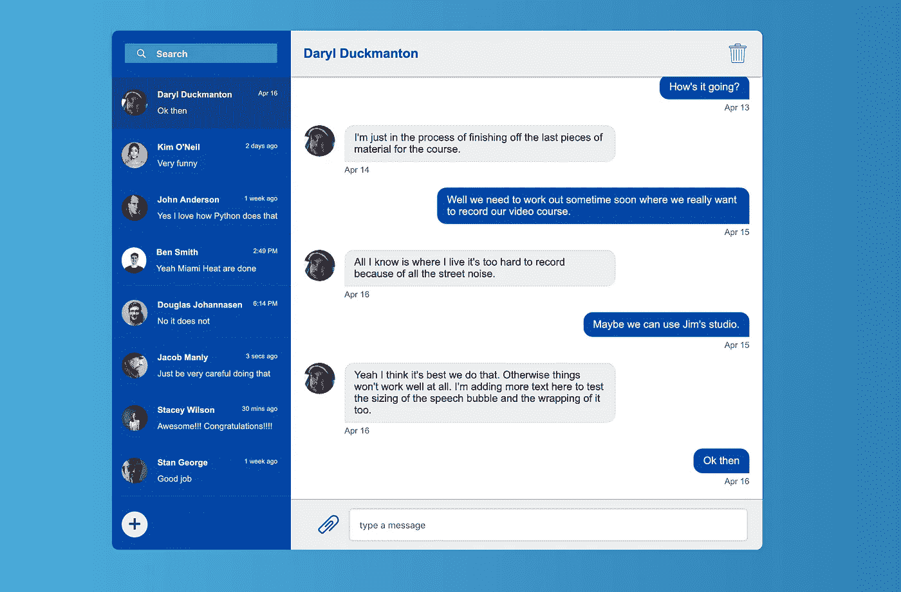

# 使用 Flexbox 构建聊天应用程序

> 原文：<https://medium.com/quick-code/building-a-chat-application-using-flexbox-11891b009dda?source=collection_archive---------5----------------------->

简介——什么和为什么

所以你可能之前听说过 Flexbox，想了解更多。或者你根本不知道它是如何工作的。不管怎样，学习任何东西的最好方法是从头到尾构建一个应用程序，在这个过程中学习。

# 理解“什么”

在接下来的几篇文章中，我们的目标是通过构建一个聊天应用程序 UI，让您了解 Flexbox。参考本文顶部的图片，这是我们将要构建的最终产品。但是我们要开始的地方离那还远着呢。事实上，我们将从一张空白的画布开始。比如下图。

Literally an empty canvas

# 理解“为什么”

那么，为什么我写的是 Flexbox 而不是 CSS Grid 或其他东西呢？

老实说，CSS 网格几乎是现在的主流，但还不完全是。我们今天仍然担心浏览器对 Internet Explorer 的支持。在这个问题被根除之前，Flexbox 仍然会是很多开发者的选择，只是时间会长一点。然而，在不久的将来，我将会写一些关于如何使用 CSS Grid 构建这个应用程序的文章。请继续关注。

至于所有其他选项，比如使用浮动、定位和其他 CSS 技术，它们被认为是黑客，而且一直都是，所以我不打算浪费你我的时间来演示反模式。

现在我选择了一个聊天应用程序 UI，因为本质上它有点复杂，但并不复杂得离谱。这是在合理水平上学习 Flexbox 的一个很好的例子。然而，如果你想更深入地了解 Flexbox，你可以随时在 Udemy 上查看我的课程[这里](https://www.udemy.com/flexbox-in-depth/?couponCode=FB_MEDIUM_INTRO_ART)，只需几杯咖啡的费用。此外，我认为建立一个聊天应用程序用户界面是实用的，也很有趣。

# 代码在哪里？

这些文章的代码都将基于下面的 Github 库【https://github.com/lyraddigital/flexbox-chat-app。

现在我们知道了是什么，为什么，代码在哪里，是时候开始了。我们将在下一篇文章中讨论这个问题。

**下一篇文章—** [**构建聊天应用外壳**](/@aussie_tech_tutor/e6936c3057ef?source=your_stories_page---------------------------)