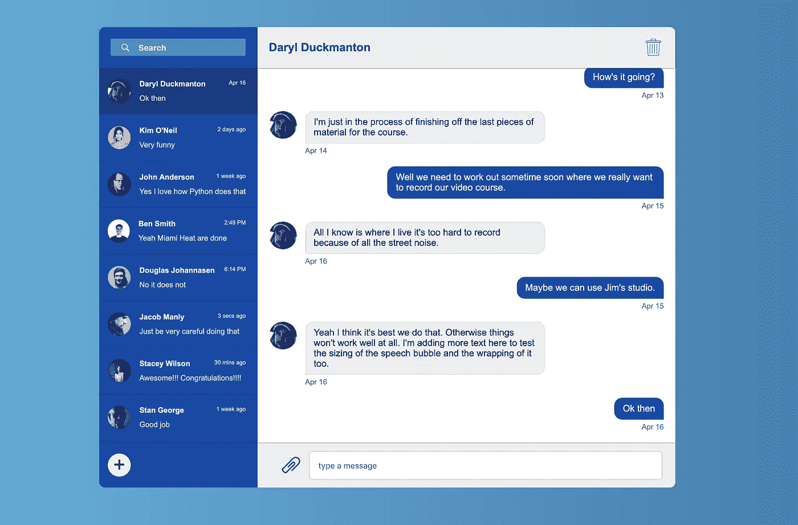

# 使用 Flexbox 构建聊天应用程序

> 原文：<https://medium.com/quick-code/building-a-chat-application-using-flexbox-e506ca2bd9ff?source=collection_archive---------2----------------------->

## 创建对话侧栏和主聊天部分

在这篇文章中，我们将着重于建立一个基本的侧边栏，以及聊天外壳中的主聊天窗口。见下文。