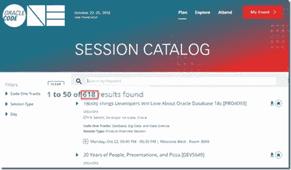
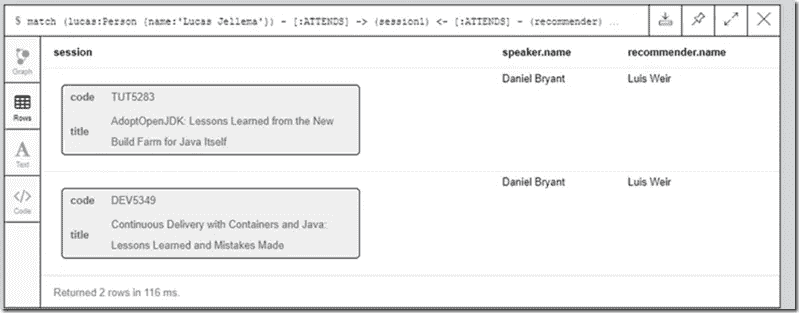

# 利用 Neo4J 图形数据库构建会议会话推荐引擎

> 原文：<https://medium.com/oracledevs/building-a-conference-session-recommendation-engine-using-neo4j-graph-database-2365b3b80ad9?source=collection_archive---------0----------------------->

本文描述了一个用例，对于这个用例，传统的基于 SQL 的关系数据库方法可以提供一个解决方案——但是对于这个用例，传统的方法不是最佳的解决方案。SQL 是万能的——你几乎可以让它做任何你需要的事情。因此很容易成为你的锤子，每一个挑战都是钉子。如果说这篇文章有什么意义的话，那就是让我(也许还有你)认识到，有一些技术可以补充我们工具箱中的 SQL hammer。在这种特殊情况下，补充工具是图形数据库，更具体地说是 Neo4J。

我的同事 Rosanna Denis 最近在我们的 AMIS 技术博客上发表了这篇文章，这是对 Neo4J 的第一次很好的介绍。您可能想查看一下 Neo4J 的一些背景知识。



这里讨论的挑战是 Code One 会话推荐引擎。CodeOne 之类的会议有很多环节可以选择。选择最佳会议是一个真正的挑战。我的时间很宝贵——我如何确保自己不会浪费在口齿不清或缺乏灵感的演讲者的会议上？

我想要的是一个引擎，它会向我推荐与我参加相同会议的人喜欢的演讲者的会议。当然，如果人们来参加我参加的会议，那么他们对他们喜欢的演讲者的推荐对我来说一定是有价值的。

下面我将创建这个建议的两个实现。一个基于关系和 SQL，另一个使用 Graph DB 和 Cypher(Neo4J 查询和数据操作语言)。

本文的所有代码都在 GitHub 上:[https://GitHub . com/lucasjellema/conference-re commendation-engine-in-graphdb](https://github.com/lucasjellema/conference-recommendation-engine-in-graphdb)。

# 举一个例子——关系和 SQL

我设计的关系数据模型看起来像这样:


我必须考虑到这样的事实，即与会者将参加多个会议，会议有多个与会者，发言者可以介绍多个会议，一个会议可以有多个发言者。此外，人们可以喜欢不止一个说话者，同样，一个说话者可以被多个人喜欢。

GitHub repo 包含带有表创建 DDL 和数据创建 DML 的源文件。两者都很简单。

我将为*创建的 SQL 查询从我和我参加的会议开始，然后定位这些会议中的其他与会者，接下来找到他们喜欢的发言人，最后检索这些发言人介绍的会议*如下所示:

```
select s.code,      s.title,      a2.attendee_name "suggested by"from   people p1joinattendance a1on (p1.name = a1.attendee_name)join attendance a2on (a2.session_code = a1.session_code)join speaker_liking slon (sl.attendee_name = a2.attendee_name)join speakers spon (sl.speaker_name = sp.speaker_name)join sessions son (sp.session_code = s.code)where  p1.name = 'Lucas Jellema'
```

此查询的结果(在 SQL Developer 中):


虽然我走了一些捷径，但这个查询还是有点冗长。在 SQL 中，这种特殊的搜索挑战严重依赖于对象之间的关系，最终使用许多表连接来找到正确的答案。这不一定是一件坏事——这只是关系数据库和 SQL 的方式。然而，我们最终得到的查询不是很直观，因此也不太容易维护。此外，对于真正的大数据集，这种方法在性能方面可能无法很好地扩展。我们或许可以采用智能索引策略来扩展这种方法的性能。但是我们很可能在某个阶段达到极限。

所以让我们考虑另一种方法。

# 取两个图形数据库(Neo4J 和 Cypher)

图形数据库对数据有非常不同的看法。存储在图形数据库中的数据和针对图形数据库执行的查询由对象之间的关系驱动，或者由图形中顶点之间的边驱动。图形数据库可以很好地用于特定的查询用例，这些查询用例需要基于这些关系的非常丰富、可伸缩和性能良好的数据访问路径。它们通常会补充关系数据库，但不一定会取代它。

Neo4J 是一个流行的图形数据库，因此显然是我在本文中演示的对象。

为了开始，我按照 Rosanna 在她的[文章](https://technology.amis.nl/2018/11/16/querying-connected-data-in-graph-databases-with-neo4j/)中提供的说明进行了工作。在带有 Docker 引擎的 Linux 虚拟机上工作，我需要做的就是:

创建目录

mkdir ~/neo4j mkdir ~/neo4j/data

mkdir ~/neo4j/logs

然后运行:

docker run–publish = 7474:7474–publish = 7687:7687–volume = $ HOME/neo4j/data:/data–volume = $ HOME/neo4j/logs:/logs neo4j:3.0

现在通过浏览器 7474 端口访问 Neo4J，例如:[http://192 . 168 . 188 . 120:7474](http://192.168.188.120:7474/)

使用 Neo4J 的 Cypher 语言，我在我的图中创建了顶点和边(查看[这个文件](https://github.com/lucasjellema/conference-recommendation-engine-in-graphdb/blob/master/neo4j_ddl_and_dml.txt)中所有的数据操作语句):

```
CREATE (lucas:Person{name:'Lucas Jellema'}) – [:PRESENTS] ->(session:Session {title:'50 Shades of Data: How, When, Why—Big, Relational, NoSQL, Elastic, Graph, Event', code:'DEV4976'})
CREATE (daniel:Person{name:'Daniel Bryant'}) – [:PRESENTS] ->(session:Session {title:'Continuous Delivery with Containers and Java: Lessons Learned and Mistakes Made', code:'DEV5349'})
CREATE (luis:Person{name:'Luis Weir'}) – [:PRESENTS] ->(session:Session {title:'The Seven Deadly Sins of API Design', code:'DEV4921'})
MERGE (daniel:Person{name:'Daniel Bryant'}) CREATE (daniel) - [:PRESENTS] -> (session:Session{title:'AdoptOpenJDK: Lessons Learned from the New Build Farm for Java Itself', code:'TUT5283'})
CREATE (adam:Person{name:'Adam Farley'}) 
MATCH (adam:Person {name:'Adam Farley'}), ((session:Session {code:'TUT5283'})) MERGE (adam)-[:PRESENTS]-> (session)
CREATE (session:Session{title:'Oracle Cloud Soaring: Live Demo of a Poly-Cloud Microservices Implementation ', code:'DEV4979'}) 

MATCH (luis:Person {name:'Luis Weir'}), ((session:Session {code:'DEV4854'})) MERGE (luis)-[:ATTENDS]-> (session)
MATCH (lucas:Person {name:'Lucas Jellema'}), ((session:Session {code:'DEV4854'})) MERGE (lucas)-[:ATTENDS]-> (session)//Luis likes Daniel Bryant as a speaker
MATCH (luis:Person {name:'Luis Weir'}), ((daniel:Person {name:'Daniel Bryant'})) MERGE (luis)-[:VALUES]-> (daniel)
```

这导致了下面的图形表示(粉红色的会话和蓝色的人员):


有了这个图，我就可以创建提供会话建议的查询了。在 Cypher 中，我可以非常接近描述我的查询的自然语言:


```
// now the hunt is on 
//find me and the sessions I attended 
match (lucas:Person {name:'Lucas Jellema'}) - [:ATTENDS] -> (s1) RETURN s1// find people who attended the same sessions as ME
match (lucas:Person {name:'Lucas Jellema'}) - [:ATTENDS] -> (s1) <- [:ATTENDS] - (p2) RETURN p2// find presenters valued by the people who attended the same sessions as I did:
match (lucas:Person {name:'Lucas Jellema'}) - [:ATTENDS] -> (s1) <- [:ATTENDS] - (p2) - [:VALUES] -> (p3) RETURN p3// find sessions presented by presenters valued by the people who attended the same sessions as I did:
match (lucas:Person {name:'Lucas Jellema'}) - [:ATTENDS] -> (session1) 
  <- [:ATTENDS] - (recommender) - [:VALUES] -> (speaker) - [:PRESENTS] -> (session) RETURN session, speaker.name, recommender.name
```

从我开始(Person 类型的顶点，属性名等于 Lucas Jellema)，遍历我参加的所有会话。对于这些会议，导航到所有与会者(让我们称他们为推荐者)，并找到他们重视的所有发言人。遍历所有这些演讲者的演示边缘，以获取他们演示的会话。返回这些会话，以及发言者的姓名和推荐者的姓名。

毫不奇怪，我得到了想要的结果:



# 比较

这两个查询可以并排比较。很明显哪个更短。在稍微习惯了 Cypher 语法之后，我敢说较短的语法将被证明是更直观和更容易维护的语法。我没有专门测试性能；然而，种种迹象表明，Graph DB 方法对于这个用例来说性能(明显)更好，尽管 SQL 性能对于这个用例来说可能已经足够好了。


Neo4J 中的数据操作肯定是不同的——没有预先定义固定的表结构，元数据是在数据创建时获得的。对于一个小的演示系统来说，这很好，也很方便。对于更严肃的应用程序，这几乎没有关系。所有的软件都依赖于特定的数据结构，所以仍然非常需要严格的元数据管理。

我喜欢在我的工具箱中有图形数据库的想法，作为一种工具，它可以帮助我处理查询挑战，在传统的关系方法中，这些挑战可能会让我非常头疼。随之而来的有趣挑战当然是如何将数据变更从关系主数据库复制到 Graph DB query only 存储。我们称之为 CQRS。我们会再次讨论这个问题。

注意:在 Graph DB 的顶部找出 Cypher 中的查询应该是什么非常有趣！这就像重新发现 SQL 一样。

# 资源

本文源代码:[https://github . com/lucasjellema/conference-re commendation-engine-in-graphdb](https://github.com/lucasjellema/conference-recommendation-engine-in-graphdb)

来自我的 50 个数据色度演示文稿的幻灯片:[https://www . slide share . net/lucasjellema/50-Shades-of-Data-how-when-and-why-bigreelationalnosqleelasticgrapevent-code one-2018-旧金山](https://www.slideshare.net/lucasjellema/50-shades-of-data-how-when-and-why-bigrelationalnosqlelasticgraphevent-codeone-2018-san-francisco)
(或者观看来自 CodeOne 2018 的 YouTube 录制:[https://www.youtube.com/watch?v=S2wEDlKzVok](https://www.youtube.com/watch?v=S2wEDlKzVok))

我的同事 Rosanna Denis 最近在我们的 AMIS 技术博客上发表了这篇文章，这是对 Neo4J 的第一次很好的介绍。您可能想查看一下 Neo4J 的一些背景知识。

[图形数据库](https://technology.amis.nl/tag/graph-database/)[graphdb](https://technology.amis.nl/tag/graphdb/)[Neo4j](https://technology.amis.nl/tag/neo4j/)[no SQL](https://technology.amis.nl/tag/nosql/)[关系型](https://technology.amis.nl/tag/relational/) [sql](https://technology.amis.nl/tag/sql/)


*原载于 2018 年 11 月 19 日*[*technology . amis . nl*](https://technology.amis.nl/2018/11/20/building-a-conference-session-recommendation-engine-using-neo4j-graph-database/)*。*