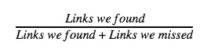

# 构建国家和语言检测管道

> 原文：<https://medium.com/pinterest-engineering/building-a-country-and-language-detection-pipeline-594041081643?source=collection_archive---------2----------------------->

贾雪峰| Pinterest 工程师，内容

保存到 Pinterest 的 Pin 不仅仅是一张图片。保存的 750 亿个 pin 中的每一个都是一个可视的书签，有几十个信号，比如它起源的网站，以及它起源的国家和语言。由于超过一半的 pinner 都在美国以外，我们非常依赖语言和国家检测来帮助 pinner 发现和参与当地的想法。在这里，我们将分享我们如何在 Pinterest 上检测和使用语言和国家信号——在搜索、主页订阅、相关 pin 和主题中——以改善 Pinners 的体验并推动国际参与。

## 检测链接的语言和国家

我们将一个 URL 的国家定义为网站的主要受众。类似地，我们将 URL 的语言定义为该页面的主要语言。我们可以通过多种方法来检测链接的语言和国家，并根据它们的精确度来衡量它们。

## 用于语言检测的白名单

我们在巴西、日本、法国、德国和英国的当地团队利用他们的专业知识来洞察哪些领域或链接可能在他们各自的国家流行。我们与他们合作，为每个国家编制最受欢迎的域名白名单，以帮助我们更快地检测语言。这些白名单通常非常准确，但需要大量的人工筛选和验证，这使得这种方法难以扩展。

## 携带区域信号的 URL

链接的 ccTLD、子目录和子域也可以提供关于登陆页面的国家和语言的有用信息。这不是最好的覆盖范围，因为许多链接可能不包含这些信息，但对于我们可以从 URL 解析 ccTLD、子目录或子域的情况，这种方法通常工作得很好。

## 平纳交战信号

虽然我们在确定网站的语言和国家时会努力优化客观信号，但有时非客观信号也会产生有用的信息。例如，我们可以识别某个链接是否被来自特定国家或语言的 Pin 用户交互最多，并推断 Pin 的国家和语言。

我们考虑的两个主观信号是，当用户从网站上保存 Pin 或点击 Pin 进入其登录页面时。由于这些都是主观信号，它们没有恒星的准确率，但仍然有助于我们对许多网址进行分类，否则我们几乎没有信息。

## HTML 内容

只要能够正确解析，页面的实际 HTML 包含大量信息。我们内部的 HTML 解析器从登录页面获取原始 HTML，并提取各种元数据，如 HTML 语言标签、描述、标题和标题。然后，我们可以将该文本传递到我们内部的文本处理库中，尝试检测页面的语言。几乎所有的网页都包含一些 HTML，所以这种方法给了我们相当高的精确度和覆盖率。

## 聚类推理

即使一个页面本身提供给我们的有用信息非常少，我们仍然可以确定该页面的语言或国家。我们可以进行聚类推断，这是一种类似于[k-最近邻算法](https://en.wikipedia.org/wiki/K-nearest_neighbors_algorithm)的方法。如果我们可以将共享相同域或路径的其他链接的语言或国家分类为未分类链接，并且如果这些分类链接的语言或国家基本一致，那么我们可以假设我们一无所知的链接使用该语言或来自该国家。

## IP 地理定位

网页的 IP 地址也包含关于链接的潜在国家的有用信息。我们使用第三方 IP 地理位置查找服务 [MaxMind](https://www.maxmind.com/en/home) 来确定链接的 IP 地址所在的地区或国家。每个网站都有一个 IP 地址，但网站几乎可以托管在任何地方。因此，这种方法有 100%的覆盖率，但准确性较低，所以当我们不能使用任何其他方法对链接进行分类时，它可以作为一种总括方法。

## 测量质量

在语言和国家检测方面，最直接的成功衡量标准是我们的准确率和召回率。精度很容易计算。我们所要做的就是从我们想了解更多的每个国家的链接中抽取一个样本，并找出我们正确的部分。我们一般是通过亚马逊 Mechanical Turk 或者 CrowdFlower 进行人工评估来做到这一点的。

召回率更难衡量，因为国际链接的比例远低于美国网站。我们的解决方案是首先估计来自我们找到的语言或国家的链接的数量，方法是将标记链接的总数乘以该语言或国家的精确率。然后，我们通过抽取所有其他链接的样本并运行人工评估来估计我们错过的链接的百分比。将这个百分比乘以未标记链接的数量，我们就可以估计出我们错过了多少链接。给定我们找到的链接的数量和我们错过的链接的数量，计算召回率可以通过一个简单的等式来完成。

## 经验教训

当试图建立一个强大的语言和国家检测管道时，我们发现最佳方法是使用许多不同的技术，从机器学习到文本处理，以及各种各样的客观和主观信号。所有这些方面加在一起比任何一个单独的元素都要好得多。通过这些不同的方法，我们实现了高水平的精确度和召回率，并在推动本地参与或国际增长方面发挥了关键作用。

## 展望未来

要改善我们的国家和语言检测渠道，还有很多工作要做，包括将语言和国家检测扩展到所有国家和语言。其他关注领域可能包括将本地实体检测添加到我们的 HTML 解析器中，以根据公共信息(如“联系我”页面的地址，或页面上可能出现的货币和地标)来识别网页的来源国。我们还可以添加对多语言网站的支持，以及那些检测用户语言或国家的网站，并将它们重定向到页面的适当版本。如果这些问题中有任何一个听起来很有趣，那么[加入我们](https://careers.pinterest.com/careers/engineering)！

*鸣谢:感谢徐快、Anna Markowska 和 John Milinovich 对登录页面国家和语言检测流程的指导和宝贵贡献。*