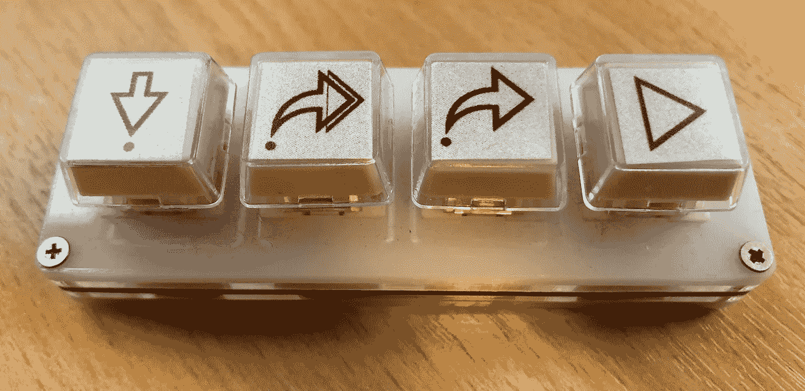
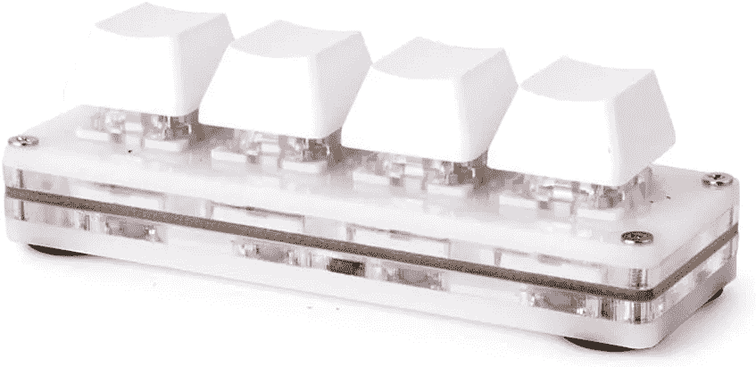
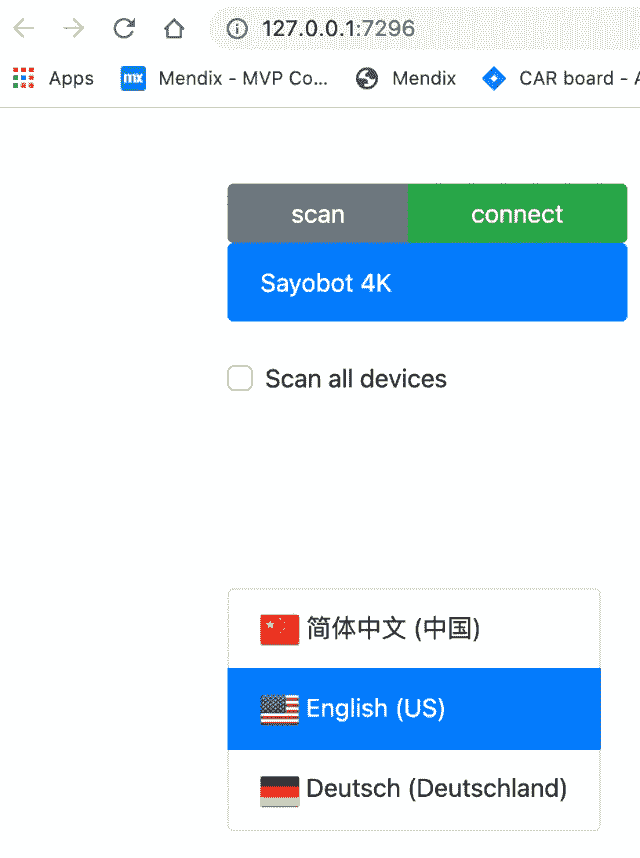
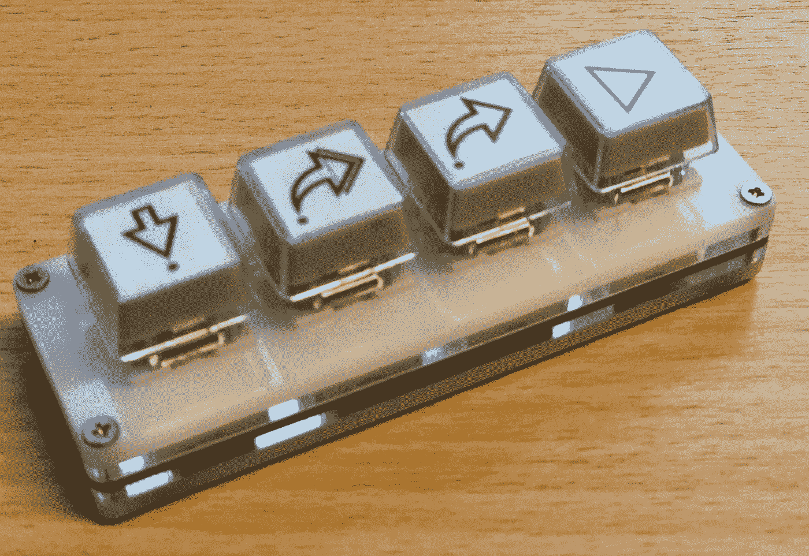

# 为 Mendix Studio Pro 构建调试键盘

> 原文：<https://medium.com/mendix/building-a-debugging-keyboard-for-mendix-studio-pro-685d1c287050?source=collection_archive---------4----------------------->

Building a debugging keyboard for Mendix Studio Pro

# Mendix 调试器是 Mendix Studio Pro 的一个常用部分。开发人员使用定点设备或键盘来完成微流程。

关键如下…

**Alt**+**F5**:Step into—将调试器移动到子微流或循环中。

**Alt**+**F6**:Step over——将调试器移动到同一微流中的下一步。

**Alt** + **F7** :步出——指示调试器离开子微流或循环。

**Alt**+**F8**:Continue—指示调试器继续运行，直到它到达另一个断点。

在我的键盘上，这是一个尴尬和不舒服的手的伸展。我想知道是否有更简单的方法来获取这些密钥。

我想到的解决方案是构建一个简单的 4 键键盘，提供对每个功能的单键访问。

我开始使用 Raspberry Pi Pico 来模拟按键，构建自己的程序。在寻找按键时，我遇到了一个[预建的 4 键键盘](https://amzn.to/3rXRq9L)，这意味着我不必自己构建。我订购了这个，几个星期后它就到了。

Keyboard with the original supplied keys

键盘没有说明书。在网上搜索，我发现其他人在编程上有问题。

# 设置键盘

我用的是带 Parallels 的 Macbook Pro，这个对我很管用。

**1:** 从[https://osu.sayobot.cn/download/](https://osu.sayobot.cn/download/)下载软件

**2:** 解压下载的文件。对我来说，这是在~/Downloads/setting.zip 中

**3:** 进入终端 app 中的设置文件夹:cd ~/Download/setting

**4:** 仍在终端中，给予 Mac app 执行权限:chmod u+rx 纱代 _CLI_Mac_X86

**5:** 插上键盘，分配给 Mac

**6:** 双击 Finder 中的应用程序，然后运行它。它可能会警告您来自不可信的来源。

7: 一个浏览器将会打开，你会看到一个绿色的“连接”按钮，点击它。

Plugging in the keyboard should give the following screen if the setup application is running.

8:单击“按钮”选项卡，您可以对按键进行编程。我将修饰符设置为“左 Alt”，并将通用键设置为“F5”、“F6”、“F7”或“F8”，以表示 Mendix 调试键。

Setting up the keys

**9:** 一旦设置完毕，点击“永久保存”。现在，您可以使用键盘来调试您的 Mendix 应用程序了！

从那以后，我把附赠的键帽换成了透明的，从而改进了键盘的外观。在这些下面，我打印了一些图标来图形化地表示每个键的功能。

Mendix Studio Pro debugging keyboard

# 结论

我发现使用我的调试键盘非常容易使用。这当然比笨拙的手伸展或不得不用我的触控板点击要好。

如果你想买自己的键盘，复制这个作品，可以在亚马逊上买这个:[https://amzn.to/3rXRq9L](https://amzn.to/3rXRq9L)

*披露:这是一个联盟链接，如果你选择使用这个链接购买，我会从亚马逊赚取一小笔费用。*

## 阅读更多

 [## 调试微流和纳流- Studio Pro 9 操作指南| Mendix 文档

### Mendix Studio Pro 有一个内置的一致性检查器，可以验证您正在构建的应用程序是否包含任何…

docs.mendix.com](https://docs.mendix.com/howto/monitoring-troubleshooting/debug-microflows-and-nanoflows#3-debugging-overview)  [## 远程调试微流- Studio Pro 9 操作指南| Mendix 文档

### 除了调试应用程序的本地部署之外，还可以调试已经在…

docs.mendix.com](https://docs.mendix.com/howto/monitoring-troubleshooting/debug-microflows-remotely) 

*来自出版商-*

如果你喜欢这篇文章，你可以在我们的 [*媒体页面*](https://medium.com/mendix) *找到更多类似的文章。对于精彩的视频和直播会话，您可以前往*[*MxLive*](https://www.mendix.com/live/)*或我们的社区*[*Youtube PAG*](https://www.youtube.com/c/MendixCommunity/community)*e .*

*希望入门的创客，可以注册一个* [*免费账号*](https://signup.mendix.com/link/signup/?source=direct) *，通过我们的* [*学苑*](https://academy.mendix.com/link/home) *获得即时学习权限。*

有兴趣更多地参与我们的社区吗？你可以加入我们的 [*Slack 社区频道*](https://join.slack.com/t/mendixcommunity/shared_invite/zt-hwhwkcxu-~59ywyjqHlUHXmrw5heqpQ) *或者那些想要更多参与的人，看看加入我们的*[*Meetups*](https://developers.mendix.com/meetups/#meetupsNearYou)*。*