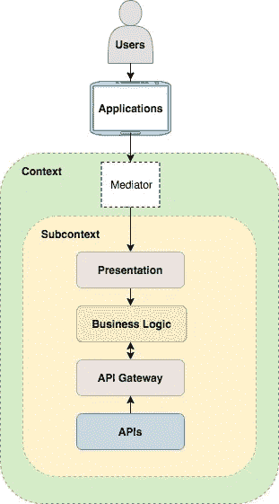

# 构建一个解耦架构来优化我们的移动应用

> 原文：<https://medium.com/walmartglobaltech/building-a-decoupled-architecture-to-optimize-our-mobile-apps-7bc4a0d6da37?source=collection_archive---------5----------------------->

**Figure 1\. High-Level Diagram of the Decoupled Architecture**

我们如何为沃尔玛墨西哥市场优化移动应用？

在本文中，我们解释了我们用于标准化和分离这四个沃尔玛墨西哥应用程序架构的工程:

*   **沃尔玛百货**
*   **沃尔玛超市**
*   **Superama**