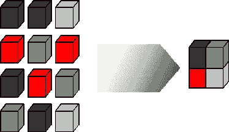
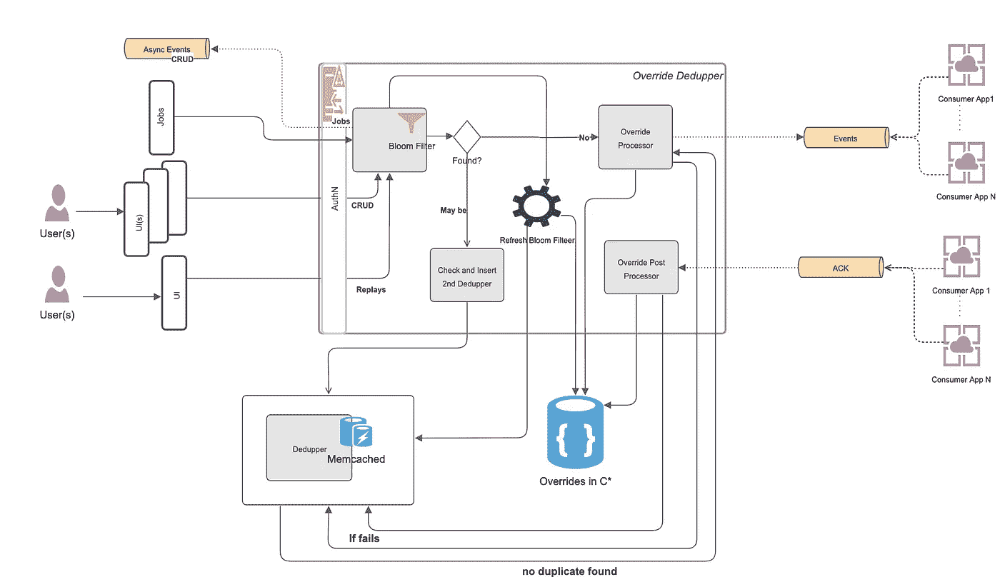
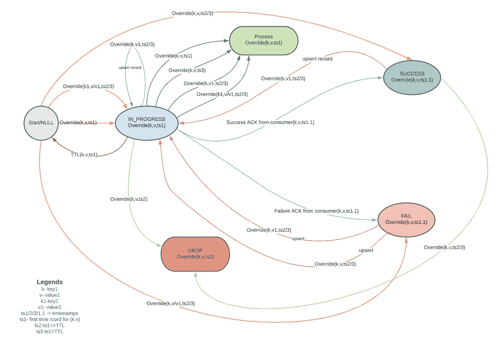
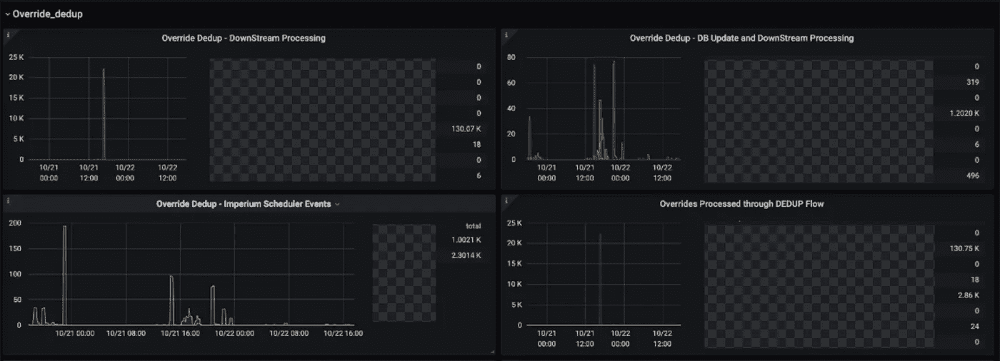

# 构建重复数据删除，这是我们系统环境中的一种系统方法

> 原文：<https://medium.com/walmartglobaltech/building-a-dedupper-a-systematic-approach-in-our-system-context-41e8168d2f76?source=collection_archive---------0----------------------->

如果你是一名软件工程师，你可能已经听说过数百次重复数据删除。每一个想要伸缩或专注于伸缩的系统都应该有兴趣在事件处理管道中尽早过滤掉重复的处理，如中的*和*中的*。在 Walmart Global Tech，我们的企业规则引擎平台是为优化特定事件(我们称之为规则上的 ***override*** )而构建的，我们需要由用户以多种不同方式创建和更新的处理(例如，通过 REST 或 Kafka 的 UI/API/电子表格)。*

**假设**:

*   如果发现重复，处理将被视为成功。
*   如果重复检查失败，我们将继续处理。

# **方法 1: (** 发芽)

我的第一个系统设计方法是依赖两个主要组件，例如:

1.  布隆过滤器(确定可能存在或不存在)
2.  键值存储(MemCached 或 Cassandra(C*))(如下面的图 1 所示)

我们将首先检查一个覆盖的键(它的散列)*是否可能存在于布隆过滤器中的*，然后调用第二个键/值存储(缓存)来寻找一个副本。如果在高速缓存中没有找到副本，或者布隆过滤器中不存在关键字*或*，则处理将遵循正常流程。如果发现重复，系统会将事件标记为*“重复”*，并响应调用者，标记为处理成功。这里是我们的覆盖处理系统的高级系统图(如图 1 所示)。

Figure 1 : System Diagram for ‘Override Deduper’

## 优势:

1.  这是一个简单的设计，易于理解。
2.  由于数据量还不是很大(尽管它在增长)，我们没有太关注*缓存失效*策略。
3.  我们更喜欢使用*直写缓存*(同一个数据中心( *DC* )的延迟约为 1 毫秒，<为 10 毫秒，*交叉* *DC* 用于缓存写入，写入数据库没有额外的成本，因为之前我们一直在写入 C*)而不是*绕写或回写缓存。*

## 挑战:

1.  我们需要保持 *bloom filter* 条目是最新的才能有效。
2.  处理部分失败和超时等问题确实很棘手。这促使我们考虑下面提到的方法 2。
3.  我们计划对**键**(包括覆盖*键* + *配置文件* + *消费者域细节等)进行重复检查。)和****有效载荷** *(* *状态* + *动作、* *等。*)但是在我们的例子中，仅仅检查密钥是否存在以及有效载荷是否匹配也是不够的，因为对于每个到来的事件，还额外依赖于从不同时间帧(我们称之为*时间盒*)计算的最终状态。覆盖有效负载的示例如下所示:*

# *方法 2:(萌芽)*

*我们计划通过引入状态和 TTL(除了事件创建后的简单持续时间之外，什么都不用做)来解决处理部分故障的问题。有三种可能的状态类型:1。开始(例如，开始/空)，2。中间(例如，进行中/处理中等。)，还有 3。终端状态(成功/失败)及其转换。*

*除了状态之外，还可以有两个动作，例如根据状态转换确定的丢弃/处理(事件)(如图 2 所示),例如，如果新事件进入系统，具有相同的*键*和*有效载荷*,并且当前状态是正在处理，而预定义的 TTL 没有过去，则丢弃该事件是有意义的，否则如果 TTL 已经过去，则处理该事件，因为此时系统无法更新到终端状态。*

**

*Figure 2 : State Transition Diagram(State machine approach)*

## *优势:*

1.  *与前一种情况不同，这种方法具有处理部分故障的额外优势。*

## *缺点:*

1.  *它将为状态转换引入额外的表，并增加额外的查找和维护成本。*
2.  *检查缓存中某个键的现有值/有效载荷时，仍然需要计算总体*覆盖*状态。*

# *方法三:(开花)*

> *"最简单的解决方案几乎总是最好的。"—奥卡姆剃刀*

*我们还尝试简化重复数据删除问题的解决方案。我们现在知道我们的系统做了大量的计算，例如将传入的*时间盒*(时间帧)和状态与系统中现有的*时间盒*和状态合并，以确定最终的合并状态(整体覆盖状态)。因此，我们可以得出结论，如果我们的合并状态与任何传入请求的保存数据相同或部分匹配，我们应该将其标记为重复/半重复。因此，我们在计算完成后放置了重复数据删除逻辑。*重复数据删除状态*在这种情况下是一种复合状态，具有以下决策:*

1.  **isdbuupdate*=真/假- >基于此，我们的系统数据库和调度程序(我们使用自己开发的分布式调度程序来触发这些事件)得到更新。*
2.  **isDownstreamProcessing =*TRUE/FALSE->根据这个值，我们确定是否需要用我们的下游客户端应用程序来处理这些事件。*

*无论任何*重复数据删除*状态如何，我们都会为内部审计更新审计日志/历史详细信息。时间视角中的覆盖状态解释为:如果存在覆盖，则在时间盒(此处指时间范围)合并后:*

1.  *从现在到未来日期:*活动**
2.  *从过去的时间到现在或过去:*过期**
3.  *从现在或未来时间到未来时间:*到期**
4.  *从系统中删除该覆盖键的所有时间盒:*删除**

*如果先前事件的部分故障场景发生，系统不应支持重复数据删除状态，因此我们决定对每个事件继续执行*重复数据删除* *流程*，同时从历史/日志表中异步检查*最后的状态是什么(重复状态除外)。如果之前的状态是中间状态(例如，*正在处理* / *超时)*，并且经过了可配置的时间窗口(例如，在我们的示例中为 4 小时)，我们不会遵从*重复数据删除*逻辑的决定。相反，我们继续进行正常的处理。**

## **优势:**

1.  **不需要散列密钥，因此没有散列逻辑、成本和冲突。**
2.  **缓存和维护缓存不需要新的额外键值存储。**
3.  **不需要维护任何单独的状态。**
4.  **更少的集成点，更少的故障**
5.  **如果出现不同类型的重复，我们可以避免下游处理、数据库更新和调度更新，最终降低成本。**

## **不足之处**

1.  **虽然通过不更新 DB 或避免下游处理提高了覆盖处理的效率，但是由于重复数据删除是在计算之后进行的，因此每个事件都有几毫秒(例如 10ms)的开销。**
2.  **它需要一个单独的线程池来对以前的状态进行异步检查，并且每个事件都有一个开销。**

## **韵律学**

**每个人都喜欢数据，所以这里是我们的生产指标的快照。数据严重依赖于用户行为，因此绘图模式变化很大。**

****

**Figure 3: Statistics for deduplication at database, downstream systems, and scheduler**

# **关闭:**

**权衡是分布式系统设计的严酷现实。通过这种设计方法，我们很好地实现了我们的最终目标。最后但同样重要的是，我们还为任何处理状态的强制触发事件和任何不可预见问题的最坏情况恢复的时间框架构建了开发人员工具。**

# **参考资料:**

1.  **缓存写入方案—[https://shahriar . svbtle . com/Understanding-write through-write around-and-write back-caching-with-python](https://shahriar.svbtle.com/Understanding-writethrough-writearound-and-writeback-caching-with-python)**
2.  **[https://code ahoy . com/2017/08/11/caching-strategies-and-how-to-choose-the-right-one/](https://codeahoy.com/2017/08/11/caching-strategies-and-how-to-choose-the-right-one/)**
3.  **布鲁姆过滤器:【https://yourbasic.org/algorithms/bloom-filter/ **
4.  **状态图:【https://en.wikipedia.org/wiki/State_diagram **

***我要感谢我的朋友和一位出色的工程师*[*Amit Sharma*](https://medium.com/u/e334247ec344?source=post_page-----41e8168d2f76--------------------------------)*与我一起集思广益，系统地提出了这个解决方案。***