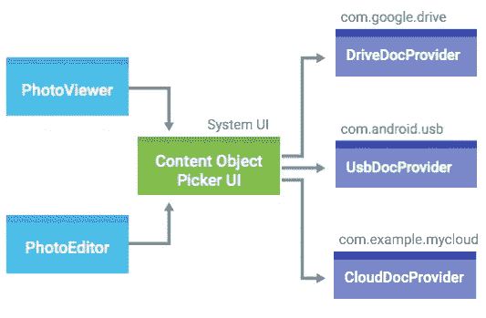

# 构建文档提供程序

> 原文：<https://medium.com/androiddevelopers/building-a-documentsprovider-f7f2fb38e86a?source=collection_archive---------2----------------------->

Android 的优势之一一直是它的意图系统:你可以依靠定义应用程序可以注册处理的标准*动作*的[通用意图](https://developer.android.com/guide/components/intents-common.html?utm_campaign=android_series_adp_documentsprovider_blog_090716&utm_source=medium&utm_medium=blog)，而不是只将你的应用程序工作的特定应用程序列入白名单。这些常见的操作之一是[检索特定类型的文件](https://developer.android.com/guide/components/intents-common.html?utm_campaign=android_series_adp_documentsprovider_blog_090716&utm_source=medium&utm_medium=blog#GetFile)，通常用[*ACTION _ GET _ CONTENT*](https://developer.android.com/reference/android/content/Intent.html?utm_campaign=android_series_adp_documentsprovider_blog_090716&utm_source=medium&utm_medium=blog#ACTION_GET_CONTENT)来实现。

在 KitKat 之前，这意味着构建一个具有 *ACTION_GET_CONTENT* 意图过滤器的活动，编写一个允许选择由您的应用程序管理的文件的 UI，并处理多种标志，如多选和仅本地。然后用户必须学习每个应用的用户界面。文件选择的狂野西部。所以在 KitKat 中，我们引入了一个新的标准，它带有[存储访问框架](https://developer.android.com/guide/topics/providers/document-provider.html?utm_campaign=android_series_adp_documentsprovider_blog_090716&utm_source=medium&utm_medium=blog)和支撑整个系统的类:[*documents provider*](https://developer.android.com/reference/android/provider/DocumentsProvider.html?utm_campaign=android_series_adp_documentsprovider_blog_090716&utm_source=medium&utm_medium=blog)。

这使得用户可以通过一个标准的用户界面访问任何应用程序中的文件——无论这些文件是来自附带的本地存储*文档提供程序*的本地文件，还是来自您构建的自定义*文档提供程序*的文件。

# 什么是文档提供者？

旧系统和存储访问框架之间的一个关键区别是**UI 是由系统**提供的，而不是直接由您的应用程序提供的。



The system provides the UI for all DocumentsProviders

一个 [*文档提供者*](https://developer.android.com/reference/android/provider/DocumentsProvider.html?utm_campaign=android_series_adp_documentsprovider_blog_090716&utm_source=medium&utm_medium=blog) 只有一个目的:提供用你的应用程序管理的目录和文件(统称为“文档”)填充用户界面所需的信息。

你可能已经猜到了，但是一个*文档提供者*扩展了*内容提供者*——Android 上可用的高级组件之一，特别适合于允许其他应用程序(或者，在这种情况下，系统)从你的应用程序读取信息，并提供对你拥有的文件的访问。

就像任何*内容提供者*一样，这意味着您的*文档提供者*需要在您的清单中注册:

```
<provider
    android:name="com.example.YourDocumentProvider"
    android:authorities="com.example.documents"
    android:exported="true"
    android:grantUriPermissions="true"
    android:permission="android.permission.MANAGE_DOCUMENTS">
  <intent-filter>
    <action
      android:name="android.content.action.DOCUMENTS_PROVIDER"/>
  </intent-filter>
</provider>
```

您会注意到 *authorities* 属性——这需要是一个唯一的字符串，您可以将它视为您的 *DocumentsProvider* 构建的所有 URIs 的前缀。我们也将在代码中提到这一点，因此有时使用一些 Gradle magic 来确保它们始终保持同步更有意义:

```
// build.gradle
defaultConfig {
  def documentsAuthorityValue = applicationId + ".documents"

  // Now we can use ${documentsAuthority} in our Manifest
  manifestPlaceholders =
    [documentsAuthority: documentsAuthorityValue] // Now we can use BuildConfig.DOCUMENTS_AUTHORITY in our code
  buildConfigField "String",
    "DOCUMENTS_AUTHORITY",
    "\"${documentsAuthorityValue}\""}
```

现在我们可以更新我们的提供者来使用*Android:authorities = " $ { documents authority } "*并使用 *BuildConfig。DOCUMENTS_AUTHORITY* 在我们代码的任何地方引用同一个常量。

> 注意: *applicationId* 在库模块中将为 *null* ，所以只有当 *DocumentsProvider* 在应用模块中时，这种技术才有效。

幸运的是， *DocumentsProvider* 负责高层次的*content provider*API，给你一个非常特定于文档的 API 来实现。

# 这一切都从根源开始

且该文档特定 API 以[***query roots()***](https://developer.android.com/reference/android/provider/DocumentsProvider.html?utm_campaign=android_series_adp_documentsprovider_blog_090716&utm_source=medium&utm_medium=blog#queryRoots(java.lang.String[]))开头。“根”是出现在文档 UI 中的最顶端的条目，包括诸如唯一的根 ID、根的“显示名称”(用户可见的名称)、图标、可选摘要以及最重要的该根的最顶端目录的文档 ID(这是它将用来实际枚举其余内容的信息)。

对于大多数应用程序来说，这是非常简单的——你的应用程序有一个根，但这并不是必须的。例如，上图中的 *UsbDocProvider* 对于每个连接的 USB 驱动器都有一个根目录(这实际上意味着大多数时候它根本没有根目录，也不会出现在列表中——正如您所料)。您还可以考虑支持多个帐户的情况:您可以并且应该为每个用户帐户设置一个单独的根目录。

## 在文档提供程序中使用光标

当您实际查看 *queryRoots()* 的完整定义时，您会从一开始就遇到两个概念:一个*光标*和一个投影。这些是使用数据库时的常用术语(实际上是一个 *ContentProvider* 背后的基础)，但这并不意味着您需要了解数据库的细节才能编写一个 *DocumentsProvider* 。

因此，就像传统数据库有许多行，每一行由许多列组成一样， *queryRoots()* 期待一个*游标*，它为您想要返回的每个根都有一行，每个根都有许多列，表示各种信息。传入的投影是一个数组，其中包含被请求的列，如果您可以选择要返回的列，则该投影为 null。

在文档根的情况下，有效列在 [*DocumentsContract 中找到。Root*](https://developer.android.com/reference/android/provider/DocumentsContract.Root.html?utm_campaign=android_series_adp_documentsprovider_blog_090716&utm_source=medium&utm_medium=blog) —这个“契约”是系统和您的*文档提供者*需要达成一致的。在根的情况下，有许多必需的列:

*   [*COLUMN _ ROOT _ ID*](https://developer.android.com/reference/android/provider/DocumentsContract.Root.html?utm_campaign=android_series_adp_documentsprovider_blog_090716&utm_source=medium&utm_medium=blog#COLUMN_ROOT_ID)—定义根的唯一字符串。只要它在你的应用中是唯一的，它可以是你想要的任何东西
*   [*COLUMN _ ICON*](https://developer.android.com/reference/android/provider/DocumentsContract.Root.html?utm_campaign=android_series_adp_documentsprovider_blog_090716&utm_source=medium&utm_medium=blog#COLUMN_ICON)—为根显示的图标的资源 ID。理想情况下，这应该是一些品牌，这样就可以清楚地知道根是什么应用程序相关联
*   [*COLUMN_TITLE*](https://developer.android.com/reference/android/provider/DocumentsContract.Root.html?utm_campaign=android_series_adp_documentsprovider_blog_090716&utm_source=medium&utm_medium=blog#COLUMN_TITLE) —根的标题—这应该是一个用户友好的名称(记住这里有一个单独的、可选的 [*COLUMN_SUMMARY*](https://developer.android.com/reference/android/provider/DocumentsContract.Root.html?utm_campaign=android_series_adp_documentsprovider_blog_090716&utm_source=medium&utm_medium=blog#COLUMN_SUMMARY) 用于类似帐户名的东西)
*   [*COLUMN_FLAGS*](https://developer.android.com/reference/android/provider/DocumentsContract.Root.html?utm_campaign=android_series_adp_documentsprovider_blog_090716&utm_source=medium&utm_medium=blog#COLUMN_FLAGS) —一个整数，表示您的根支持哪些可选行为，例如它是否仅表示本地数据，或者您是否支持创建新文件、按新近度排序或搜索。如果你不支持任何东西，这可以只是 0

因此，构建一个至少包含这些字段的默认根投影是有意义的:

```
private final static String[] DEFAULT_ROOT_PROJECTION =
  new String[]{
    Root.COLUMN_ROOT_ID,
    Root.COLUMN_ICON, Root.COLUMN_TITLE,
    Root.COLUMN_FLAGS, Root.COLUMN_DOCUMENT_ID};
```

现在您可以使用一个 [*MatrixCursor*](https://developer.android.com/reference/android/database/MatrixCursor.html?utm_campaign=android_series_adp_documentsprovider_blog_090716&utm_source=medium&utm_medium=blog) 手动构建一个包含所需列的游标:

```
MatrixCursor result = new MatrixCursor(projection != null ?
  projection : DEFAULT_ROOT_PROJECTION);
```

对于您想要添加的每个根，调用[*【newRow()*](https://developer.android.com/reference/android/database/MatrixCursor.html?utm_campaign=android_series_adp_documentsprovider_blog_090716&utm_source=medium&utm_medium=blog#newRow()):

```
MatrixCursor.RowBuilder row = result.newRow();
row.add(Root.COLUMN_ROOT_ID, rootId);
row.add(Root.COLUMN_ICON, R.mipmap.ic_launcher);
row.add(Root.COLUMN_TITLE,
  getContext().getString(R.string.app_name));
row.add(Root.COLUMN_FLAGS, Root.FLAG_LOCAL_ONLY |
  Root.FLAG_SUPPORTS_CREATE);
row.add(Root.COLUMN_DOCUMENT_ID, rootDocumentId);
```

不要担心检查投影是否包括您想要添加的每一列——如果不需要它们，它们将被忽略。

## 动态根

如果你做的不仅仅是一组静态的根，那么文档 UI 保持同步是很关键的——用户不应该看到已经断开的 USB 设备或注销的帐户。幸运的是，构建在一个 *ContentProvider* 之上给了我们一个预先构建的机制，通过 [*notifyChange()*](https://developer.android.com/reference/android/content/ContentResolver.html?utm_campaign=android_series_adp_documentsprovider_blog_090716&utm_source=medium&utm_medium=blog#notifyChange(android.net.Uri,%20android.database.ContentObserver)) 通知监听器发生了变化:

```
Uri rootsUri =
  DocumentsContract.buildRootsUri(BuildConfig.DOCUMENTS_AUTHORITY);
context.getContentResolver().notifyChange(rootsUri, null);
```

# 放到文件上

一旦用户看到并选择了您的根，您将希望从[***query childdocuments()***](https://developer.android.com/reference/android/provider/DocumentsProvider.html?utm_campaign=android_series_adp_documentsprovider_blog_090716&utm_source=medium&utm_medium=blog#queryChildDocuments(java.lang.String,%20java.lang.String[],%20java.lang.String))中返回一些文档。这可以采取在分层结构中该级别的更多目录(然后将由用户递归浏览)或文件的形式。

就像 *queryRoots()* 一样，这需要一个投影并返回一个*光标*。这些功能相同，但是将使用[文档合同*中定义的列。文档*](https://developer.android.com/reference/android/provider/DocumentsContract.Document.html?utm_campaign=android_series_adp_documentsprovider_blog_090716&utm_source=medium&utm_medium=blog) ，其中也有许多必填栏:

*   [*COLUMN _ DOCUMENT _ ID*](https://developer.android.com/reference/android/provider/DocumentsContract.Document.html?utm_campaign=android_series_adp_documentsprovider_blog_090716&utm_source=medium&utm_medium=blog#COLUMN_DOCUMENT_ID)—标识该文档的唯一字符串
*   [*列 _ 显示 _ 名称*](https://developer.android.com/reference/android/provider/DocumentsContract.Document.html?utm_campaign=android_series_adp_documentsprovider_blog_090716&utm_source=medium&utm_medium=blog#COLUMN_DISPLAY_NAME) —用户可见的文档名称
*   [*COLUMN _ MIME _ TYPE*](https://developer.android.com/reference/android/provider/DocumentsContract.Document.html?utm_campaign=android_series_adp_documentsprovider_blog_090716&utm_source=medium&utm_medium=blog#COLUMN_MIME_TYPE)—文档的 MIME 类型，如“image/png”或“application/pdf”——用 [*MIME_TYPE_DIR*](https://developer.android.com/reference/android/provider/DocumentsContract.Document.html?utm_campaign=android_series_adp_documentsprovider_blog_090716&utm_source=medium&utm_medium=blog#MIME_TYPE_DIR) 表示一个目录
*   [*COLUMN_FLAGS*](https://developer.android.com/reference/android/provider/DocumentsContract.Document.html?utm_campaign=android_series_adp_documentsprovider_blog_090716&utm_source=medium&utm_medium=blog#COLUMN_FLAGS) —表示该特定文档支持什么可选行为*的整数。*
*   [*COLUMN _ SIZE*](https://developer.android.com/reference/android/provider/DocumentsContract.Document.html?utm_campaign=android_series_adp_documentsprovider_blog_090716&utm_source=medium&utm_medium=blog#COLUMN_SIZE)—long，以字节表示文档的大小(如果不知道，可以加上 *null* )
*   [*COLUMN _ LAST _ MODIFIED*](https://developer.android.com/reference/android/provider/DocumentsContract.Document.html?utm_campaign=android_series_adp_documentsprovider_blog_090716&utm_source=medium&utm_medium=blog#COLUMN_LAST_MODIFIED)

同样的基于 MatrixCursor 的方法在这里也有效。

请记住， *COLUMN_DOCUMENT_ID* 必须唯一地描述单个文档，**一个文档可以有多个父文档**——让同一个文档出现在目录结构中的多个位置是完全有效的。例如，您的 *DocumentsProvider* 可以让其目录的一个分支按用户定义的标签对图像进行排序，而另一个分支按年份进行排序——同一图像可能会出现在多个标签下以及一个年份目录下。

虽然 *queryChildDocuments()* 是当用户浏览您的*文档提供者*时将被调用的主要方法，但是您还必须实现[***query document()***](https://developer.android.com/reference/android/provider/DocumentsProvider.html?utm_campaign=android_series_adp_documentsprovider_blog_090716&utm_source=medium&utm_medium=blog#queryDocument(java.lang.String,%20java.lang.String[]))——该方法应该返回与您在 *queryChildDocuments()* 中返回的完全相同的关于单个文档的元数据。(这是对您的代码进行重复数据删除的好机会，并且有一组代码为 *queryChildDocuments()* 和 *queryDocument()* 构建一行)。

## 从网络加载

当然，如果您正在处理用户的文件，一个用户最终将拥有一个包含数万个文件的目录。如果您通过网络加载文件元数据，用户可能会在那里坐很长时间。 *DocumentsProvider* 允许您指定[*EXTRA _ LOADING*](https://developer.android.com/reference/android/provider/DocumentsContract.html?utm_campaign=android_series_adp_documentsprovider_blog_090716&utm_source=medium&utm_medium=blog#EXTRA_LOADING)来指示有更多的文档到来，而不是一次加载整个集合:

```
MatrixCursor result = new MatrixCursor(projection != null ?
  projection : DEFAULT_DOCUMENT_PROJECTION) {
    @Override
    public Bundle getExtras() {
      Bundle bundle = new Bundle();
      bundle.putBoolean(DocumentsContract.EXTRA_LOADING, true);
      return bundle;
    }
  };
```

是的，您需要扩展您的*游标*类来覆盖 *getExtras()* 。(还有 [*EXTRA_INFO*](https://developer.android.com/reference/android/provider/DocumentsContract.html?utm_campaign=android_series_adp_documentsprovider_blog_090716&utm_source=medium&utm_medium=blog#EXTRA_INFO) 和 [*EXTRA_ERROR*](https://developer.android.com/reference/android/provider/DocumentsContract.html?utm_campaign=android_series_adp_documentsprovider_blog_090716&utm_source=medium&utm_medium=blog#EXTRA_ERROR) ，您可能会发现它们在使用相同的技术向用户显示信息时很有用)。

然后我们可以使用与动态根相同的基于 *notifyChange()* 的方法，但是这里我们需要在我们的*游标*上设置一个特定的通知 Uri(因为对于文档有很多游标):

```
result.setNotificationUri(DocumentsContract.buildChildDocumentsUri(
  BuildConfig.DOCUMENTS_AUTHORITY, parentDocumentUri);// When we’ve loaded our data
Uri updatedUri = DocumentsContract.buildChildDocumentsUri(
  BuildConfig.DOCUMENTS_AUTHORITY, parentDocumentUri);
getContentResolver().notifyChange(updatedUri, null);
```

## 最近通话和搜索

当返回您的**根**时，您可以包括的两个可选标志是[*FLAG _ SUPPORTS _ RECENTS*](https://developer.android.com/reference/android/provider/DocumentsContract.Root.html?utm_campaign=android_series_adp_documentsprovider_blog_090716&utm_source=medium&utm_medium=blog#FLAG_SUPPORTS_RECENTS)和[*FLAG _ SUPPORTS _ SEARCH*](https://developer.android.com/reference/android/provider/DocumentsContract.Root.html?utm_campaign=android_series_adp_documentsprovider_blog_090716&utm_source=medium&utm_medium=blog#FLAG_SUPPORTS_SEARCH)。这些标志表示用户可以分别获得最近修改的文档列表和搜索根目录。在这两种情况下，您将使用与 *queryChildDocuments()* 相同的技术。

最近的文档通过[*queryRecentDocuments()*](https://developer.android.com/reference/android/provider/DocumentsProvider.html?utm_campaign=android_series_adp_documentsprovider_blog_090716&utm_source=medium&utm_medium=blog#queryRecentDocuments(java.lang.String,%20java.lang.String[]))返回，按照[*COLUMN _ LAST _ MODIFIED*](https://developer.android.com/reference/android/provider/DocumentsContract.Document.html?utm_campaign=android_series_adp_documentsprovider_blog_090716&utm_source=medium&utm_medium=blog#COLUMN_LAST_MODIFIED)降序排列，最多不超过 64 个文档。您在此处返回的文档将与系统提供的“最近”根目录下的其他文档合并，允许用户在所有已安装的*文档提供者*中查看他们最近的文档

> **注意:**最近的文档不支持 *notifyChange()* ，这与 *queryChildDocuments()* 和 *querySearchDocuments()* 不同，因为默认情况下，结果是跨多个 *DocumentProvider* 组合的(如果它们都是在不同时间更新的，则移动太多！).

搜索一个根需要你实现[*query search documents()*](https://developer.android.com/reference/android/provider/DocumentsProvider.html?utm_campaign=android_series_adp_documentsprovider_blog_090716&utm_source=medium&utm_medium=blog#querySearchDocuments(java.lang.String,%20java.lang.String,%20java.lang.String[]))。这里给出了一个特定的查询字符串，需要返回最相关的文档。虽然至少应该尝试匹配[*COLUMN _ DISPLAY _ NAME*](https://developer.android.com/reference/android/provider/DocumentsContract.Document.html?utm_campaign=android_series_adp_documentsprovider_blog_090716&utm_source=medium&utm_medium=blog#COLUMN_DISPLAY_NAME)(不区分大小写)，但是它当然可以查看其他元数据——文件上的标签、图像的 OCR 等。只要确保它确实返回相关的结果！

# 进入文档的核心:字节！

在大多数情况下，用户经历这整个过程来实际选择和打开文件的原因。所以有意义的是，你必须实现的最后一个方法是[***open document()***](https://developer.android.com/reference/android/provider/DocumentsProvider.html?utm_campaign=android_series_adp_documentsprovider_blog_090716&utm_source=medium&utm_medium=blog#openDocument(java.lang.String,%20java.lang.String,%20android.os.CancellationSignal))——你实际上是如何提供文档的原始字节的。

在这里，你的任务是返回一个[*parcel file descriptor*](https://developer.android.com/reference/android/os/ParcelFileDescriptor.html?utm_campaign=android_series_adp_documentsprovider_blog_090716&utm_source=medium&utm_medium=blog)——比你的标准 *OutputStream* 多一点，当然，但令人惊讶的是更灵活一点，支持读和写。如果您已经有了一个表示文档的本地文件，这就变成了一个相当简单的编写方法:

```
public ParcelFileDescriptor openDocument(final String documentId,
    final String mode,
    final CancellationSignal signal) throws FileNotFoundException {
  // Get a File from your documentId,
  // downloading the file if necessary
  File file = …; return ParcelFileDescriptor.open(file,
    ParcelFileDescriptor.parseMode(mode));
}
```

> **注意**:如果你正在其他地方同步文件，并且需要知道文件关闭的时间，可以考虑使用 [open()](https://developer.android.com/reference/android/os/ParcelFileDescriptor.html?utm_campaign=android_series_adp_documentsprovider_blog_090716&utm_source=medium&utm_medium=blog#open(java.io.File,%20int,%20android.os.Handler,%20android.os.ParcelFileDescriptor.OnCloseListener)) 调用，这个调用需要一个 [*OnCloseListener*](https://developer.android.com/reference/android/os/ParcelFileDescriptor.OnCloseListener.html?utm_campaign=android_series_adp_documentsprovider_blog_090716&utm_source=medium&utm_medium=blog) 来准确地知道其他应用程序完成写入文件的时间——一定要检查 *IOException* 来知道远程端是实际成功了还是遇到了错误。

当然，如果你有一个更复杂的结构或者正在流式传输文件，你会想要查看[*createreliable pipe()*](https://developer.android.com/reference/android/os/ParcelFileDescriptor.html?utm_campaign=android_series_adp_documentsprovider_blog_090716&utm_source=medium&utm_medium=blog#createReliablePipe())或者[*createReliableSocketPair()*](https://developer.android.com/reference/android/os/ParcelFileDescriptor.html?utm_campaign=android_series_adp_documentsprovider_blog_090716&utm_source=medium&utm_medium=blog#createReliableSocketPair())，它们允许你创建一对*parcelfiledescripter*来返回其中一个并通过[*AutoCloseOutputStream*](https://developer.android.com/reference/android/os/ParcelFileDescriptor.AutoCloseOutputStream.html?utm_campaign=android_series_adp_documentsprovider_blog_090716&utm_source=medium&utm_medium=blog)(用于发送数据)或者这些情况不支持“rw”读+写状态——这种情况假设随机访问和本地文件。

> **注意**:如果[*cancellation signal*](https://developer.android.com/reference/android/os/CancellationSignal.html?utm_campaign=android_series_adp_documentsprovider_blog_090716&utm_source=medium&utm_medium=blog)不为空，偶尔要检查一下它的[*is cancelled()*](https://developer.android.com/reference/android/os/CancellationSignal.html?utm_campaign=android_series_adp_documentsprovider_blog_090716&utm_source=medium&utm_medium=blog#isCanceled())方法，放弃长时间运行的操作。

## 提供缩略图

默认情况下，每个文档使用基于其 mime 类型的默认图标。这可以通过包含 [*COLUMN_ICON*](https://developer.android.com/reference/android/provider/DocumentsContract.Document.html?utm_campaign=android_series_adp_documentsprovider_blog_090716&utm_source=medium&utm_medium=blog#COLUMN_ICON) 提供自定义图标来覆盖，但是对于图像或视频(甚至文档/pdf)之类的文档，缩略图可以让用户判断出哪个是要选择的正确文档。

当您将[*FLAG _ SUPPORTS _ THUMBNAIL*](https://developer.android.com/reference/android/provider/DocumentsContract.Document.html?utm_campaign=android_series_adp_documentsprovider_blog_090716&utm_source=medium&utm_medium=blog#FLAG_SUPPORTS_THUMBNAIL)添加到文档中时，系统将调用[openDocumentThumbnail()](https://developer.android.com/reference/android/provider/DocumentsProvider.html?utm_campaign=android_series_adp_documentsprovider_blog_090716&utm_source=medium&utm_medium=blog#openDocumentThumbnail(java.lang.String,%20android.graphics.Point,%20android.os.CancellationSignal))，传入大小提示—缩略图的建议大小(如前所述，图像不应超过提示大小的两倍)。由于这些将作为浏览过程的一部分可见，强烈建议缓存这些缩略图(比如在 [getCacheDir()](https://developer.android.com/reference/android/content/Context.html?utm_campaign=android_series_adp_documentsprovider_blog_090716&utm_source=medium&utm_medium=blog#getCacheDir()) )。

> **注意**:你会发现可以通过使用*new AssetFileDescriptor(ParcelFileDescriptor，0，AssetFileDescriptor)从 parcel file descriptor 创建 asset file descriptor。【未知 _ 长度)*

如果你有一个完整的支持缩略图的文档目录，如果你在父目录上设置[*FLAG _ DIR _ PREFERS _ GRID*](https://developer.android.com/reference/android/provider/DocumentsContract.Document.html?utm_campaign=android_series_adp_documentsprovider_blog_090716&utm_source=medium&utm_medium=blog#FLAG_DIR_PREFERS_GRID)来默认获得更大的缩略图，你的用户可能会很高兴。

## 虚拟文件

虽然带有 [*MIME_TYPE_DIR*](https://developer.android.com/reference/android/provider/DocumentsContract.Document.html?utm_campaign=android_series_adp_documentsprovider_blog_090716&utm_source=medium&utm_medium=blog#MIME_TYPE_DIR) 的文档是不可打开的(毕竟它们是目录！)，还有另一类文档实际上不能直接打开——这些被称为虚拟文件。对于 Android Nougat 和 API 24 来说，一个虚拟文件被标记为[*FLAG _ VIRTUAL _ DOCUMENT*](https://developer.android.com/reference/android/provider/DocumentsContract.Document.html?utm_campaign=android_series_adp_documentsprovider_blog_090716&utm_source=medium&utm_medium=blog#FLAG_VIRTUAL_DOCUMENT)。当应用程序的意图中包含[*CATEGORY _ open*](https://developer.android.com/reference/android/content/Intent.html?utm_campaign=android_series_adp_documentsprovider_blog_090716&utm_source=medium&utm_medium=blog#CATEGORY_OPENABLE)类别时，这些文件**将不会被选择，并且永远不会调用 *openDocument()* 。**

那为什么还要包括他们呢？那么，当用户在附带的文件浏览器(Nexus 设备上的设置- >存储- >浏览)中点击文件时发送的 [*动作 _ 查看*](https://developer.android.com/reference/android/content/Intent.html?utm_campaign=android_series_adp_documentsprovider_blog_090716&utm_source=medium&utm_medium=blog#ACTION_VIEW) 意图仍将与这些文件一起工作，允许用户在自己的应用程序中打开文件。

虚拟文件还特别受益于 API 24 中添加的其他特性之一——备用文件格式。这允许虚拟文件具有替代的可打开的文件导出格式(例如用于云文档的 PDF 文件)。

## 替代文件格式

你返回的 [*COLUMN_MIME_TYPE*](https://developer.android.com/reference/android/provider/DocumentsContract.Document.html?utm_campaign=android_series_adp_documentsprovider_blog_090716&utm_source=medium&utm_medium=blog#COLUMN_MIME_TYPE) 和你在 *openDocument()* 中返回的内容之间有一个隐含的联系——如果你说你是一个 *"image/png"* ，你最好是在传递一个 png 文件。在 API 24+设备上，还有一个额外的选项:允许应用程序通过其他 mime 类型访问你的文档。例如，您可能正在提供 *"image/svg+xml"* 文件，并希望允许应用程序使用固定分辨率的 *"image/png"* ，因为缺少原生 svg 解析通常会使 *image/svg+xml* 文件变得不太有用。

在这里，您的 *DocumentsProvider* 可以实现[*getDocumentStreamTypes()*](https://developer.android.com/reference/android/provider/DocumentsProvider.html?utm_campaign=android_series_adp_documentsprovider_blog_090716&utm_source=medium&utm_medium=blog#getDocumentStreamTypes(java.lang.String,%20java.lang.String))来返回与给定文档 id 支持的给定 mime 类型过滤器(例如，“image/*”或“*/*”)相匹配的 mime 类型的完整列表。请记住，如果您的默认 mime 类型代表一个可打开的 mime 类型，那么您应该包括它。

然后，当客户端将[*opentypedasetfile descriptor()*](https://developer.android.com/reference/android/content/ContentResolver.html?utm_campaign=android_series_adp_documentsprovider_blog_090716&utm_source=medium&utm_medium=blog#openTypedAssetFileDescriptor(android.net.Uri,%20java.lang.String,%20android.os.Bundle,%20android.os.CancellationSignal))与这些 mime 类型之一一起使用时，将触发对[*openTypedDocument()*](https://developer.android.com/reference/android/provider/DocumentsProvider.html?utm_campaign=android_series_adp_documentsprovider_blog_090716&utm_source=medium&utm_medium=blog#openTypedDocument(java.lang.String,%20java.lang.String,%20android.os.Bundle,%20android.os.CancellationSignal))的调用，该 mime 类型相当于 *openDocument()* 。

# 超越动作获取内容

我们讨论的大部分内容都是使用 *ACTION_GET_CONTENT* 在 KitKat 设备上为客户端应用程序构建最佳体验，而客户端可以使用[*documentscontract . isdocumenturi()*](https://developer.android.com/reference/android/provider/DocumentsContract.html?utm_campaign=android_series_adp_documentsprovider_blog_090716&utm_source=medium&utm_medium=blog#isDocumentUri(android.content.Context,%20android.net.Uri))来确定他们是否确实在接收文档 Uri(一种有条件地使用所提供的更高级功能的好方法)，通过实现 *DocumentsProvider* ，您还将允许客户端使用[*ACTION _ OPEN _ DOCUMENT*](https://developer.android.com/reference/android/content/Intent.html?utm_campaign=android_series_adp_documentsprovider_blog_090716&utm_source=medium&utm_medium=blog#ACTION_OPEN_DOCUMENT)，这确保所有您的*文档提供者*还可以选择处理另外两个动作:[*ACTION _ OPEN _ DOCUMENT _ TREE*](https://developer.android.com/reference/android/content/Intent.html?utm_campaign=android_series_adp_documentsprovider_blog_090716&utm_source=medium&utm_medium=blog#ACTION_OPEN_DOCUMENT_TREE)和[*ACTION _ CREATE _ DOCUMENT*](https://developer.android.com/reference/android/content/Intent.html?utm_campaign=android_series_adp_documentsprovider_blog_090716&utm_source=medium&utm_medium=blog#ACTION_CREATE_DOCUMENT)。

> **注意:**如果你的应用程序包含一个*文档提供者*并且还持久化从 *ACTION_OPEN_DOCUMENT* 、*ACTION _ OPEN _ DOCUMENT _ TREE*或 *ACTION_CREATE_DOCUMENT* 返回的 URIs，请注意**你将无法持久化通过**[***takespersistableuripermission()***](https://developer.android.com/reference/android/content/ContentResolver.html?utm_campaign=android_series_adp_documentsprovider_blog_090716&utm_source=medium&utm_medium=blog#takePersistableUriPermission(android.net.Uri,%20int))访问你自己的 URIs——尽管它以一个如果您想在 API 23+设备上隐藏您自己的文档提供者，您可以将布尔型[*EXTRA _ EXCLUDE _ SELF*](https://developer.android.com/reference/android/provider/DocumentsContract.html?utm_campaign=android_series_adp_documentsprovider_blog_090716&utm_source=medium&utm_medium=blog#EXTRA_EXCLUDE_SELF)添加到您的意图中。

## 动作 _ 打开 _ 文档 _ 树

虽然 *ACTION_GET_CONTENT* 和 *ACTION_OPEN_DOCUMENT* 专注于提供对一个或多个单独文档的访问，但是在 API 21 中添加了[*ACTION _ OPEN _ DOCUMENT _ TREE*](https://developer.android.com/reference/android/content/Intent.html?utm_campaign=android_series_adp_documentsprovider_blog_090716&utm_source=medium&utm_medium=blog#ACTION_OPEN_DOCUMENT_TREE)以允许用户选择整个目录，从而给予其他应用对整个目录的持久访问。

支持*ACTION _ OPEN _ DOCUMENT _ TREE*包括将[*FLAG _ SUPPORTS _ IS _ CHILD*](https://developer.android.com/reference/android/provider/DocumentsContract.Root.html?utm_campaign=android_series_adp_documentsprovider_blog_090716&utm_source=medium&utm_medium=blog#FLAG_SUPPORTS_IS_CHILD)添加到你的根，实现[*isChildDocument()*](https://developer.android.com/reference/android/provider/DocumentsProvider.html?utm_campaign=android_series_adp_documentsprovider_blog_090716&utm_source=medium&utm_medium=blog#isChildDocument(java.lang.String,%20java.lang.String))。这允许框架确认给定的文档 ID 是某个文档树的一部分:记住一个文档可以在你的层次结构中的多个位置，所以这是从父文档到潜在子文档(子文档、孙文档等)的“向下”检查。

理想情况下，这个请求不应该依赖于网络，因为它可以被频繁地快速连续调用，所以如果您想要支持这个用例，请确保您可以在本地处理这个请求。

## 动作 _ 创建 _ 文档

如果 *ACTION_OPEN_DOCUMENT* 是传统操作系统的“打开文件”，[*ACTION _ CREATE _ DOCUMENT*](https://developer.android.com/reference/android/content/Intent.html?utm_campaign=android_series_adp_documentsprovider_blog_090716&utm_source=medium&utm_medium=blog#ACTION_CREATE_DOCUMENT)是“保存文件”对话框，允许客户端在具有[*FLAG _ DIR _ SUPPORTS _ CREATE*](https://developer.android.com/reference/android/provider/DocumentsContract.Document.html?utm_campaign=android_series_adp_documentsprovider_blog_090716&utm_source=medium&utm_medium=blog#FLAG_DIR_SUPPORTS_CREATE)的目录中，在具有[*FLAG _ SUPPORTS _ CREATE*](https://developer.android.com/reference/android/provider/DocumentsContract.Root.html?utm_campaign=android_series_adp_documentsprovider_blog_090716&utm_source=medium&utm_medium=blog#FLAG_SUPPORTS_CREATE)的任何根目录下创建全新的文档(可以将根目录标志视为是否应该在*的 UI 中显示根目录的标志*

当用户选择一个目录来放置新文档时，您会收到一个对 [*createDocument()*](https://developer.android.com/reference/android/provider/DocumentsProvider.html?utm_campaign=android_series_adp_documentsprovider_blog_090716&utm_source=medium&utm_medium=blog#createDocument(java.lang.String,%20java.lang.String,%20java.lang.String)) 的调用，其中包含所选目录的父文档 ID、客户端应用程序指定的 mime 类型和显示名称(理想情况下，您应该设置为[*COLUMN _ DISPLAY _ NAME*](https://developer.android.com/reference/android/provider/DocumentsContract.Document.html?utm_campaign=android_series_adp_documentsprovider_blog_090716&utm_source=medium&utm_medium=blog#COLUMN_DISPLAY_NAME)，但是您当然可以编辑它、添加扩展名等。如果需要)。您所要做的就是生成一个新的[*COLUMN _ DOCUMENT _ ID*](https://developer.android.com/reference/android/provider/DocumentsContract.Document.html?utm_campaign=android_series_adp_documentsprovider_blog_090716&utm_source=medium&utm_medium=blog#COLUMN_DOCUMENT_ID)，然后客户端应用程序可以使用它来调用 *openDocument()* 以实际写入文档的内容。

## 资料管理

虽然核心体验总是由读取、写入和创建文档来驱动，但传统的文件管理器有更多的功能，其中许多功能在构建您的*文档提供者*时都受到*的支持，允许系统 UI 为那些想要浏览或管理您的文档的人提供额外的功能。*

每个功能都有一个您需要添加到文档的 [*COLUMN_FLAGS*](https://developer.android.com/reference/android/provider/DocumentsContract.Document.html?utm_campaign=android_series_adp_documentsprovider_blog_090716&utm_source=medium&utm_medium=blog#COLUMN_FLAGS) 的标志，以及一个您需要实现来执行操作的相关方法:

*   [*FLAG _ SUPPORTS _ DELETE*](https://developer.android.com/reference/android/provider/DocumentsContract.Document.html?utm_campaign=android_series_adp_documentsprovider_blog_090716&utm_source=medium&utm_medium=blog#FLAG_SUPPORTS_DELETE)(API 19)全部删除文档。实现 [*deleteDocument()*](https://developer.android.com/reference/android/provider/DocumentsProvider.html?utm_campaign=android_series_adp_documentsprovider_blog_090716&utm_source=medium&utm_medium=blog#deleteDocument(java.lang.String)) 。
*   [*FLAG _ SUPPORTS _ RENAME*](https://developer.android.com/reference/android/provider/DocumentsContract.Document.html?utm_campaign=android_series_adp_documentsprovider_blog_090716&utm_source=medium&utm_medium=blog#FLAG_SUPPORTS_RENAME)(API 21)对文档进行重命名(更改其[*COLUMN _ DISPLAY _ NAME*](https://developer.android.com/reference/android/provider/DocumentsContract.Document.html?utm_campaign=android_series_adp_documentsprovider_blog_090716&utm_source=medium&utm_medium=blog#COLUMN_DISPLAY_NAME)以及可选地更改其[*COLUMN _ DOCUMENT _ ID*](https://developer.android.com/reference/android/provider/DocumentsContract.Document.html?utm_campaign=android_series_adp_documentsprovider_blog_090716&utm_source=medium&utm_medium=blog#COLUMN_DOCUMENT_ID))。实现[*rename document()*](https://developer.android.com/reference/android/provider/DocumentsProvider.html?utm_campaign=android_series_adp_documentsprovider_blog_090716&utm_source=medium&utm_medium=blog#renameDocument(java.lang.String,%20java.lang.String))。
*   [*FLAG _ SUPPORTS _ COPY*](https://developer.android.com/reference/android/provider/DocumentsContract.Document.html?utm_campaign=android_series_adp_documentsprovider_blog_090716&utm_source=medium&utm_medium=blog#FLAG_SUPPORTS_COPY)(API 24)在您的 *DocumentsProvider* 中的一个新的父目录下创建文档的副本。实现[*copy document()*](https://developer.android.com/reference/android/provider/DocumentsProvider.html?utm_campaign=android_series_adp_documentsprovider_blog_090716&utm_source=medium&utm_medium=blog#copyDocument(java.lang.String,%20java.lang.String))。
*   [*FLAG _ SUPPORTS _ MOVE*](https://developer.android.com/reference/android/provider/DocumentsContract.Document.html?utm_campaign=android_series_adp_documentsprovider_blog_090716&utm_source=medium&utm_medium=blog#FLAG_SUPPORTS_MOVE)(API 24)将文档从现有的父目录移动到您的 *DocumentsProvider* 中的新父目录。实现 [*moveDocument()*](https://developer.android.com/reference/android/provider/DocumentsProvider.html?utm_campaign=android_series_adp_documentsprovider_blog_090716&utm_source=medium&utm_medium=blog#moveDocument(java.lang.String,%20java.lang.String,%20java.lang.String)) 。
*   [*FLAG _ SUPPORTS _ REMOVE*](https://developer.android.com/reference/android/provider/DocumentsContract.Document.html?utm_campaign=android_series_adp_documentsprovider_blog_090716&utm_source=medium&utm_medium=blog#FLAG_SUPPORTS_REMOVE)(API 24)从父目录中删除一个文档。实现[*remove document()*](https://developer.android.com/reference/android/provider/DocumentsProvider.html?utm_campaign=android_series_adp_documentsprovider_blog_090716&utm_source=medium&utm_medium=blog#removeDocument(java.lang.String,%20java.lang.String))。

请记住 delete 和 remove 之间的细微差别: **remove 更关注文档和其父目录之间的关系**。在文档只有一个*父文档的情况下，一个单独的删除会使文档成为孤儿，你通常想要触发与删除相同的代码(因为没有办法再导航到那个文档)。但是在单个文档有多个父目录的情况下，删除将影响每个父目录，而移除将是仅影响单个父目录的本地操作。*

当涉及到可以删除现有文档 id 的操作(如删除、移动和从最后一个父文档中删除)时，请确保您调用了[*【revokeDocumentPermission()*](https://developer.android.com/reference/android/provider/DocumentsProvider.html?utm_campaign=android_series_adp_documentsprovider_blog_090716&utm_source=medium&utm_medium=blog#revokeDocumentPermission(java.lang.String))——这是告诉系统该文档 ID 不再有效，应从所有其他应用中撤销访问。

# 文档提供商:现代存储

本地存储当然仍然非常重要，这也是系统为内部存储、SD 卡和 USB 连接存储设备提供*文档提供者*的原因。借助存储访问框架，**您的应用**和您代表用户存储的数据现在就像在设备上一样可访问。

# BuildBetterApps

关注 [Android 开发模式集](https://plus.google.com/collection/sLR0p?utm_campaign=android_series_adp_documentsprovider_blog_090716&utm_source=medium&utm_medium=blog)了解更多！

