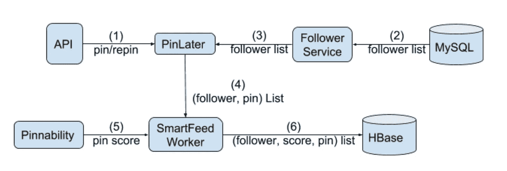
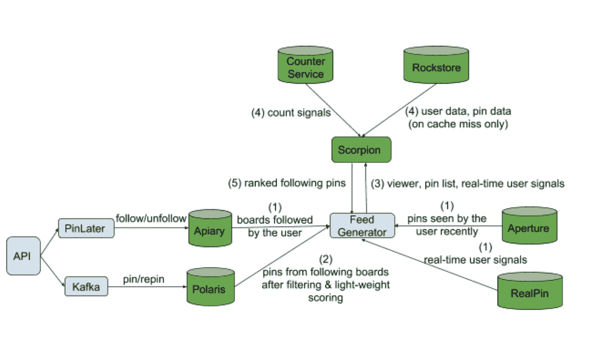
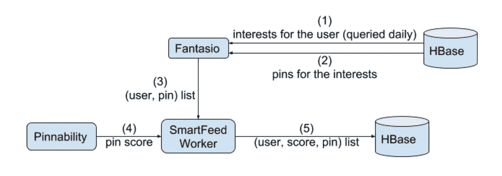
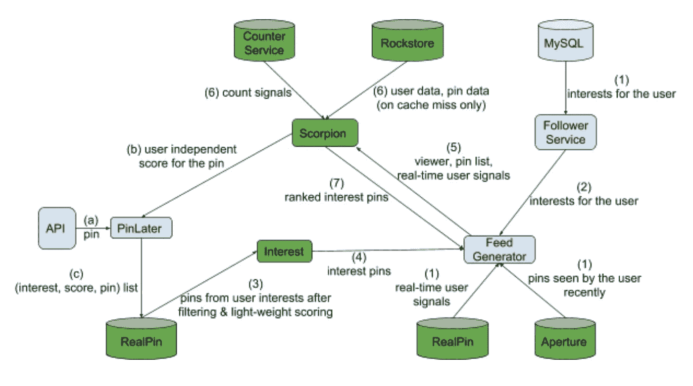
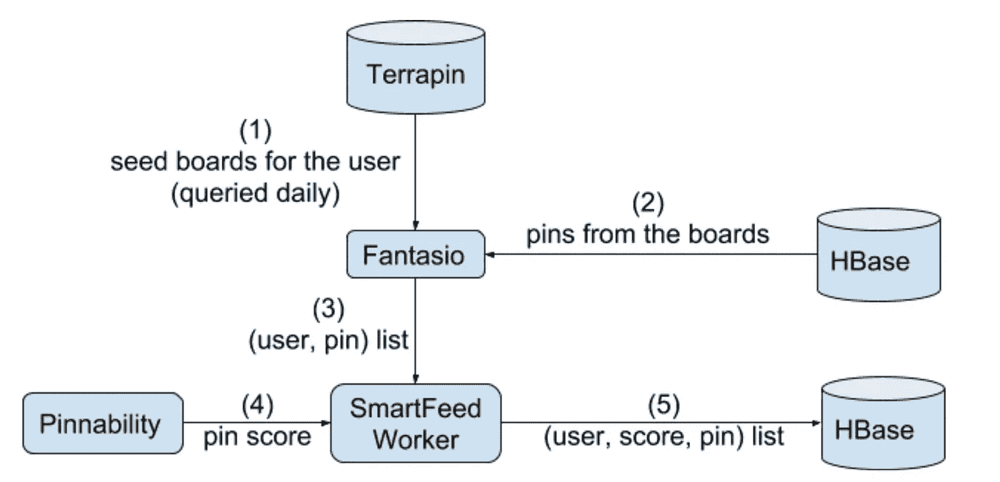
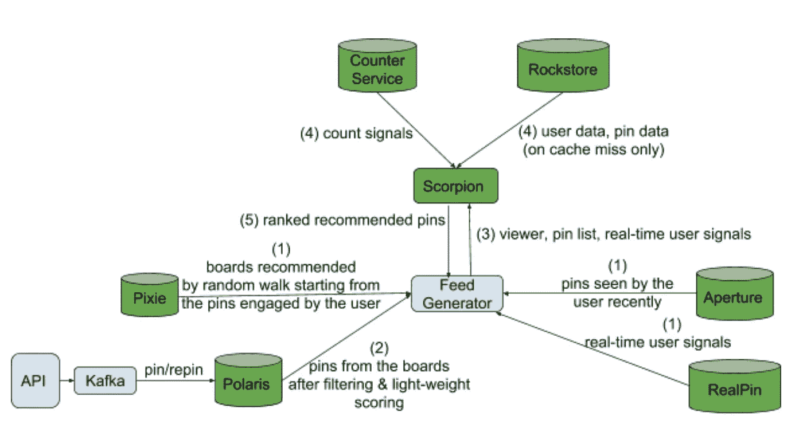

# 构建动态响应的 Pinterest

> 原文：<https://medium.com/pinterest-engineering/building-a-dynamic-and-responsive-pinterest-7d410e99f0a9?source=collection_archive---------1----------------------->

刘波|工程经理，服务系统团队

2015 年，Pinterest 上的大部分内容都是在用户登录之前预先生成的。它被静态地存储在 HBase 中，并在进入服务时被直接服务。(更多细节可以在博客文章[构建更智能的家庭饲料](/@Pinterest_Engineering/building-a-smarter-home-feed-ad1918fdfbe3)中找到。)

虽然我们早期的架构帮助我们在 2015 年前将月活跃用户增加到 1 亿，但它有几个弱点，阻碍了我们构建更具动态性和响应性的产品。例如，很难在系统的不同组件上试验不同的想法和模型。由于内容是预先生成的，用于对候选人进行排名的功能可能是几周前的，我们无法利用最新的 Pin/Board/用户数据，更不用说实时用户操作了。我们还必须为每个用户预先生成和存储内容，包括那些从未返回的用户。此外，我们一直在运行大量的并发实验，并且需要为每个实验预先生成和存储内容。存储成本巨大。

尽管一个动态且响应迅速的 Pinterest 对 Pinners 更有吸引力，但它对我们的后端系统提出了苛刻的要求。

为了解决技术问题，我们构建了九个不同的系统，共同为当今完全动态且响应迅速的 Pinterest 产品提供动力。虽然这些系统是为 Pinterest 构建的，但它们解决了许多面向消费者的网络内容分发应用程序的常见问题。在这里，我们将讨论这些系统以及它们如何改变驱动主要 Pinterest 产品的后端架构，包括 Following Feed、Interest Feed 和 Picked For You(推荐)。

# 挑战

首先，需要实时存储和更新下图、所有者到电路板的映射和电路板到引脚的映射。尽管我们的 MySQL 和 HBase 集群中有这些信息，但从这些数据存储中查询这些信息以用于在线应用程序需要太长时间(每个请求不止一次往返、大扇出和大数据扫描)。

另一个巨大的挑战是缺乏高性能的机器学习排名系统，以对每个请求的数千条内容进行排名，P99 延迟为几十毫秒。为了向该 ML 排名系统提供特征数据，需要一些具有批处理和实时更新支持的有状态服务。这些有状态服务不仅必须提供 KV 数据模型，还必须提供更复杂的数据模型，如计数、列表等。这些有状态服务必须以个位数 P99 延迟来回答查询，给定依赖于它们的 ML 排名系统的延迟要求。

最后，我们需要一个候选生成系统来为内容推荐实时提供高质量的候选集。

# 跟随馈送

Fig. 1: Former Following Feed

图 1 描绘了大约 2015 年的以下馈送。每当保存一个 Pin，一个异步任务就被排队到 [Pinlater](/@Pinterest_Engineering/pinlater-an-asynchronous-job-execution-system-b8664cb8aa7d) ，一个异步作业执行系统。该任务将首先通过 follower 服务从 MySQL 检索 Pin 的所有(直接和间接)追随者，然后将(追随者列表，Pin)发送给智能 feed worker。智能 feed 工作器将利用[Pin ability](/@Pinterest_Engineering/pinnability-machine-learning-in-the-home-feed-64be2074bf60)为每个追随者打分，然后将(追随者、分数、Pin)列表插入 HBase。当用户访问 Pinterest 时，我们以用户 id 为前缀扫描 HBase，提取该用户得分最高的 pin。这种实现消耗了不必要的大量存储空间，并且使得利用新信号和试验新想法变得困难。此外，获取关注者列表(步骤 2 和 3)和排名(步骤 5)的长等待时间阻止了我们进行在线实验。

Fig. 2: Current Following Feed

在图 2 所示的当前版本的 feed 中，绿色的组件是新构建的系统，而数据库形状表示有状态服务(在本文中我们使用相同的术语)。从用户到直接和间接跟踪的电路板的映射在 Apiary 中存储并实时更新，这支持适用于在线应用的低延迟查询。在 Polaris 中存储并实时更新板到引脚映射和一些轻量级引脚数据，Polaris 不仅支持基于板的引脚检索，还支持通过传入的 bloom filter 进行过滤，以及轻量级评分来选择高质量引脚。

当向 Feed Generator 发送请求以获取用户的后续 Feed 时，它会同时获取用户的实时信号、用户跟踪的电路板以及用户最近分别从 RealPin、Apiary 和 Aperture 看到的引脚。

RealPin 是一个高度可定制的对象检索系统，为对象存储和时间维度上的数据聚合提供了丰富的数据模型。我们定制了 RealPin 来跟踪和服务实时用户信号。Aperture 最初是为内容重复数据删除而设计的；它存储所有用户事件，包括后端和前端 Pin 印象，并返回任何用户长达几个月的印象历史，所有这些都有个位数的 P99 延迟。Aperture 后来被改编为广告用户行为计数用例，如博客文章[中所述，为广告构建实时用户行为计数系统](/@Pinterest_Engineering/building-a-real-time-user-action-counting-system-for-ads-88a60d9c9a)。

然后，Feed Generator 向 Polaris 发送由用户印象历史组成的公告板列表和 bloom 过滤器。在检索、过滤和应用轻量级评分之后，Polaris 向 Feed Generator 返回一个 pin 列表。最后，这个 pin 列表和实时用户信号被发送到 Scorpion 进行第二次全面评分。Scorpion 是一个统一的 ML 在线排名平台，为生产中的大多数 Pinterest ML 模型提供支持。我们有 Counter service 和 Rockstore 底层 Scorpion 来提供计数信号和用户数据、pin 数据等。请注意，Scorpion 积极地在本地内存中缓存静态特征数据，这是 ML 模型所需的所有特征数据的较大部分。Scorpion 被分片以实现超过 90%的缓存命中率。

# 利息馈送

Fig. 3: Former Interest Feed

图 3 描绘了兴趣馈送架构的 2015 版本，其类似于图 1 中描述的以下馈送。主要区别是内容生成由日常工作触发，源数据存储在 HBase 而不是 MySQL 中。

Fig. 4: Current Interest Feed

# 为您挑选(推荐)

Fig. 5: Former Picked For You (recommendations)

图 5 描绘了 2015 年的“为您挑选”架构。它的内容生成也是由日常工作引发的。定期的离线作业为每个用户生成一个电路板列表，作为 Pin 建议的种子。这些种子板被批量上传到[水龟](/@Pinterest_Engineering/open-sourcing-terrapin-a-serving-system-for-batch-generated-data-7aa2f38c4472)上桌。

Fig. 6: Current Picked For You (recommendations)

图 6 描述了当前的“为你挑选”架构。Pixie 是一个为实时董事会推荐而构建的新服务。它会定期将离线生成的由电路板和引脚组成的图形加载到内存中。当用户请求推荐的板时，通过使用用户使用的引脚作为起点，在 Pixie 图中模拟随机行走。(更多信息请见博客文章[介绍 Pixie，一个先进的基于图形的推荐系统](/@Pinterest_Engineering/introducing-pixie-an-advanced-graph-based-recommendation-system-e7b4229b664b)。)其余系统类似于跟进给。

# 简短的技术讨论

在从头构建系统以实现完全动态和响应的 Pinterest 产品的整个过程中，我们需要做出合理权衡的设计决策，解决技术问题，并优化系统以满足在线应用的延迟要求。

回到 2015 年，Pinterest 的大多数后端系统都是用 Java 实现的，我们还没有用 C++构建任何系统。正如我们在前面几节中看到的，新系统必须通过大扇出(有时是所有分片扇出)实现低长尾延迟，并且一些系统是 CPU 密集型的(例如 Scorpion、Pixie 和 RealPin)。我们选择采用 C++11，FBThrift，Folly，RocksDB 来构建这些系统。一开始很慢，因为我们必须安装所有的依赖项，构建几个基本的工具库(比如统计报告、请求路由等等。)，并设置我们的构建和发布环境。它最终得到了回报，因为我们使用我们的新基础在整个公司范围内建立了越来越高效和有效的系统。

RocksDB 是一个嵌入式存储引擎。为了在其上构建分片和复制的分布式系统，数据复制是我们需要解决的第一个问题。我们从写入所有副本的方法开始，后来转向主从复制。我们的系统运行在 AWS 上，AWS 将其网络建模为区域、可用性区域和放置组。值得注意的是，跨 AZ 网络流量的费用很高。我们构建了一个基于前缀的 AZ 感知流量路由库，最大限度地减少跨 AZ 流量，并支持所有可能的路由模式(例如，单分片、多分片和全分片扇出)。该库还监视 TCP 连接的健康状况，并在副本之间适度地对请求进行故障转移。需要注意的一点是，当远程对等体上的操作系统崩溃时，我们需要利用 TCP_USER_TIMEOUT 套接字选项来快速失败。由于各种原因，在不关闭 TCP 连接的情况下，VM 实例在 AWS 上变得不可达是很常见的。如果没有设置 TCP_USER_TIMEOUT，典型的 TCP 实现可能需要超过 10 分钟来向用户空间应用程序报告问题。(关于数据复制和流量路由的更多细节可以在 [Rocksplicator Github repo](https://github.com/pinterest/rocksplicator) 和博客文章[开源 Rocksplicator，一个实时 RocksDB 数据复制器](/@Pinterest_Engineering/open-sourcing-rocksplicator-a-real-time-rocksdb-data-replicator-558cd3847a9d)中找到。)

Pinterest 超过 10%的 AWS 实例运行我们的系统。为了减少运营开销和服务停机时间，我们将 Apache Helix(Linkedin 开源的集群管理框架)与 Rocksplicator 进行了集成。(更多细节可以在博客文章[中找到。)](/@Pinterest_Engineering/automated-cluster-management-and-recovery-for-rocksplicator-f1f8fd35c833)

在实施和生产这些系统时，我们做了大量的优化和调整。例如，我们需要调整 RocksDB 压缩线程数，并将 L0 和 L1 设置为相同的大小，以减少写入放大并提高写入吞吐量。

其中一个计数器服务集群必须支持为 P99 延迟小于 20 毫秒的单个请求返回数万个计数。为了实现这一点，我们切换到 RocksDB 普通表，并将其配置为本质上类似于内存哈希表的东西。我们还必须切换到 float16 以减少数据大小，并手动将返回计数列表编码为二进制字符串以节省序列化和反序列化开销。对于大的请求，计数器服务也可以利用多个线程来处理单个请求。

虽然 RealPin 是作为一个对象检索系统设计的，但我们对它进行了定制，将其作为一个在线评分系统运行了几个月。然而，我们注意到，考虑到计算和存储在同一位置，操作该系统是一个挑战。随着我们开始使用更多类型的特征数据，这个问题变得更加严重。最终，我们开发了新的 Scorpion 系统，它将计算与存储分离，并将特征数据缓存在计算节点上。

由于 Scorpion 是 CPU 密集型的，并且运行在大型集群上，我们需要在优化它上投入大量资金。我们仔细地调优了 Scorpion 线程模型，以在高并发处理和低上下文切换或同步开销之间取得良好的平衡。最佳点不是固定的，因为它取决于许多因素，例如数据是从内存、本地磁盘还是 RPC 获取。我们优化了内存中的 LRU 缓存模块，实现了零拷贝；也就是说，缓存的数据在没有任何数据复制的情况下被提供给 ML 模型。实施批量评分是为了让 GCC 更好地利用 SIMD 指令。GBDT 模型中的决策树在内存中被压缩并仔细布局，以实现更好的 CPU 缓存命中率。对象级同步避免了高速缓存未命中的大爆发。

储存在 Aperture 中的数据沿时间维度存储。我们对旧数据使用冻结数据格式，它是不可变的，适合快速读取访问。更新的数据以可变格式存储，这对于更新是有效的。利用 max_successive_merges RocksDB 选项来限制 mem-table 中来自同一个键的合并操作数的数量。此设置对于 Aperture 实现低读取延迟至关重要，因为它可能需要读取具有大量合并操作数的 RocksDB 键，这在读取时处理起来非常昂贵。为了节省存储空间，RocksDB 被配置为对不同级别使用不同的压缩策略和乘数因子。

如果你对这些挑战感兴趣，[加入我们的团队](https://careers.pinterest.com/careers/engineering)！请关注这个博客，了解更多关于我们一些系统开源的文章和信息。

*鸣谢:除了服务系统团队之外，我们还要感谢我们的客户团队提供了有用的反馈，帮助构建和采用这些系统——主页反馈、相关 pin、广告、兴趣、应用科学、视觉搜索、垃圾邮件等。*