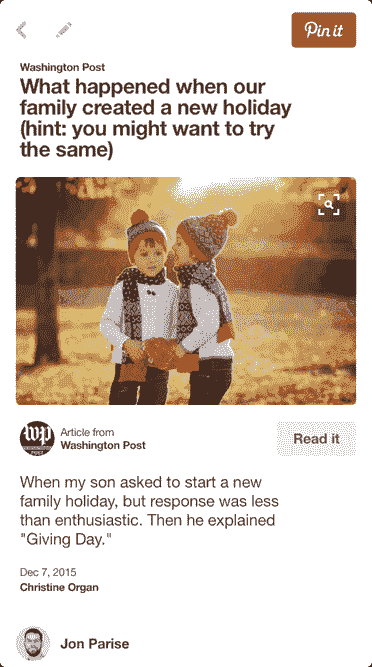
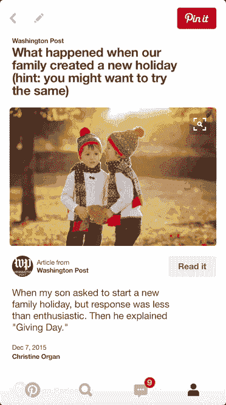
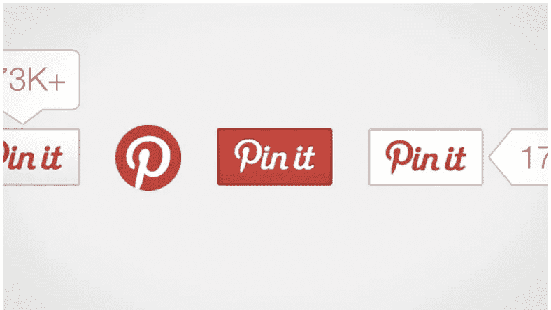

# 使用 AMP 构建更快的移动网络体验

> 原文：<https://medium.com/pinterest-engineering/building-a-faster-mobile-web-experience-with-amp-a73c651ded7?source=collection_archive---------1----------------------->

Jon Parise | Pinterest 技术架构主管，核心经验

作为一个拥有数十亿 pin 的发现引擎，Pinterest 在内容相关、快速且易于访问的情况下表现最佳。超过 80%的 Pinners 在移动设备上使用 Pinterest，我们很高兴能够与谷歌、Wordpress、Twitter 和开源社区合作，在全行业范围内开发一种轻量级、更快版本的移动网页，即[加速移动网页(AMP)](https://www.ampproject.org/) 。

[AMP](https://amphtml.wordpress.com/2015/12/09/continued-momentum-for-the-amp-project) 致力于解决移动网络上每个人的一个痛点——速度。AMP 是用于快速移动优化内容的开源架构。它基于 AMP HTML，HTML 的一个受限子集，以及一组定义良好的自定义元素和基于 JavaScript 的组件。结果是令人难以置信的快速浏览体验，通过网络加载最少的数据。

在早期测试中，我们发现 AMP 页面的加载速度比传统的移动优化页面快 4 倍，使用的数据量少 8 倍。一个更好、更快的移动网络对所有人都有好处，包括用户、像 Pinterest 这样的平台和出版商。

**Pinterest 放大了**



**没有放大器的 Pinterest】**



## 传送 AMP 内容

Pinterest 上的每一个大头针都是一个可视化书签，可以链接回它的原始网站。我们定期使用[阿拉戈克，我们的 URL 获取系统](https://engineering.pinterest.com/blog/fetching-and-serving-billions-urls-aragog)访问这些网站。然后，我们使用一个称为 Atlas 的内部系统来解析获取的 HTML 内容(我们将在以后讨论)。除了收集我们在 [Rich Pins](https://business.pinterest.com/rich-pins) 上包含的元数据，我们还了解关于页面本身的有用信息，例如它的规范链接、主要语言以及它是否提供其内容的 AMP HTML 版本。发布者可以使用我们的 [URL 调试器](https://developers.pinterest.com/tools/url-debugger/)来查看页面是如何被解析的。

页面使用<link>关系宣传其 AMP HTML 等价物:

```
<link rel="amphtml" href="http://www.example.com/news/article.amp.html">
```

我们将所有这些信息作为链接条目的一部分记录在阿拉戈克的 URLStore 中。我们使用这些元数据，以及我们收集的其他信号来选择我们在应用程序中使用的最高质量的链接。这为 Pin 用户提供了最佳的浏览体验，无论他们何时点击 Pin 以了解更多信息。

## Pinterest 小工具

我们还开发了一个 AMP 组件，允许出版商在他们的 AMP HTML 页面上添加[大头针按钮](https://business.pinterest.com/en/pin-it-button)和嵌入式大头针。

开发 [< amp-pinterest >扩展](https://github.com/ampproject/amphtml/blob/master/extensions/amp-pinterest/amp-pinterest.md)是为了充分利用 amp 的 JavaScript 运行时。从性能角度来看，这很棒，它让出版商可以非常容易地将 Pinterest 元素添加到他们的页面中。

这里我们有一个“锁定”按钮:

```
<amp-pinterest height=20 width=40
  data-do="buttonPin"
  data-url="http://www.flickr.com/photos/kentbrew/6851755809/"
  data-media="http://farm8.staticflickr.com/7027/6851755809_df5b2051c9_z.jpg"
  data-description="Next stop: Pinterest">
</amp-pinterest>
```



这里有一个嵌入式[引脚:](https://www.pinterest.com/pin/99360735500167749/)

您可以使用我们的[小部件构建器](https://developers.pinterest.com/tools/widget-builder/?embedType=amp)为您的 AMP 页面创建自己的按钮和小部件。

## 展望未来

我们目前正在与一小组合作伙伴一起测试 AMP 页面。我们将继续致力于 AMP 项目，并为之做出贡献，我们鼓励您在自己的网站上看看 AMP，这样我们就可以一起让移动网络变得更好。

鸣谢:感谢肯特·布鲁斯特为 Pinterest AMP 组件所做的工作，感谢李璇教 Atlas 识别 AMP 内容。