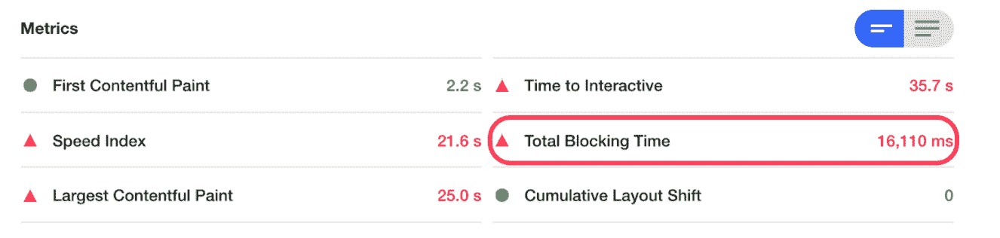

# 使用任务后计划程序构建更快的 Web 体验

> 原文：<https://medium.com/airbnb-engineering/building-a-faster-web-experience-with-the-posttask-scheduler-276b83454e91?source=collection_archive---------1----------------------->

你上一次在网站上打开一个页面并试图多次点击某个东西以使其工作是什么时候？或者你最后一次在旋转木马上滑动图像时，它会不自然地结巴和移动？

虽然这种类型的体验经常发生，但我们可以使用工具来帮助我们为用户提供更好、更具响应性的体验。有效地安排和优先处理任务可能是反应灵敏的体验和感觉迟钝的体验之间的区别。

在 Airbnb，我们一直在与 Chrome 团队合作，使用优先任务调度程序来提高性能，以实现新的模式并提高现有模式的性能。

# 满足优先任务后计划程序的要求

[优先级任务后 API](https://github.com/WICG/scheduling-apis/blob/main/explainers/prioritized-post-task.md) 旨在为我们高效调度任务提供更多的灵活性和能力。与 [requestIdleCallback](https://developer.mozilla.org/en-US/docs/Web/API/Window/requestIdleCallback) 和 [setTimeout](https://developer.mozilla.org/en-US/docs/Web/API/WindowOrWorkerGlobalScope/setTimeout) 类似，有效地使用它可以帮助减少[总阻塞时间](https://web.dev/tbt/)、[第一次内容绘制](https://web.dev/fcp/)、[输入延迟](https://web.dev/fid/)和[其他关键指标](https://web.dev/custom-metrics/#long-tasks-api)。

虽然许多性能工作都集中在初始页面加载上，但我们希望在页面加载后改善用户体验。我们以多种方式使用了任务后调度器——从我们如何在传送带上预加载图像到使我们的地图更加灵敏。

为了了解自这项工作开始以来我们所取得的进展，[我们创建了新的真实用户监控性能指标](https://www.youtube.com/watch?v=e215_uiU3LQ)，并利用来自工具[网页测试](https://www.webpagetest.org/easy)和[灯塔](https://developers.google.com/web/tools/lighthouse)的现有基于实验室的指标。

**怎么开始的**

Total Blocking Time was nearly 16 seconds loading our search results page

最近怎么样

Total Blocking Time improved by nearly 10 seconds for a typical mobile web user on average hardware

# 什么是任务后调度程序？

与 requestAnimationFrame、setTimeout 或 requestIdleCallback 非常相似，scheduler.postTask 允许我们在浏览器的事件循环上调度一个函数。然后，该功能将被优先化并由浏览器运行。

“前两个——微任务和不让步——通常与计划和提高响应能力的目标是对立的。它们是开发者可以并且确实使用的隐含优先级。”

# 分解长时间的任务

为了提高响应能力，我们可以也应该将我们的长期任务分解开来。下面是一个长任务的例子，它设置了基本的错误跟踪和事件日志。注意浏览器是如何将任务标记为一个[长任务](https://w3c.github.io/longtasks/)的。

249ms long task early during the page lifecycle

一旦我们确定了一个长任务，我们可以使用 postTask 将任务分解成更小的任务。

After using scheduler.postTask, we no longer have any long tasks, only smaller ones below the Long Task threshold

# 你好，任务后

目前，postTask 是在 chrome://flags 下的# enable-experimental-web-platform-features 标志后面的 chrome 中实现的[，并计划在即将到来的版本中完全支持 Chrome。虽然 polyfill 已经存在，但在撰写本文时，polyfill 还没有被开源。官方的 polyfill 状态可以在 WICG repo](https://www.chromestatus.com/features/6031161734201344) 上追踪，但在那之前我们可以在 Chrome Canary 上试用。

在上面的例子中，我们向 postTask 传递了一个新的**延迟**和**优先级**参数，告诉它我们希望在等待 1 秒钟后在后台运行我们的任务。任务后调度程序目前支持 3 种不同的优先级。

任务后调度器的好处之一是它建立在[中止信号](https://developer.mozilla.org/en-US/docs/Web/API/AbortSignal)之上，允许我们取消一个已经排队但尚未执行的任务。API 还定义了一个新的 [TaskController](https://wicg.github.io/scheduling-apis/#sec-task-controller) ，它允许信号使用优先级来控制任务和优先级。

# 推迟非关键任务

大多数网站加载了大量的第三方库，比如 Google Analytics、Tag Manager、logging libraries 等等。衡量和理解这些对用户初始加载体验的影响很重要。

例如，Airbnb 优先考虑让用户可以输入搜索词，这需要我们加载一些 JavaScript 并用 React“水合”我们的页面。将某些任务推迟到关键时刻完成可能是有意义的。

# 介绍实验性的“scheduler.wait”

scheduler.wait 是一个提议的扩展，允许等待页面中的某个里程碑，在我们的例子中是一个定制的 DOM 事件。让我们看看如何在加载完页面后使用它来加载 Google Tag Manager。

Without a polyfill, this won’t work in any browser yet!

这种方法的美妙之处在于它的简单性——我们得到一个承诺，我们可以阻止它，直到我们的自定义事件被触发。

我们还可以在任何任务中指定这个选项，作为传递给 postTask 的选项，从而进一步简化我们的 Google Tag Manager 注册。

按照现在的定义，多填充等待函数相对来说比较容易，因为它采用与 postTask 相同的选项，但不需要指定任务。

我们还需要在上面的 shim 中使用的 postTask 方法周围创建一个包装器，以便在调用 scheduler.postTask 时支持事件选项。

上面 waitForEvent 调用的代码是一个将 DOM 事件映射到 promise 的包装器，promise 在触发时解析，允许我们等待 postTask 包装器中的任何事件。对于这将如何进行，还没有标准定义的方法。我们的实现非常简单——例如，如果我们在一个单页面应用程序中，并且页面发生了变化，它不能在事件被触发后重置事件的状态。在这种情况下，我们可能想要触发一个新的加载事件。在[提议的 API 增加](https://github.com/WICG/scheduling-apis#apis-and-status)中有一系列的选项正在探索，所以预计这将继续发展。

# 用例:预取重要资源

在用户加载之前，预加载图片轮播中的下一张图片或页面的细节，可以极大地提高站点的性能和用户的感知性能。我们最近使用 postTask 调度器为我们的主要搜索结果图像传送带实现了一个延迟的、交错的、可取消的图像预加载器。让我们看看如何使用 postTask 构建它的简单版本。

**对我们列表传送带上的图像预加载器的要求:**

*   等到列表在屏幕上大约 50%可见
*   延迟一秒；如果用户仍在查看它，加载转盘中的下一个图像
*   如果用户在一幅图像上滑动，预载接下来的三幅图像，*每一幅在前一幅开始后的 100 毫秒*
*   如果圆盘传送带在一秒钟计时器结束之前的任何时候离开了视窗，我们应该取消所有尚未完成的预加载任务。如果用户导航到另一个页面，也取消所有的预加载任务

When the next slide scrolls into view, the 2nd image loads. Once we swipe, the next 3 load, each beginning 100ms after the previous one

让我们从第一部分开始，如果用户将卡片滚动至少 50%一秒钟，就预加载转盘中的下一张图像。虽然我们在接下来的几个示例中使用 React，但这并不是必需的。这里的所有概念也可以用其他框架实现，或者更重要的是，根本不用框架。

假设我们有一个名为 preloadImages 的方法，它开始获取下一个图像，并在完成图像预加载后切换一个布尔字段。

我们可以将它与交叉点观察器和任务后调度器结合起来，并在一秒钟内完成 50%视图后加载第二个图像。

幕后有一大堆逻辑在运行，所以让我们把它分解成更小的步骤来理解发生了什么。

让我们先来看看如何确定一个用户是否至少有 50%进入了我们的视野。对于这个任务，我们可以使用交叉点观察器。我们使用一个小助手来设置它们，但是你也可以不用库来使用它们。

既然我们已经知道何时我们已经滚动到视图的 50%,我们可以使用一个结合了 scheduler.postTask 的 useEffect 钩子来等待它们在视图中停留一秒钟。

因为我们还传递了一个关联的 TaskSignal，所以当用户滚动到视图之外时，对 abort()的调用将取消任何对 preloadImages 的未决调用。我们还注意删除对控制器的引用，以便在它们滚动回视图时允许重新启动流。

**交错网络资源** 我们需要实现的最后一个需求是交错接下来的几个图像请求，每个请求在用户在旋转木马上滑动之后 100 毫秒。让我们看看如何使用任务后调度程序来修改现有代码，以解决这种情况。首先，让我们添加一个钩子来调用我们的预加载逻辑，当用户与它交互时，有三个图像要预加载。我们将跳过第一张图片，因为我们已经加载了它。

任务后调度器的目标之一是提供一个底层 API 来构建。我们已经建立了一个集成，当在 React 中使用我们认为非常有用的模式或策略时，它可以让我们执行许多不同的模式或策略。

# 在 React 中有效使用后任务

Opt-in debugging, showing total time taken and other useful information

同时与 React、Vue、Angular、Lit 等进行自定义集成。没有必要，我们可以通过这样做获得一些主要的好处。例如，在 React 中，当一个组件卸载时，我们通常希望取消任何仍在排队的任务。

我们可以通过将一个函数作为返回值传递给 useEffect 来实现。然而，记住每次都这样做是一个挑战，不这样做可能会导致内存泄漏。当我们调用 abort()时，记住捕捉调度程序抛出的任何 AbortError 也是一个挑战，因为这些都是非常期望的，但不是我们可以一概而论的异常。

让我们为 usePostTaskScheduler 挂钩列出一些好处，让人们更容易使用。

*   传递一个 enabled 标志，允许绕过调度程序，使 A/B 测试更容易
*   允许轻松取消，包括卸载时自动取消
*   将信号自动传播到 scheduler.postTask 和 scheduler.wait
*   捕捉和压制流产或任何类似的东西
*   支持强大的调试功能
*   允许为常见模式指定一个策略，比如我们在这篇文章中提到的 2 个模式
*   添加一个等待延迟完成的挂钩

虽然深入研究这个钩子的实现超出了本文的范围，但是让我们看看它如何简化 React 中的 postTask 调度程序的使用。让我们延迟加载一个高成本、低重要性的 React 组件，直到加载事件触发之后，并在加载之后清除一些旧的 localStorage 状态。

在这里我们可以看到，我们有一个布尔标志，它将指示加载何时完成，还有一个传统的回调，它让我们可以清理 localStorage 键。在这种情况下，如果该组件在该事件之前卸载，我们将取消 cleanupLocalStorageKeys 的任务，并且不再呈现<expensivecomponent>。在我们的例子中，ExpensiveComponent 是异步加载的，因此通过延迟它，我们可以在阻塞时间和包大小成本方面显著降低初始水合的成本。</expensivecomponent>

让我们看看如何在后台加载事件后五秒再加载我们的服务人员。

Loads our service-worker 5 seconds after the [load](https://developer.mozilla.org/en-US/docs/Web/API/Window/load_event) event fires

# 前方的道路

**浏览器兼容性** Chromium 率先实现并原型化了这个新的 API 然而，该 API 正在 [WICG](https://github.com/WICG) 中公开开发，目标是标准化并被所有浏览器采用。同样值得注意的是，即使没有原生支持，我们也看到了 Safari 和 Chrome 等浏览器通过使用 polyfill 实现了许多性能提升，因为它强制实施了良好的优先级和调度模式。

我们很高兴有机会测试[任务后调度器](https://github.com/WICG/scheduling-apis/blob/main/explainers/prioritized-post-task.md)，希望在这篇博文中你能感受到它带来的开发者体验和性能提升。我们期待着看到它通过标准机构的进展，并开始登陆 web 浏览器供应商。

# 鸣谢❤️

这一努力是在这么多人的支持下才得以实现的。我们感谢 Scott Haseley(谷歌)、Shubhie Panicker(谷歌)、Aditya Punjani、Josh Nelson、Elliott Sprehn、Casey Klimkowsky、Etienne Tripier、Victor Lin 和 Kevin Weber。

# 改善顾客体验

在过去的一年里，除了性能，我们还致力于重新设计我们技术堆栈的大部分，以支持我们的客户的新产品使用案例。通过注册参加我们即将于 6 月 8 日中午 12 点(太平洋标准时间)举行的技术讲座[再造旅行](https://reengineeringtravel.splashthat.com/)，与我们的客户体验技术团队一起走进幕后。在本次演讲中，我们将分享更多关于我们如何构建平台和流程以适应当今旅行的信息。

*JavaScript 是 Oracle America，Inc .的注册商标。React 是脸书，Inc .的注册商标。Chrome、Google Analytics、Angular 和 Chromium 是 Google LLC 或 Google，Inc .的注册商标。除了 Airbnb 与这些公司之间的各种协议中合法达成并记录的权利和所有权之外，Airbnb 对任何这些产品不主张任何权利或所有权。*