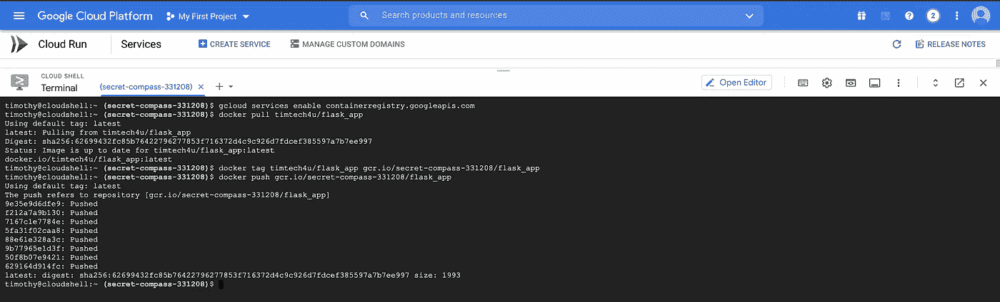

# 使用 Docker 构建 Flask 应用程序并部署到 Google Cloud Run。

> 原文：<https://medium.com/google-developer-experts/building-a-flask-app-using-docker-and-deploy-to-google-cloud-run-8f311ad36040?source=collection_archive---------0----------------------->


了解如何将应用程序打包成容器是一个最佳实践，也是了解如何将它们部署到云的一个很好的知识。

*在本教程中，我将讨论如何构建一个* [*Flask*](https://flask.palletsprojects.com/) *应用程序，并使用*[*Docker*](https://www.docker.com/)*将其部署到云运行。*

# 概观

1.  Docker —基础和安装
2.  Flask —先决条件和创建 Hello World 应用程序
3.  构建 Docker 容器并推送到容器注册中心
4.  部署到 Google 云运行
5.  结论

# Docker —基础和安装

[Docker](https://www.docker.com/) 是一个开源的应用容器化平台，支持开发者将应用打包到容器中。容器是一个标准的软件单元，它将软件代码及其所有依赖项打包在一起。容器成为分发和测试应用程序的单元。

容器也是图像的可运行实例。您可以使用 Docker 创建、启动、停止、移动或删除容器。你可以按照下面的步骤来设置 Docker。

# 安装 Docker

Docker 可在多种 Linux 平台、Mac OS 和 Windows 操作系统上使用。

关于安装 Docker 的详细说明，你可以阅读官方文档。

如果你是 Mac OS 用户，你可以简单地使用 HomebrewCask，一个用于在 Mac 上安装 GUI 软件的 Homebrew 扩展。只需运行以下命令。

`brew cask install docker`


# Flask —先决条件和创建 Hello World 应用程序

Flask 是一个用 Python 开发的 web 微框架，它易于学习和使用，不需要特殊的工具或库。Flask 框架是轻量级的、灵活的，但却是高度结构化的，这使得它比其他框架更受青睐。

要开始使用 Flask，您需要安装以下要求。点击每个项目，访问其官方安装页面。

*   [Python](https://www.python.org/downloads/)
*   Python 的包安装程序— [Pip](https://pip.pypa.io/en/stable/installation/)

一旦安装了 Python 和 Pip 我们可以使用下面的命令继续安装 Flask。

`pip install flask`


现在我们已经安装了 Flask，让我们继续编写应用程序。

# 创建 Hello World 应用程序

下面的代码片段是我们的 Hello World 应用程序。

```
# Filename: app.pyfrom flask import Flask # import Flask in Pythonapp = Flask(__name__) # creates an instance of a Flask app@app.route('/') # route called by userdef index(): # function called by '/' route return 'Hello World! This App is built using Flask.'app.run(host='0.0.0.0', port=8000) # starts the web app at port 8000
```

每一行都包含 Python 注释，以散列字符(#)开头，解释它的作用。将文件保存为 *app.py* 并运行以下命令。

`python app.py`


我们有一个单一的路由，它返回一条显示在浏览器上的消息，如下所示。


现在我们有了一个可以工作的应用程序，让我们继续构建我们的 Docker 映像。

# 构建 Docker 容器并推送到容器注册中心

在本节中，我们将把我们的应用程序及其依赖项打包成一个 Docker 映像，然后将该映像推送到 Docker Hub——一个容器注册表。

[Docker Hub](https://hub.docker.com/) 是 Docker 提供的一项服务，用于寻找和分享容器。如果您没有 Docker ID ，您需要[创建一个 Docker ID](https://hub.docker.com/signup)。

您可能已经注意到了一条警告，该警告将内置的 Flask 服务器描述为对生产不安全。为了解决这个问题，我们将使用 guni corn——用于 UNIX 的 Python WSGI HTTP 服务器。

创建一个 *requirements.txt* 文件来存放我们的应用程序需要的依赖项。

```
# requirements.txtflaskgunicorn
```

接下来，让我们设置我们的 *Dockerfile，*一个包含 Docker 构建映像所需的所有命令的文件。

```
# DockerfileFROM python:alpine3.7COPY requirements.txt /RUN pip3 install -r /requirements.txtCOPY app.py .CMD ["gunicorn"  , "-b", "0.0.0.0:8888", "app:app"]
```

我们将引入 [Python Alpine](https://hub.docker.com/_/python) 作为我们的基础映像，然后继续复制&安装我们的依赖项并设置我们的应用程序

最后一行告诉 Docker 运行 *gunicorn* ，第一个“app”参数作为模块，第二个“app”参数作为代码中定义的 WSGI callable 的名称。

与你的 *app.py* 、 *requirements.txt 和 Dockerfile 放在同一个目录下。您应该运行以下命令来构建 Docker 映像。*

`docker build -t flask_app .`


既然我们已经建立了自己的形象。我们也可以使用以下命令运行它:

`docker run -it -p 8000:8888 flask_app`


瞧啊。它跑了！您可以访问端口 *8000* 上的应用程序，如下图所示:


# 推送到容器注册中心

现在让我们将我们的图像推送到 Docker Hub。为此，您可以使用您的凭据登录到[https://hub.docker.com](https://hub.docker.com)，然后点击**创建存储库。**


您需要使用以下命令从终端登录 Docker CLI

`docker login`


完成后，您应该能够使用以下命令将图像推送到 Docker Hub

`docker tag flask_app timtech4u/flask_app`

`docker push timtech4u/flask_app`


您应该用自己的 Docker Hub ID 替换 *timtech4u* 。您还可以验证映像是否在 Docker Hub 注册表中。


我们已经完成了大部分困难的部分，现在您可以将捆绑的 Docker 映像部署到您选择的任何云提供商上。

在下一节中，您将看到如何在 Google 云平台上轻松部署映像。

# 部署到 Google 云运行

在本指南中，我们将把我们的映像部署到 [Google Cloud Run](https://cloud.google.com/run) ，这是一个在 Google Cloud Platform (GCP)上运行容器的无服务器环境。

要开始使用谷歌云，你可以在这里注册:[https://cloud.google.com/free](https://cloud.google.com/free)获得 300 美元的免费积分。完成后，请访问此处的云运行页面:[https://console.cloud.google.com/run](https://console.cloud.google.com/run)


需要将 Docker 映像推送到 Google 容器注册中心(GCR)，然后才能在 Cloud Run 上部署。您可以通过在 Cloud Shell 上运行一些命令来轻松做到这一点。

要激活 Google Cloud Shell，请点击屏幕右上角蓝色导航栏上的*终端图标*。然后运行以下命令，第一个命令是启用 GCR。

`gcloud services enable containerregistry.googleapis.com`

`docker pull <docker-id>/<image-name>`

`docker tag <docker-id>/<image-name> gcr.io/<project-id>/<image-name>`

`docker push gcr.io/<project-id>/<image-name>`

需要对以下内容进行编辑，以符合您的使用情形:

*   <docker-id>— Docker Hub ID 或用户名</docker-id>
*   <image-name>—图像名称</image-name>
*   <project-id>— GCP 项目 ID</project-id>



现在，您可以在云运行页面上点击**创建服务**。选择您刚刚推送的图像。


点击**高级设置**开关，按照之前的定义配置容器的端口号


点击下一步的**并选择**允许未认证调用**以公开部署。**

几分钟后，您的服务将被部署并生成一个 URL。

您可以单击云运行页面上的服务来访问其属性和生成的 URL。


# 结论

在本文中，我介绍了使用 Docker 封装 Flask 应用程序的基础知识。我已经向您展示了如何将 Docker 图像上传到 Docker Hub、Google Container Registry 并部署到 Google Cloud Run。