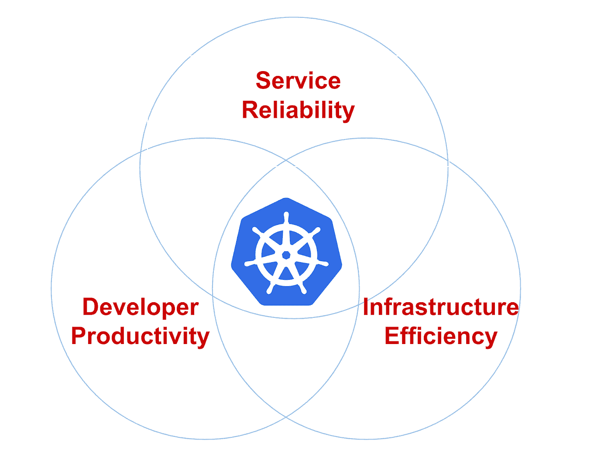
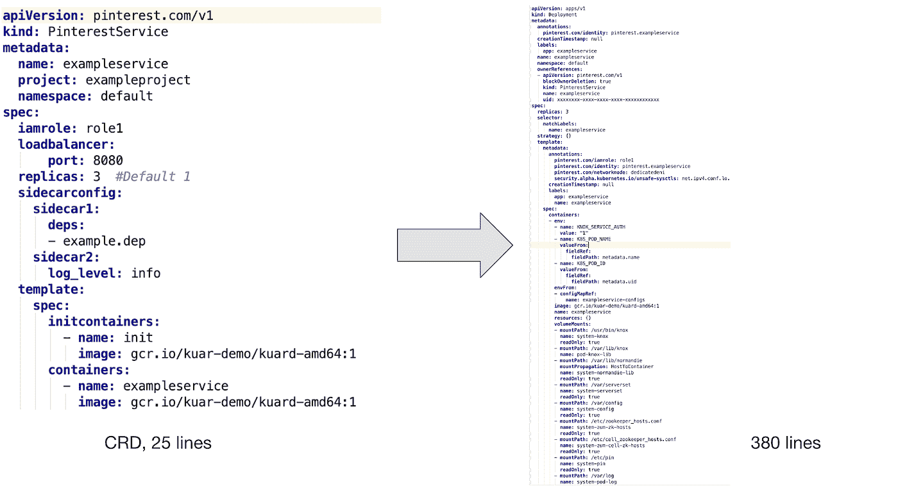
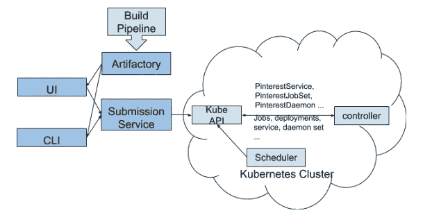

# 在 Pinterest 建立一个 Kubernetes 平台

> 原文：<https://medium.com/pinterest-engineering/building-a-kubernetes-platform-at-pinterest-fb3d9571c948?source=collection_archive---------0----------------------->

Lida Li，June Liu，Rodrigo Menezes，Suli Xu，，Roberto Rodriguez Alcala | Pinterest 软件工程师，云管理平台

# 为什么是 Kubernetes？

多年来，3 亿 Pinners 在 Pinterest 上保存了超过 40 亿个董事会的超过 2000 亿个 pin。为了服务于这一庞大的用户群和内容池，我们开发了数千种服务，从少数 CPU 的微服务到占据整个虚拟机机群的大型整体服务。还有来自各种不同框架的各种批处理作业，它们可能是 CPU、内存或 I/O 密集型的。

为了支持这些多样化的工作负载，Pinterest 的基础设施团队面临着多重挑战:

*   工程师在启动工作负载时没有统一的体验。无状态服务、有状态服务和批处理作业是由完全不同的技术栈部署和管理的。这为我们的工程师创造了一个陡峭的学习曲线，也为基础设施团队带来了巨大的维护和客户支持负担。
*   管理自己的虚拟机群的工程师给基础架构团队带来了巨大的维护负担。操作系统或 AMI 升级之类的简单操作可能需要数周到数月时间。在这些流程中，生产工作负载也会受到干扰，而这些流程本应对他们透明。
*   很难在分离的管理系统之上构建基础设施治理工具。对于我们来说，确定谁拥有哪些机器以及它们是否可以安全回收更是难上加难。

容器编排系统提供了一种统一工作负载管理的方法。它们还为更快的开发速度和更简单的基础设施治理铺平了道路，因为所有运行的资源都由一个集中的系统管理。

图 1:基础设施优先级(服务可靠性、开发人员生产力和基础设施效率)

Figure 1: Infrastructure priorities (Service Reliability, Developer Productivity and Infra Efficiency)

Pinterest 的云管理平台团队早在 2017 年就开始了他们在 Kubernetes 上的旅程。到 2017 年上半年，我们将大部分生产工作负载进行了分类，包括核心 API 和 Web 机群。然后，通过构建 prod 集群并在其上运行实际工作负载，对不同的容器编排系统进行了广泛的评估。到 2017 年底，我们决定走 Kubernetes 的道路，因为它的灵活性和广泛的社区支持。

到目前为止，我们已经基于 Kops 构建了自己的集群引导工具，并将现有的基础设施组件集成到我们的 Kubernetes 集群中，如网络、安全性、指标、日志记录、身份管理和流量。我们引入了特定于 Pinterest 的定制资源来建模我们独特的工作负载，同时向开发人员隐藏运行时的复杂性。我们现在专注于集群稳定性、可扩展性和客户加入。

# Kubernetes，Pinterest 方式

运行 Kubernetes 以支持 Pinterest 规模的工作负载，同时使其成为一个受我们工程师喜爱的平台，这面临着许多挑战。

作为一家大型组织，我们在基础设施工具方面投入了大量资金，例如处理证书和密钥分发的安全工具、支持服务注册和发现的流量组件，以及提供日志和指标的可见性组件。这些都是建立在艰难的经验教训之上的组件，所以我们希望将它们集成到 Kubernetes 中，而不是重新发明轮子。这也使得迁移更加容易，因为我们的内部应用程序已经有了所需的支持。

Figure 2: Runtime support for applications. To run the application in the middle, there are many other support components that need to be co-located with it.

另一方面，Kubernetes 的本地工作负载模型，如部署、作业和 daemonsets，不足以模拟我们自己的工作负载。可用性问题是采用 Kubernetes 的巨大障碍。例如，我们已经听到服务开发者抱怨丢失或错误配置的入口搞乱了他们的端点。我们也看到过批量作业用户使用模板工具生成相同作业规范的数百个副本，并以调试噩梦告终。

对工作负载的运行时支持也在发展，所以在同一个 Kubernetes 集群上支持不同的版本是非常困难的。想象一下，如果我们需要面对许多版本的运行时，客户支持的复杂性，以及为它们升级或打补丁的困难。

## Pinterest 自定义资源和控制器

为了给我们的工程师采用 Kubernetes 铺平一条更容易的道路，并使 infra 开发更快更顺利，我们设计了自己的定制资源定义(CRDs)。

CRDs 提供以下功能:

1.  将各种本地 Kubernetes 资源捆绑在一起，使它们作为单个工作负载工作。例如，PinterestService 资源将一个部署、一个服务、一个入口和一个配置映射放在一起，因此服务开发人员无需担心为他们的服务设置 DNS。
2.  为应用程序注入必要的运行时支持。用户只需要关注他们自己的业务逻辑的容器规范，而 CRD 控制器将必要的侧柜、初始化容器、环境变量和卷注入到他们的 pod 规范中。这为应用工程师提供了开箱即用的体验。
3.  CRD 控制器还对本机资源进行生命周期管理，并处理可见性和可调试性。这包括但不限于协调期望规格和实际规格、CRD 状态更新和事件记录。如果没有 CRDs，应用工程师必须管理更多的资源，这个过程很容易出错。

下面是 PinterestService 和我们的控制器翻译的本地资源的一个例子:

Figure 3: CRD to native resources. The left is the Pinterest CR written by user, and the right is the native resource definition generated by the controller.

如图所示，为了支持用户的容器，我们需要插入一个 init 容器和几个 sidecars，以保证安全性、可见性和网络流量。此外，我们引入了批处理作业的配置映射模板和 PVC 模板支持，以及许多用于跟踪身份、资源利用和垃圾收集的环境变量。

很难想象没有 CRD 的支持，工程师会愿意手写这些配置文件，更不用说维护和调试配置了。

## 应用程序部署工作流

Figure 4: Pinterest CRD Overview

图 4 展示了如何将 Pinterest 定制资源部署到 Kubernetes 集群:

1.  开发人员通过 CLI 和 UI 与我们的 Kubernetes 集群进行交互。
2.  CLI/UI 工具从 Artifactory 中检索工作流配置 YAML 文件和其他构建属性(如版本 ID ),并将它们发送到作业提交服务。这确保了只有经过审查和登陆的工作负载才会被提交到 Kubernetes 集群。
3.  作业提交服务是各种计算平台的门户，包括 Kubernetes。用户身份验证、配额实施和部分 Pinterest CRD 配置验证都在这里进行。
4.  一旦 CRD 通过作业提交服务验证，它就会被发送到 Kubernetes API。
5.  我们的 CRD 控制器监视所有定制资源上的事件。它将 CR 转换为 Kubernetes 本地资源，将必要的边盘添加到用户定义的 pod 中，设置适当的环境变量，并执行其他必要的日常工作，以确保用户的应用程序容器有足够的基础设施支持。
6.  然后，CRD 控制器将生成的本地资源写回 Kubernetes API，这样调度程序就可以获取这些资源并开始运行。

注意:这是新的基于 Kubernetes 的计算平台的早期采用者使用的预发布部署工作流。我们正在改进这一体验，以便与我们新的 CI/CD 平台完全集成，从而避免暴露大量 Kubernetes 特有的细节。我们期待在即将发布的博客文章“为 Pinterest 构建 CI/CD 平台”中分享动机、进展和后续影响

## 自定义资源类型

基于 Pinterest 的特定需求，我们设计了以下适合不同工作流程的 CRD:

*   PinterestService 是一个长期运行的无状态服务。许多核心系统都基于一组这样的服务。
*   **PinterestJobSet** 对运行完成的批处理作业进行建模。Pinterest 中一个非常常见的模式是，多个作业并行运行相同的容器，每个作业只占工作负载的一小部分，彼此不依赖。
*   **pinterestcronbjob**被轻量级周期性工作负载的团队广泛采用。PinterestCronJob 是原生 cron 作业的包装器，具有 Pinterest 特有的支持，如安全性、流量、日志和指标。
*   PinterestDaemon 仅限于与基础设施相关的守护进程。随着我们在集群上增加更多支持，PinterestDaemon 家族仍在不断壮大。
*   PinterestTrainingJob 包装 Tensorflow 和 Pytorch 作业，提供与所有其他 CRD 相同级别的运行时支持。由于 Pinterest 是 Tensorflow 和其他机器学习框架的大量用户，围绕它们建立一个专用的 CRD 是有意义的。

我们还有正在建设的 **PinterestStatefulSet** ，它将很快被用于存储和其他有状态系统。

## 运行时支持

当一个应用程序 pod 在 Kubernetes 上启动时，它会自动获得一个证书来标识自己。该证书用于通过 mTLS 访问机密存储或与其他服务对话。同时，配置管理初始化容器和守护进程将确保在应用程序容器启动之前下载所有必需的依赖项。当应用程序容器准备就绪时，流量边车和守护程序会将 pod IP 注册到我们的 Zookeeper，以便让客户端可以发现它。在 pod 启动之前，网络守护程序已经为 pod 设置了网络。

以上是服务工作负载的典型运行时支持示例。其他工作负载类型可能需要稍微不同的支持，但它们都是以 pod 级侧柜、节点级守护进程或虚拟机级守护进程的形式出现的。我们确保所有这些都由基础架构团队部署，因此它们在所有应用程序之间保持一致，这大大减轻了我们的维护和客户支持负担。

## 测试和质量保证

我们在本地的 [Kubernetes 测试基础上](https://github.com/kubernetes/test-infra)构建了一个端到端的测试管道。这些测试部署到所有集群。在到达生产集群之前，这个管道已经捕获了许多回归。

除了测试基础架构之外，还有监控和警报系统，可以持续监控系统组件的运行状况、资源利用率和其他关键指标，并在需要人工干预时通知我们。

## 可供选择的事物

我们考虑了一些定制资源的替代方案，比如变异接纳控制器和模板系统。然而，所有的选择都伴随着重大的问题，所以我们选择了 CRDs。

*   变异准入控制器已被用来注入边车，环境变量和其他运行时支持。然而，它很难将资源捆绑在一起并管理它们的生命周期，而 CRD 提供了协调、状态更新和生命周期管理。
*   Helm charts 等模板系统也广泛用于启动具有类似配置的应用程序。然而，我们的工作负载太多种多样，无法通过模板来管理。我们还需要支持连续部署，这对于模板来说是非常容易出错的。

# 未来的工作

目前，我们在所有的 Kubernetes 集群上运行混合工作负载。为了支持不同规模和类型的工作负载，我们致力于以下几个方面:

*   集群联合将大型应用程序分布在不同的集群上，以实现可伸缩性和稳定性。
*   群集稳定性、可扩展性和可见性，确保应用程序达到其 SLA。
*   资源和配额管理，以确保应用程序互不干扰，并且群集规模在控制之下。
*   新的 CI/CD 平台支持 Kubernetes 上的应用程序部署

# 承认

Pinterest 的许多工程师从头开始帮助构建这个平台。负责工程生产力工作的 Micheal Benedict 和 Yongwen Xu 从一开始就共同努力设定计算平台的方向，讨论设计并帮助确定功能优先级。Jasmine Qin 和 Kaynan Lalone 在 Jenkins 和 Artifactory 集成支持方面提供了帮助。Fuyuan Bie、Brain Overstreet、朱未、Ambud Sharma、杨宇、Jeremy Karch、Jayme Cox 和许多其他人帮助构建了配置管理、指标、日志记录、安全性、网络和其他基础架构支持。朱成金和吴仲强帮助建立了提交服务。最后，我们的早期采用者 Prasun Ghosh、Michael Permana、Jinfeng Zhuang 和 Ashish Singh 提供了许多有用的反馈和功能需求。