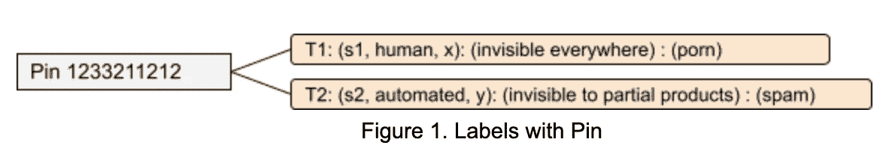
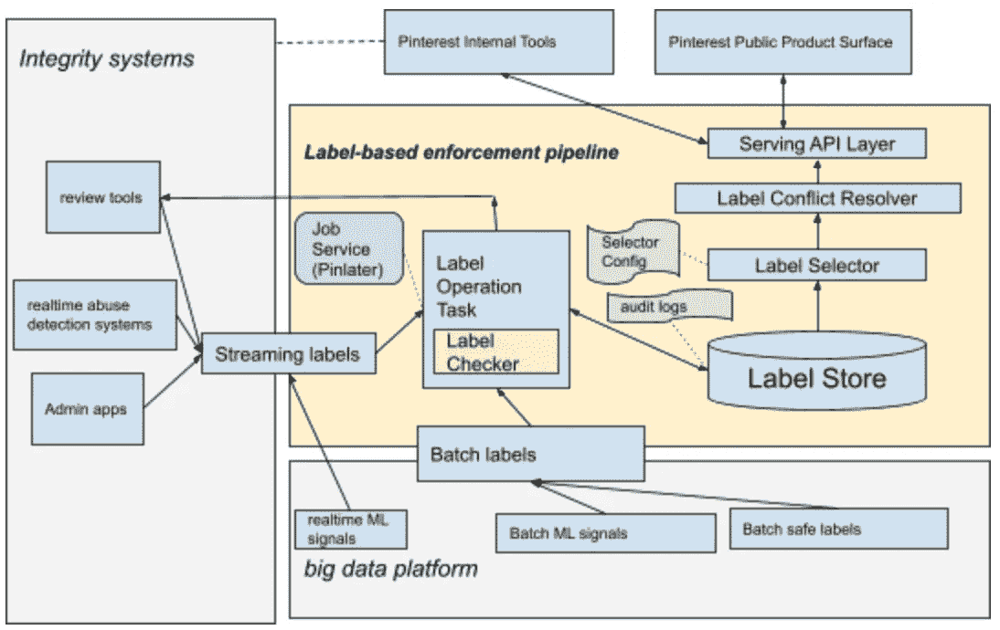
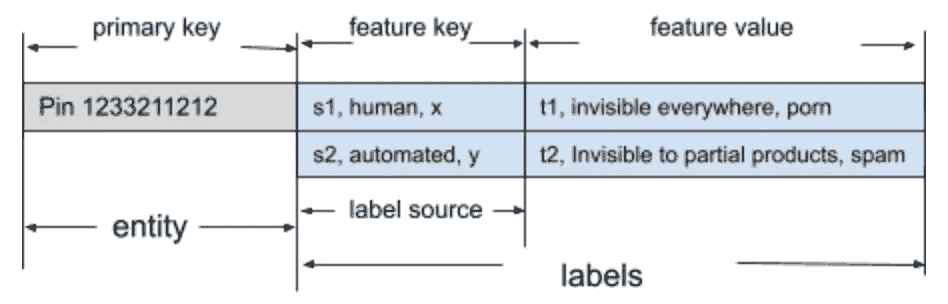
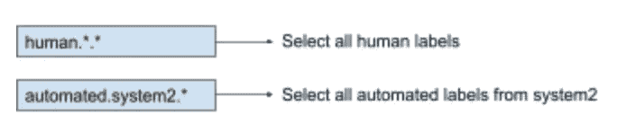
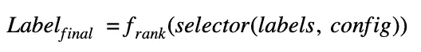

# 构建基于标签的信任和安全执行渠道

> 原文：<https://medium.com/pinterest-engineering/building-a-label-based-enforcement-pipeline-for-trust-safety-4b05a409cb5d?source=collection_archive---------3----------------------->

Sharon Xie|软件工程师，信任与安全

随着 Pinterest 随着用户和企业数量的增加而增长，提供安全可信的体验是我们的首要任务之一。每天，这个平台都会提供数十亿个图钉和图板来激励玩家。由于有如此多的 pin 和活动，在解锁高质量内容分发的同时，为内容安全提供及时和一致的决策可能是一项挑战。在这篇博文中，我们将从技术上深入探讨我们所面临的问题，并展示我们如何构建基于标签的执行管道来解决这些问题并大规模打击滥用行为。

# 背景

## 信号产品的基础设施成本增长

在 Pinterest 的早期阶段，阻止列表是内容过滤器最广泛采用的信号存储(包含要从产品表面阻止的内容的 id)。它被部署在每一个提供服务的主机上，Apache Zookeeper 作为它的同步服务。阻止列表中的所有项目都将被加载到内存中。每当有更新时，整个阻止列表将被推送到每台主机，从而消耗带宽。随着内容数量的增长，阻止列表的大小已经增加到相当大的规模。规模的显著增长不仅给产品主机带来了越来越大的内存压力，而且每年都会产生不断增长的基础设施成本。随着这些问题越来越多，我们意识到黑名单已经不足以支撑 Pinterest 的增长。

## 跨系统的执行差异

随着 Pinterest 工程团队的成长，团队通常会孤立地构建系统，彼此之间不会进行通信。由此引发的一个棘手问题是，如果 Pin 被不同的自动化系统删除，我们的审查代理无法获得执行的完整视图来正确处理用户上诉请求。

## 信号实施可能很复杂

确定如何将多个信号合成到一个策略实施中可能很复杂，并且来自不同类型系统的信号质量可能会有所不同。我们还必须找出如何最大限度地减少自动化系统的误报，以便 Pinterest 上的企业和创作者不会受到负面影响。此外，不同的表面对信号质量有不同的要求。例如，推荐表面通常需要具有较低假阳性的信号，而通知表面需要具有较低假阴性的信号。我们必须弄清楚如何在每个表面上收集最相关的信号，以便 Pinterest 用户能够获得最佳的产品体验。

# 基于标签的执行管道

为了及时、一致和灵活地实施信任和安全策略，我们构建了一个基于标签的实施管道。该管道使用来自各种产品和政策利益相关方的标签，并呈现最相关的标签以用于对内容进行操作，例如根据产品表面进行过滤(例如主页订阅或搜索)。在本节中，我们将介绍端到端实施管道的构建模块。

## 标签

标签是一个节约结构，它捕获源、时间、建议的实施和原因:

*   来源表示“谁”创建了标签。它包括关于源系统、源类型(自动、人工)和名称的信息。
*   建议的实施指示“什么”是被标记的实体的可见性状态。有些内容，比如色情，在 Pinterest 上是不允许的，我们会删除。其他类型的内容，如自拍，可能不违反政策，但如果它对 Pinners 没有启发性，我们可能会希望限制它的分发。
*   时间表示由给定源产生强制的“时间”。这也是标签新鲜度的关键信号。
*   原因表示“为什么”根据违反了哪个策略来执行，例如垃圾邮件、色情或错误信息。

标签可以与任何实体相关联，例如引脚、电路板、用户等。图 1 显示了一个带有 Pin 实体的标签示例。在示例中，有两个标签与 ID 为 1233211212 的 Pin 相关联。一个标签来自人类审查系统，该系统建议阻止平台上的 Pin 分发，因为它违反了我们社区指南的色情部分。另一个标签来自一个自动化系统，该系统建议限制平台的 Pin 分发，因为它违反了我们社区指南的垃圾邮件部分。

Figure 1\. Labels with Pin

## 将商店贴上真理之源的标签

Figure 2\. Label-Based Enforcement Pipeline

基于标签的执行管道涉及从标签创建到标签服务的整个过程。在 Pinterest，信任与安全执行的标签可以来自定期更新的批次，也可以来自流媒体源，如图 2 所示。批量标签集包括 Pinterest 大数据平台中运行的批量作业生成的所有标签，如 ML 模型推理、关键业务数据连接等。这些标签通常每天出现一次，其服务 SLA 为 24 小时。另一方面，流标签捕获由 integrity 系统或流作业生成的标签，如审查工具、管理应用程序、实时滥用检测系统和实时 ML 模型推断。这些标签通常可以在创建后五分钟内送达。为了克服我们前面讨论的与来自不同系统的分布式标签相关的挑战，我们构建了一个统一的标签存储来托管所有标签，而不管它们的来源。构建集中式标签存储有两个主要优势:

*   它克服了块列表的存储限制，并且可以在数据量或服务请求增加时水平扩展。
*   它允许我们集中管理标签生命周期，为标签提供单一的真实来源。这使得支持对操作更新的可靠审计和一致的标签服务变得更加容易。

我们采用了 Pinterest 的内部键值数据解决方案，该方案使用 [Rocksplicator](/pinterest-engineering/open-sourcing-rocksplicator-a-real-time-rocksdb-data-replicator-558cd3847a9d) 构建，用于数据存储。图 3 显示了我们的数据模型。实体，如引脚、电路板或用户，被建模为主键。给定实体的所有标签被聚集在一起用于快速查询。标签源被建模为特征键，其中支持诸如添加、删除和更新之类的原子操作。

Figure 3\. Label Store Data Model

所有标注操作都在一个标注操作任务中运行。这个任务由一个作业服务 ak [PinLater](/@Pinterest_Engineering/pinlater-an-asynchronous-job-execution-system-b8664cb8aa7d) 管理，它负责注入速率、任务并发和客户端重试。它确保标签可以正确地添加到标签存储中或从标签存储中删除。该任务还与标签检查器一起执行标签清理和初步检查。标签检查器在两个方面在执行管道中充当关键角色:它确保在数据库中不会创建格式错误的标签或重复的标签，并且它使用试探法来防止重要的业务合作伙伴受到误报的影响。例如，如果一个自动化系统将一个负面标签放在一个可信的创建者身上，标签检查器将检测到这种情况，并触发一个代理对来自这个伙伴的内容进行检查。在检讨完成前，不会采取任何执法行动。

标签存储还提供了一个 API 来返回给定实体的所有标签。这个 API 与标签选择器一起为不同的应用程序分组标签。标签选择器可以很容易地配置为过滤出匹配源查询的标签。图 4 显示了一个配置示例，该配置从系统 2 为实体返回所有人工标签和所有自动化标签。

Figure 4\. Example of Source Config

标签冲突解决程序是为所选标签提供排名功能的组件。我们应用排名函数来呈现最终的标签以用于生产。下面的等式说明了这一点。标签源信誉和标签新鲜度都被加权以构建解析器函数。

Figure 5\. Example Ranking Equation

在实践中，标签冲突解决器和标签选择器使信任和安全团队能够在不同的 Pinterest 产品表面上以最相关的方式操作。这是因为源选择器允许我们收集符合特定表面过滤 SLA 的标签，并且标签解析器确保将最合适的试探法应用于实体实施。实体的最终实施是通过 API 来完成的。所有 Pinterest 公共表面都可以与 API 集成，以阻止不良内容，而我们的内部工具可以利用 API 来了解内容服务状态，并对有害内容采取进一步行动。

# 生产结果

在推出标签执行管道并将其与我们最关键的产品表面(如 home feed 和 search)整合后，我们能够利用来自我们的代理审查工具和 ML 平台的数千个高质量标签。我们设法获得了可伸缩性的改进。即使我们将检查从内存中转移到了服务调用中，我们也可以更有效地针对不良内容执行检查。性能没有明显下降，例如延迟和成功率。由于设计周到，我们还能够最大限度地减少假阳性的影响，使它们不会对 Pinners 或合作伙伴产生不利影响。当在实验后测试标签商店时，我们已经看到了用户参与度的重要积极指标，随着越来越多的表面与标签商店集成，这种影响将继续增长。

通过集中执行标签，我们设法为所有客户提供执行一致性和透明度。以前，找出一个 Pin 被删除的原因意味着搜索多个系统和表来找到结果。现在，有一个单一的搜索中心来概述标签强制变更事件的历史。最终，对于我们的用户和广告商来说，标签商店已经成为保持 Pinterest 安全的最重要工具之一。

# 承认

非常感谢 Revant Kapoor、Nilesh Gohel、陈新元、王加斌、Abhishek Jathan、Vladimir Mikhaylovskiy、Jared Wong、Farran Wang、Alok Singhal、蔡美诗·萨缪尔森以及 Trust & Safety 团队的其他成员帮助设计和建造执行管道和工具！感谢哈里·沙曼斯基对这篇博文的帮助！