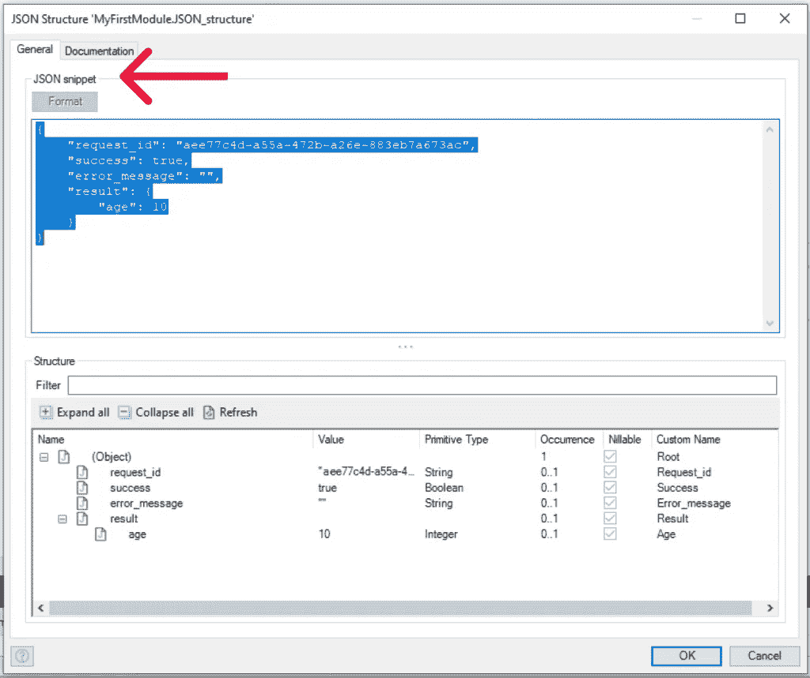
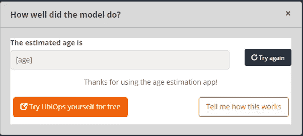

# 构建一个由人工智能驱动的低代码应用程序(使用 Mendix 和 UbiOps)

> 原文：<https://medium.com/mendix/building-a-low-code-app-powered-by-ai-with-mendix-and-ubiops-4229df20790c?source=collection_archive---------3----------------------->


大多数低代码平台不包括在生产或大规模运行 AI 所需的功能。以下是您仍然可以这样做的方法，不需要深入的 IT 知识。

# 像 Mendix 这样的低代码平台是开发 web 和移动应用程序的好方法，只需开发一个应用程序所需时间的一小部分。在这样一个平台的帮助下，你不需要一行一行地编写你的应用程序，而是使用预先构建的元素和组件来构建它。这使得构建自己的应用程序更快、更直观、更容易调试。

尽管对数据科学和机器学习的兴趣越来越大，但大多数低代码平台都不包括人工智能的功能，而是依赖于与其他工具的集成。如果您有一个可用的模型或者能够构建一个模型，并且您希望将它转变为客户的端到端应用程序，该怎么办？例如图像识别应用、聊天机器人或[推荐系统。](https://ubiops.com/how-to-build-and-implement-a-recommendation-system-from-scratch-in-python/)


图 1:总体架构概述

在本文中，我们将通过一个年龄估计应用程序的例子向您展示如何做到这一点。有了这个应用程序，你可以上传你自己、一个朋友或网上某个随机人物的照片，应用程序会根据这个人的脸来估计他们的年龄。很酷，对吧？

为此，我们使用了一个预先训练好的(开源)神经网络和两个工具: [Mendix](https://www.mendix.com/) 和 [UbiOps](https://ubiops.com/) 。Mendix 和 UbiOps 都可以免费使用，你也可以自己试用一下。

让我们一步一步来。

# 组件和概述

## 图像识别模型和训练数据

对于图像分类本身，我们将使用用 [Caffe](https://caffe.berkeleyvision.org/) 深度学习库实现的预训练神经网络。年龄估计模型是在苏黎世联邦理工学院开发的，并在从 IMDB 和维基百科收集的公开图像数据集上进行训练，其中包含名人和公众人物的面孔以及他们的年龄。

有关该模型的更多细节和信息，您可以访问:[https://data.vision.ee.ethz.ch/cvl/rrothe/imdb-wiki/](https://data.vision.ee.ethz.ch/cvl/rrothe/imdb-wiki/)*参考:拉斯穆斯·罗特和拉杜·蒂莫夫特和吕克·范·古尔，《从没有面部标志的单一图像中对真实和表观年龄的深度期望》，国际计算机视觉杂志，第 126 卷，2018 年*


[https://bit.ly/MXW21](https://bit.ly/MXW21)

## 服务基础设施和前端

为了构建应用程序逻辑和前端，我们使用低代码平台 [Mendix](https://mendix.com/) 。为了部署和运行 Caffe 神经网络，并将其作为一个带有 API 端点的服务，我们使用了 [UbiOps](https://ubiops.com/) 。UbiOps 中模型的服务端点可以被 Mendix 应用程序使用来发出请求(参见图 1)。

## 为什么要这样设置？

它不需要任何关于如何建立底层 It 架构的知识。我们不必担心设置服务器、部署我们的应用程序、配置网络、用户管理、可扩展性和正常运行时间。Mendix 和 UbiOps 都是 SaaS 的服务，带走困难的工作。让我们可以立即创建这个应用程序！下图显示了一切是如何组合在一起的:


图 2:高层架构

# 要求

为了开始，您需要以下内容:

*   UbiOps 账户。你可以在 https://app.ubiops.com/sign-up 的[免费创建一个。](https://app.ubiops.com/sign-up)
*   门迪克斯账户。你可以在[https://signup.mendix.com/](https://signup.mendix.com/)免费创建一个。
*   已安装 Mendix Studio Pro。
*   预训练的 Caffe 深度学习模型文件。你可以从以下地方下载它们:[https://data.vision.ee.ethz.ch/cvl/rrothe/imdb-wiki/](https://data.vision.ee.ethz.ch/cvl/rrothe/imdb-wiki/)(滚动到底部)
    你需要`. caffemodel '文件和` age.prototxt '文件。我们用的是 IMDB-WIKI 的。
*   Python 的基础知识，对 REST APIs 的基本理解。

# 开始工作:部署年龄估计模型

首先，我们将在 UbiOps 上部署深度学习模型，以便我们可以向它发出请求。

在我们上传代码和预训练模型之后，UbiOps 会创建一个 Docker 映像，其中包含代码和所有必需的包和依赖项。构建完成后，它可以作为一个带有 REST API 端点的活动服务使用，我们可以从 Mendix 调用它。这基本上使我们能够在端点后运行任何类型的数据处理代码，并在我们想要的任何地方使用它。

要在 UbiOps 上部署预训练的 Caffe 模型，我们需要先编写一些 Python 代码。UbiOps 需要一个包含请求函数的 deployment.py 文件。这是 UbiOps 每次通过服务端点发出请求时都会调用的函数。

我们将使用 [UbiOps Github](https://github.com/UbiOps/deployment-template) 上可用的“deployment.py”模板，并根据我们的目的对其进行一些编辑和调整。

下面是“deployment.py”的最终代码:

```
from setup_logging import setup_logging
import logging
import sys
sys.path.append('/usr/lib/python3/dist-packages') # We need to point to the location where Caffe installs its Python lib
import os
import cv2
import caffe
import numpy as np
from PIL import Image
import base64
import io
```

# [参见最终代码](https://ubiops.com/building-a-low-code-app-powered-by-ai/#)

关于代码的一些注释:

*   请求函数的输入是一个字符串。稍后，我们将把来自 Mendix 的图像作为 base64 编码的字符串发送到 UbiOps。这是因为 Mendix 不能从它们的 REST 请求模块发送文件。
*   请求函数的输出是估计年龄的整数。
*   我们添加了一个函数(base64_to_image ),用于将图像转换为 Numpy 数组，并将其放在 Deployment 类之外。

在 UbiOps 中，压缩文件夹“[部署包](https://ubiops.com/docs/deployments/deployment-structure/)用于将我们的代码上传到平台，这样 UbiOps 就可以部署所有东西。zip 的结构如下(注意，zip 中有一个父文件夹):


图 3:部署包 caffe.zip 文件的内容

*   deployment.py 文件(参见上面的代码)包含请求函数，该函数在 Python 中执行实际的数据处理和模型推断。
*   列出所需 Python 包的 requirements.txt 文件。

```
# This file contains package requirements for the model# installed via PIP. Installed before model initializationopencv-python==4.5.1.48imageio==2.5.0
```

*   下载的 Caffe 模型文件(。咖啡模特和。prototxt)，我们在 deployment.py 文件中引用了它。
*   “ubiops.yaml”文件。这用于告诉 UbiOps 需要在 Docker 中安装什么操作系统级别的包。我们需要它来安装 Caffe 及其依赖项。

```
apt: packages: - caffe-cpu - ffmpeg - libsm6 - libxext6
```

*   setup_logging.py 文件不是强制性的，但是用于将代码中的日志与 UbiOps 集成。

现在我们登录 UbiOps 来部署我们的模型。有了完成的 deployment_package，我们可以通过 UbiOps UI 创建部署的第一个版本(也可以通过 CLI 或客户端库来完成)。

首先，我们转到左侧菜单中的“部署”。在那里，我们点击“创建”并告诉 UbiOps 一些事情:

*   我们给我们的模型起了一个好听的名字，比如“mendix-age-estimation-app”

我们的模型所期望的输入输出类型和字段。您可以在“deployment.py”中的 request()函数中看到以下变量:
作为“输入”，我们定义了一个类型为“字符串”的变量“照片”
作为输出，我们定义了一个类型为“整数”的变量“年龄”


图 4:ubi ops 中的部署创建步骤


图 5:ubi ops 中的部署创建步骤(页面底部)

我们单击“下一步”,然后定义以下内容:

*   将 Python 语言设置为 Python 3.8。
*   点击“上传代码”,然后从我们的笔记本电脑中选择要上传的 zip 文件。
*   其余的我们可以听其自然。

你可以使用一些有用的高级设置，但我们现在不需要它们。


图 6:在 UbiOps 中上传我们的代码(部署包)

现在我们点击“创建”, UbiOps 自动开始构建和部署模型。请注意，上传部署包可能需要一段时间。大约是 500MB，这可能需要一些时间，取决于您的互联网连接。

上传后，版本的状态更改为“正在构建”。如果我们单击版本名称，并在下一页中单击状态旁边的徽标图标，我们实际上可以跟踪后台发生的事情。你可以看到这样的建筑日志:


图 7:构建容器时 UbiOps 中的日志

经过几分钟的构建(安装 Caffe 需要一段时间)，我们的年龄估计模型就可以使用了！如果需要，您可以通过单击版本并单击“创建直接请求”来进行测试。请注意，该模型需要一个 base64 字符串的图像(因此您需要先转换图像，这将由 Mendix 在后台完成)。


图 8:模型被部署，并可用于请求

我们的 Caffe 模型现在正在运行，我们可以向它发送数据，太棒了！

最后，我们需要在 UbiOps 中创建一个带有 API 令牌的服务用户，这样 Mendix 应用程序就可以通过 UbiOps 端点进行身份验证。您可以在左侧的“用户和权限”选项卡中完成此操作。确保复制令牌并保存起来以备后用。为此，将“项目管理”角色分配给 UbiOps 的用户。


图 9:添加一个令牌并保存它以备后用

现在我们将切换到 Mendix 来创建前端和到 UbiOps 的连接。

# 构建 Mendix 前端

为了开发我们应用程序的前端，我们使用 Mendix Studio (webApp)和 Mendix Studio Pro(桌面版)。

我们将创建一个简单的应用程序，它有三个页面:

1.  带有上传图像按钮的主页。
2.  上传图像的页面(弹出)。
3.  显示照片中人的估计年龄的页面。

*注意:后来，我们还添加了第四个页面，为用户提供更多信息和这篇文章的链接。由于底层逻辑的原因，前三个页面通过两个微流连接在一起(后面会详细介绍)。后一页是独立的，通过点击“？”来激活在第二页。*

# 步骤 1:定义领域模型

作为第一步，我们创建一个“领域模型”实体。这基本就是 app 的信息/数据模型。我们的领域模型叫做“照片”,有一个“系统”。' Image '属性，因此 Mendix 知道它包括一个图像，附加到这个属性的是两个属性，称为 age 和 photo。在这些属性中，我们稍后将上传的照片保存为一个字符串，年龄作为 ubiops 的响应保存为一个整数。


图 10:Mendix 中的域模型

# 步骤 2:创建主页、上传页面和微流。

首先，我们使用 Mendix 中的一个预建模板创建一个“表单”页面。在做了一些调整并添加了一个“在此上传图片”的按钮(见图 2)后，我们添加了一个“微流”来触发另一个页面，用户可以在那里上传并提交图片(见图 3)。Mendix 使用所谓的微流来创建页面背后的逻辑。


图 11:年龄估计应用程序的主页(编辑模式，工作室视图)


图 12:带有文件上传小部件的弹出页面(编辑模式)

这只是一个带有称为“图像上传器”的标准小部件和一些布局定制的页面。您可以将它拖放到页面上。这里没有太多的代码要做。

点击按钮“在这里上传你的图片”触发微流，如图 13 所示。这个微流首先在实体“Photo”中创建一个对象(参见域模型)，然后打开弹出窗口上传一张照片(参见图 12)，完成后关闭页面。有关微流的更多详细信息，请参见步骤 3。


图 13:打开和关闭“上传图片”弹出窗口的微流程

# 步骤 3:创建微流来调用 UbiOps API

一旦用户单击图 12 中的“submit ”,就会触发一个新的(更高级的)微流来编码图像，调用 UbiOps API 并返回响应值。在这一步，我们解释微流是如何工作的。


图 14:调用 UbiOps API 并返回结果的微流概述

Mendix 必须首先“提交”图像，换句话说，将它“保存”在我们应用程序的临时数据库中。下一步是将图像编码成一个字符串。这是必需的，因为 Mendix 不能用 REST 请求功能发送文件。所以我们使用了来自[社区公共函数库](https://docs.mendix.com/appstore/modules/community-commons-function-library)的“Base64 编码器”。输入是实体照片，而输出是存储在附加到实体的变量“Photo”中的字符串。


图 15: base64 编码器

这意味着我们现在在 Mendix 数据库中有一个名为“photo”的变量，其值是原始图像的 base64 编码字符串。

现在我们准备设置 REST API post 调用来调用 UbiOps 中部署的深度学习模型的 API 端点。图 16 显示了 http 方法(post)、身份验证、http 头、请求和响应上的 Mendix“Call REST”设置。你可以在这里粘贴 UbiOps 中模型的 API URL(从 https://api.ubiops.com/v2.1/…的[开始)。](https://api.ubiops.com/v2.1/%E2%80%A6)


图 16:对 UbiOps 细节的 REST API 调用


图 Call REST 模块的 HTTP 头配置

在 HTTP Headers 选项卡中，我们将 UbiOps 中的 API 令牌添加到 Mendix 请求的 HTTP 头中。该值应包括字符串中的“Token”关键字，如图所示。

需要注意的是，来自 UbiOps 的响应存储在一个名为“age”的新变量中。配置参见图 18。


图 18:配置来自 UbiOps 的响应，并将其存储在一个新变量“age”中。

请注意，在域模型中(参见图 20 ),您已经可以看到“年龄”是实体“照片”中的一个变量。在“更改照片”步骤中存储“年龄”的返回值。这类似于第一个“更改照片”步骤(参见图 14 中的微流程)。

为了正确映射 UbiOps 的返回值并将其存储在变量“age”中，我们创建了一个导入映射。这将从 HTTP 响应中选择正确的变量。Mendix 中配置的 JSON 格式如下所示:



图 19:Mendix 中配置的 JSON 格式


图 20:正确映射 UbiOps 响应的导入映射

因此，微流中的最后一步是触发一个页面弹出响应的值(参见图 22)。这意味着我们需要创建另一个带有拖放元素的页面，并向其传递响应值。


图 21:显示结果页面(3)并传递实体照片

# 步骤 4:创建一个页面来显示结果

如图 21 所示，必须创建一个在某处显示变量“年龄”的页面。通过拖放，创建了第三个页面，并选择了所选的数据源(变量“age”)。



图 22:ubi ops API 调用的响应显示。

# 步骤 5:发布 Mendix 应用程序

最后但同样重要的是，我们将发布应用程序，并通过管理权限来确保公众可以访问它。有关如何操作的更多信息，请参见 [Mendix 文档](https://docs.mendix.com/studio/settings-security)。

你可以在这里亲自试用我们的应用:【https://ageestimationapp-sandbox.mxapps.io/ 

# 包扎

有了两个免费使用的平台，一个开源的人工智能模型和有限的编程或软件开发知识，你可以创建自己的人工智能应用程序。在这个项目中，我们没有关注深度学习模型的性能，所以你可能会发现自己比实际年龄年轻 20 岁。然而，本文的目的是展示只用两个平台和一些 Python 知识构建端到端应用程序的简易性。

你想要建立类似的东西吗？您可以随意创建一个与[门迪克斯](https://www.mendix.com/)和 [UbiOps](https://ubiops.com/) 的免费账户。如果有任何问题，请在评论中告诉我们，或者直接联系我们。我们希望你喜欢这篇文章，也希望我们能给你自己的项目带来一些灵感！

## 阅读更多

[](https://bit.ly/MXW21) [## Mendix World 2021 |召集您的应用开发团队 2021 年 9 月 7 日至 9 日

### 好像你需要说服…在一个全球制造商社区，他们想通过探索什么来相互学习…

bit.ly](https://bit.ly/MXW21) [](https://www.mendix.com/mendix-world/tracks/) [## 曲目|门迪克斯世界 2021

### 在今年 Mendix World 开幕之前，手工制作您的议程。浏览专为您量身定制的 8 个专题讲座中的 85 个以上专题讲座…

www.mendix.com](https://www.mendix.com/mendix-world/tracks/) 

*来自发布者-*

如果你喜欢这篇文章，你可以在我们的 [*媒体页面*](https://medium.com/mendix) *或我们自己的* [*社区博客网站*](https://developers.mendix.com/community-blog/) *找到更多类似的内容。*

*希望入门的创客可以注册一个* [*免费账号*](https://signup.mendix.com/link/signup/?source=direct) *，通过我们的* [*学苑*](https://academy.mendix.com/link/home) *获得即时学习。*

有兴趣加入我们的社区吗？你可以加入我们的 [*Slack 社区频道*](https://join.slack.com/t/mendixcommunity/shared_invite/zt-hwhwkcxu-~59ywyjqHlUHXmrw5heqpQ) *或者想更多参与的人，看看加入我们的* [*遇见 ups*](https://developers.mendix.com/meetups/#meetupsNearYou) *。*