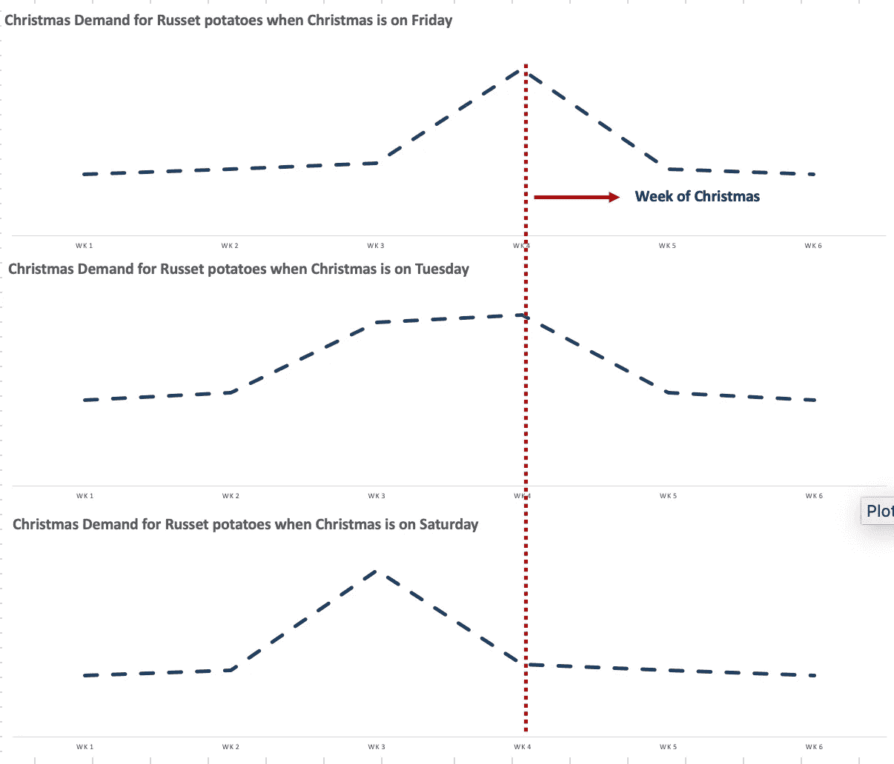
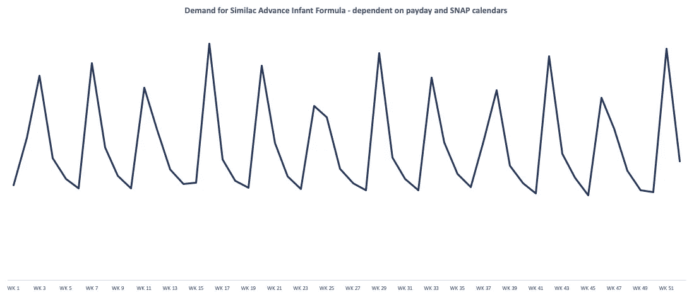
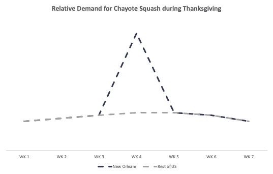

# 构建基于机器学习的需求预测平台

> 原文：<https://medium.com/walmartglobaltech/building-a-machine-learning-based-demand-forecasting-platform-d8c0841c1f07?source=collection_archive---------0----------------------->

[https://thenounproject.com/search/?q=forecasting&i=2500242](https://thenounproject.com/search/?q=forecasting&i=2500242)

作者:Sasanka Katta，Abhinav Prateek

*下面的文章详细介绍了我们沃尔玛全球技术团队如何构建了一个深度创新的&可扩展平台，以提高沃尔玛预测客户需求的能力，并帮助提高运营效率。*

**1。** **简介**

*“给人们省钱，让他们生活得更好。*”

沃尔玛的使命宣言推动着我们的商业实践。2018 年，怀着这个目标，我们着手解决我们最关键的问题之一:减少易腐废物，优化库存，以更好地为客户服务。

为了实现这一结果，我们需要提高预测客户需求的能力，并确保*正确的产品*在*正确的时间*出现在*正确的地点*。我们通过以下方式做到了这一点:

a)提高我们预测模型的准确性

b)为我们的需求管理利益相关方提供适当的可见性和灵活性。有了可靠的数据，该小组能够消除偏见，最大限度地减少人工干预，并做出更好的商品补充决策。

**2。** **了解我们的遗留系统并确定机会领域**

我们的产品团队从采访我们的利益相关者和分析数据开始，以确定遗留系统在哪些领域为世界上最大的供应链服务不足。我们发现了在我们的传统预测系统下不起作用的多个用例。下面列出了一些特别有趣的例子:

一、*首先，遗留系统建立在指数平滑模型上。*这些模型通过复制前几年(主要是前一年)的季节性模式来工作。这种方法是有缺陷的，因为需求因素每年都在变化。例如，复活节根据天气循环移动了几个星期。事实上，即使是像圣诞节和 7 月 4 日这样的静态事件，也会根据它们发生在一周中的哪一天而有所波动。对这些事件的错误预测经常导致浪费。下图说明了这一点。

***图片 1:*** *沃尔玛周在一个周六开始。根据圣诞节发生在一周的哪一天，可以看出对红褐色土豆的需求高峰是如何发生在圣诞节前后的。*

二。*宏观和微观因素影响需求*。工资单日历、补充营养援助计划(SNAP)、价格促销和天气都会影响需求。

***图 2:*** *下图显示了“雅培高级婴儿配方奶粉”的需求模式，可以看出，根据工资单日历和快速支付，每 4-5 周就会出现需求高峰。*

三。*legacy 系统预测了美国所有商店的总需求，并根据最近几周各个商店的销售额计算市场份额，从而将总需求分配给各个商店。*由于当地的活动和偏好大多是季节性的，因此这一流程存在一些缺点。例如，佛手瓜南瓜在感恩节期间是新奥尔良非常受欢迎的一道菜，但在美国其他地区的需求并没有激增。因此，遗留系统在新奥尔良预测不足，在美国其他地方预测过高，导致新奥尔良短缺，其他地方浪费。

**图 3:** *下图显示了与美国其他地区相比，新奥尔良佛手瓜在感恩节期间的相对需求峰值*

**3。确定成功指标**

如上所述，我们的目标是减少浪费，同时保持高库存水平以提高运营效率。很明显，更好地预测客户需求将减少浪费，并保持库存位置最佳。然而，要了解我们是否真正成功，我们需要确定成功的衡量标准，而不仅仅是跟踪我们的库存状况。例如，我们的预测模型本可以改进，但我们的补货实践使损耗居高不下。或者，我们的补货实践本可以改善并减少浪费，但我们的客户需求预测却没有。

因此，我们决定将跟踪浪费和库存作为主要指标，将预测准确性作为次要指标。

**—**

**测量了浪费(以美元计),并将趋势与去年进行了比较**

**每周库存* ***%*** *通过捕捉一周内不同时间快照的&商店组合中每种商品的库存水平来衡量。库存趋势也与去年进行了比较，以跟踪改进情况。**

****代理指标*** *—预测准确度。通过预测与实际需求的接近程度来衡量每个项目&商店组合实现的需求，并通过分配基于销售的权重*汇总到更高的层次结构*

***4。** **算法开发和验证***

*在进行探索性数据分析并向我们的数据科学团队展示使用案例后，我们意识到不可能有一个模型能够准确预测沃尔玛的各种产品。我们创建了单独的轨道来开发模型，这些模型将解决特定的使用情形—快速移动项目、长尾项目、特定于活动的季节性、新项目以及其他非常专业的使用情形。我们与数据科学团队合作，帮助他们更详细地了解使用案例，为他们提供具体的解决示例，并确保他们能够访问相关数据。我们的数据科学团队开发了基于梯度推进机器、状态空间模型、随机森林和分层技术(针对长尾项目)的算法。还有一些基于 GLM 和回归技术的特殊用途算法。*

*我们使用回溯测试流程来评估所有模型的性能。该流程帮助我们 a)向我们的数据科学团队提供任何进一步机会领域的反馈 b)建立我们的模型比传统系统更好地预测需求的能力。通过运行 52 周的回溯测试流程，我们看到了大约 300 bps 的准确性改进，这是我们预测客户需求能力的重大改进。我们将结果打包成简洁的可视化形式提供给我们的利益相关者，让他们参与进来。通过这种方式，我们确保了我们的算法充分利用了对利益相关方的深入供应链了解。*

***图片 3:** *我们遵循的典型模型开发生命周期**

**

***5。** **利益相关方的应用程序用户界面***

*沃尔玛的需求规划团队负责需求预测，并与供应商和买家合作，为我们的客户保持最佳的商品供应。虽然重点关注我们预测客户需求的能力是重中之重，但为我们的需求规划团队提供高效的 UI 也同样重要。以下是我们在构建 UI 时的一些主要考虑因素:*

*I .为需求计划团队提供所有必要指标和信息的应用程序界面，以推动数据驱动的对话和行动。*

*二。一个界面跟踪我们的指标(浪费、库存和预测准确性)。*

*三。为我们的需求计划团队提供适当的诊断工具，帮助他们识别问题领域，并让他们能够深入了解根本原因。*

*四。一个提供适当能力(不太高也不太低)来修改预测的界面，并且还测量它们的接触—无论它们是否增值*

***6。** **技术堆栈和采用过程中的其他考虑事项***

****技术堆栈:*** 当我们的工程团队生产我们的预测解决方案时，我们就几个关键考虑事项达成一致，以确保我们有一个灵活的平台:*

*I .平台应该是可横向扩展的—如果未来的需求需要新的模型或增加的工作负载，我们可以通过增加更多的计算能力和存储容量来实现，而不是例行公事地升级基础架构。*

*二。为我们的数据科学团队提供选择任何运行时环境的灵活性，如 R、Python、C++等。—我们的工程团队为我们的 ML 管道选择了基于容器的编排(docker +Kubernetes ),为我们的数据科学家消除了运行时限制。*

*三。通过简单和有限的维护，灵活地扩展到其他沃尔玛市场。我们的工程师开发了一个多租户基础架构模型，帮助我们在不增加维护的情况下，以可承受的成本结构扩展到其他市场。*

*关于我们的技术堆栈的更多详细信息，请访问我们的设计师的工程博客—[https://medium . com/Walmart global tech/demand-forecasting-tech-stack-Walmart-539d 17 f 385 db](/walmartglobaltech/demand-forecasting-tech-stack-walmart-539d17f385db)*

****投放部门:*** 我们缩小了全美商场的肉类和生产部门，以进行首次投放。以下是推动这一决定的因素:*

*I .这两个部门将从优化库存位置(浪费节约和库存水平)中获益最大。*

*二。这两个部门的客户需求取决于复杂的因素，这些因素可以通过我们的机器学习模型进行精确建模。*

*三。这些部门的利益相关者花费大量时间管理不准确的预测，使这一领域物有所值。*

*当涉及到 MVP 优化时，我们降低了几个用例的优先级。*

*I. *价格&促销*肉类和农产品部门没有考虑这些特性，因为它们不经常进行促销。总的来说，沃尔玛美国公司的经营模式是 EDLP 模式(每天低价)，使得价格和促销不那么重要。我们最终在 2019 年 8 月加入了价格&促销功能，以解决我们的高低国际市场。*

*二。*由于我们最初的部门进展迅速，因此取消了专门为长尾产品*设计的模型的优先级。我们最终在 2019 年 4 月推出了这些模型，以帮助各部门处理长尾项目。*

*三。云原生与本地基础架构:云原生基础架构将为我们提供我们正在寻找的可扩展平台，但由于我们对系统的熟悉，我们选择了本地基础架构进行初始发布。此外，快速成功的内部 POC 将为我们提供支持和资源，以在云上建立可扩展的平台。成功的概念验证确实帮助我们在 2019 年将基础架构迁移到云，使我们能够进一步扩大我们的范围。*

***7。** **成果和产品展开***

*一、2018 年 6 月，我们为美国商场推出了两个部门的产品。准确性的提高与我们在回溯测试中观察到的结果是同步的。*

*二。到 2020 年 7 月，沃尔玛美国所有关键部门都采用了我们的预测解决方案。*

*三。我们在美国市场的成功引起了国际供应链团队的兴趣。我们在 2019 年 2 月将我们的解决方案扩展到加拿大市场，随后扩展到墨西哥和英国。我们计划将我们的解决方案扩展到沃尔玛经营的其他国际市场。*

*a.国际市场的精度提高了约 500 个基点，与美国市场相比，回报更高。*

*四。在应用程序用户界面中，我们测量了利益相关者对机器生成的预测的手动触摸，并与他们合作消除影响预测的触摸，使沃尔玛的预测管理流程更加数据化。*

***8。** **我们产品团队的重要收获***

***培养对算法的直觉&技术:**对算法有很好的理解和直觉对产品经理来说是无价的财富，尤其是那些从事算法驱动产品的人。很多时候，我们的团队能够倾听潜在的数据科学解决方案，并判断该解决方案是否能够解决特定的用例。类似地，我们还能够预见 solve 的任何潜在问题，或者算法是否可以轻松扩展或投入生产。这种直觉帮助我们的团队与数据科学团队进行了丰富的对话，并提高了我们的协作能力。对工程解决方案的类似理解将有助于产品经理更有效地与工程团队合作。*

***与管理层&利益相关方**一起创建透明的反馈循环:虽然我们的目标是通过提高预测准确性来减少浪费，但将问题定性地分解为可展示的用例确保了与业务利益相关方&管理层的良好反馈循环。我们能够帮助他们直观地了解为什么准确性会提高，而不是让这个过程成为“机器学习黑箱”。*

***先窄后宽:**对于产品团队来说，非常重要的一点是，首先要专注于产品与市场的紧密契合，在我们的例子中，就是肉类和生产部门。这确保了团队正在解决一个定义明确的问题，以吸引一小群初始用户。但最终项目经理应该考虑随着吸引力的增加而扩张——要么扩张到更多的用户群、新的地理区域，要么扩张到职能领域。围绕要解决的问题和要关注的用户群进行良好的优先级排序是非常重要的。构建初始平台时的另一个考虑因素是未来的可伸缩性，即考虑产品的潜在扩展。我们能够迅速将我们的产品扩展到沃尔玛的不同市场和职能领域，因为我们最初的技术堆栈是按规模构建的。*

***用数据驱动的方法来克服偏见:**数据让对话变得公平、合理，并消除偏见。我们能够消除大量降低预测质量的既定需求管理实践，只是因为我们团队的叙述得到了数据的有力支持。*

**我是沃尔玛全球技术部的产品经理，领导需求预测和流量预测的产品团队。我在运输基于数据科学的解决方案方面有大约 10 年的经验，并拥有达特茅斯塔克商学院的 MBA 学位。**

*Abhinav Prateek 是沃尔玛全球技术公司的高级产品经理，负责领导需求预测工作。他拥有约 6 年的产品管理经验和宾夕法尼亚大学沃顿商学院的 MBA 学位。*