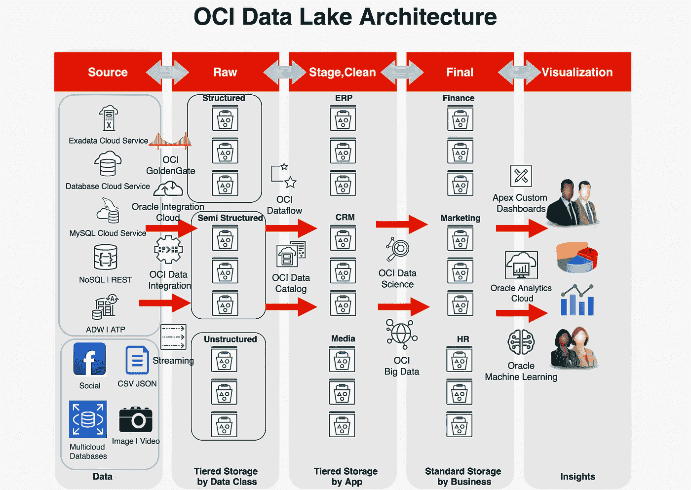

# 在 Oracle 云基础架构上构建现代数据湖

> 原文：<https://medium.com/oracledevs/building-a-modern-data-lake-on-oracle-cloud-infrastructure-92f1df351f44?source=collection_archive---------0----------------------->

# 介绍

从词源和功能的角度来看，数据湖是数据仓库的发展。过去，企业公司使用关系数据库作为数据源，从中提取、转换数据，然后加载到中央存储库中。这些过程每天以批处理模式运行，被恰当地称为 ETL(提取转换加载),中央数据库被称为数据仓库。数据仓库成为一个庞大数据库的通称，在使用分析和可视化技术从中提取价值之前，您可以将您的商品(在本例中是数据)存放在这个数据库中很长一段时间。这种企业从历史数据中获取价值的方法在内部部署环境中有所不同，因为数据的数量和速度都是可预测的，而容量规划就是计算您的数据源和数据增长。然而，随着大数据计算的出现和传入数据性质的改变，这种方法的可扩展性并不好，尤其是在处理海量数据时。

数据湖提供了一个几乎无限可扩展的存储池，专门用于收集和存储结构化(关系数据库)、半结构化(NoSQL 数据库)和非结构化(视频、图像、音频)数据。有了数据湖，现在的方法是从各种来源收集数据，数据量和速度都非常大。数据存储可以很容易地扩展到 Pb，同时收集各种数据，而不必规划一个巨大的集中式数据库的容量。这种收集和存储历史数据的方法会导致 ETL 过程中的细微变化。“L”在“T”之前移动，现在是 ELT(提取负载转换)。现在，您首先提取数据，并以原始格式将其加载到一个集中的暂存区，然后再对其进行转换，以从中获得一些商业价值..为了存储这些海量数据，而不是昂贵的定制数据仓库设备或文件系统，使用了分布式对象存储。对象存储是一种便宜得多的存储机制，它可以以较低的 TCO 保留数据。互联网规模的对象存储进一步降低了成本，并加速了公司将其数据湖扩展到千兆字节。

# 数据湖架构

数据从上游系统到数据湖再到下游系统消费的过程可以分为 4 个主要阶段:摄取、存储、转换和可视化。一旦这些阶段完成，您就可以从您的数据中获得商业价值。

现在让我们看看 OCI 的现代数据湖是什么样子，以及如何使用 OCI 服务构建各个阶段

对于数据湖中的数据存储，需要在 3 个不同的筒仓中进行维护。这种分离的原因是为了确保数据类别的内在价值是可识别的，并适当定义数据保留以避免额外的成本。第一个阶段是在数据湖中存储原始数据。这是您通常卸载传入流以转储数据的地方。数据可以来自不同的来源，并且可以存放在不同的存储桶中。第二阶段，我们将对数据进行一些基本的清理，并根据数据来源的应用程序类型对其进行分类存储。应用程序级的数据分类是可选的，您可以根据您的业务需求进行分类。

最后的存储阶段将对数据进行清理、处理和标记，以便随时可以使用或加载到可视化工具中。这将包括运行机器学习算法和其他数据科学技术，根据您的组织需求对业务成果进行预测。将数据存储在最终存储中的类别同样取决于您的业务需求，但一个良好的做法是根据组织的业务结构来存储数据。从安全角度来看，这也很重要，因为只有合适的分析师才能基于角色访问数据。

# OCI 数据湖产品

Oracle 云基础设施(OCI)提供了使用 OCI 原生数据服务和 Oracle 自己的对象存储为您的企业构建互联网规模的数据湖的所有产品。OCI 为初创公司、规模化企业和企业提供了一个构建强大、安全且可扩展的数据湖的机会。OCI 拥有一些最具竞争力的性价比产品来构建您的 EB 级数据湖。

OCI 提供全面的服务列表来构建完全云原生和无服务器的数据湖，该数据湖可以从您的内部、其他云提供商和各种第三方数据源接收数据。此外，Oracle 云基础设施提供了多种产品，用于集成、转换以及从您的数据湖中获取商业价值。所有这些产品都是完全托管的服务，不需要配置任何服务器

**摄入**

[OCI 数据集成](https://docs.oracle.com/en-us/iaas/data-integration/using/index.htm) — Oracle 云基础设施数据集成是一种全面管理的多租户、无服务器的原生云服务，可帮助您完成常见的提取、加载和转换(ETL)任务，例如从不同来源获取数据、清理、转换和整形这些数据，然后高效地将其加载到 Oracle 云基础设施上的目标数据源。

[OCI golden gate](https://docs.oracle.com/en-us/iaas/goldengate/doc/overview-goldengate.html)—golden gate 是一款完全托管的原生云服务，可大规模实时移动数据。当数据从一个或多个数据管理系统转移到目标数据库时，OCI GoldenGate 对数据进行处理。您还可以设计、运行、协调和监控数据复制任务，而无需分配或管理任何计算环境。

[Oracle Integration Cloud(OIC)](https://docs.oracle.com/en-us/iaas/integration/doc/overview-oracle-integration-generation-2.html)—Oracle Integration 是一项完全托管的服务，允许您集成应用程序、自动化流程并深入了解您的业务流程。

[OCI 流(Kafka 兼容)](https://docs.oracle.com/en-us/iaas/Content/Streaming/Concepts/streamingoverview.htm) — Oracle 云基础设施流服务为实时接收和使用大容量数据流提供了一个全面管理、可扩展且持久的解决方案。对于在发布-订阅消息传递模型中连续不断地生成和处理数据的任何用例，请使用流。

**储存**

[Oracle 对象存储](https://docs.oracle.com/en-us/iaas/Content/Object/Concepts/objectstorageoverview.htm) — Oracle 云基础设施对象存储服务是一个互联网规模的高性能存储平台，可提供可靠且经济高效的数据持久性。对象存储服务可以存储无限量的任何内容类型的非结构化数据，包括分析数据和丰富的内容，如图像和视频。

**转换**

[OCI 数据目录](https://docs.oracle.com/en-us/iaas/data-catalog/using/index.htm) — Oracle 云基础设施数据目录是一个全面管理的自助式数据发现和企业数据治理解决方案。借助数据目录，您可以获得一个单一的协作环境来管理技术、业务和运营元数据。您可以收集、组织、查找、访问、理解、丰富和激活这些元数据。

[OCI 数据流](https://docs.oracle.com/en-us/iaas/data-flow/using/dfs_data_flow.htm) — Oracle 云基础设施数据流是一项完全托管的服务，用于运行 Apache Spark 应用。它允许开发人员专注于他们的应用程序，并提供一个简单的运行时环境来执行它们。它有一个简单易用的用户界面，支持与应用程序和工作流的集成。

[OCI 大数据](https://docs.oracle.com/en-us/iaas/bigdata/home.htm) —按需提供完全配置、安全、高度可用的专用 Hadoop 和 Spark 集群。通过使用一系列支持小型测试和开发集群到大型生产集群的 Oracle 云基础架构计算形状，扩展集群以适应您的大数据和分析工作负载。

[OCI 数据科学](https://docs.oracle.com/en-us/iaas/data-science/using/data-science.htm) —数据科学是一个完全托管的无服务器平台，用于数据科学团队在 Oracle can 基础架构中构建、培训和管理机器学习模型。

**可视化**

[Oracle Analytics Cloud](https://docs.oracle.com/en-us/iaas/analytics-cloud/index.html)—Analytics 为业务分析师和消费者提供基于人工智能的现代自助式分析能力，用于数据准备、可视化、企业报告、增强分析和自然语言处理。

[Oracle 自治数据库(Apex)](https://docs.oracle.com/en-us/iaas/Content/Database/Concepts/adboverview.htm) —自治数据库是一个全面管理、预配置的数据库环境，具有四种可用的工作负载类型，即:自治事务处理、自治数据仓库、Oracle APEX 应用程序开发和自治 JSON 数据库。

# OCI 数据湖部署

## 先决条件

*   创建 OCI 租户，并创建有权在根隔离专区级别设置 IAM 策略的管理员用户
*   确保根据将要部署的服务创建正确的 IAM 组和策略。
*   为在您的 OCI 租赁中拥有管理员权限的用户创建 [API 密钥](https://docs.oracle.com/en-us/iaas/Content/Functions/Tasks/functionssetupapikey.htm)
*   应该有从您的 OCI 租赁虚拟云网络(VCN)到您的内部、其他云或第三方网络的网络连接。安全性最佳实践是使用 IPsec VPN 或 Fastconnect 建立一个专用虚拟电路，连接到其他云及内部数据中心。[这里的](https://blogs.oracle.com/cloud-infrastructure/post/connecting-oracle-cloud-infrastructure-to-amazon-vpc-with-megaport-cloud-router)是一个如何使用 Fastconnect 将 AWS VPC 连接到 OCI VCN 的示例，以获得高带宽和低延迟。

您可以使用 Terraform 自动部署 [OCI 数据湖。](https://github.com/shadabshaukat/ocidatalake)

# 数据治理

## 数据保持

数据保留是数据湖策略的重要组成部分。根据您的业务运营所在的行业或数据所在国家/地区的本地数据保留法律，数据保留对于各种法规遵从性和监管政策来说非常重要。

## 数据安全

安全性是重中之重，尤其是当来自各种来源的数据可能符合 HIPAA、PCI-DSS、FedRAMP、FIPS 140 等标准时。在云中，安全是一种共同责任模式，因此请参考[此](https://www.oracle.com/au/cloud/compliance/)链接，了解 OCI 如何帮助您遵守各种行业数据安全认证。数据湖中的数据在静态和传输过程中都应该加密。你可以在 OCI [这里](https://docs.oracle.com/en-us/iaas/Content/Security/Concepts/security_guide.htm)找到更多与安全相关的最佳实践

# 结论

最近，你存放最终数据的地方有了进一步的变化。借助 Oracle 的自主数据仓库等云原生数据仓库，可以提供一种更经济高效的替代方案来存储大量随时可用的数据。此外，一个较新的概念是拥有一个数据湖库架构，其中底层存储在查询和向数据湖写入数据时表现得像关系数据库中的表。数据湖库是数据湖的进一步发展。存储和处理来自不同来源的历史数据以获取业务价值已经并将继续是一个不断发展的过程。

借助 OCI，可以轻松构建和部署互联网规模的无服务器可扩展数据湖。OCI 提供数据集成和转换服务，以及数据科学和机器学习技术，以从您的数据中获得深刻的见解。Oracle 一直是每个企业关键数据需求的核心，我们一直支持我们的客户满足他们不断增长的数据需求；无论是使用数据库云服务器进行 Pb 级数据仓库存储，还是现在使用 Oracle 云基础架构 Datalake 进行 EB 级数据存储和处理。

# 后续步骤

[1] [使用 Terraform 自动部署](https://github.com/shadabshaukat/ocidatalake)

[2] [企业数据仓库—集成数据湖示例](https://docs.oracle.com/en/solutions/oci-curated-analysis/index.html#GUID-7FF7A024-5EB0-414B-A1A5-4718929DC7F2)

[3] [使用 Terraform 的 Oracle 快速启动部署](https://docs.oracle.com/en/solutions/oci-curated-analysis/index.html#GUID-7FF7A024-5EB0-414B-A1A5-4718929DC7F2)

[4] [甲骨文更新大数据服务，加速在甲骨文云上使用托管开源软件](https://blogs.oracle.com/cloud-infrastructure/post/oracle-updates-big-data-service-to-accelerate-use-of-managed-open-source-on-oracle-cloud)