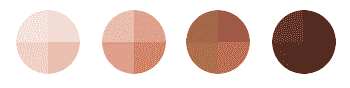
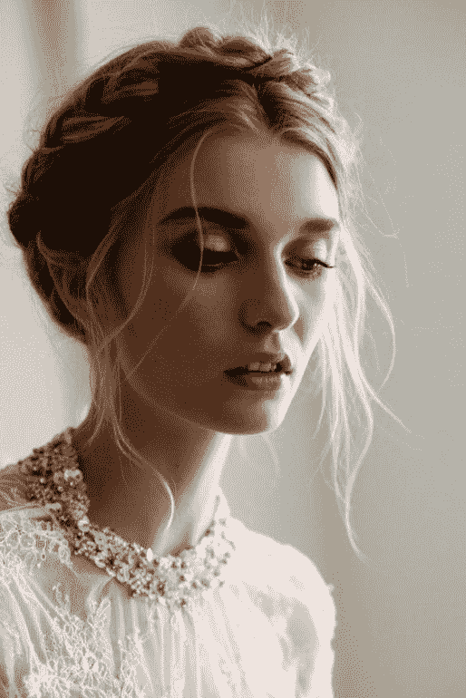
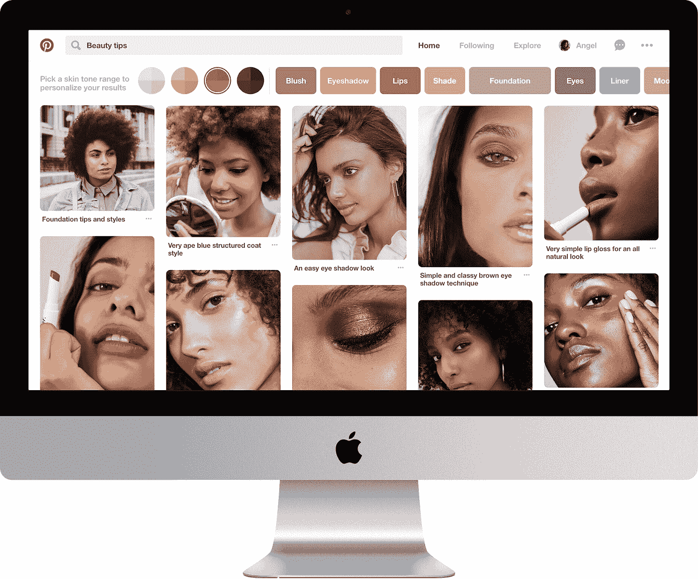
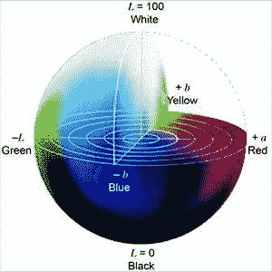

# 构建更具包容性的搜索方式

> 原文：<https://medium.com/pinterest-engineering/building-a-more-inclusive-way-to-search-789f4c92fd73?source=collection_archive---------1----------------------->

Laksh Bhasin | Pinterest 工程师，搜索质量

每天都有数千万人在 Pinterest 上搜索创意，无论是当天晚上做饭的菜谱，还是周末尝试的新发型。根据 Pinterest 的一项研究，70%的人使用 Pinterest 来发现和保存他们想要尝试的日常装扮和风格。由于保存了超过 80 亿个美容和美发创意，我们一直在测试一项新功能，以帮助 Pinners 更容易地在搜索中找到相关的美容创意。今天，我们开始推出测试版，使您能够通过肤色范围缩小美容结果。在本帖中，我们将介绍如何构建和实现更具包容性的搜索体验。

每月有超过 2 亿人使用 Pinterest。我们的产品反映了全球人民的兴趣和品味，有超过 1000 亿个想法可供探索。然而，找到最相关的结果并不总是容易的。Pinterest 上的大多数查询少于三个词，这提出了一个有趣的[服务挑战](/@Pinterest_Engineering/manas-a-high-performing-customized-search-system-cf189f6ca40f)。此外，我们目前的排名算法受到大多数人长期参与的内容的严重影响。这意味着一些品酒师不得不更加努力地寻找他们想要的东西。

任何一个搜索工程师都知道让用户体验无缝、易用有多重要，这样用户就可以尽可能少地重复查询。我们从 Pinners 那里听说，他们在搜索头发和美容创意时，并不总能找到他们想要的东西，所以我们想解决这个问题，从肤色范围开始。肤色范围实验使您能够通过肤色范围自定义搜索结果。我们从四个调色板开始，每个调色板代表一系列肤色。随着我们技术的进步和我们从品酒师那里收集到更多的反馈，我们计划将范围扩大到更多的肤色。

## **深度学习**

检测图像中的肤色是一个具有挑战性的问题，因为它在很大程度上取决于光照、阴影、人脸的突出程度、模糊度以及许多其他因素。检测大头针图像中肤色的最准确的方法是根据科学的肤色调色板给每一张大头针图像贴上人工标签。但是，面对数十亿张独特的图像，以及每天创建的更多图像，这种方法成本高昂，难以扩展。

相反，我们使用一种大规模运作的方法——机器学习。它并不总是完美的，但 Pinners 的反馈迄今为止一直令人鼓舞。

为了快速解决这个问题，我们使用了来自 [ModiFace](http://modiface.com/) 的第三方人脸 AI 库，这是一家专注于增强现实和机器学习的美容应用公司。在深度神经网络的帮助下，ModiFace 产生了用于肤色检测的连续算法。为了改进这个算法，我们经历了几次迭代，特别是对于光线不好和阴影突出的图像。例如，在初始模型中，下面的[图像](https://www.pinterest.com/pin/56083957844390660/)被检测为暗肤色，因为图像中的照明和阴影对于机器学习算法来说很难拾取。

Source: [https://www.pinterest.com/pin/56083957844390660/](https://www.pinterest.com/pin/56083957844390660/)

我们试图生成更多训练数据来纠正机器学习算法的一种方法是获取结果，并将它们通过我们的人类评估平台 [Sofia](/@Pinterest_Engineering/do-you-trust-the-crowd-3-ways-to-improve-crowdsourcing-at-your-company-6f19df729a89) 。

我们还必须考虑许多其他因素。例如，不是每个大头针都包含一张脸，所以我们根据大头针的类别进行一些初步过滤。我们通过在多个工作节点上运行 Spark 作业来分配回填过程，同时注意不要一次向亚马逊 S3 发送太多流量。为了确保回填相对快速地运行，我们使用较小的图像尺寸来加速肤色检测算法，即使该算法本身通常与尺寸无关。在速度和准确性之间有一个明确的权衡，我们将继续改进。

随着新的引脚被添加到系统中，我们仅在这些新引脚上递增地运行肤色检测算法，因此我们继续增加肤色数据的覆盖范围并改善结果。

当我们在每张图像上运行肤色检测算法时，我们将 RGB 颜色输出转换到 [Lab 颜色空间](https://en.wikipedia.org/wiki/Lab_color_space)。这个颜色空间具有用于“亮度”的轴 *L* ，以及用于颜色分量绿-红和蓝-黄的两个轴 *a* 和 *b* 。肤色通常属于 *ab* 颜色平面的特定子空间，我们使用 *L* 坐标来选择不同的肤色，从较浅的肤色(高 *L* )到较深的肤色(低 *L* )。由于 Pinterest 上的许多图像都是照明良好的高质量照片，我们使用了 CIE-L*ab 空间，视角为 2 度，光源为 D65(日光)。

*A handy* [*Pin*](https://www.pinterest.com/pin/AZ3mi9PZ5xDFnB98bHekELGS-T6DjBN_Y2rOg1UMtyDEB_X-ouTGQVo/) *explaining the Lab color space!*

## **提供肤色范围**

我们利用之前为[食谱过滤器](https://newsroom.pinterest.com/en/post/whats-for-dinner-we-got-you-covered-with-new-food-features)所做的工作，将我们的服务和记录逻辑用于肤色范围，这允许 Pinners 搜索符合他们饮食偏好的食谱。

肤色范围的初始版本使用四个范围基于肤色暗度或明度过滤内容，每个范围都有一些重叠。在前端，肤色范围以象限的形式显示给用户，因此很清楚每个调色板实际上都包含一个肤色范围。为了确保 Pinners 的良好体验，肤色范围目前仅针对常见头发和美容查询的预定列表显示。

## **查询重写**

Pinterest 不仅仅是寻找鼓舞人心的图片(在这种情况下，人们炫耀头发和美容想法)。Pinners 希望找到可操作的内容，如美容产品和教程(我们对[镜头结果](/@Pinterest_Engineering/building-pinterest-lens-a-real-world-visual-discovery-system-59812d8cbfbc)采取类似的方法)。为了使我们的结果更具可操作性，我们使用我们的查询重写和理解框架将不同类型的 pin 与适当的肤色混合到结果中。

我们还重写了查询，以确保每个特定肤色范围的结果更有吸引力。如果用户搜索“化妆”并选择较深的肤色范围，这告诉我们他们正在寻找更深色调的化妆创意，并使我们能够完善我们的搜索排名逻辑，以更好地满足他们的期望。

## **隐私**

Pinners 知道我们尊重他们的隐私是很重要的。这就是为什么如果您点击肤色范围，我们不会存储此信息或使用它来为您建立个人资料。这意味着你需要在每次搜索时点击一个肤色范围。我们也不会使用这些信息来定向投放广告。我们不试图预测用户的个人信息，如种族。

## **未来工作**

一旦这一测试实验推广到所有 Pinners，我们未来的工作将主要集中在提高结果的准确性，并将体验带到更多的平台上。我们将尝试新的查询重写方法，并融入可操作的内容，并希望改进我们的搜索排名模型，以便更好地考虑所选的肤色。为了使新的肤色检测算法的实验更容易，我们必须进行一些后端更改，以允许我们索引多个检测到的肤色，并更容易地运行 A/B 实验。

最后，肤色只是构建更具包容性搜索的开始。我们希望通过提供更多方法来缩小搜索范围，从而帮助 Pinners 找到更个性化的结果。

我们一直在努力改进我们的系统，为 Pinners 提供更加个性化的搜索体验。如果你喜欢像这样解决搜索问题，[加入我们的团队](https://careers.pinterest.com/careers/details/software-engineer-search-quality_san-francisco_1077759)！

*鸣谢:这个项目是由一个充满热情的 pin 员工组成的跨职能团队完成的，他们非常关心包容性和多样性，并希望为 Pinners 扩展这些价值。感谢 Rahim Daya、Xixia Wang、Stephanie Rogers、Frances Haugen、Candice Morgan、Karen Gomez、Larkin Brown、Antonio Alucema、Andrey、Christina Lin 和 Aaron Ru。*