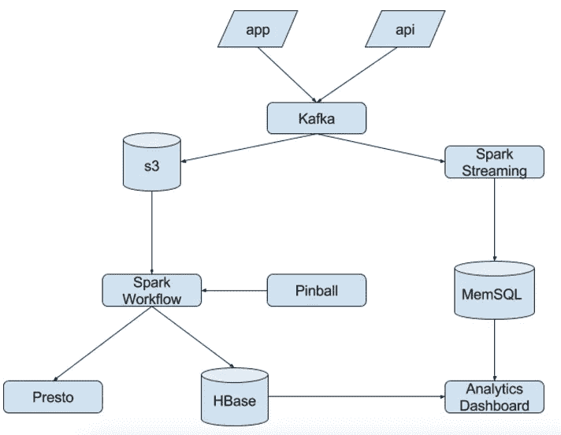
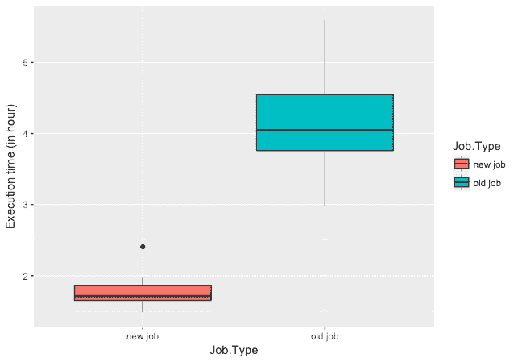
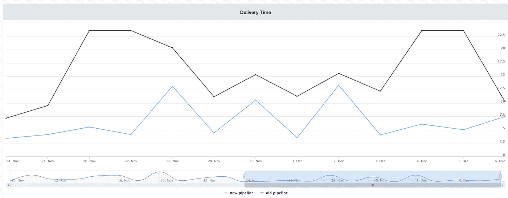

# 用 Spark 构建新的实验管道

> 原文：<https://medium.com/pinterest-engineering/building-a-new-experiment-pipeline-with-spark-b04e1a7d639a?source=collection_archive---------2----------------------->

Tien Nguyen | Pinterest 工程师，数据

在 Pinterest，我们非常依赖 A/B 实验来决定产品和功能。我们每天的目标是在上午 10 点之前准备好实验结果，这样我们就可以做出快速而有根据的决定。每天运行 1，000 多个实验，处理超过 1.75 亿个 Pinners 的数十亿条记录，我们需要一个可靠的管道来支持我们的增长并实现我们的服务级别协议。在本帖中，我们将讨论如何改进我们的遗留实验管道，以加快计算过程，使其更具可扩展性和性能。

## **遗留管道**

Pinterest 一直是一家数据驱动的公司。为了支持我们的决策过程，我们花费了巨大的努力来巩固、建立和维护一个专门的、可靠的[实验管道](/@Pinterest_Engineering/scalable-a-b-experiments-at-pinterest-1e28ddb7d22)。随着这些年来我们的快速发展，Hive 中的旧管道达到了其设计预期寿命。为此，管道有几个缺点:

*   *较长的计算时间。*月活跃用户数从 2015 年的 1 亿跃升至 2016 年的 1.5 亿，再到今天的 1.75 亿。此外，活跃实验的数量在同一时期翻了一番，有更多的指标需要处理。这些增加导致了许多瓶颈，导致计算时间更长。
*   工作冗余。由于我们的数据量很大，我们需要通过将一个任务分成更小的任务来实现并行化。划分工作导致我们的管道中不可避免的重复代码，使得调试和维护更加困难。工作越多，依赖就越多，因此潜在的延迟就越多。

为了支持我们的长期增长，我们必须解决这些缺点，建立新的渠道。

## **新管道**

在我们设计新管道时，我们不仅希望解决前面提到的挑战，还希望支持 Pinterest 在未来几年的发展。具体来说，我们希望简化逻辑、减少存储空间并轻松支持用户的请求。

为此，我们采用 Spark 作为我们的解决方案。(查看[这篇文章](https://engineering.pinterest.com/blog/scalable-ab-experiments-pinterest)，它描述了我们实验框架的组件。)Spark 工作流非常适合我们的框架。下图显示了:

*   日志传输层的 Kafka
*   用于编排我们的 Spark 工作流程的弹球
*   用于实时实验组验证的火花流
*   HBase 和 MemSQL 为仪表板后端提供动力
*   快速进行交互式分析

借助 Spark，我们还获得了以下优势:

*   *更快的执行时间*。对于我们的特殊需求，我们发现在给定相同输入数据的情况下，我们在 Spark 中的实现通常比我们以前在遗留管道中的实现更快。下图显示，一项新作业的平均执行时间远低于两个小时，而在此之前，该作业需要四个多小时。我们通过简化管道来利用 Spark 的内存执行，从而获得更好的运行时间。此外，使用 Spark，我们可以根据作业本身所需的资源来调整作业参数(比如执行器数量、Java 内存开销)。

*   [*工作抽象*](https://engineering.pinterest.com/blog/scalable-ab-experiments-pinterest) *。使用 Spark，我们可以构建一个可以在未来扩展的实验分析框架，因此我们可以抽象作业，并在需要时传递适当的参数。作业抽象有助于避免重复代码，并将管道中的作业数量减少到很少。我们在设计和实施我们的渠道时抱着这样一种心态，即我们的工作需要:*

1.  具有足够的可扩展性和通用性，因此 Pinterest 的其他团队可以扩展和添加新的指标到实验仪表板。
2.  可扩展以处理、存储和跟踪由不断增加的实验、用户和指标数量生成的大量数据。
3.  能够通过仪表盘批量/实时地提供高质量的指标，提供最佳的统计测试模块。

*   *减少存储空间。*随着数据的增加，我们希望减少存储空间。我们使用 parquet 格式(Spark 自带的)来节省成本和空间。

## **结果**

借助我们的新管道，我们现在可以在工作执行方面节省大量时间。平均而言，我们至少增加了三个小时(如下图所示)，因此，在我们的同事开始工作之前，我们就可以获得实验结果。

上图显示了两条管道的交货时间。黑色是遗留管道，蓝线是用 Spark 写的。y 轴是太平洋时间的交付时间(例如，15 表示管道在下午 3 点结束)。新管道几乎总是在上午 8 点前完工，尽管仍有一些由上游作业延迟引起的高峰。

我们很高兴看到新的 Spark 管道带来的巨大好处。如果你有兴趣建立一个影响整个 Pinterest 的伟大服务，[加入我们](https://careers.pinterest.com/)！

***鸣谢*** *:本项目由数据分析团队的 Tien Nguyen、Shuo Xiang、Jooseong Kim 和 Bryant Xiao 合作完成。全公司的人通过他们的见解和反馈帮助推出了这一功能。*