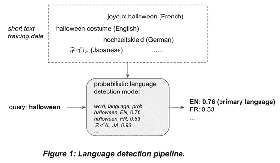
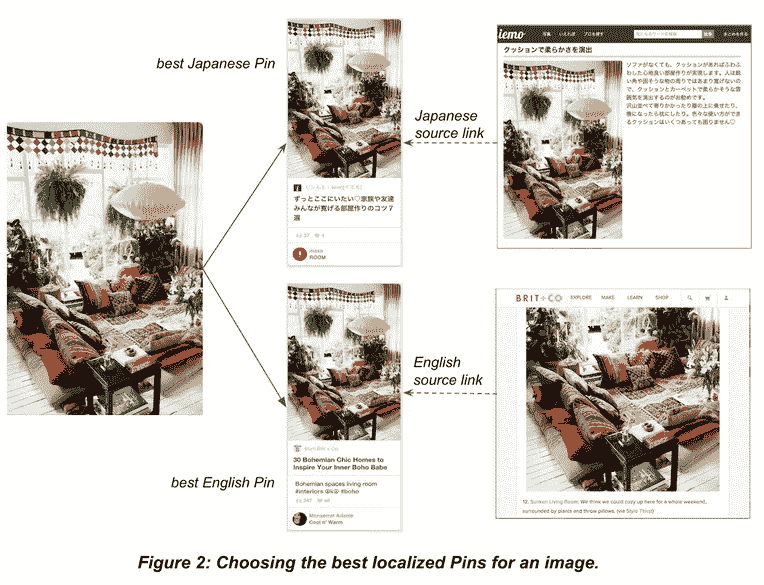
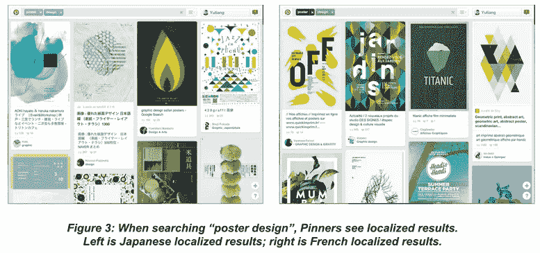

# 构建新的本地化搜索体验

> 原文：<https://medium.com/pinterest-engineering/building-a-new-localized-search-experience-ca68c0c9c937?source=collection_archive---------3----------------------->

尹| Pinterest 产品工程工程师

随着美国以外的 Pinners 用户数量增长到 1 亿月活跃用户的近一半，我们能够向世界各地的人们展示更多的本地内容。例如，如果一个日本和法国的 Pinner 都搜索“*海报设计*”，结果应该与他们的兴趣相关，并以他们的语言本地化。为了帮助世界各地的 Pinners 发现他们国家保存的最好的 pin，今天我们推出了搜索改进，包括更多的本地化结果，国际自动完成和国际拼写检查。

## 了解品客的内容偏好

从用户研究中，我们知道 Pinners 通常希望搜索和保存文化上相关的和他们自己语言的 pin。例如，寻找“pao de queijo”(一种美味的奶酪面包)的巴西 Pinner 可能正在寻找葡萄牙语的食谱。

为了使搜索更加本地化，我们需要了解 Pinner 的语言偏好，以便我们可以显示更容易理解和相关的 pin。为此，我们使用 Pinner 的*账户语言设置*，这是我们为每个 Pinner 提供的一个简单而重要的信号。帐户语言设置定义了用户界面、电子邮件、通知以及现在的搜索中的语言，创造了一致的体验。

除了语言设置，我们还参考*搜索查询语言*来帮助识别 Pinner 的语言偏好。搜索查询通常很短(少于三个单词)，因此很难检测语言。为了解决这个问题，我们在内部建立了一个概率语言检测模型，它帮助我们对许多语言实现了 90%以上的准确率。图 1 显示了我们的查询语言检测模型的简化管道。

## 选择最佳本地化引脚

为了用 Pinner 的首选语言显示更多的本地化管脚，我们引入了最佳本地化管脚选择算法。对于 Pinterest 上的每一张不同的图片，都可能有数千个与之相关联的图钉。具有相同图像的大头针可能保存自不同的源链接，并且具有多种语言的不同描述。为了避免在搜索中显示重复的图像，我们根据每个 Pin 描述的语言、源链接和创建 Pin 的 Pinner 来选择 Pin。上菜时，我们会显示最符合品酒师偏好语言的 Pin。例如，图 2 显示，对于同一个图像，可以找到同时包含日语和英语内容的高质量大头针。

## 堆焊局部销

除了为每张图片找到最相关的本地化 pin，我们还需要修改我们的搜索算法，以帮助将本地内容呈现给国际 Pinners。我们尝试的第一种方法是只显示本地语言的 pin。这种方法效果不好，因为查询覆盖率很低，并且很难用较小的本地 pin 语料库来保证良好的搜索相关性。最终，我们认为这对 Pinners 来说是错误的体验——我们不想用人为的、相同的语言限制来限制我们平台上全球发现的潜力。我们希望帮助 Pinners 更容易地发现本地内容，但仍然保留我们内容的完整范围。

因此，我们决定尝试另一种方法——一种动态的语言降级和国家推广模式，帮助我们将 Pinners 与本地内容联系起来，并智能地用全球内容替代他们的搜索结果作为备份。有了这个模型，我们可以更灵活地配置每种语言的降级程度。例如，模型中的一些规则可能是:

*   对于日本大头针，将英文大头针降级 a%，将中文大头针降级 b%。
*   *对于法国大头针，降级英国大头针 c%，降级日本大头针 d%。*
*   *对于日本别针，将日本别针促销 e%。*

使用该模型的一个好处是，我们能够显示更多的本地化 pin，同时，如果给定查询没有足够的本地化 pin，仍然可以显示高质量的非本地化 pin。该模型的另一个好处是，它允许我们配置每个<*用户语言、内容语言* >对的降级因子。为了确定降级因素，我们根据参与度数据(如重复次数和点击率)查看每种 Pin 语言在每种 Pinner 语言中的表现。例如，我们比较日语 Pinner 对日语 Pin 和英语 Pin 采取行动的可能性，以决定对英语内容降级多少。引脚根据引脚所在地区的普通人群对其语言的接受程度进行降级。例如，如果搜索者的首选语言是日语而不是法语，则英语 Pin 可能会得到更重的降级，因为英语比日语更接近法语，并且我们的数据显示法语 Pin 比日语 Pin 更关注英语 Pin。类似地，我们也考虑与其他国家相比，Pinner 对其源链接来自他们国家的 Pin 采取行动的可能性，并将其用作排名信号。

## 影响

通过我们针对本地化搜索运行的 A/B 实验，我们观察到在将国际 Pinners 与本地相关的内容联系起来方面取得了显著的收益，同时仍然保留了我们的发现体验的完整全球范围。本地化的重复内容和本地化的点击量几乎翻了一番，美国以外的用户在点击后会花更多的时间在一个页面的链接上。我们还发现，新注册的 Pinners 更多地参与本地化搜索和 pin，而不是全球内容。

到目前为止，我们已经向法国、日本、德国和巴西的 Pinners 推出了这种搜索体验，我们将继续在更多国家推出这种体验。

为了继续帮助美国以外的 Pinner 轻松找到他们喜欢的东西，我们将不断进行改进，以更好地反映 Pinner 基于参与度数据的搜索意图和内容偏好。与此同时，我们已经开始尝试许多其他匹配信号，以提高英语以外的语言查询的搜索相关性。为了使搜索体验更具相关性，我们还推出了几个本地化功能，如国际自动完成，它以 Pinner 的首选语言提供查询建议，以及国际拼写检查。其他正在进行的工作包括改进国际搜索指南、趋势查询等。敬请关注这些即将到来的改进！

如果您对构建和改进 Pinners 本地化发现体验感兴趣，[加入我们的](https://careers.pinterest.com/careers/engineering)！

*鸣谢:本作品由、尹、、马凯文、Julia Oh、Keita Fujii、江睿和 Mike Repass(我们的产品经理)以及其他搜索团队成员共同完成。我们要感谢探索科学团队、国际团队、商业分析团队以及公司的其他许多人，他们提供了大量的帮助和宝贵的反馈。*