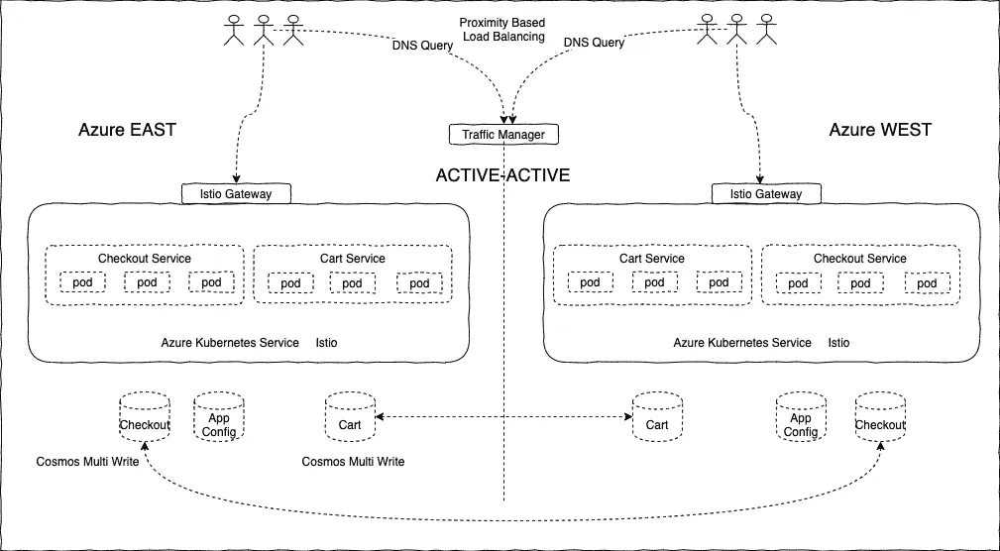
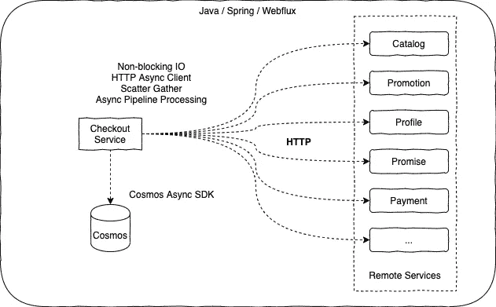
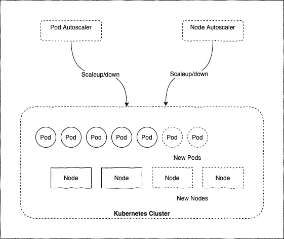
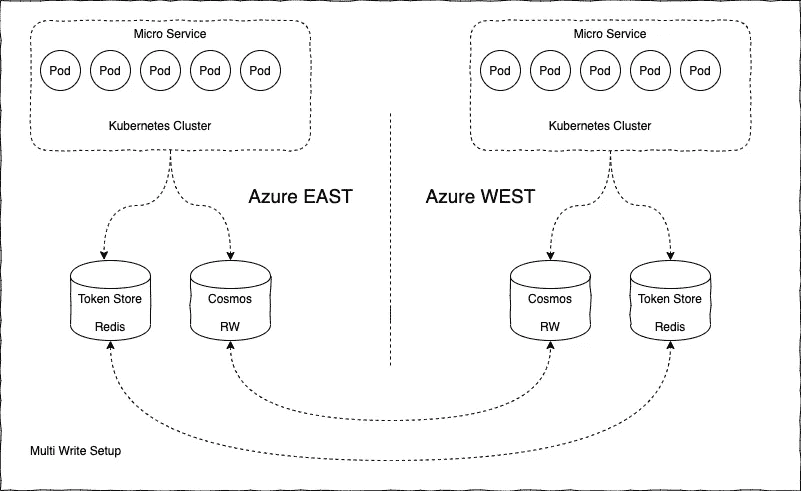
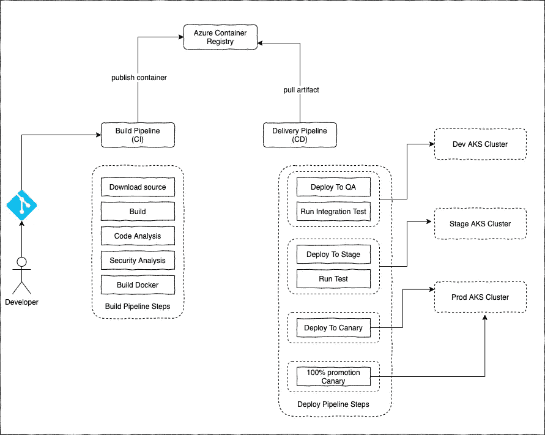
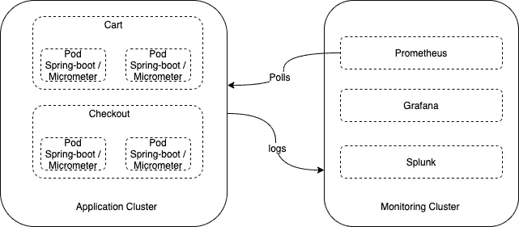
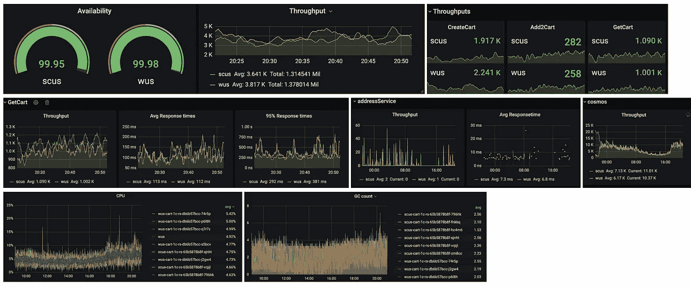
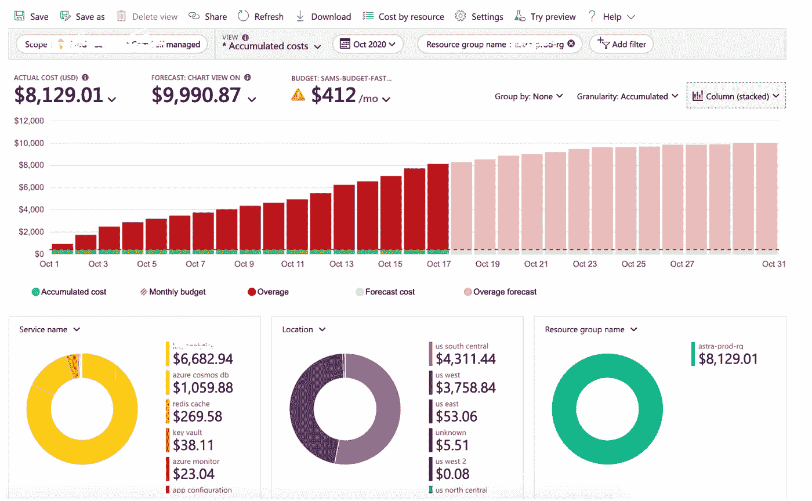

# 构建下一代电子商务平台，实现 10 倍增长

> 原文：<https://medium.com/walmartglobaltech/building-a-next-generation-e-commerce-platform-for-10x-growth-b677ea35de89?source=collection_archive---------0----------------------->

作者:西达尔特·帕特奈克

Photo credit: Chandler Cruttenden

# 介绍

在本帖中，我们将讨论公共云上的云原生未来电子商务平台的架构。我们将讨论手头的问题、构建这样一个新平台背后的动机、我们遵循的架构指南和操作原则、我们选择的技术堆栈以及这些决策背后的基本原理。这篇文章将关注云原生的架构方面，所以我建议你参考我之前关于[云原生应用架构](/walmartglobaltech/cloud-native-application-architecture-a84ddf378f82)的博客作为预读。

背景是沃尔玛的电子商务业务之一，年收入约为 50 亿美元。该业务正以每年 30–40%的速度增长，并且该业务期望该技术能够扩展以支持这种超高速增长。实际上，当前的电子商务应用程序已经存在了几年，建立在商业现货供应(COTS)的整体软件上，从开发、支持和硬件成本的角度来看，它不具有可伸缩性，而且成本高昂。我们面临着在典型的 monolith 应用程序中看到的各种问题，例如极难扩展到某个点之外，发布周期延迟，在部署期间需要团队之间的大量协调和沟通，开发缓慢，QA 周期长，无法通过快速实验和利用新技术进行创新。

这些问题促使我们在公共云上使用现代技术从头开始构建一个新平台，其目标如下:

*   **高性能、大规模可扩展** —应该能够扩展到当前吞吐量的 10 倍。在电子商务应用中，吞吐量通常用 PVM(每分钟页面浏览量)和 OPM(每分钟订单量)来衡量。我们希望扩展到当前指标的 10 倍
*   **高质量**——无 Bug 的高质量软件
*   **上市时间** —应该能够快速构建新功能，频繁部署
*   **Elastic —** 我们一年中会举办多次促销活动。该平台应在此类事件期间扩大规模，并在这些事件之后缩小规模。遵循按使用付费的模式
*   **创新** —应该能够试验&快速采用新技术
*   **经济高效** —解决方案应该经济高效。应该随着业务逐步扩展
*   **高可用性** —系统停机与收入损失直接相关。该系统应提供 99.99 的正常运行时间

# 架构指南和操作原则

我们制定了一些架构指导方针和设计模式，并严格遵循。我们确保微服务和各个团队都遵循这些原则。在随后的部分中，我们将深入这些领域，并从 ***购物车&结账服务*** 的角度讨论实现细节。

*   **同类最佳技术** —使用多云战略，并使用来自 Azure、GCP 等不同公共云提供商的同类最佳技术。此外，比起 IAAS，我更喜欢 PAAS。我们的大部分服务都是建立在 Azure 之上的。还有一些利用 GCP 的特定服务。支付、税务等关键服务在私有云上运行
*   **面向领域的微服务架构** —我们基于领域边界将整体分为多个微服务。我们最终获得了目录、搜索、购物车、结账、促销、支付、库存、订单、退货等服务。这些服务是以这样的方式独立设计的，它们由各自的团队管理，拥有明确的所有权，提供 API 合同，使用最合适的技术堆栈，独立测试，部署时有明确的关注点分离
*   **容器化部署** —使用 docker 技术将微服务打包为轻量级容器，并在 Kubernetes 平台中进行编排
*   **无状态、全渠道&可大规模扩展** —无共享状态，使用 NoSQL 数据库可大规模扩展(尽可能实现最终一致性)，尽可能缓存，多区域主动-主动部署拓扑
*   **弹性** —按需放大&缩小。从容器到数据库的所有级别的自动缩放
*   **核心的弹性** —系统应对故障具有弹性。还应通过影响尽可能少的客户来最小化爆炸半径
*   **STOSA** —单一团队拥有的服务架构。该团队负责从开发到部署再到生产支持的整个过程
*   **敏捷开发运维&自动化** —持续集成&部署策略，实现从开发到部署的一切自动化。频繁部署(一天多次)
*   **可观察性** —每个服务都用服务级别指标声明它们的服务级别目标(SLO)。例如，平均响应时间、P95 响应时间、错误百分比、吞吐量(每秒请求数)。所有这些 sli 都使用仪表板进行监控。定义了警报，一旦阈值被突破，就会触发警报并采取适当的措施
*   **经济高效** —应选择合适的技术，同时考虑成本因素。此外，还会定期监控云资源，以确保有效利用资源

# 微服务部署架构

Kubernetes 已经成为运行容器化工作负载的事实上的平台。我们所有的微服务都部署到 Azure Kubernetes 服务中。Kubernetes 提供了许多重要功能，如服务发现/负载平衡、基于配置的 CPU/内存跨虚拟机调度 pod/容器、部署策略(蓝/绿、滚动更新)、基于水平 pod 自动缩放器的自动缩放&节点自动缩放器、管理应用 pod 的生命周期。我们还使用 [Istio](https://istio.io/) 作为服务网格技术，该技术使用 sidecar 模型在流量管理、负载平衡、金丝雀部署、微服务之间的安全通信和完整服务拓扑的可观察性方面获得更大的灵活性。

我们遵循主动-主动模式来实现高吞吐量和 HA/DR。服务部署在 Azure 东部和西部地区。未来，我们计划部署到更多地区。

Deployment Topology

# 水平可扩展性

为了实现线性可伸缩性，该架构使用各种策略构建，如异步处理、无状态、缓存、自动伸缩、高性能 NoSQL 数据库、多区域部署等。让我们详细研究一下这些方面。

**异步处理**

像 Cart & Checkout 这样的服务依赖于多个远程服务，这是它们处理逻辑的一部分。这些服务已经使用异步处理框架实现，如 [Webflux](https://docs.spring.io/spring-framework/docs/current/spring-framework-reference/web-reactive.htmlhttps://docs.spring.io/spring-framework/docs/current/spring-framework-reference/web-reactive.html) 、Completable Future、异步 HTTP 客户端。这种非阻塞和反应式的处理特性有助于我们用相对较小的硬件配置实现高吞吐量

Non-Blocking IO

**Kubernetes 中的自动缩放**

已经为自动缩放配置了水平窗格自动缩放规则。每当流量激增时，就会添加新的单元和节点，服务也会随之扩展。同样如上图所示，服务已经被部署到多个 Azure 区域中。

Autoscaling in Kubernetes

**Azure Cosmos 可扩展性**

我们早期的应用程序是基于包含数百个表的 RDBMS 的，我们在可伸缩性方面面临很多问题。在设计新平台时，我们确信 NoSQL 是前进的方向。我们选择了 Azure Cosmos DB，它是一个全球分布式的、水平可伸缩的、无模式的数据库，专为全球规模而设计。数据模型是用正确的分区键和访问模式精心设计的。对于我们的用例，访问总是基于密钥(getDocumentByID ),这为我们 99%的调用提供了不到 10 Ms 的延迟。从一致性的角度来看，我们使用会话一致性。当传递正确的会话令牌时，Cosmos 确保一致的读取。因此，在每次写入之后，令牌被存储在键值存储(Redis)中的相应文档中，并在后续读取中使用该令牌。

Azure Cosmos

# 弹性/混沌工程

每件事都会失败，每时每刻！在云架构中，虽然我们无法避免完全失败，但我们可以为失败做好计划。不要接受失败！那么，如何定义可靠的应用程序呢？以下是弹性应用程序的特征:

*   从故障中优雅地恢复并继续运营
*   高可用性(HA ),按设计运行，无明显停机

我们通过遵循许多设计模式在我们的架构中建立了弹性。下面列举了几个例子:

*   到处建立冗余。没有 SPOF。将服务部署到多个区域，以避免完全的区域故障
*   节流以抵御流量的突然增加和 bot 攻击
*   军种间通信
*   为每个远程服务调用配置超时和重试次数
*   每个远程服务的断路器。回退逻辑到位以处理故障
*   当系统的一部分发生故障时，防止完全故障的隔板

**故障注入测试**

为了模拟故障，注入故障并验证行为。为此，我们使用各种工具，如 Istio、Gremlin

# 敏捷和开发实践

每个微服务的设计都是由一个团队拥有的。该团队使用 STOSA 模型(单个团队拥有的服务架构)运营，他们从架构到开发、测试、部署、监控到解决生产问题承担端到端的责任。开发是使用敏捷方法完成的。源代码存储在 Git 中，团队遵循基于主干的开发作为分支策略。对于测试，团队非常依赖自动化测试，并且使用 CI/CD 最佳实践对代码进行持续测试。这是团队遵循的 CI/CD 模型

CI/CD

# 可观察性

服务最重要的特征之一是它的可观察性。每项服务都会将应用程序日志推送到一个集中的 Splunk 集群中进行聚合和搜索。对于实时监控和警报，我们使用 Prometheus 作为指标存储，Graffana 作为仪表板。我们最初从 Azure Application insights 开始，但后来出于性能原因转向 Splunk 和 Prometheus。

Monitoring Setup

以下指标是仪表板的一部分。

*   Kubernetes 仪表板
*   pod 级别的 CPU /内存
*   pod 级别的 Tomcat 线程状态
*   pod 级别的垃圾收集统计信息
*   断路器状态
*   有效性
*   吞吐量
*   响应时间(平均 95 分钟)
*   错误(基于 HTTP 状态代码)
*   所有相关服务(响应时间、可用性、错误)

Dashboards

# 成本管理

成本是任何架构的一个非常重要的方面，我们从一开始就牢记这一点。在本节中，我们将看到我们遵循的准则以及我们为构建最具成本效益的解决方案而采取的措施。

**技术选择**

云提供商为一个域提供多种 PAAS 服务。例如，对于数据库存储，有像 Cosmos、Postgress、MySQL、SQL Server 这样的服务，每种服务都有自己的定价模式。此外，根据所选的功能，价格也会有所不同。例如，Cosmos Multi write 与 single write 的定价模式不同。

**最佳云资源使用**

云计算最大的承诺之一是你为你使用的东西付费。因此，监控资源的使用情况并对其进行优化是非常重要的。在我们的例子中，我们尽可能使用自动缩放功能。例如，使用 AKS 自动缩放，宇宙自动驾驶仪，这有助于最佳的资源利用，并确保成本效益。

**成本报告**

作为 Azure 成本管理的一部分，可以创建报告并从不同的维度对其进行分割。我们为每项服务创建了报告，为多个阈值定义了预算和警报。这为我们提供了一个非常好的整体成本的可视性，并在预算违反时通知相应的成本中心所有者。

下面是一个成本报告的示例:

Cost Report

# 结论

尽管在构建这个平台的过程中进行了大量的思考、研究和努力工作，但你不会在第一次尝试中就把所有事情都做好。这个想法是不断地监控系统，从生产流量中观察系统行为，并从每次迭代中改进。